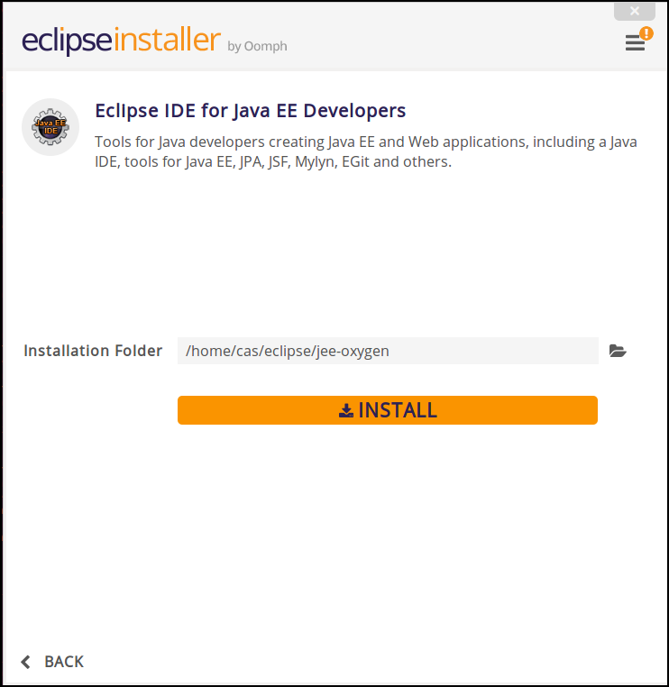

# Infrastructure Setup

### Prerequisites

For the workshops, the following software needs to be installed locally.

  * Ubuntu Linux (any other OS is fine two, but workshop description and screenshots are done on Ubuntu Linux)
  * Apache Java JDK 8
  * Apache Maven
  * Eclipse IDE (any other IDE is fine too, but workshop descriptions and screenshots are done for Eclipse)
  * Docker with Docker Compose
  * kafkacat (optional)
  * Fish Shell (optional)
  * SSH Server

The following chapters show how to install the necessary software.

Docker will be used for the provisioning of the streaming platform including components such as Kafka, Zookeeper, StreamSets and many more. 

You can also get a virtual machine with all the software pre-installed. 

## Ubuntu Linux
For the workshops we assume a Ubuntu Linux environment. You can either install that on your machine, use the Virtual Machine image provide with the course or setup a VM in the cloud, for example through the Azure market place. 

### Install Net Tools

To be able to retrieve the IP address using `ifconfig` we have to install Net Tools:

```
sudo apt install net-tools
```

### Enable SSH (optional)
In order to work with the virtual machine from an external terminal, we need to enable SSH. 

```
sudo apt install ssh
```

## Apache Java JDK 8
If you want to install the latest JDK 1.8, use the webupd8team PPA.

Add the repository in your system:

```
sudo add-apt-repository ppa:webupd8team/java
sudo apt-get update
```

You can now install Oracle Java 8 using the following command:

```
sudo apt-get install oracle-java8-installer
```

This ppa repository also provides a package to set environment variables automatically. Just type:

```
sudo apt-get install oracle-java8-set-default

```

## Apache Maven
Install Apache Maven using the following commands:

```
sudo apt-get update
sudo apt-get install maven
```

## Eclipse IDE
Install the Eclipse IDE for Java Developers from here <http://www.eclipse.org/downloads/eclipse-packages/>.

After decompressing the downloaded archive, start the installer by clicking on the **eclipse-inst** icon.

A screen for choosing the version should pop up. Select the Eclipse IDE for Java EE Developers.


On the next screen, select in the **Installation Folder** select the folder where you want Eclipse installed and click on **INSTALL** and the installation will start. 



After a while Eclipse should be ready and can be started. 

## Docker and Docker Compose

### Setup Docker Engine

```
sudo apt-get update

sudo apt-get install \
    apt-transport-https \
    ca-certificates \
    curl \
    software-properties-common
```

```
curl -fsSL https://download.docker.com/linux/ubuntu/gpg | sudo apt-key add -
```

```
sudo apt-key fingerprint 0EBFCD88
```

```
sudo add-apt-repository \
   "deb [arch=amd64] https://download.docker.com/linux/ubuntu \
   $(lsb_release -cs) \
   stable"
```

```
sudo apt-get update
```

```
sudo apt-get install docker-ce
```

Add the user to the `docker` group to avoid having to use sudo all the time. 

```
sudo usermod -a -G docker $USER
```

Completely log out of your account and log back in (if in doubt, reboot!):

### Setup Docker Compose

```
sudo curl -L https://github.com/docker/compose/releases/download/1.21.0/docker-compose-$(uname -s)-$(uname -m) -o /usr/local/bin/docker-compose
```

```
sudo chmod +x /usr/local/bin/docker-compose
```

## Kafkacat
[Kafkacat](https://docs.confluent.io/current/app-development/kafkacat-usage.html#kafkacat-usage) is a command line utility that you can use to test and debug Apache Kafka deployments. 

Kafkacat is an open-source utility, available at <https://github.com/edenhill/kafkacat>. It is not part of the Confluent platform and also not part of the streaming platform we run in docker. 

You can either install `kafkacat` directly on Ubuntu and Mac OS-X or run it through a docker container. Docker container is the recommended way when running on Windows.  

### Run it on Ubuntu

First let's install the required packages:

Install the Confluent public key, which is used to sign the packages in the APT repository:

```
wget -qO - https://packages.confluent.io/deb/4.1/archive.key | sudo apt-key add -
```

Add the repository to the `/etc/apt/sources.list`:

```
sudo add-apt-repository "deb [arch=amd64] https://packages.confluent.io/deb/4.1 stable main"
```

Run apt-get update and install the 2 dependencies as well as kafkacat:
 
```
sudo apt-get update
sudo apt-get install librdkafka-dev libyajl-dev
sudo apt-get install kafkacat
```

Now we can use it via the `kafkacat` command:

```
kafkacat
```

You should see the `kafkacat` help page. We will see `kafkacat` in use for the first time in [Working with Apache Kafka Broker](../02-working-with-kafka-broker/README.md).

### Run it through Docker container

To run it through docker, just simply execute a `docker run` on the `confulentinc/cp-kafkacat` docker image. 

```
docker run -ti confluentinc/cp-kafkacat kafkcat
```

You should see the `kafkacat` help page. We will see `kafkacat` in use for the first time in [Working with Apache Kafka Broker](../02-working-with-kafka-broker/README.md).

## Fish shell
[Fish](https://fishshell.com/) is a smart and user-friendly command line shell for macOS, Linux, and the rest of the family. Fish includes handy features like syntax highlighting, autosuggest-as-you-type, and fancy tab completions that just work, with no configuration required.

Using fish for this course is optional.

Packages for Ubuntu are available from the fish PPA, and can be installed using the following commands:

```
sudo apt-add-repository ppa:fish-shell/release-2
sudo apt-get update
sudo apt-get install fish
```

Once installed, run `fish` from your current shell to try fish out!

If you wish to use fish as your default shell, use the following command:

```
chsh -s /usr/bin/fish
```

`chsh` will prompt you for your password and change your default shell. 
