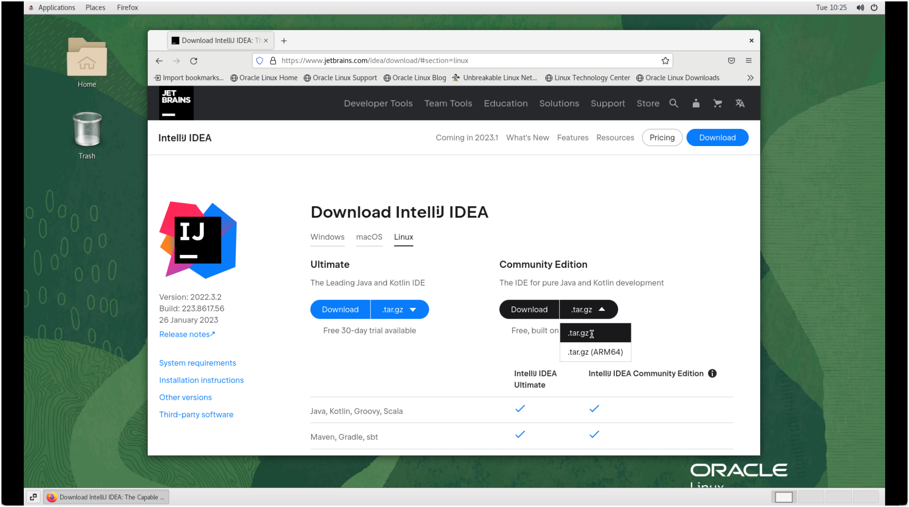
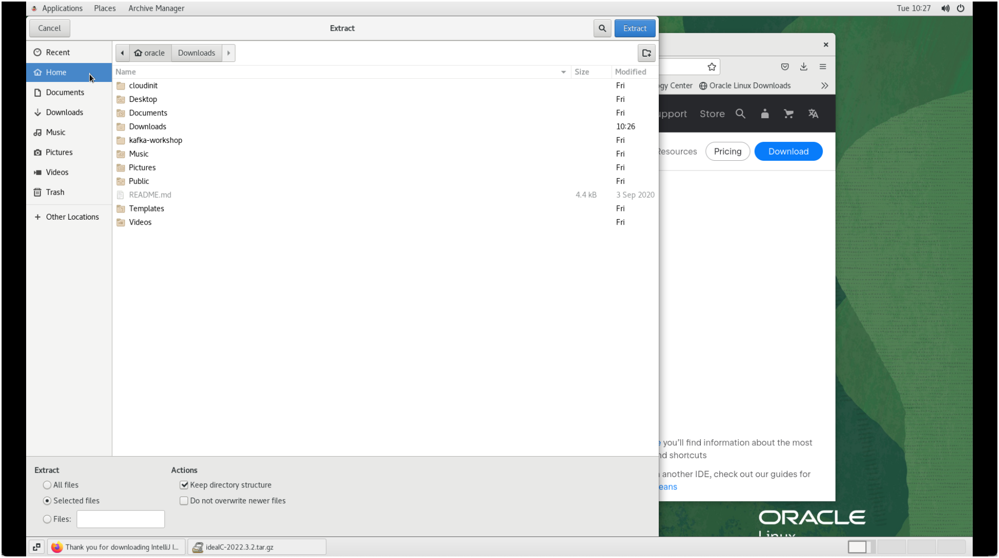

# Installing additional software

The Platform contains a fully working and running Kafka installation with the necessary additional tools such as Schema Registry. But an IDE for doing the workshops has to be installed manually. 

## For Java-based workshops

## Installing IntelliJ IDEA

* Open Firefox by clicking on **Applications** in the top menu and select **Firefox** 
* navigate to the IntelliJ Community download: <https://www.jetbrains.com/idea/download/#section=linux> and download the Community Edition as a `tar.gz` file



* Once the download finished, double click on the file and extract it into the home folder



## Starting IntelliJ IDEA

To start IntelliJ

* Open a Terminal window by clicking on **Applications** in the top menu and select **System Tools** | **Terminal**.
* Navigate to the `bin` folder of IntelliJ: `cd idea-IC*/bin`.
* Start the IntelliJ: `./idea.sh`
* confirm the **JETBRAINS COMMUNITY EDITION TERMS** by enabling the checkbox and then click **Continue**.
* on the **DATA SHARING** page click **Don't share**

You now have a working IntelliJ available for the workshops.

## For .NET-based workshops

### Installing .NET core

Install .NET core by performing the following steps

```bash
sudo rpm -Uvh https://packages.microsoft.com/config/centos/7/packages-microsoft-prod.rpm
```

```bash
sudo yum install dotnet-sdk-6.0
```

### Installing Visual Code

Download Visual Studio from <https://code.visualstudio.com/docs/?dv=linux64> as a TAR ball and untar it to `/home/oracle`

Extend the Path by editing `/home/oracle/.bash_profile` and add `/home/oracle/VSCode-linux-x64` to the PATH variable (last line in the file)

```bash
export PATH=$PATH:$LAB_BASE:/u00/app/oracle/local/bdkafkadev/bin:.:/home/oracle/VSCode-linux-x64
```

