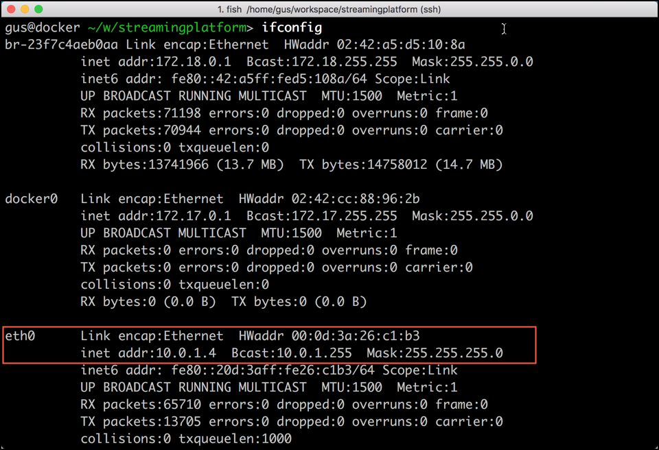
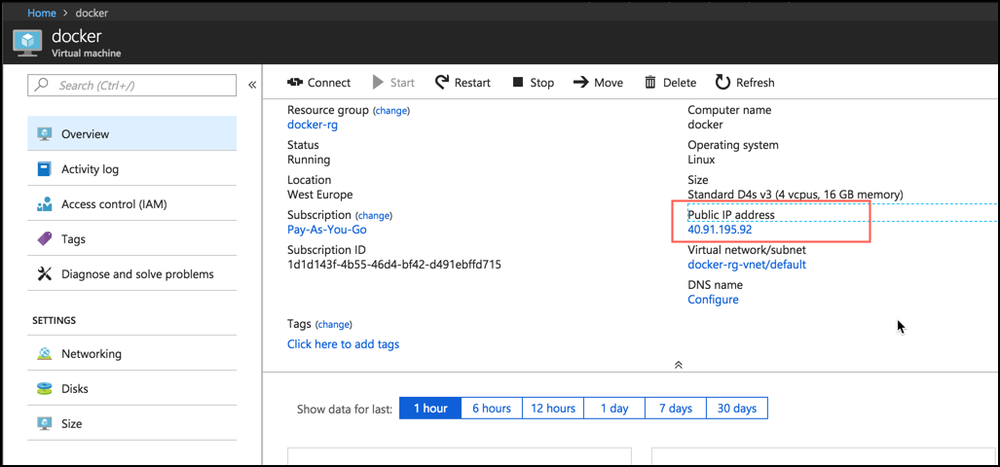

# Streaming Platform in Docker
The environment for this course is completly based on docker containers. 

Either use the Virtual Machine image made available in the course, containing a docker installation or provisiong your own Docker environemnt including Docker Compose. Find the information for installing [Docker](https://docs.docker.com/install/#supported-platforms) and [Docker Compose](https://docs.docker.com/compose/install/).
 
[Here](../00-setup/README.md) you can find the installation of an Virtual Machine in Azure. 

In order to simplify the provisioning, a single docker-compose configuration is used. All the necessary software will be provisioned using Docker. 

## What is this Streaming Platform?

The following services are provisioned as part of the Streaming Platform: 

 * Apache Zookeeper
 * Kafka Broker 1-3
 * Confluent Schema Registry
 * kafka connect
 * kafka rest proxy
 * ksql server
 * ksql cli
 * Confluent control center
 * Schema registry UI
 * Kafka Manager
 * Apache Zeppelin (optional)
 * Streamsets Data Collector
 * Apache NiFi
 * Hawtio

For Kafka we will be using the Docker images provided by Confluent and available under the following GitHub project: <https://github.com/confluentinc/cp-docker-images>. In this project, there is an example folder with a few different docker compose configuration for various Confluent Platform configurations. 

## Prepare the Docker Compose configuration

On your Docker Machine, create a folder `streamingplatform`. 

```
mkdir streamingplatform
cd streamingplatform
```

Copy the code from below and paste it into a docker-compose.yml file. Alternatively you can also use wget to retrieve the file from GitHub: `wget https://raw.githubusercontent.com/gschmutz/kafka-workshop/master/01-environment/docker-compose.yml`

```
#
# Docker Compose with the following services:
#  zookeeper
#  kafka broker 1-3
#  schema registry
#  kafka connect
#  kafka rest proxy
#  ksql server
#  ksql cli
#  confluent control center
#  schema registry UI
#  kafka manager
#  streamsets
#  apache nifi
#

version: '2'
services:
  zookeeper:
    image: confluentinc/cp-zookeeper:5.0.0
    hostname: zookeeper
    ports:
      - "2181:2181"
    environment:
      ZOOKEEPER_CLIENT_PORT: 2181
      ZOOKEEPER_TICK_TIME: 2000
    restart: always

  broker-1:
    image: confluentinc/cp-enterprise-kafka:5.0.0
    hostname: broker-1
    depends_on:
      - zookeeper
    ports:
      - "9092:9092"
    environment:
      KAFKA_BROKER_ID: 1
      KAFKA_BROKER_RACK: 'r1'
      KAFKA_ZOOKEEPER_CONNECT: 'zookeeper:2181'
      KAFKA_ADVERTISED_LISTENERS: 'PLAINTEXT://${DOCKER_HOST_IP}:9092'
      KAFKA_METRIC_REPORTERS: io.confluent.metrics.reporter.ConfluentMetricsReporter
      KAFKA_OFFSETS_TOPIC_REPLICATION_FACTOR: 1
      KAFKA_GROUP_INITIAL_REBALANCE_DELAY_MS: 0
      KAFKA_DELETE_TOPIC_ENABLE: 'true'
      KAFKA_AUTO_CREATE_TOPICS_ENABLE: 'false'
      KAFKA_JMX_PORT: 9994
      CONFLUENT_METRICS_REPORTER_BOOTSTRAP_SERVERS: broker-1:9092
      CONFLUENT_METRICS_REPORTER_ZOOKEEPER_CONNECT: zookeeper:2181
      CONFLUENT_METRICS_REPORTER_TOPIC_REPLICAS: 1
      CONFLUENT_METRICS_ENABLE: 'true'
      CONFLUENT_SUPPORT_CUSTOMER_ID: 'anonymous'
    restart: always

  broker-2:
    image: confluentinc/cp-enterprise-kafka:5.0.0
    hostname: broker-2
    depends_on:
      - zookeeper
    ports:
      - "9093:9093"
    environment:
      KAFKA_BROKER_ID: 2
      KAFKA_BROKER_RACK: 'r1'
      KAFKA_ZOOKEEPER_CONNECT: 'zookeeper:2181'
      KAFKA_ADVERTISED_LISTENERS: 'PLAINTEXT://${DOCKER_HOST_IP}:9093'
      KAFKA_METRIC_REPORTERS: io.confluent.metrics.reporter.ConfluentMetricsReporter
      KAFKA_OFFSETS_TOPIC_REPLICATION_FACTOR: 1
      KAFKA_GROUP_INITIAL_REBALANCE_DELAY_MS: 0
      KAFKA_DELETE_TOPIC_ENABLE: 'true'
      KAFKA_AUTO_CREATE_TOPICS_ENABLE: 'false'
      KAFKA_JMX_PORT: 9993
      CONFLUENT_METRICS_REPORTER_BOOTSTRAP_SERVERS: broker-2:9093
      CONFLUENT_METRICS_REPORTER_ZOOKEEPER_CONNECT: zookeeper:2181
      CONFLUENT_METRICS_REPORTER_TOPIC_REPLICAS: 1
      CONFLUENT_METRICS_ENABLE: 'true'
      CONFLUENT_SUPPORT_CUSTOMER_ID: 'anonymous'
    restart: always

  broker-3:
    image: confluentinc/cp-enterprise-kafka:5.0.0
    hostname: broker-3
    depends_on:
      - zookeeper
    ports:
      - "9094:9094"
    environment:
      KAFKA_BROKER_ID: 3
      KAFKA_BROKER_RACK: 'r1'
      KAFKA_ZOOKEEPER_CONNECT: 'zookeeper:2181'
      KAFKA_ADVERTISED_LISTENERS: 'PLAINTEXT://${DOCKER_HOST_IP}:9094'
      KAFKA_METRIC_REPORTERS: io.confluent.metrics.reporter.ConfluentMetricsReporter
      KAFKA_OFFSETS_TOPIC_REPLICATION_FACTOR: 1
      KAFKA_GROUP_INITIAL_REBALANCE_DELAY_MS: 0
      KAFKA_DELETE_TOPIC_ENABLE: 'true'
      KAFKA_AUTO_CREATE_TOPICS_ENABLE: 'false'
      KAFKA_JMX_PORT: 9992
      CONFLUENT_METRICS_REPORTER_BOOTSTRAP_SERVERS: broker-3:9094
      CONFLUENT_METRICS_REPORTER_ZOOKEEPER_CONNECT: zookeeper:2181
      CONFLUENT_METRICS_REPORTER_TOPIC_REPLICAS: 1
      CONFLUENT_METRICS_ENABLE: 'true'
      CONFLUENT_SUPPORT_CUSTOMER_ID: 'anonymous'
    restart: always
      
  schema_registry:
    image: confluentinc/cp-schema-registry:5.0.0
    hostname: schema_registry
    depends_on:
      - zookeeper
      - broker-1
    ports:
      - "8081:8081"
    environment:
      SCHEMA_REGISTRY_HOST_NAME: schema_registry
      SCHEMA_REGISTRY_KAFKASTORE_CONNECTION_URL: 'zookeeper:2181'
      SCHEMA_REGISTRY_ACCESS_CONTROL_ALLOW_ORIGIN: '*'
      SCHEMA_REGISTRY_ACCESS_CONTROL_ALLOW_METHODS: 'GET,POST,PUT,OPTIONS'
    restart: always
      
  connect:
    image: confluentinc/cp-kafka-connect:5.0.0
    hostname: connect
    depends_on:
      - zookeeper
      - broker-1
      - schema_registry
    ports:
      - "8083:8083"
    environment:
      CONNECT_BOOTSTRAP_SERVERS: 'broker-1:9092'
      CONNECT_REST_ADVERTISED_HOST_NAME: connect
      CONNECT_REST_PORT: 8083
      CONNECT_GROUP_ID: compose-connect-group
      CONNECT_CONFIG_STORAGE_TOPIC: docker-connect-configs
      CONNECT_CONFIG_STORAGE_REPLICATION_FACTOR: 1
      CONNECT_OFFSET_FLUSH_INTERVAL_MS: 10000
      CONNECT_OFFSET_STORAGE_TOPIC: docker-connect-offsets
      CONNECT_OFFSET_STORAGE_REPLICATION_FACTOR: 1
      CONNECT_STATUS_STORAGE_TOPIC: docker-connect-status
      CONNECT_STATUS_STORAGE_REPLICATION_FACTOR: 1
      CONNECT_KEY_CONVERTER: io.confluent.connect.avro.AvroConverter
      CONNECT_KEY_CONVERTER_SCHEMA_REGISTRY_URL: 'http://schema_registry:8081'
      CONNECT_VALUE_CONVERTER: io.confluent.connect.avro.AvroConverter
      CONNECT_VALUE_CONVERTER_SCHEMA_REGISTRY_URL: 'http://schema_registry:8081'
      CONNECT_INTERNAL_KEY_CONVERTER: org.apache.kafka.connect.json.JsonConverter
      CONNECT_INTERNAL_VALUE_CONVERTER: org.apache.kafka.connect.json.JsonConverter
      CONNECT_ZOOKEEPER_CONNECT: 'zookeeper:2181'
      CONNECT_PLUGIN_PATH: "/usr/share/java,/etc/kafka-connect/custom-plugins"
      CONNECT_LOG4J_ROOT_LOGLEVEL: INFO
      CLASSPATH: /usr/share/java/monitoring-interceptors/monitoring-interceptors-4.0.0.jar
    volumes:
      - $PWD/kafka-connect:/etc/kafka-connect/custom-plugins
    restart: always

  rest-proxy:
    image: confluentinc/cp-kafka-rest:5.0.0
    hostname: rest-proxy
    depends_on:
      - broker-1
      - schema_registry
    ports:
      - "8084:8084"
    environment:
      KAFKA_REST_ZOOKEEPER_CONNECT: '${DOCKER_HOST_IP}:2181'
      KAFKA_REST_LISTENERS: 'http://0.0.0.0:8084'
      KAFKA_REST_SCHEMA_REGISTRY_URL: 'http://schema_registry:8081'
      KAFKA_REST_HOST_NAME: 'rest-proxy'
    restart: always

  ksql-server:
    image: confluentinc/cp-ksql-server:5.0.0
    hostname: ksql-server
    ports:
      - '8088:8088'
    depends_on:
      - broker-1
      - schema_registry
    environment:
      KSQL_BOOTSTRAP_SERVERS: "broker-1:9092"
      KSQL_LISTENERS: "http://0.0.0.0:8088"
      KSQL_KSQL_SERVICE_ID: "test-2"
      KSQL_PRODUCER_INTERCEPTOR_CLASSES: io.confluent.monitoring.clients.interceptor.MonitoringProducerInterceptor
      KSQL_CONSUMER_INTERCEPTOR_CLASSES: io.confluent.monitoring.clients.interceptor.MonitoringConsumerInterceptor
    restart: always

  control-center:
    image: confluentinc/cp-enterprise-control-center:5.0.0
    hostname: control-center
    depends_on:
      - zookeeper
      - broker-1
      - schema_registry
      - connect
    ports:
      - "9021:9021"
    environment:
      CONTROL_CENTER_BOOTSTRAP_SERVERS: 'broker-1:9092'
      CONTROL_CENTER_ZOOKEEPER_CONNECT: 'zookeeper:2181'
      CONTROL_CENTER_CONNECT_CLUSTER: 'connect:8083'
      CONTROL_CENTER_REPLICATION_FACTOR: 1
      CONTROL_CENTER_INTERNAL_TOPICS_PARTITIONS: 1
      CONTROL_CENTER_MONITORING_INTERCEPTOR_TOPIC_PARTITIONS: 1
      CONFLUENT_METRICS_TOPIC_REPLICATION: 1
      PORT: 9021
    restart: always

  schema-registry-ui:
    image: landoop/schema-registry-ui
    hostname: schema-registry-ui
    depends_on:
      - broker-1
      - schema_registry
    ports:
      - "8002:8000"
    environment:
      SCHEMAREGISTRY_URL: 'http://${PUBLIC_IP}:8081'
    restart: always

  kafka-manager:
    image: trivadisbds/kafka-manager
    hostname: kafka-manager
    depends_on:
      - zookeeper
    ports:
      - "39000:9000"
    environment:
      ZK_HOSTS: 'zookeeper:2181'
      APPLICATION_SECRET: 'letmein'
    restart: always

  streamsets:
    image: trivadisbds/streamsets-kafka-nosql
    hostname: streamsets
    ports:
      - "18630:18630"
    restart: always

  nifi:
    image: apache/nifi:1.7.0
    hostname: nifi
    ports:
      - "28080:8080"
    restart: always

  mosquitto-1:
    image: eclipse-mosquitto:latest
    hostname: mosquitto-1
    ports: 
      - "1883:1883"
      - "9001:9001"
#    volumes:
#      - ./mosquitto/mosquitto-1.conf:/mosquitto/config/mosquitto.conf

  hawtio:
    image: "indigo/hawtio"
    hostname: hawtio
    ports:
      - "8090:8090" 
    restart: always
```

## Prepare the environment

Before we can start the environment, we have to set the environment variable `DOCKER_HOST_IP` to contain the IP-address of the Docker Host and another environment variable `PUBLIC_IP` to the public IP address (not the same if you are using Azure). 
You can find the IP-Address of the Docker host using the `ifconfig` config from the linux shell. 



The public IP address of the VM in Azure can be found in the Azure portal.



In a terminal window, execute the follwoing two commands, setting the two addresses with the values you got in the previous steps:

```
export PUBLIC_IP=40.91.195.92
export DOCKER_HOST_IP=10.0.1.4
```

If you are not on azure, you can set the `PUBLIC_IP` environment variable to the same value as the `DOCKER_HOST_IP`.

You have to repeat that, whever you open a new terminal window and want to perform some commands in the docker-compose environment. 

## Start the environment

Now let's run all the container specified by the Docker Compose configuration. In the terminal window, where you have exported the two environment variables, perform the following command:

```
docker-compose up -d
```

The first time it will take a while, as it has to download many Docker images.

After it has started, you can get the log output of all services by executing
 
```
docker-compose logs -f
```

if you want to see the services running for our environment, perform the following command:

```
docker ps

CONTAINER ID        IMAGE                                            COMMAND                  CREATED             STATUS                           PORTS                                          NAMES
d01fb522accd        apache/nifi:1.6.0                                "/bin/sh -c ${NIFI_B…"   6 hours ago         Up 6 hours                       8443/tcp, 10000/tcp, 0.0.0.0:38080->8080/tcp   stream-processing_nifi_1
9ecf9a3ab42c        trivadisbds/streamsets-kafka-nosql               "/docker-entrypoint.…"   6 hours ago         Up 6 hours                       0.0.0.0:18630->18630/tcp                       stream-processing_streamsets_1
5e96deeff9cc        confluentinc/ksql-cli:5.0.0-beta1                "perl -e 'while(1){ …"   7 hours ago         Up 7 hours                                                                      stream-processing_ksql-cli_1
cf4893312d40        confluentinc/cp-kafka-rest:5.0.0-beta1-1         "/etc/confluent/dock…"   7 hours ago         Up 7 hours                       8082/tcp, 0.0.0.0:8084->8084/tcp               stream-processing_rest-proxy_1
a36ed06fa71f        landoop/schema-registry-ui                       "/run.sh"                7 hours ago         Up 7 hours                       0.0.0.0:8002->8000/tcp                         stream-processing_schema-registry-ui_1
382358f81cf8        confluentinc/cp-enterprise-kafka:5.0.0-beta1-1   "/etc/confluent/dock…"   7 hours ago         Up 7 hours                       9092/tcp, 0.0.0.0:9093->9093/tcp               stream-processing_broker-2_1
e813de06f7cd        confluentinc/cp-enterprise-kafka:5.0.0-beta1-1   "/etc/confluent/dock…"   7 hours ago         Up 7 hours                       0.0.0.0:9092->9092/tcp                         stream-processing_broker-1_1
c2210b42db6e        confluentinc/cp-enterprise-kafka:5.0.0-beta1-1   "/etc/confluent/dock…"   7 hours ago         Up 7 hours                       9092/tcp, 0.0.0.0:9094->9094/tcp               stream-processing_broker-3_1
db2033adfd2a        trivadisbds/kafka-manager                        "./km.sh"                7 hours ago         Restarting (255) 7 seconds ago                                                  stream-processing_kafka-manager_1
676e4f734b09        confluentinc/cp-zookeeper:5.0.0-beta1-1          "/etc/confluent/dock…"   7 hours ago         Up 7 hours                       2888/tcp, 0.0.0.0:2181->2181/tcp, 3888/tcp     stream-processing_zookeeper_1
```

### Add inbound rules for the follwing ports
If you are using a VM on Azure, make sure to add inbound rules for the following ports:

Service | Url
------- | -------------
StreamSets Data Collector | 18630
Apache NiFi | 28080
Apache Zepplin  | 38080
Schema Registry UI  | 8002
Schema Registry Rest API  | 8081
Kafka Manager  | 39000
Confluent Control Center | 9021


### Add entry to local /etc/hosts File
To simplify working with the Streaming Platform, add the following entry to your local `/etc/hosts` file. 

```
40.91.195.92	streamingplatform
```

## Services accessible on Streaming Platform
The following service are available as part of the platform:

Type | Service | Url
------|------- | -------------
Development | StreamSets Data Collector | <http://streamingplatform:18630>
Development | Apache NiFi | <http://streamingplatform:28080/nifi>
Governance | Schema Registry UI  | <http://streamingplatform:8002>
Governance | Schema Registry Rest API  | <http://streamingplatform:8081>
Management | Kafka Manager  | <http://streamingplatform:39000>
Management | Confluent Control Center | <http://streamingplatform:9021>


## Stop the environment
To stop the environment, execute the following command:

```
docker-compose stop
```

after that it can be re-started using `docker-compose start`.

To stop and remove all running container, execute the following command:

```
docker-compose down
```

