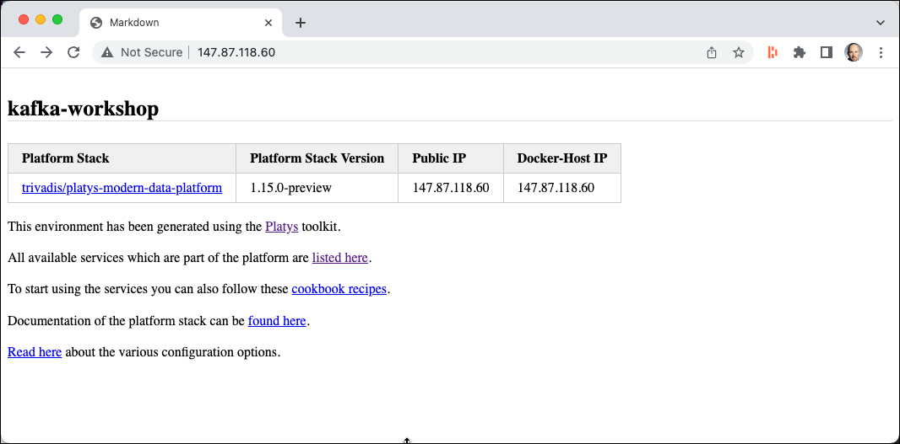
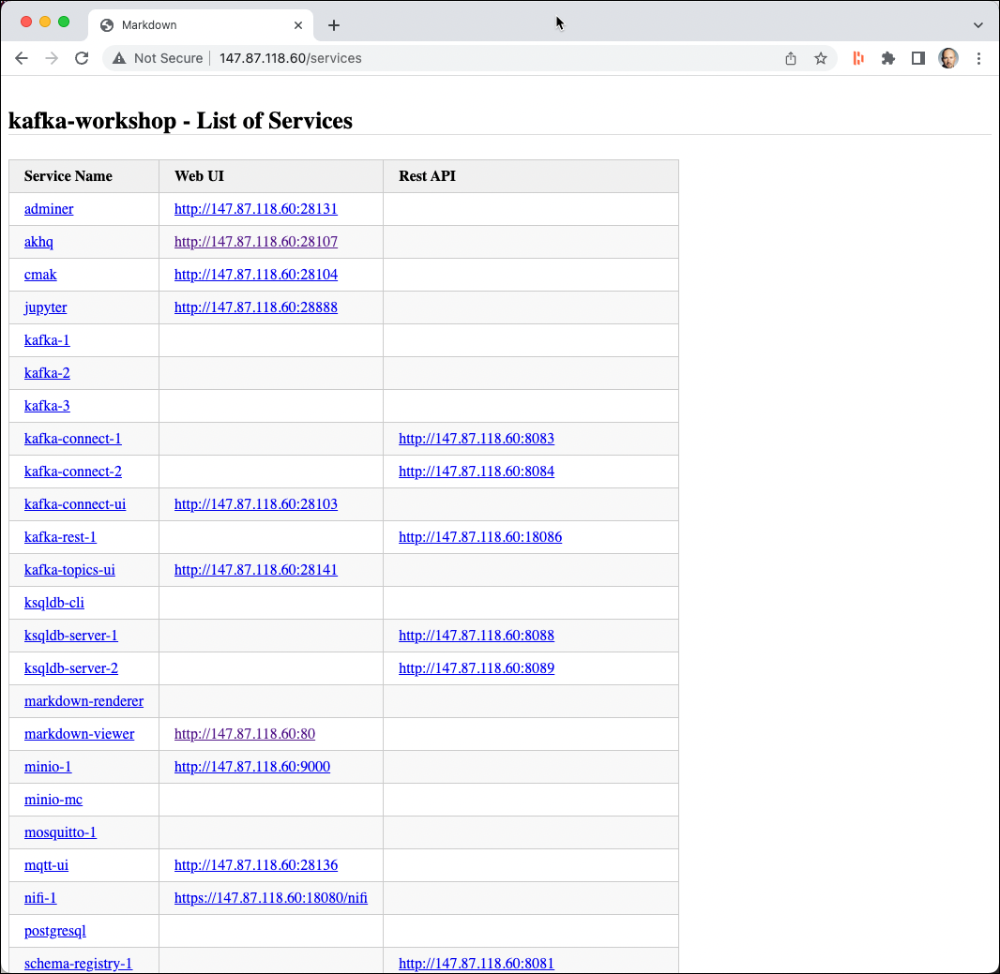

# (Virtual) machine running Ubuntu Linux

This document describes how to install the workshop environment on a Ubuntu Machine, which could be running in a virtual machine, either in the cloud, on a remote server or on your local machine.

The VM should be configured with at least 8 GB and 4 CPUs.

## Setup Software

First let's create some environment variables.   

```bash
export GITHUB_PROJECT=kafka-workshop
export GITHUB_OWNER=gschmutz
export DATAPLATFORM_HOME=01-environment/docker
export PLATYS_VERSION=2.4.3
export NETWORK_NAME=<network-name>
```

**Note:** Make sure to replace the `<network-name>` by the value retrieved from `ip addr`, which would be `ens33` in the example below

```
$ ip addr
2: ens33: <BROADCAST,MULTICAST,UP,LOWER_UP> mtu 1500 qdisc fq_codel state UP group default qlen 1000
    link/ether 00:0c:29:3a:82:45 brd ff:ff:ff:ff:ff:ff
    altname enp2s1
```    

### Install some helpful utilities

```bash
sudo apt-get install -y curl jq kafkacat openssh-server
```

### Installing Docker

The instructions below are taken from here: <https://docs.docker.com/engine/install/ubuntu/>

**Setup the repository**

Uninstall old versions

```bash
sudo apt-get remove docker docker-engine docker.io containerd runc
```

Update `apt` package index and install packages

```bash
sudo apt-get update

sudo apt-get install \
    ca-certificates \
    curl \
    gnupg \
    lsb-release
```    

Add Docker's official GPG key

```bash    
sudo mkdir -p /etc/apt/keyrings

curl -fsSL https://download.docker.com/linux/ubuntu/gpg | sudo gpg --dearmor -o /etc/apt/keyrings/docker.gpg
```

Setup the repository

```bash    
echo \
  "deb [arch=$(dpkg --print-architecture) signed-by=/etc/apt/keyrings/docker.gpg] https://download.docker.com/linux/ubuntu \
  $(lsb_release -cs) stable" | sudo tee /etc/apt/sources.list.d/docker.list > /dev/null
```

**Install Docker Engine**

Update the apt package index, and install the latest version of Docker Engine, containerd, and Docker Compose

```bash    
sudo apt-get update
```

**Note:** if you receive a GPG error when running apt-get update

```bash
sudo chmod a+r /etc/apt/keyrings/docker.gpg
sudo apt-get update
```

Now install the latest version of Docker

```bash
sudo apt-get install docker-ce docker-ce-cli containerd.io docker-compose-plugin
```

**Add user to `docker` group**

```bash    
sudo usermod -aG docker $USER
```

logout and relogin as the user. 

**Test if docker is working**

```bash
docker -v

docker ps
```

### Installing Docker Compose Switch

[Compose Switch](https://github.com/docker/compose-switch) is a replacement to the Compose V1 docker-compose (python) executable.

Download compose-switch binary for your architecture:

```bash
sudo curl -fL https://github.com/docker/compose-switch/releases/latest/download/docker-compose-linux-amd64 -o /usr/local/bin/compose-switch
```

Make compose-switch executable:

```bash
sudo chmod +x /usr/local/bin/compose-switch
```

Define an "alternatives" group for docker-compose command

```
sudo update-alternatives --install /usr/local/bin/docker-compose docker-compose /usr/local/bin/compose-switch 99
```

### Installing Platys

Installing `platys` is optional. It is an [open source tool](http://github.com/trivadispf/platys) we have used to generate the docker-compose stack we will use below.

```bash
sudo curl -L "https://github.com/TrivadisPF/platys/releases/download/2.4.3/platys_2.4.3_linux_x86_64.tar.gz" -o /tmp/platys.tar.gz
tar zvxf /tmp/platys.tar.gz 
sudo mv platys /usr/local/bin/
sudo chown root:root /usr/local/bin/platys
sudo rm README.md 
```

Test that `platys` is working

```bash
platys -v
```

## Prepare Environment

In a terminal terminal window execute the following commands. 

### Setup environment variables

If your virtual machine is running in the cloud or on a remote server, set the `PUBLIC_IP` variable to the IP Address you use to reach it

```bash
export PUBLIC_IP=<public-ip>
```

otherwise this command (make sure that `$NETWORK_NAME` has been set correctly)

```bash
export PUBLIC_IP=$(ip addr show $NETWORK_NAME | grep "inet\b" | awk '{print $2}' | cut -d/ -f1)
```

Additionally set the `DOCKER_HOST_IP` to the IP address of the machine (make sure that `$NETWORK_NAME` has been set correctly)

```bash
export DOCKER_HOST_IP=$(ip addr show $NETWORK_NAME | grep "inet\b" | awk '{print $2}' | cut -d/ -f1)
```

### Clone Workshop GitHub project

Now let's clone the Kafka Workshop project from GitHub:

```
cd 
git clone https://github.com/${GITHUB_OWNER}/${GITHUB_PROJECT}.git
cd ${GITHUB_PROJECT}/${DATAPLATFORM_HOME}
export DATAPLATFORM_HOME=$PWD
```

### Persist Environment variables

Finally let's persist the 3 environment variables `PUBLIC_IP`, `DOCKER_HOST_IP` and `DATAPLATFORM_HOME`, so that they are available after a logout.

```bash
printf "export PUBLIC_IP=$PUBLIC_IP\n" >> /home/$USER/.bash_profile
printf "export DOCKER_HOST_IP=$DOCKER_HOST_IP\n" >> /home/$USER/.bash_profile
printf "export DATAPLATFORM_HOME=$DATAPLATFORM_HOME\n" >> /home/$USER/.bash_profile
printf "\n" >> /home/$USER/.bash_profile
sudo chown ${USER}:${USER} /home/$USER/.bash_profile
```

### Settings for Elasticsearch

For Elasticsearch to run properly, we have to increase the `vm.max_map_count` parameter like shown below.  

```bash
sudo sysctl -w vm.max_map_count=262144   
```

## Start Environment

Start the environment by performing a `docker-compose up`

```
docker-compose up -d
```

If started the first time, the necessary docker images will be downloaded from the public docker registry. Therefore you need internet access from your machine.

Depending on the speed of the network, the download takes a few minutes (around 5 minutes).

Once this is done, the docker container will start one by one, and at the end the output should be similar to the one below. 


Your instance is now ready to use. Complete the post installation steps documented the [here](README.md).

In a web browser navigate to `http://<public-ip>` to access the markdown page with the relevant information about the docker compose stack.



Click on link **All available services which are part of the platform are listed here** to navigate to the list of services:



## Stop environment

To stop the environment, execute the following command:

```
docker-compose stop
```

after that it can be re-started using `docker-compose start`.

## Remove the environment

To stop and remove all running container, execute the following command:

```
docker-compose down
```


