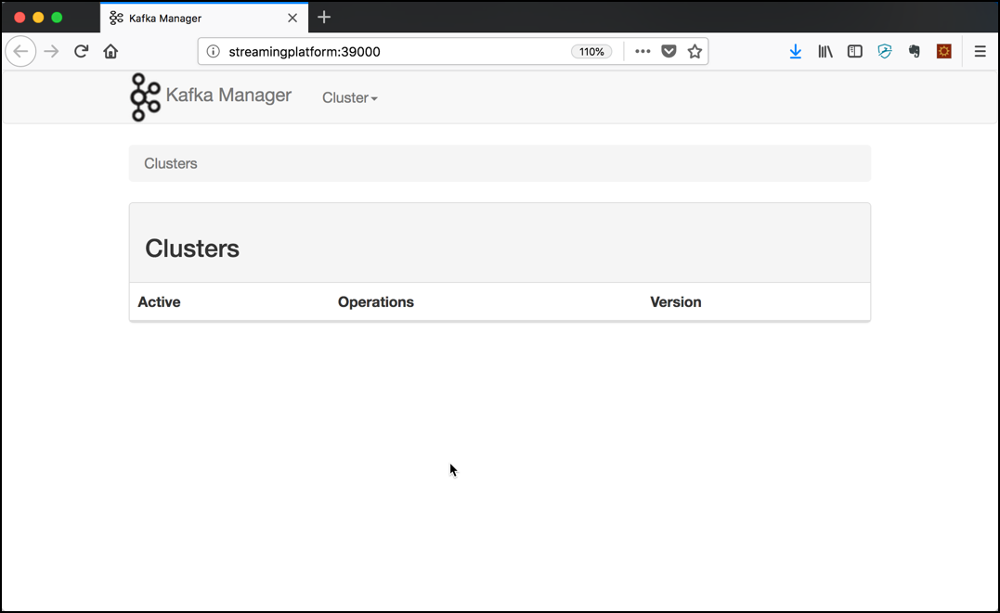
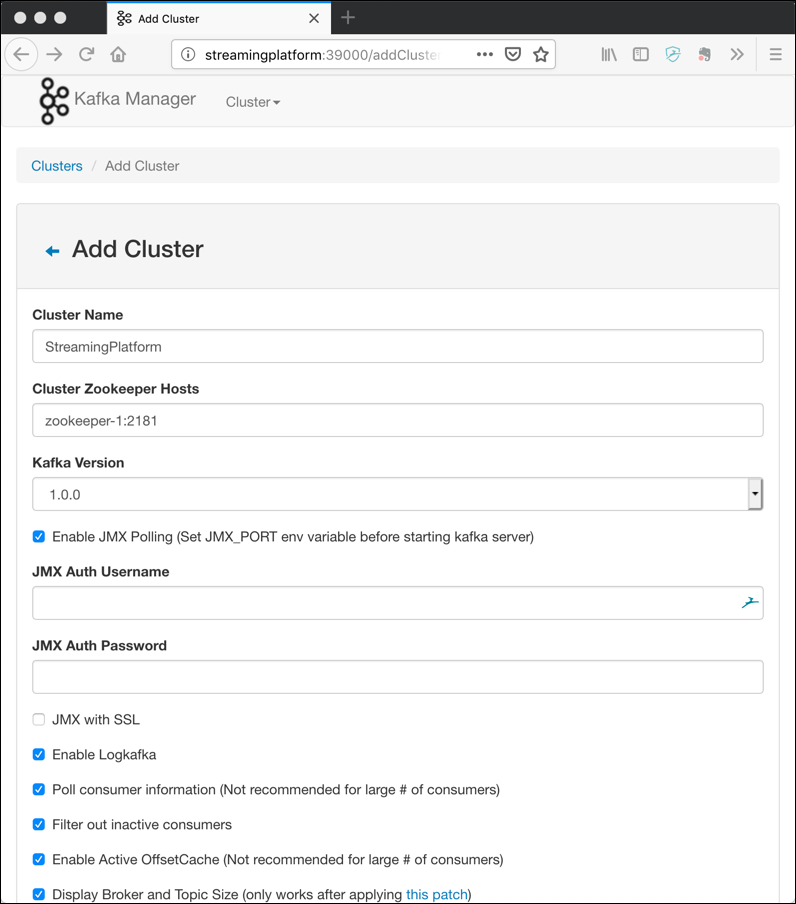
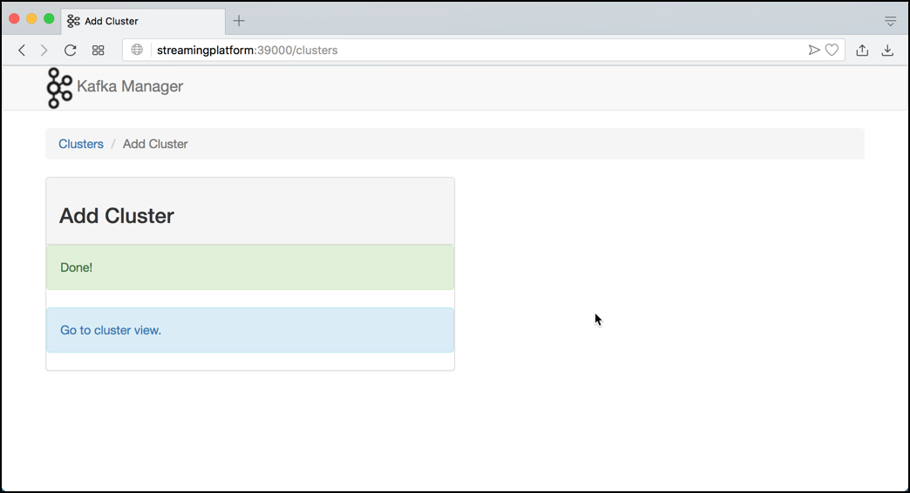

# Getting started with Apache Kafka

## Introduction

In this workshop we will learn the basics of working with Apache Kafka. Make sure that you have created the environment as described in [Preparing the Environment](../01-environment/01-environment.md).

The main units of interest in Kafka are topics and messages. A topic is simply what you publish a message to, topics are a stream of messages.

In this workshop you will learn how to create topics, how to produce messages, how to consume messages and how to describe/view metadata in Apache Kafka. 
    
## Working with built-in Command Line Utilities 

### Connect to a Kafka Broker 

The environment contains of a Kafka cluster with 3 brokers, all running on the Docker host of course. So it's of course not meant to really fault-tolerant but to demonstrate how to work with a Kafka cluster. 

To work with Kafka you need the command line utilities. They are available on each broker. 
The `kafka-topics` utility is used to create, alter, describe, and delete topics. The `kafka-console-producer` and `kafka-console-consumer` can be used to produce/consume messages to/from a Kafka topic. 

So let's connect into one of the broker through a terminal window. 

Open a terminal window on the Docker Host and run a `docker exec` command to start a shell in the `kafka-1` docker container 

```
docker exec -ti kafka-1 bash
```

if we just execute the `kafka-topics` command without any options, a help page is shown

```
root@kafka-1:/# kafka-topics
Create, delete, describe, or change a topic.
Option                                   Description
------                                   -----------
--alter                                  Alter the number of partitions,
                                           replica assignment, and/or
                                           configuration for the topic.
--bootstrap-server <String: server to    REQUIRED: The Kafka server to connect
  connect to>                              to. In case of providing this, a
                                           direct Zookeeper connection won't be
                                           required.
--command-config <String: command        Property file containing configs to be
  config property file>                    passed to Admin Client. This is used
                                           only with --bootstrap-server option
                                           for describing and altering broker
                                           configs.
--config <String: name=value>            A topic configuration override for the
                                           topic being created or altered.The
                                           following is a list of valid
                                           configurations:
                                         	cleanup.policy
                                         	compression.type
                                         	delete.retention.ms
                                         	file.delete.delay.ms
                                         	flush.messages
                                         	flush.ms
                                         	follower.replication.throttled.
                                           replicas
                                         	index.interval.bytes
                                         	leader.replication.throttled.replicas
                                         	max.message.bytes
                                         	message.downconversion.enable
                                         	message.format.version
                                         	message.timestamp.difference.max.ms
                                         	message.timestamp.type
                                         	min.cleanable.dirty.ratio
                                         	min.compaction.lag.ms
                                         	min.insync.replicas
                                         	preallocate
                                         	retention.bytes
                                         	retention.ms
                                         	segment.bytes
                                         	segment.index.bytes
                                         	segment.jitter.ms
                                         	segment.ms
                                         	unclean.leader.election.enable
                                         See the Kafka documentation for full
                                           details on the topic configs.It is
                                           supported only in combination with --
                                           create if --bootstrap-server option
                                           is used.
--create                                 Create a new topic.
--delete                                 Delete a topic
--delete-config <String: name>           A topic configuration override to be
                                           removed for an existing topic (see
                                           the list of configurations under the
                                           --config option). Not supported with
                                           the --bootstrap-server option.
--describe                               List details for the given topics.
--disable-rack-aware                     Disable rack aware replica assignment
--exclude-internal                       exclude internal topics when running
                                           list or describe command. The
                                           internal topics will be listed by
                                           default
--force                                  Suppress console prompts
--help                                   Print usage information.
--if-exists                              if set when altering or deleting or
                                           describing topics, the action will
                                           only execute if the topic exists.
                                           Not supported with the --bootstrap-
                                           server option.
--if-not-exists                          if set when creating topics, the
                                           action will only execute if the
                                           topic does not already exist. Not
                                           supported with the --bootstrap-
                                           server option.
--list                                   List all available topics.
--partitions <Integer: # of partitions>  The number of partitions for the topic
                                           being created or altered (WARNING:
                                           If partitions are increased for a
                                           topic that has a key, the partition
                                           logic or ordering of the messages
                                           will be affected
--replica-assignment <String:            A list of manual partition-to-broker
  broker_id_for_part1_replica1 :           assignments for the topic being
  broker_id_for_part1_replica2 ,           created or altered.
  broker_id_for_part2_replica1 :
  broker_id_for_part2_replica2 , ...>
--replication-factor <Integer:           The replication factor for each
  replication factor>                      partition in the topic being created.
--topic <String: topic>                  The topic to create, alter, describe
                                           or delete. It also accepts a regular
                                           expression, except for --create
                                           option. Put topic name in double
                                           quotes and use the '\' prefix to
                                           escape regular expression symbols; e.
                                           g. "test\.topic".
--topics-with-overrides                  if set when describing topics, only
                                           show topics that have overridden
                                           configs
--unavailable-partitions                 if set when describing topics, only
                                           show partitions whose leader is not
                                           available
--under-replicated-partitions            if set when describing topics, only
                                           show under replicated partitions
--zookeeper <String: hosts>              DEPRECATED, The connection string for
                                           the zookeeper connection in the form
                                           host:port. Multiple hosts can be
                                           given to allow fail-over.
```

### List topics in Kafka

First, let's list the topics available on a given Kafka Cluster. For that we use the `kafka-topics` utility with the `--list` option. 

```
kafka-topics --list --zookeeper zookeeper-1:2181
```

We can see that there are some technical topics, `_schemas` being the one, where the Confluent Schema Registry stores its schemas. 

### Creating a topic in Kafka

Now let's create a new topic. For that we again use the **kafka-topics** utility but this time with the `--create` option. We will create a test topic with 6 partitions and replicated 2 times. The `--if-not-exists` option is handy to avoid errors, if a topic already exists. 

```
kafka-topics --create \
			--if-not-exists \
			--zookeeper zookeeper-1:2181 \
			--topic test-topic \
			--partitions 6 \
			--replication-factor 2
```

Re-Run the command to list the topics. You should see the new topic you have just created. 

### Describe a Topic

You can use the `--describe` option to

```
kafka-topics --describe --zookeeper zookeeper-1:2181 --topic test-topic
```

```
Topic:test-topic	PartitionCount:6	ReplicationFactor:2	Configs:
	Topic: test-topic	Partition: 0	Leader: 3	Replicas: 3,2	Isr: 3,2
	Topic: test-topic	Partition: 1	Leader: 1	Replicas: 1,3	Isr: 1,3
	Topic: test-topic	Partition: 2	Leader: 2	Replicas: 2,1	Isr: 2,1
	Topic: test-topic	Partition: 3	Leader: 3	Replicas: 3,1	Isr: 3,1
	Topic: test-topic	Partition: 4	Leader: 1	Replicas: 1,2	Isr: 1,2
	Topic: test-topic	Partition: 5	Leader: 2	Replicas: 2,3	Isr: 2,3
```

### Produce and Consume to Kafka topic with command line utility

Now let's see the topic in use. The most basic way to test it is through the command line. Kafka comes with two handy utilities `kafka-console-consumer` and `kafka-console-producer` to consume and produce messages through the command line. 

In a new terminal window, first let's run the consumer on the topic `test-topic` we have created before

```
kafka-console-consumer --bootstrap-server kafka-1:19092,kafka-2:19093 \
                       --topic test-topic
```
After it is started, the consumer just waits for newly produced messages. 

In an another terminal, again connect into `kafka-1` using a `docker exec` 

```
docker exec -ti kafka-1 bash
```

and run the following command to start the producer.   
 
```
kafka-console-producer --broker-list kafka-1:19092,kafka-2:19093 \
                       --topic test-topic
```

The console producer reads from stdin, and takes a broker list instead of a zookeeper address. We specify 2 of the 3 brokers of the Streaming Platform.

On the `>` prompt enter a few messages, execute each single message by hitting the **Enter** key.<br>
**Hint:** Try to enter them as quick as possible.

```
>aaa
>bbb
>ccc
>ddd
>eee
```

You should see the messages being consumed by the consumer. 

```
root@kafka-1:/# kafka-console-consumer --bootstrap-server kafka-1:19092,kafka-2:19093 --topic test-topic
aaa
bbb
ccc
eee
ddd
```

You can see that they don't arrive in the same order (if you are entering them fast enough on the producer side)

You can stop the consumer by hitting **Ctrl-C**. If you want to consume from the beginning of the log, use the `--from-beginning` option.

You can also echo a longer message and pipe it into the console producer, as he is reading the next message from the command line:

```
echo "This is my first message!" | kafka-console-producer \
                  --broker-list kafka-1:19092,kafka-2:19093 \
                  --topic test-topic
```

And of course you can send messages inside a bash for loop:

```
for i in 1 2 3 4 5 6 7 8 9 10
do
   echo "This is message $i"| kafka-console-producer \
                  --broker-list kafka-1:19092,kafka-2:19093 \
                  --topic test-topic \
                  --batch-size 1 &
done 
```

By ending the command in the loop with an & character, we run each command in the background and in parallel. 

If you check the consumer, you can see that they are not in the same order as sent, because of the different partitions, and the messages being published in multiple partitions. We can force order by using a key when publishing the messages and always using the same value for the key. 

### Working with Keyed Messages

A message produced to Kafka always consists of a key and a value, the value being necessary and representing the message/event payload. If a key is not specified, such as we did so far, then it is passed as a null value and Kafka distributes such messages in a round-robin fashion over the different partitions. 

We can check that by re-consuming the messages we have created so far, specifying the option `--from-beginning` together with the option `print.key` and `key.separator` in the console consumer. For that stop the old consumer and restart it again using the following command

```
kafka-console-consumer --bootstrap-server kafka-1:19092,kafka-2:19093 \
							--topic test-topic \
							--property print.key=true \
							--property key.separator=, \
							--from-beginning
```

We can see that the keys are all `null` because so far we have only created the value part of the messages.

For producing messages also with a key, use the options `parse.key` and `key.separator`. 

```
kafka-console-producer --broker-list kafka-1:19092,kafka-2:19093 \
							--topic test-topic \
							--property parse.key=true \
							--property key.separator=,
```

Enter your messages so that a key and messages are separated by a comma, i.e. `key1,value1`.  Do that for a few messages and check that they are shown in the console consumers as key and value. 

### Dropping a Kafka topic

A Kafka topic can be dropped using the `kafka-topics` utility with the `--delete` option. 

```
kafka-topics --zookeeper zookeeper-1:2181 --delete --topic test-topic
```

## Working with the Kafkacat utility

[Kafkacat](https://docs.confluent.io/current/app-development/kafkacat-usage.html#kafkacat-usage) is a command line utility that you can use to test and debug Apache Kafka deployments. You can use `kafkacat` to produce, consume, and list topic and partition information for Kafka. Described as “netcat for Kafka”, it is a swiss-army knife of tools for inspecting and creating data in Kafka.

It is similar to the `kafka-console-producer` and `kafka-console-consumer` you have learnt and used above, but much more powerful and also simpler to use. 

**Kafkacat** is an open-source utility, available at <https://github.com/edenhill/kafkacat>. It is not part of the Confluent platform and also not part of the Streaming Platform we run in docker. 

You can run **Kafkacat** as a standalone utility on any **Linux** or **Mac** computer and remotely connect to a running Kafka cluster. 

### Installing Kafakcat

Officially **Kafkacat** is either supported on **Linux** or **Mac OS-X**. There is no official support for **Windows** yet. There is a Docker image for Kafkacat from Confluent as well.
We will show how to install it on **Ubunut** and **Mac OS-X**. 

In all the workshops we will assume that **Kafkacat** is installed locally on the Docker Host and that `streamingplatform` alias has been added to `/etc/hosts`. 

#### Ubuntu

You can install **kafkacat** directly on the Ubuntu environment. First let's install the required packages:

Install the Confluent public key, which is used to sign the packages in the APT repository:

```
wget -qO - https://packages.confluent.io/deb/5.2/archive.key | sudo apt-key add -
```

Add the repository to the `/etc/apt/sources.list`:

```
sudo add-apt-repository "deb [arch=amd64] https://packages.confluent.io/deb/5.2 stable main"
```

Run apt-get update and install the 2 dependencies as well as **kafkacat**
 
```
sudo apt-get update
sudo apt-get install librdkafka-dev libyajl-dev
sudo apt-get install kafkacat
```

#### Mac OS-X

To install **Kafkacat** on a Macbook, just run the following command:

```
brew install kafkacat
```

#### Docker Container

There is also a Docker container from Confluent which can be used to run **Kafkacat**

```
docker run --tty --network kafkaworkshop_default edenhill/kafkacat:1.5.0 kafkacat
```

Check the [Docker Image description on Docker Hub](https://hub.docker.com/r/confluentinc/cp-kafkacat) to see more options for using **Kafkacat** with Docker. 

#### Windows

There is no official support to run Kafkacat on Windows. You might try the following link to run it on Windows: <https://ci.appveyor.com/project/edenhill/kafkacat/builds/23675338/artifacts>.

An other option for Windows is to run it as a Docker container as shown above. 

### Display Kafkacat options

**kafkacat** has many options. If you just enter `kafkacat` without any options, all the options with a short description is shown on the console. Additionally Kafkacat will show the version which is installed. This is current **1.5.0** if installed on Mac and **1.3.1** if on Ubuntu. **1.4.0** is interesting, because support for Kafka Headers has been added and with **1.5.0** there is also support for consuming Avro messages.

```
gus@gusmacbook ~> kafkacat
Error: -b <broker,..> missing

Usage: kafkacat <options> [file1 file2 .. | topic1 topic2 ..]]
kafkacat - Apache Kafka producer and consumer tool
https://github.com/edenhill/kafkacat
Copyright (c) 2014-2019, Magnus Edenhill
Version 1.5.0 (JSON, librdkafka 1.2.0 builtin.features=gzip,snappy,ssl,sasl,regex,lz4,sasl_gssapi,sasl_plain,sasl_scram,plugins,zstd,sasl_oauthbearer)


General options:
  -C | -P | -L | -Q  Mode: Consume, Produce, Metadata List, Query mode
  -G <group-id>      Mode: High-level KafkaConsumer (Kafka >=0.9 balanced consumer groups)
                     Expects a list of topics to subscribe to
  -t <topic>         Topic to consume from, produce to, or list
  -p <partition>     Partition
  -b <brokers,..>    Bootstrap broker(s) (host[:port])
  -D <delim>         Message delimiter character:
                     a-z.. | \r | \n | \t | \xNN
                     Default: \n
  -E                 Do not exit on non fatal error
  -K <delim>         Key delimiter (same format as -D)
  -c <cnt>           Limit message count
  -F <config-file>   Read configuration properties from file,
                     file format is "property=value".
                     The KAFKACAT_CONFIG=path environment can also be used, but -F takes preceedence.
                     The default configuration file is $HOME/.config/kafkacat.conf
  -X list            List available librdkafka configuration properties
  -X prop=val        Set librdkafka configuration property.
                     Properties prefixed with "topic." are
                     applied as topic properties.
  -X dump            Dump configuration and exit.
  -d <dbg1,...>      Enable librdkafka debugging:
                     all,generic,broker,topic,metadata,feature,queue,msg,protocol,cgrp,security,fetch,interceptor,plugin,consumer,admin,eos
  -q                 Be quiet (verbosity set to 0)
  -v                 Increase verbosity
  -V                 Print version
  -h                 Print usage help

Producer options:
  -z snappy|gzip|lz4 Message compression. Default: none
  -p -1              Use random partitioner
  -D <delim>         Delimiter to split input into messages
  -K <delim>         Delimiter to split input key and message
  -k <str>           Use a fixed key for all messages.
                     If combined with -K, per-message keys
                     takes precendence.
  -H <header=value>  Add Message Headers (may be specified multiple times)
  -l                 Send messages from a file separated by
                     delimiter, as with stdin.
                     (only one file allowed)
  -T                 Output sent messages to stdout, acting like tee.
  -c <cnt>           Exit after producing this number of messages
  -Z                 Send empty messages as NULL messages
  file1 file2..      Read messages from files.
                     With -l, only one file permitted.
                     Otherwise, the entire file contents will
                     be sent as one single message.

Consumer options:
  -o <offset>        Offset to start consuming from:
                     beginning | end | stored |
                     <value>  (absolute offset) |
                     -<value> (relative offset from end)
                     s@<value> (timestamp in ms to start at)
                     e@<value> (timestamp in ms to stop at (not included))
  -e                 Exit successfully when last message received
  -f <fmt..>         Output formatting string, see below.
                     Takes precedence over -D and -K.
  -J                 Output with JSON envelope
  -s key=<serdes>    Deserialize non-NULL keys using <serdes>.
  -s value=<serdes>  Deserialize non-NULL values using <serdes>.
  -s <serdes>        Deserialize non-NULL keys and values using <serdes>.
                     Available deserializers (<serdes>):
                       <pack-str> - A combination of:
                                    <: little-endian,
                                    >: big-endian (recommended),
                                    b: signed 8-bit integer
                                    B: unsigned 8-bit integer
                                    h: signed 16-bit integer
                                    H: unsigned 16-bit integer
                                    i: signed 32-bit integer
                                    I: unsigned 32-bit integer
                                    q: signed 64-bit integer
                                    Q: unsigned 64-bit integer
                                    c: ASCII character
                                    s: remaining data is string
                                    $: match end-of-input (no more bytes remaining or a parse error is raised).
                                       Not including this token skips any
                                       remaining data after the pack-str is
                                       exhausted.
  -D <delim>         Delimiter to separate messages on output
  -K <delim>         Print message keys prefixing the message
                     with specified delimiter.
  -O                 Print message offset using -K delimiter
  -c <cnt>           Exit after consuming this number of messages
  -Z                 Print NULL values and keys as "NULL"instead of empty.
                     For JSON (-J) the nullstr is always null.
  -u                 Unbuffered output

Metadata options (-L):
  -t <topic>         Topic to query (optional)

Query options (-Q):
  -t <t>:<p>:<ts>    Get offset for topic <t>,
                     partition <p>, timestamp <ts>.
                     Timestamp is the number of milliseconds
                     since epoch UTC.
                     Requires broker >= 0.10.0.0 and librdkafka >= 0.9.3.
                     Multiple -t .. are allowed but a partition
                     must only occur once.

Format string tokens:
  %s                 Message payload
  %S                 Message payload length (or -1 for NULL)
  %R                 Message payload length (or -1 for NULL) serialized
                     as a binary big endian 32-bit signed integer
  %k                 Message key
  %K                 Message key length (or -1 for NULL)
  %T                 Message timestamp (milliseconds since epoch UTC)
  %h                 Message headers (n=v CSV)
  %t                 Topic
  %p                 Partition
  %o                 Message offset
  \n \r \t           Newlines, tab
  \xXX \xNNN         Any ASCII character
 Example:
  -f 'Topic %t [%p] at offset %o: key %k: %s\n'

JSON message envelope (on one line) when consuming with -J:
 { "topic": str, "partition": int, "offset": int,
   "tstype": "create|logappend|unknown", "ts": int, // timestamp in milliseconds since epoch
   "headers": { "<name>": str, .. }, // optional
   "key": str|json, "payload": str|json,
   "key_error": str, "payload_error": str } //optional
 (note: key_error and payload_error are only included if deserialization failed)

Consumer mode (writes messages to stdout):
  kafkacat -b <broker> -t <topic> -p <partition>
 or:
  kafkacat -C -b ...

High-level KafkaConsumer mode:
  kafkacat -b <broker> -G <group-id> topic1 top2 ^aregex\d+

Producer mode (reads messages from stdin):
  ... | kafkacat -b <broker> -t <topic> -p <partition>
 or:
  kafkacat -P -b ...

Metadata listing:
  kafkacat -L -b <broker> [-t <topic>]

Query offset by timestamp:
  kafkacat -Q -b broker -t <topic>:<partition>:<timestamp>
```

Now let's use it to Produce and Consume messages.

### Consuming messages using Kafkacat

The simplest way to consume a topic is just specifying the broker and the topic. By default all messages from the beginning of the topic will be shown 

```
kafkacat -b streamingplatform -t test-topic
```

If you want to start at the end of the topic, i.e. only show new messages, add the `-o` option. 

```
kafkacat -b streamingplatform -t test-topic -o end
```

To show only the last message (one for each partition), set the `-o` option to `-1`. `-2` would show the last 2 messages.

```
kafkacat -b streamingplatform -t test-topic -o -1
```

To show only the last message from exactly one partition, add the `-p` option

```
kafkacat -b streamingplatform -t test-topic -p1 -o -1
```

You can use the `-f` option to format the output. Here we show the partition (`%p`) as well as key (`%k`) and value (`%s`):

```
kafkacat -b streamingplatform -t test-topic -f 'Part-%p => %k:%s\n'
```

If there are keys which are Null, then you can use `-Z` to actually show NULL in the output:

```
kafkacat -b streamingplatform -t test-topic -f 'Part-%p => %k:%s\n' -Z
```

There is also the option `-J` to have the output emitted as JSON.

```
kafkacat -b streamingplatform -t test-topic -J
```

### Producing messages using Kafkacat

Producing messages with **Kafkacat** is as easy as consuming. Just add the `-P` option to switch to Producer mode.

```
kafkacat -b streamingplatform -t test-topic -P
```

To produce with key, specify the delimiter to split key and message, using the `-K` option. 

```
kafkacat -b streamingplatform -t test-topic -P -K , -X topic.partitioner=murmur2_random
```

Find some more example on the [Kafkacat GitHub project](https://github.com/edenhill/kafkacat) or in the [Confluent Documentation](https://docs.confluent.io/current/app-development/kafkacat-usage.html).

### Send "realistic" test messages to Kafka using Mockaroo and Kafkacat

In his [blog article](https://rmoff.net/2018/05/10/quick-n-easy-population-of-realistic-test-data-into-kafka-with-mockaroo-and-kafkacat/) Robin Moffatt shows an interesting and easy approach to send realistic mock data to Kafka. He is using [Mockaroo](https://mockaroo.com/), a free test data generator and API mocking tool, together with [Kafkacat](https://github.com/edenhill/kafkacat) to produce mock messages. 

Taking his example, you can send 10 orders to test-topic.

```
curl -s "https://api.mockaroo.com/api/d5a195e0?count=20&key=ff7856d0"| \
	kafkacat -b streamingplatform -t test-topic -P
```

## Using Kafka Manager

[Kafka Manger](https://github.com/yahoo/kafka-manager) is an open source tool created by Yahoo for managing a Kafka cluster. It has been started as part of the **streamingplatform** and can be reached on <http://streamingplatform:28044/>.



Navigate to the **Cluster** menu and click on the drop-down and select **Add Cluster**.


The **Add Cluster** details page should be displayed. Enter the following values into the edit fields / drop down windows:

  * **Cluster Name**: Streaming Platform
  * **Custer Zookeeper Hosts**: zookeeper-1:2181
  * **Kafka Version**: 2.0.0

Select the **Enable JMX Polling**, **Poll consumer information**, **Filter out inactive consumers**, **Enable Active OffsetCache** and **Display Broker and Topic Size** and click on **Save** to add the cluster. 



You should get a message `Done!` signalling that the cluster has been successfully configured in **Kafka Manager**.



Click on **Go to cluster view**. 


