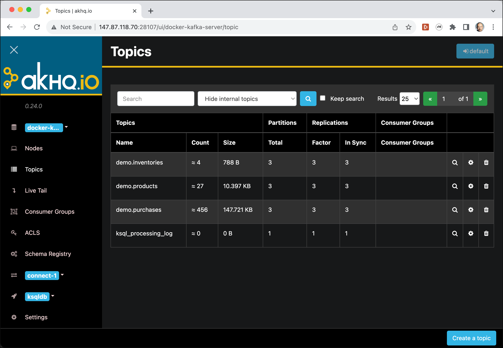
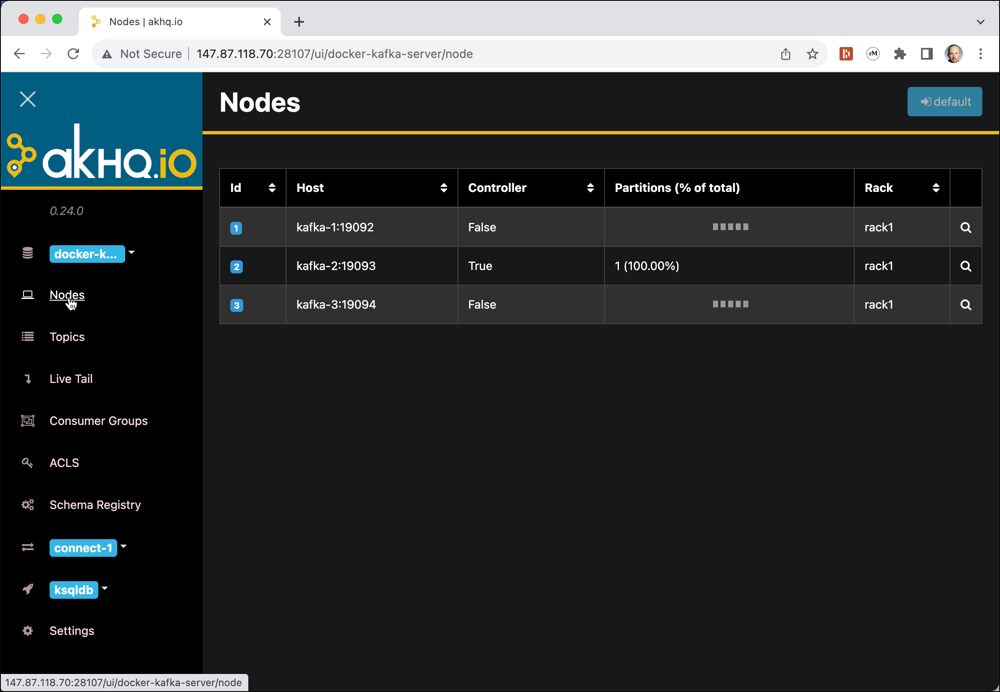
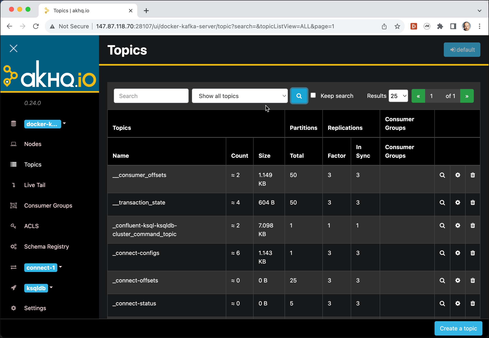
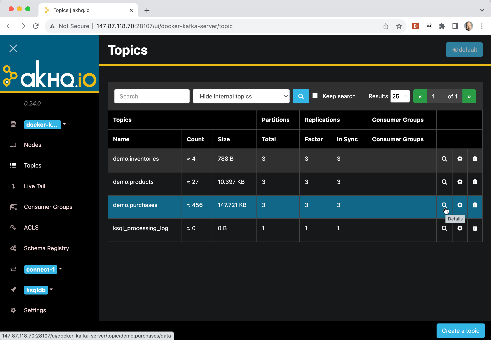
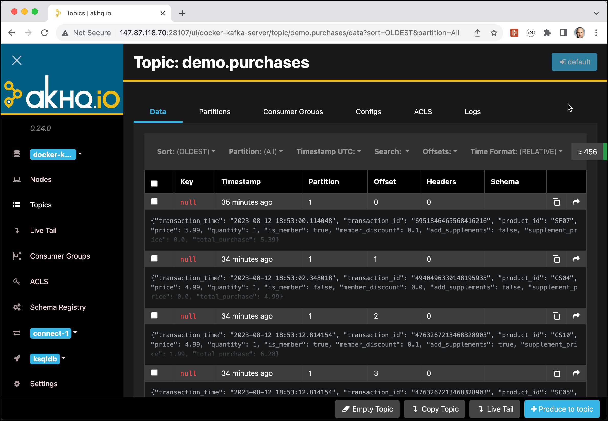
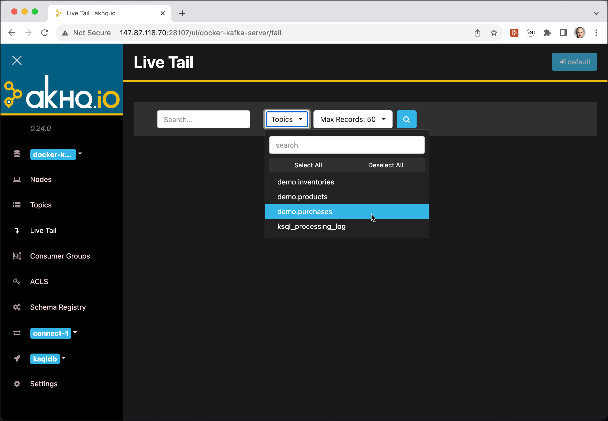
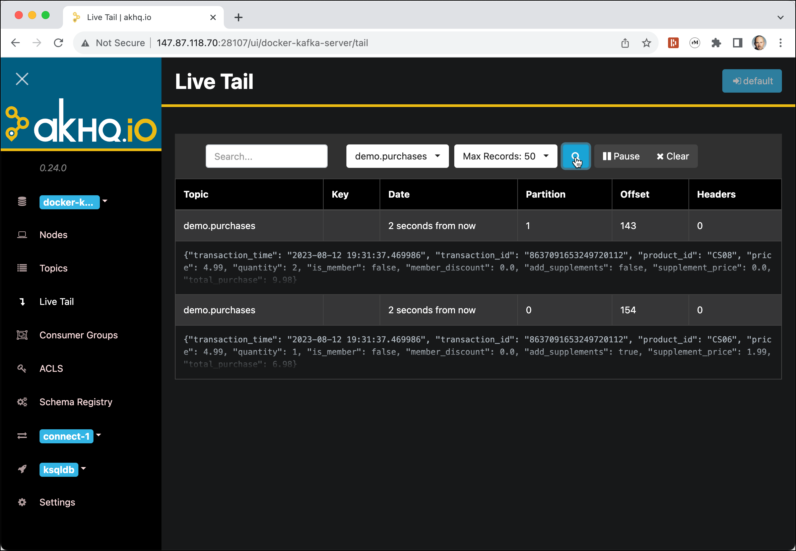
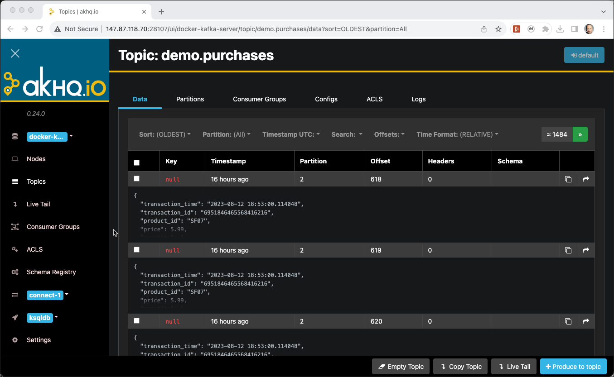

# Getting started with Apache Kafka

## Introduction

In this workshop we will learn the basics of working with Apache Kafka. Make sure that you have created the environment as described in [Preparing the Environment](../01-environment/README.md).

The main units of interest in Kafka are topics and messages. A topic is simply what you publish a message to, topics are a stream of messages.

In this workshop you will learn how to create topics, how to produce messages, how to consume messages and how to describe/view metadata in Apache Kafka. 
    
## Working with built-in Command Line Utilities 

### Connect to a Kafka Broker 

The environment contains of a Kafka cluster with 3 brokers, all running on the Docker host of course. So it's of course not meant to really fault-tolerant but to demonstrate how to work with a Kafka cluster. 

To work with Kafka you need the command line utilities. They are available on each broker. 
The `kafka-topics` utility is used to create, alter, describe, and delete topics. The `kafka-console-producer` and `kafka-console-consumer` can be used to produce/consume messages to/from a Kafka topic. 

So let's connect into one of the broker through a terminal window.
  
  * If you have access through Guacamole, then right click on the dashboard and select **Open Terminal**.
  * if you have a user and password, you can also use a browser-based terminal, by navigating to <http://localhost:3001> and then login with username and password.

In the terminal window run a `docker exec` command to start a shell in the `kafka-1` docker container 

```bash
docker exec -ti kafka-1 bash
```

if we just execute the `kafka-topics` command without any options, a help page is shown

```bash
root@kafka-1:/# kafka-topics
Create, delete, describe, or change a topic.
Option                                   Description                            
------                                   -----------                            
--alter                                  Alter the number of partitions,        
                                           replica assignment, and/or           
                                           configuration for the topic.         
--at-min-isr-partitions                  if set when describing topics, only    
                                           show partitions whose isr count is   
                                           equal to the configured minimum.     
--bootstrap-server <String: server to    REQUIRED: The Kafka server to connect  
  connect to>                              to.                                  
--command-config <String: command        Property file containing configs to be 
  config property file>                    passed to Admin Client. This is used 
                                           only with --bootstrap-server option  
                                           for describing and altering broker   
                                           configs.                             
--config <String: name=value>            A topic configuration override for the 
                                           topic being created or altered. The  
                                           following is a list of valid         
                                           configurations:                      
                                         cleanup.policy                        
                                         compression.type                      
                                         delete.retention.ms                   
                                         file.delete.delay.ms                  
                                         flush.messages                        
                                         flush.ms                              
                                         follower.replication.throttled.       
                                           replicas                             
                                         index.interval.bytes                  
                                         leader.replication.throttled.replicas 
                                         local.retention.bytes                 
                                         local.retention.ms                    
                                         max.compaction.lag.ms                 
                                         max.message.bytes                     
                                         message.downconversion.enable         
                                         message.format.version                
                                         message.timestamp.difference.max.ms   
                                         message.timestamp.type                
                                         min.cleanable.dirty.ratio             
                                         min.compaction.lag.ms                 
                                         min.insync.replicas                   
                                         preallocate                           
                                         remote.storage.enable                 
                                         retention.bytes                       
                                         retention.ms                          
                                         segment.bytes                         
                                         segment.index.bytes                   
                                         segment.jitter.ms                     
                                         segment.ms                            
                                         unclean.leader.election.enable        
                                         See the Kafka documentation for full   
                                           details on the topic configs. It is  
                                           supported only in combination with --
                                           create if --bootstrap-server option  
                                           is used (the kafka-configs CLI       
                                           supports altering topic configs with 
                                           a --bootstrap-server option).        
--create                                 Create a new topic.                    
--delete                                 Delete a topic                         
--delete-config <String: name>           A topic configuration override to be   
                                           removed for an existing topic (see   
                                           the list of configurations under the 
                                           --config option). Not supported with 
                                           the --bootstrap-server option.       
--describe                               List details for the given topics.     
--disable-rack-aware                     Disable rack aware replica assignment  
--exclude-internal                       exclude internal topics when running   
                                           list or describe command. The        
                                           internal topics will be listed by    
                                           default                              
--help                                   Print usage information.               
--if-exists                              if set when altering or deleting or    
                                           describing topics, the action will   
                                           only execute if the topic exists.    
--if-not-exists                          if set when creating topics, the       
                                           action will only execute if the      
                                           topic does not already exist.        
--list                                   List all available topics.             
--partitions <Integer: # of partitions>  The number of partitions for the topic 
                                           being created or altered (WARNING:   
                                           If partitions are increased for a    
                                           topic that has a key, the partition  
                                           logic or ordering of the messages    
                                           will be affected). If not supplied   
                                           for create, defaults to the cluster  
                                           default.                             
--replica-assignment <String:            A list of manual partition-to-broker   
  broker_id_for_part1_replica1 :           assignments for the topic being      
  broker_id_for_part1_replica2 ,           created or altered.                  
  broker_id_for_part2_replica1 :                                                
  broker_id_for_part2_replica2 , ...>                                           
--replication-factor <Integer:           The replication factor for each        
  replication factor>                      partition in the topic being         
                                           created. If not supplied, defaults   
                                           to the cluster default.              
--topic <String: topic>                  The topic to create, alter, describe   
                                           or delete. It also accepts a regular 
                                           expression, except for --create      
                                           option. Put topic name in double     
                                           quotes and use the '\' prefix to     
                                           escape regular expression symbols; e.
                                           g. "test\.topic".                    
--topics-with-overrides                  if set when describing topics, only    
                                           show topics that have overridden     
                                           configs                              
--unavailable-partitions                 if set when describing topics, only    
                                           show partitions whose leader is not  
                                           available                            
--under-min-isr-partitions               if set when describing topics, only    
                                           show partitions whose isr count is   
                                           less than the configured minimum.    
--under-replicated-partitions            if set when describing topics, only    
                                           show under replicated partitions     
--version                                Display Kafka version.
```

### List topics in Kafka

First, let's list the topics available on a given Kafka Cluster. For that we use the `kafka-topics` utility with the `--list` option. 

```
kafka-topics --list --bootstrap-server kafka-1:19092,kafka-2:19093
```

We can see that there are some technical topics, `_schemas` being the one, where the Confluent Schema Registry stores its schemas. 

### Creating a topic in Kafka

Now let's create a new topic. For that we again use the **kafka-topics** utility but this time with the `--create` option. We will create a test topic with 6 partitions and replicated 2 times. The `--if-not-exists` option is handy to avoid errors, if a topic already exists. 

```bash
kafka-topics --create \
             --if-not-exists \
             --bootstrap-server kafka-1:19092,kafka-2:19093 \
             --topic test-topic \
             --partitions 6 \
             --replication-factor 2
```

Re-Run the command to list the topics. You should see the new topic you have just created. 

### Describe a Topic

You can use the `--describe` option to

```bash
kafka-topics --describe --bootstrap-server kafka-1:19092,kafka-2:19093 --topic test-topic
```

```bash
Topic:test-topicPartitionCount:6ReplicationFactor:2Configs:
Topic: test-topicPartition: 0Leader: 3Replicas: 3,2Isr: 3,2
Topic: test-topicPartition: 1Leader: 1Replicas: 1,3Isr: 1,3
Topic: test-topicPartition: 2Leader: 2Replicas: 2,1Isr: 2,1
Topic: test-topicPartition: 3Leader: 3Replicas: 3,1Isr: 3,1
Topic: test-topicPartition: 4Leader: 1Replicas: 1,2Isr: 1,2
Topic: test-topicPartition: 5Leader: 2Replicas: 2,3Isr: 2,3
```

### Produce and Consume to Kafka topic with command line utility

Now let's see the topic in use. The most basic way to test it is through the command line. Kafka comes with two handy utilities `kafka-console-consumer` and `kafka-console-producer` to consume and produce messages through the command line. 

In a new terminal window, first let's run the consumer on the topic `test-topic` we have created before

```bash
kafka-console-consumer --bootstrap-server kafka-1:19092,kafka-2:19093 \
                       --topic test-topic
```
After it is started, the consumer just waits for newly produced messages. 

In an another terminal, again connect into `kafka-1` using a `docker exec` 

```bash
docker exec -ti kafka-1 bash
```

and run the following command to start the producer.   
 
```bash
kafka-console-producer --bootstrap-server kafka-1:19092,kafka-2:19093 --topic test-topic
```

By default, the console producer waits for **1000ms** before sending messages, if they are not larger than 16'384 bytes. The reason for that is as follows: 

  * the `linger.ms` parameter is set using the `--timeout` option on the command line which if not specified is **1000 ms**. 
  * the `batch.size` parameter is set using the `--max-partition-memory-bytes` option on the command line which if not specified is **16384**. 
  * **Note:** even if you specify `linger.ms` and `batch.size` using `--producer-property` or `--producer.config`, they will be always overwritten by the above "specific" options!

The console producer reads from stdin, and takes a bootstrap-server list (you should use it instead of the borker-list, which is deprecated). We specify 2 of the 3 brokers of the Data Platform.

On the `>` prompt enter a few messages, execute each single message by hitting the **Enter** key.<br>

```bash
>aaa
>bbb
>ccc
>ddd
>eee
```

You should see the messages being consumed by the consumer. 

```bash
root@kafka-1:/# kafka-console-consumer --bootstrap-server kafka-1:19092,kafka-2:19093 --topic test-topic
aaa
bbb
ccc
ddd
eee
```

Messages arrive in the same order because you are just not able to enter them quick enough. 

You can stop the consumer by hitting **Ctrl-C**. If you want to consume from the beginning of the log, use the `--from-beginning` option.

You can also echo a longer message and pipe it into the console producer, as he is reading the next message from the command line:

```bash
echo "This is my first message!" | kafka-console-producer \
                         --bootstrap-server kafka-1:19092,kafka-2:19093 \
                         --topic test-topic
```

And of course you can send messages inside a bash for loop:

```bash
for i in 1 2 3 4 5 6 7 8 9 10
do
   echo "This is message $i"| kafka-console-producer \
          --bootstrap-server kafka-1:19092,kafka-2:19093 \
          --topic test-topic \
          --batch-size 1 &
done 
```

By ending the command in the loop with an & character, we run each command in the background and in parallel. 

If you check the consumer, you can see that they are not in the same order as sent, because of the different partitions, and the messages being published in multiple partitions. We can force order by using a key when publishing the messages and always using the same value for the key. 

### Working with Keyed Messages

A message produced to Kafka always consists of a key and a value, the value being necessary and representing the message/event payload. If a key is not specified, such as we did so far, then it is passed as a null value and Kafka distributes such messages in a round-robin fashion over the different partitions. 

We can check that by re-consuming the messages we have created so far, specifying the option `--from-beginning` together with the option `print.key` and `key.separator` in the console consumer. For that stop the old consumer and restart it again using the following command

```bash
kafka-console-consumer --bootstrap-server kafka-1:19092,kafka-2:19093 \
                      --topic test-topic \
                      --property print.key=true \
                      --property key.separator=, \
                      --from-beginning
```

We can see that the keys are all `null` because so far we have only created the value part of the messages.

For producing messages also with a key, use the options `parse.key` and `key.separator`. 

```bash
kafka-console-producer  --bootstrap-server kafka-1:19092,kafka-2:19093 \
                        --topic test-topic \
                        --property parse.key=true \
                        --property key.separator=,
```

Enter your messages so that a key and messages are separated by a comma, i.e. `key1,value1`.  Do that for a few messages and check that they are shown in the console consumers as key and value. 

### Dropping a Kafka topic

A Kafka topic can be dropped using the `kafka-topics` utility with the `--delete` option. 

```bash
kafka-topics  --bootstrap-server kafka-1:19092,kafka-2:19093 --delete --topic test-topic
```

## Working with the `kcat` utility

[kcat](https://github.com/edenhill/kcat) is a command line utility that you can use to test and debug Apache Kafka deployments. You can use `kafkacat` to produce, consume, and list topic and partition information for Kafka. Described as “netcat for Kafka”, it is a swiss-army knife of tools for inspecting and creating data in Kafka.

It is similar to the `kafka-console-producer` and `kafka-console-consumer` you have learnt and used above, but much more powerful and also simpler to use. 

`kcat` is an open-source utility, available at <hhttps://github.com/edenhill/kcat>. It is not part of the Confluent platform and also not part of the Data Platform we run in docker. 

You can run `kcat` as a standalone utility on any **Linux** or **Mac** computer and remotely connect to a running Kafka cluster. 

### Installing `kcat`

Officially `kcat` is either supported on **Linux** or **Mac OS-X**. There is no official support for **Windows** yet. There is a Docker image for `kcat` from Confluent as well.
We will show how to install it on **Ubunut** and **Mac OS-X**. 

In all the workshops we will assume that `kcat` (used to be named `kafkacat` before version `1.7`) is installed locally on the Docker Host and that `dataplatform` alias has been added to `/etc/hosts`. 

#### Ubuntu 20.04 or 22.04

You can install `kcat` directly on the Ubuntu environment. On Ubuntu 20.04 and 22.04 version 1.7 of `kcat` is not available and therefore you still have to install `kafkacat`. 

First installhe Confluent public key, which is used to sign the packages in the APT repository:

```bash
wget -qO - https://packages.confluent.io/deb/5.2/archive.key | sudo apt-key add -
```

Add the repository to the `/etc/apt/sources.list`:

```bash
sudo add-apt-repository "deb [arch=amd64] https://packages.confluent.io/deb/5.2 stable main"
```

Run apt-get update and install the 2 dependencies as well as **kafkacat**
 
```bash
sudo apt-get update
sudo apt-get install librdkafka-dev libyajl-dev
sudo apt-get install kafkacat
```

You can define an alias, so that you can work with `kcat` even though you "only" have `kafkacat`:

```bash
alias kcat=kafkacat
```

let's see the version

```
bfh@casmio-70:~$ kcat -V
kafkacat - Apache Kafka producer and consumer tool
https://github.com/edenhill/kafkacat
Copyright (c) 2014-2019, Magnus Edenhill
Version 1.6.0 (JSON, Transactions, librdkafka 1.8.0 builtin.features=gzip,snappy,ssl,sasl,regex,lz4,sasl_gssapi,sasl_plain,sasl_scram,plugins,zstd,sasl_oauthbearer)
```

#### Ubuntu 23.04

```bash
sudo apt-get install kcat
```

let's see the version


```bash
$ kcat -V
kcat - Apache Kafka producer and consumer tool
https://github.com/edenhill/kcat
Copyright (c) 2014-2021, Magnus Edenhill
Version 1.7.1 (JSON, Transactions, IncrementalAssign, librdkafka 2.0.2 builtin.features=gzip,snappy,ssl,sasl,regex,lz4,sasl_gssapi,sasl_plain,sasl_scram,plugins,zstd,sasl_oauthbearer)
```

#### Mac OS-X

To install `kcat` on a Macbook, just run the following command:

```bash
brew install kcat
```
let's see the version

```bash
% kcat -V
kcat - Apache Kafka producer and consumer tool
https://github.com/edenhill/kcat
Copyright (c) 2014-2021, Magnus Edenhill
Version 1.7.0 (JSON, Avro, Transactions, IncrementalAssign, librdkafka 2.0.2 builtin.features=gzip,snappy,ssl,sasl,regex,lz4,sasl_gssapi,sasl_plain,sasl_scram,plugins,zstd,sasl_oauthbearer,http,oidc)
```

#### Docker Container

There is also a Docker container which can be used to run `kcat`

```bash
docker run --tty --network kafka-workshop edenhill/kcat:1.7.1 kcat
```

By setting an alias, we can work with the dockerized version of `kcat` as it would be a local command. All further examples assume that this is the case. 

```bash
alias kcat='docker run --tty --network kafka-workshop edenhill/kcat:1.7.0 kcat'
```

Check the [Running in Docker](https://github.com/edenhill/kcat#running-in-docker) to see more options for using `kcat` with Docker. 

#### Windows

There is no official support to run `kcat` on Windows. You might try the following link to run it on Windows: <https://ci.appveyor.com/project/edenhill/kafkacat/builds/23675338/artifacts>.

An other option for Windows is to run it as a Docker container as shown above. 

### Display `kcat` options

`kcat` has many options. If you just enter `kcat` without any options, all the options with a short description are shown on the console. Additionally kcat will show the version which is installed. This is currently **1.7.0** if installed on Mac and **1.6.0** if on Ubuntu. 


```bash
gus@gusmacbook ~> kcat
Error: -b <broker,..> missing

Usage: kcat <options> [file1 file2 .. | topic1 topic2 ..]]
kcat - Apache Kafka producer and consumer tool
https://github.com/edenhill/kcat
Copyright (c) 2014-2021, Magnus Edenhill
Version 1.7.0 (JSON, Avro, Transactions, IncrementalAssign, librdkafka 1.8.2 builtin.features=gzip,snappy,ssl,sasl,regex,lz4,sasl_gssapi,sasl_plain,sasl_scram,plugins,zstd,sasl_oauthbearer)


General options:
  -C | -P | -L | -Q  Mode: Consume, Produce, Metadata List, Query mode
  -G <group-id>      Mode: High-level KafkaConsumer (Kafka >=0.9 balanced consumer groups)
                     Expects a list of topics to subscribe to
  -t <topic>         Topic to consume from, produce to, or list
  -p <partition>     Partition
  -b <brokers,..>    Bootstrap broker(s) (host[:port])
  -D <delim>         Message delimiter string:
                     a-z | \r | \n | \t | \xNN ..
                     Default: \n
  -K <delim>         Key delimiter (same format as -D)
  -c <cnt>           Limit message count
  -m <seconds>       Metadata (et.al.) request timeout.
                     This limits how long kcat will block
                     while waiting for initial metadata to be
                     retrieved from the Kafka cluster.
                     It also sets the timeout for the producer's
                     transaction commits, init, aborts, etc.
                     Default: 5 seconds.
  -F <config-file>   Read configuration properties from file,
                     file format is "property=value".
                     The KCAT_CONFIG=path environment can also be used, but -F takes precedence.
                     The default configuration file is $HOME/.config/kcat.conf
  -X list            List available librdkafka configuration properties
  -X prop=val        Set librdkafka configuration property.
                     Properties prefixed with "topic." are
                     applied as topic properties.
  -X schema.registry.prop=val Set libserdes configuration property for the Avro/Schema-Registry client.
  -X dump            Dump configuration and exit.
  -d <dbg1,...>      Enable librdkafka debugging:
                     all,generic,broker,topic,metadata,feature,queue,msg,protocol,cgrp,security,fetch,interceptor,plugin,consumer,admin,eos,mock,assignor,conf
  -q                 Be quiet (verbosity set to 0)
  -v                 Increase verbosity
  -E                 Do not exit on non-fatal error
  -V                 Print version
  -h                 Print usage help

Producer options:
  -z snappy|gzip|lz4 Message compression. Default: none
  -p -1              Use random partitioner
  -D <delim>         Delimiter to split input into messages
  -K <delim>         Delimiter to split input key and message
  -k <str>           Use a fixed key for all messages.
                     If combined with -K, per-message keys
                     takes precendence.
  -H <header=value>  Add Message Headers (may be specified multiple times)
  -l                 Send messages from a file separated by
                     delimiter, as with stdin.
                     (only one file allowed)
  -T                 Output sent messages to stdout, acting like tee.
  -c <cnt>           Exit after producing this number of messages
  -Z                 Send empty messages as NULL messages
  file1 file2..      Read messages from files.
                     With -l, only one file permitted.
                     Otherwise, the entire file contents will
                     be sent as one single message.
  -X transactional.id=.. Enable transactions and send all
                     messages in a single transaction which
                     is committed when stdin is closed or the
                     input file(s) are fully read.
                     If kcat is terminated through Ctrl-C
                     (et.al) the transaction will be aborted.

Consumer options:
  -o <offset>        Offset to start consuming from:
                     beginning | end | stored |
                     <value>  (absolute offset) |
                     -<value> (relative offset from end)
                     s@<value> (timestamp in ms to start at)
                     e@<value> (timestamp in ms to stop at (not included))
  -e                 Exit successfully when last message received
  -f <fmt..>         Output formatting string, see below.
                     Takes precedence over -D and -K.
  -J                 Output with JSON envelope
  -s key=<serdes>    Deserialize non-NULL keys using <serdes>.
  -s value=<serdes>  Deserialize non-NULL values using <serdes>.
  -s <serdes>        Deserialize non-NULL keys and values using <serdes>.
                     Available deserializers (<serdes>):
                       <pack-str> - A combination of:
                                    <: little-endian,
                                    >: big-endian (recommended),
                                    b: signed 8-bit integer
                                    B: unsigned 8-bit integer
                                    h: signed 16-bit integer
                                    H: unsigned 16-bit integer
                                    i: signed 32-bit integer
                                    I: unsigned 32-bit integer
                                    q: signed 64-bit integer
                                    Q: unsigned 64-bit integer
                                    c: ASCII character
                                    s: remaining data is string
                                    $: match end-of-input (no more bytes remaining or a parse error is raised).
                                       Not including this token skips any
                                       remaining data after the pack-str is
                                       exhausted.
                       avro       - Avro-formatted with schema in Schema-Registry (requires -r)
                     E.g.: -s key=i -s value=avro - key is 32-bit integer, value is Avro.
                       or: -s avro - both key and value are Avro-serialized
  -r <url>           Schema registry URL (when avro deserializer is used with -s)
  -D <delim>         Delimiter to separate messages on output
  -K <delim>         Print message keys prefixing the message
                     with specified delimiter.
  -O                 Print message offset using -K delimiter
  -c <cnt>           Exit after consuming this number of messages
  -Z                 Print NULL values and keys as "NULL" instead of empty.
                     For JSON (-J) the nullstr is always null.
  -u                 Unbuffered output

Metadata options (-L):
  -t <topic>         Topic to query (optional)

Query options (-Q):
  -t <t>:<p>:<ts>    Get offset for topic <t>,
                     partition <p>, timestamp <ts>.
                     Timestamp is the number of milliseconds
                     since epoch UTC.
                     Requires broker >= 0.10.0.0 and librdkafka >= 0.9.3.
                     Multiple -t .. are allowed but a partition
                     must only occur once.

Format string tokens:
  %s                 Message payload
  %S                 Message payload length (or -1 for NULL)
  %R                 Message payload length (or -1 for NULL) serialized
                     as a binary big endian 32-bit signed integer
  %k                 Message key
  %K                 Message key length (or -1 for NULL)
  %T                 Message timestamp (milliseconds since epoch UTC)
  %h                 Message headers (n=v CSV)
  %t                 Topic
  %p                 Partition
  %o                 Message offset
  \n \r \t           Newlines, tab
  \xXX \xNNN         Any ASCII character
 Example:
  -f 'Topic %t [%p] at offset %o: key %k: %s\n'

JSON message envelope (on one line) when consuming with -J:
 { "topic": str, "partition": int, "offset": int,
   "tstype": "create|logappend|unknown", "ts": int, // timestamp in milliseconds since epoch
   "broker": int,
   "headers": { "<name>": str, .. }, // optional
   "key": str|json, "payload": str|json,
   "key_error": str, "payload_error": str, //optional
   "key_schema_id": int, "value_schema_id": int //optional
 }
 notes:
   - key_error and payload_error are only included if deserialization fails.
   - key_schema_id and value_schema_id are included for successfully deserialized Avro messages.

Consumer mode (writes messages to stdout):
  kcat -b <broker> -t <topic> -p <partition>
 or:
  kcat -C -b ...

High-level KafkaConsumer mode:
  kcat -b <broker> -G <group-id> topic1 top2 ^aregex\d+

Producer mode (reads messages from stdin):
  ... | kcat -b <broker> -t <topic> -p <partition>
 or:
  kcat -P -b ...

Metadata listing:
  kcat -L -b <broker> [-t <topic>]

Query offset by timestamp:
  kcat -Q -b broker -t <topic>:<partition>:<timestamp>
```

Now let's use it to Produce and Consume messages.

### Consuming messages using `kcat`

All the examples below are shown using `kcat`. If you are still on the older version (before `1.7` replace `kcat` with `kafkacat` or specify an alias as shown above). 

**Note:** Replace `dataplatform` by `kafka-1:19092` if you are using the dockerized version of `kcat` in all of the samples below (i.e. `kafka-1:19092`).

The simplest way to consume a topic is just specifying the broker and the topic. By default all messages from the beginning of the topic will be shown. 

```bash
kcat -b dataplatform -t test-topic
```

If you want to start at the end of the topic, i.e. only show new messages, add the `-o` option. 

```bash
kcat -b dataplatform -t test-topic -o end
```

To show only the last message (one for each partition), set the `-o` option to `-1`. `-2` would show the last 2 messages.

```bash
kcat -b dataplatform -t test-topic -o -1
```

To show only the last message from exactly one partition, add the `-p` option

```bash
kcat -b dataplatform -t test-topic -p1 -o -1
```

You can use the `-f` option to format the output. Here we show the partition (`%p`) as well as key (`%k`) and value (`%s`):

```bash
kcat -b dataplatform -t test-topic -f 'Part-%p => %k:%s\n'
```

If there are keys which are Null, then you can use `-Z` to actually show NULL in the output:

```bash
kcat -b dataplatform -t test-topic -f 'Part-%p => %k:%s\n' -Z
```

There is also the option `-J` to have the output emitted as JSON.

```bash
kcat -b dataplatform -t test-topic -J
```

### Producing messages using `kcat`

Producing messages with `kcat` is as easy as consuming. Just add the `-P` option to switch to Producer mode.

```bash
kcat -b dataplatform -t test-topic -P
```

To produce with key, specify the delimiter to split key and message, using the `-K` option. 

```bash
kcat -b dataplatform -t test-topic -P -K , -X topic.partitioner=murmur2_random
```

Find some more example on the [kcat GitHub project](https://github.com/edenhill/kcat) or in the [Confluent Documentation](https://docs.confluent.io/current/app-development/kafkacat-usage.html).

### Send "realistic" test messages to Kafka using Mockaroo and `kcat`

In his [blog article](https://rmoff.net/2018/05/10/quick-n-easy-population-of-realistic-test-data-into-kafka-with-mockaroo-and-kafkacat/) Robin Moffatt shows an interesting and easy approach to send realistic mock data to Kafka. He is using [Mockaroo](https://mockaroo.com/), a free test data generator and API mocking tool, together with [kcat](https://github.com/edenhill/kcat) to produce mock messages. 

Taking his example, you can send 10 orders to test-topic (it will not work if you use the dockerized version of `kcat`)

```bash
curl -s "https://api.mockaroo.com/api/d5a195e0?count=20&key=ff7856d0"| kcat -b dataplatform -t test-topic -P
```

## Publishing a "real" data stream to Kafka

Next we will see a more realistic example using the [Streaming Synthetic Sales Data Generator](https://github.com/garystafford/streaming-sales-generator). It is available as a [Docker Image](https://hub.docker.com/repository/docker/trivadis/sales-data-generator).

We can use it to stream simulated sales data into Kafka topics. By no longer manually producing data, we can see unbounded data "in action". 

First let's create the necessary 3 topics:

```bash
docker exec -ti kafka-1 kafka-topics --create --bootstrap-server kafka-1:19092 --topic demo.products --replication-factor 3 --partitions 6

docker exec -ti kafka-1 kafka-topics --create --bootstrap-server kafka-1:19092 --topic demo.purchases --replication-factor 3 --partitions 6

docker exec -ti kafka-1 kafka-topics --create --bootstrap-server kafka-1:19092 --topic demo.inventories --replication-factor 3 --partitions 6
```

The default configuration assumes that the container runs in the same network as the Kafka cluster, therefore we have to pass the name of the network when running the container. 

```bash
docker network list
```

For the Kafka workshop environment, it should be `kafka-workshop`. If you are using the workshop with another dataplatform, then you have to adapt the `--network` option in following  statement: 

```bash
docker run -ti --network kafka-workshop trivadis/sales-data-generator:latest
```

Now use `kcat` to see the data streaming into the `demo.purchases` topic.

```bash
kcat -b dataplatform -t demo.purchases
```

You can also use the **Live Tail** option of **AKHQ** (see next section).

## Using AKHQ

[AKHQ](https://akhq.io/) is an open source Kafka GUI for Apache Kafka to manage topics, topics data, consumers group, schema registry, connect and more... It has been started as part of the **dataplatform** and can be reached on <http://dataplatform:28107/>.

By default you will end-up on the topics overview page



Navigate to **Nodes** in the menu on the left to see the Kafka cluster with its 3 brokers.



To see again the topics, click on **Topics** in the menu.

Currently there is only one topic shown, due to the default setting of hiding internal topics. 

You can select **Show all topics** in the drop down to also view the internal topics, such as `__consumer_offsets`. 



To view the data stored in a topic, click on the **magnifying glass** icon on the right side



and you should see the first page of messages of the topic



You can also view the live data arriving in a topic by navigating to **Live Tail** in the menu on the left. You might want to re-run the **Streaming Synthetic Sales Data Generator** seen before, if it is no longer running.

Select one or more topics you wish to see the live data streaming in



Click on the **magnifying glass** icon and the data will be shown as it arrives in the topic



If you want to empty a topic, then navigate to **Topics** in the menu, select a topic by clicking on the **magnifying glass** icon on the right side



and click **Empty Topic**.

AKHQ can also be used to 

## Using CMAK (Cluster Manager for Apache Apache Kafka)

[CMAK](https://github.com/yahoo/CMAK), previously known as **Kafka Manager** is an open source tool created by Yahoo for managing a Kafka cluster. It has been started as part of the **dataplatform** and can be reached on <http://dataplatform:28104/>.


Navigate to the **Cluster** menu and click on the drop-down and select **Add Cluster**.


The **Add Cluster** details page should be displayed. Enter the following values into the edit fields / drop down windows:

  * **Cluster Name**: Streaming Platform
  * **Custer Zookeeper Hosts**: zookeeper-1:2181
  * **Kafka Version**: 2.0.0

Select the **Enable JMX Polling**, **Poll consumer information**, **Filter out inactive consumers**, **Enable Active OffsetCache** and **Display Broker and Topic Size** and click on **Save** to add the cluster. 


You should get a message `Done!` signalling that the cluster has been successfully configured in **Kafka Manager**.


Click on **Go to cluster view**. 


