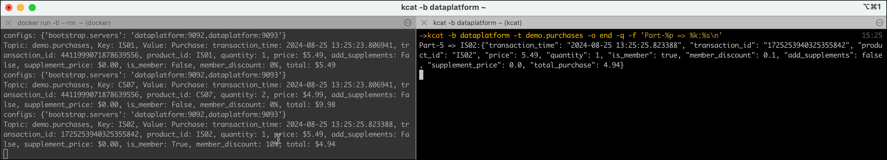
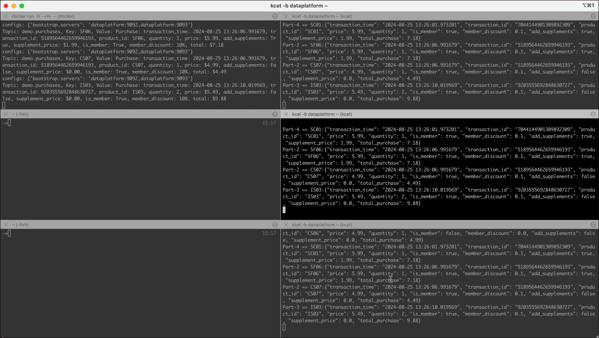
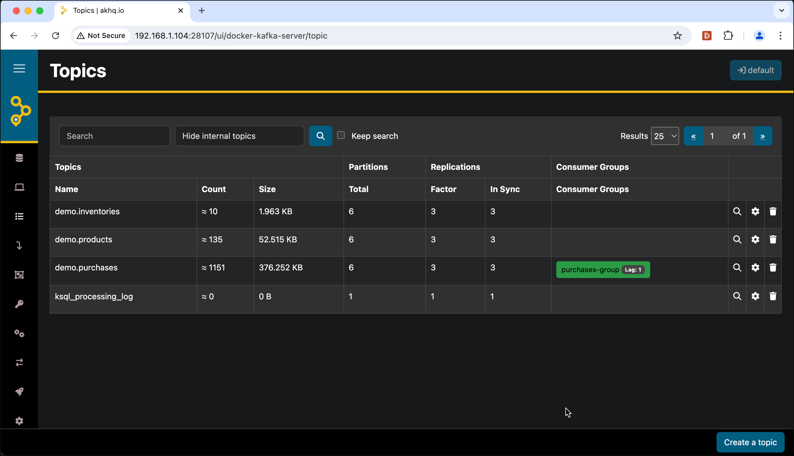
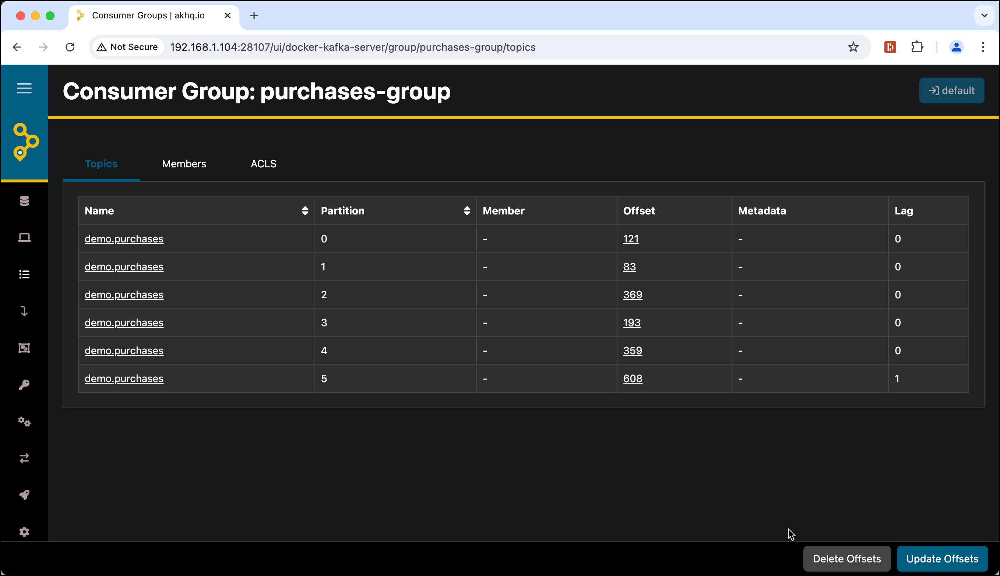
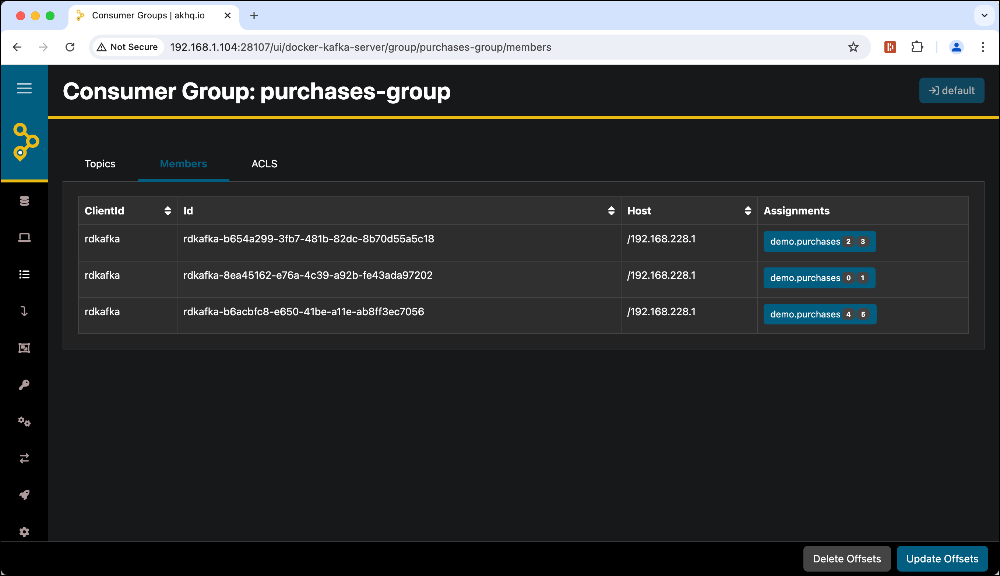
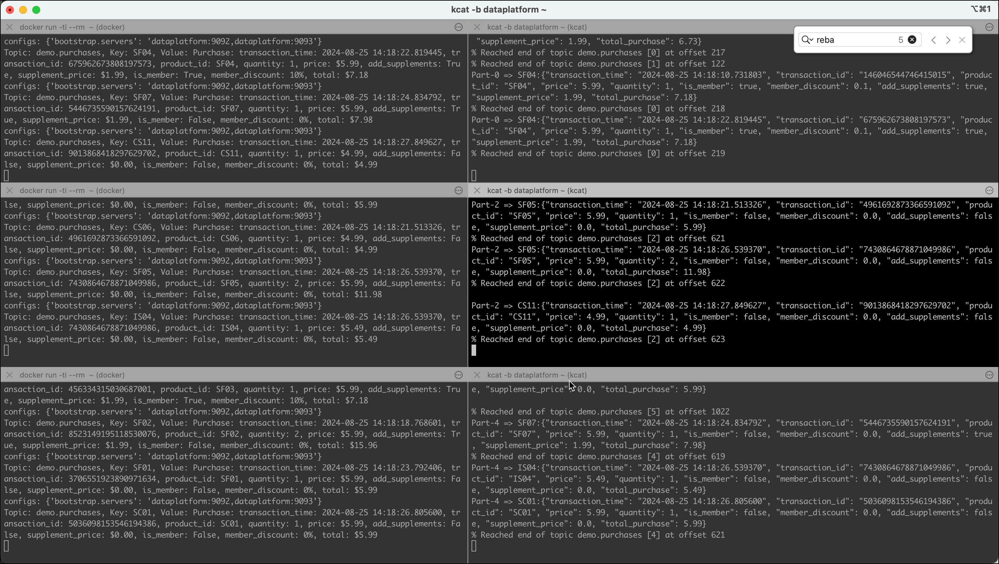
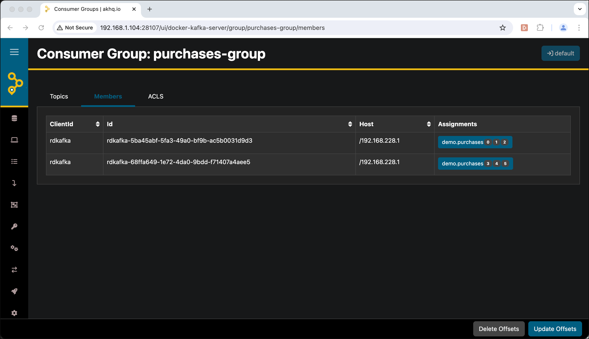
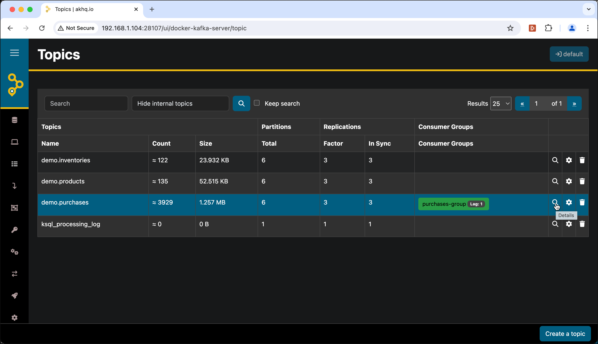
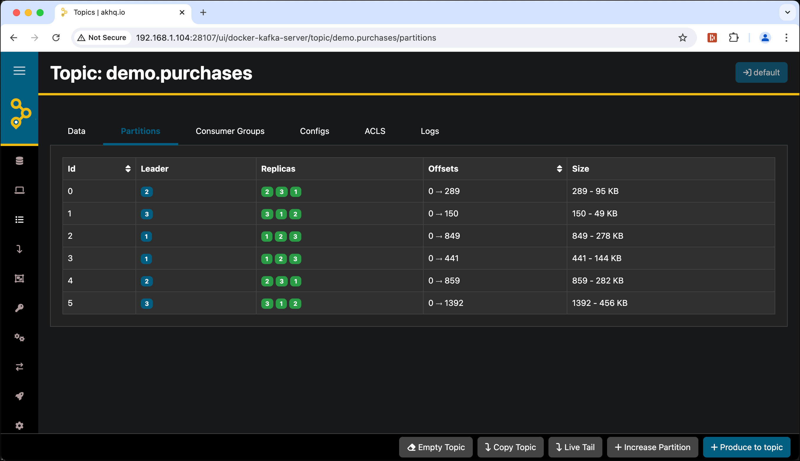

# Understanding Kafka Scalability and Failover

In this tutorial, we will demonstrate producer and consumer scalability as well as consumer failover and broker failover. 

We show how, with many groups, Kafka implements the Publish/Subscribe patterns. But, when we put all of our consumers in the same group, Kafka will load share the messages to the consumers in the same group, which directly supports scalability.

For the exercise we will be using the `kcat` (`kafkacat`) command line utility we have learned about in [Working with Apache Kafka Broker](../02-working-with-kafka-broker/README.md). 

We will also again be using the [Streaming Synthetic Sales Data Simulator](https://github.com/TrivadisPF/various-bigdata-prototypes/tree/master/streaming-sources/sales-simulator) to produce a realistic stream of messages, which we have already used in the [previous workshop](../02-working-with-kafka-broker/README.md).
    
## Create the necessary Kafka topics

First let's (re-)create the topics we will use throughout this workshop. We will first delete the ones from the previous workshop (if they exist) and then create them:

```bash
docker exec -ti kafka-1 kafka-topics --delete --bootstrap-server kafka-1:19092 --topic demo.products --if-exists

docker exec -ti kafka-1 kafka-topics --delete --bootstrap-server kafka-1:19092 --topic demo.purchases --if-exists

docker exec -ti kafka-1 kafka-topics --delete --bootstrap-server kafka-1:19092 --topic demo.inventories --if-exists


docker exec -ti kafka-1 kafka-topics --create --bootstrap-server kafka-1:19092 --topic demo.products --replication-factor 3 --partitions 6 --if-not-exists

docker exec -ti kafka-1 kafka-topics --create --bootstrap-server kafka-1:19092 --topic demo.purchases --replication-factor 3 --partitions 6 --if-not-exists

docker exec -ti kafka-1 kafka-topics --create --bootstrap-server kafka-1:19092 --topic demo.inventories --replication-factor 3 --partitions 6 --if-not-exists
```

Note that the replication factor is set to `3` for all of the 3 topics.

## Showing Kafka Scalability

First let's start a consumer on one of the topics.

### Start Kafka Consumer that uses the `demo.purchases` Topic

Start a consumer using `kcat` on the topic `demo.purchases`. Use the `-o end` switch to read only from the end. 

```bash
kcat -b dataplatform -t demo.purchases -o end -q -f 'Part-%p => %k:%s\n'
```

or if using docker

```bash
docker run --tty --network kafka-workshop edenhill/kcat:1.7.1 kcat -b kafka-1 -t demo.purchases -o end
```

### Start the Producer using the Sales simulator

Let's start the simulator to produce messages to the `demo.purchases` topic using one of the alternatives:

As part of the stack in the same network (`kafak-workshop`)

```bash
docker run -ti --rm --network kafka-workshop -e KAFKA_BOOTSTRAP_SERVERS=kafka-1:19092,kafka-2:19093 trivadis/sales-simulator:latest
```

or connecting "remotely"

```bash
docker run -ti --rm -e KAFKA_BOOTSTRAP_SERVERS=dataplatform:9092,dataplatform:9093 trivadis/sales-simulator:latest
```

In the consumer console started above you should start seeing messages

```bash
cas@cas ~> kcat -b dataplatform -t  demo.purchases -o end -q -f 'Part-%p => %k:%s\n'
Part-2 => SF05:{"transaction_time": "2024-08-25 13:22:16.794118", "transaction_id": "1987412758660499919", "product_id": "SF05", "price": 5.99, "quantity": 3, "is_member": false, "member_discount": 0.0, "add_supplements": true, "supplement_price": 1.99, "total_purchase": 23.94}
Part-5 => IS02:{"transaction_time": "2024-08-25 13:22:19.816755", "transaction_id": "8854751676730657335", "product_id": "IS02", "price": 5.49, "quantity": 1, "is_member": true, "member_discount": 0.1, "add_supplements": false, "supplement_price": 0.0, "total_purchase": 4.94}
```

similar as shown below



### Start two more consumers

Start two more consumers each in their own terminal window using the same `kcat` command

```bash
kcat -b dataplatform -t  demo.purchases -o end -q -f 'Part-%p => %k:%s\n'
```

#### Consumer Console 2nd

```bash
cas@cas ~> kcat -b dataplatform -t  demo.purchases -o end -q -f 'Part-%p => %k:%s\n'
Part-5 => CS09:{"transaction_time": "2024-08-25 13:26:23.123086", "transaction_id": "6932722226040991152", "product_id": "CS09", "price": 4.99, "quantity": 2, "is_member": false, "member_discount": 0.0, "add_supplements": false, "supplement_price": 0.0, "total_purchase": 9.98}
Part-2 => SC02:{"transaction_time": "2024-08-25 13:26:26.139792", "transaction_id": "5274818506363337719", "product_id": "SC02", "price": 5.99, "quantity": 1, "is_member": true, "member_discount": 0.1, "add_supplements": true, "supplement_price": 1.99, "total_purchase": 7.18}
Part-2 => SF06:{"transaction_time": "2024-08-25 13:26:28.153049", "transaction_id": "175454525355031747", "product_id": "SF06", "price": 5.99, "quantity": 3, "is_member": true, "member_discount": 0.1, "add_supplements": false, "supplement_price": 0.0, "total_purchase": 16.17}
```

#### Consumer Console 3rd

```bash
cas@cas ~> kcat -b dataplatform -t  demo.purchases -o end -q -f 'Part-%p => %k:%s\n'
Part-5 => CS09:{"transaction_time": "2024-08-25 13:26:23.123086", "transaction_id": "6932722226040991152", "product_id": "CS09", "price": 4.99, "quantity": 2, "is_member": false, "member_discount": 0.0, "add_supplements": false, "supplement_price": 0.0, "total_purchase": 9.98}
Part-2 => SC02:{"transaction_time": "2024-08-25 13:26:26.139792", "transaction_id": "5274818506363337719", "product_id": "SC02", "price": 5.99, "quantity": 1, "is_member": true, "member_discount": 0.1, "add_supplements": true, "supplement_price": 1.99, "total_purchase": 7.18}
Part-2 => SF06:{"transaction_time": "2024-08-25 13:26:28.153049", "transaction_id": "175454525355031747", "product_id": "SF06", "price": 5.99, "quantity": 3, "is_member": true, "member_discount": 0.1, "add_supplements": false, "supplement_price": 0.0, "total_purchase": 16.17}
```

You should now have one terminal where the simulator is running and 3 other terminals running `kcat`



Notice that the **same messages** go to all of the 3 consumers, because `kcat` is using the low level consumer without group coordination when using the `-C` consumer option (the default with `kcat`, if not specified), so there is no `group.id` used!

### Change the consumers to all be in one consumer group

Stop all the 3 `kcat` consumers started above and let's start them using the `-G` option.

This will have the effect that they use the same consumer group. This way the consumers will share the messages among each other, as each consumer in the consumer group will get its share of partitions. 

Let's start each of the 3 consumers using the adapted `kcat` command:

```bash
kcat -b dataplatform:9092,dataplatform:9093 -o end -f 'Part-%p => %k:%s\n' -G purchases-group demo.purchases
```

We are no longer using the `-q` option to see the log messages for the group re-balancing. Additionally we specify two brokers in the broker list (to prepare for the broker failover test). 

#### Consumer Console 1st

```bash
cas@cas ~> kcat -b dataplatform:9092,dataplatform:9093 -o end -f 'Part-%p => %k:%s\n' -G purchases-group demo.purchases
% Waiting for group rebalance
% Group purchases-group rebalanced (memberid rdkafka-5ba45abf-5fa3-49a0-bf9b-ac5b0031d9d3): assigned: demo.purchases [0], demo.purchases [1], demo.purchases [2], demo.purchases [3], demo.purchases [4], demo.purchases [5]
Part-4 => SC01:{"transaction_time": "2024-08-25 14:15:49.757828", "transaction_id": "9098637002779815851", "product_id": "SC01", "price": 5.99, "quantity": 1, "is_member": false, "member_discount": 0.0, "add_supplements": true, "supplement_price": 1.99, "total_purchase": 7.98}
Part-5 => CS02:{"transaction_time": "2024-08-25 14:15:49.757828", "transaction_id": "9098637002779815851", "product_id": "CS02", "price": 4.99, "quantity": 1, "is_member": false, "member_discount": 0.0, "add_supplements": fals
```

#### Consumer Console 2nd

```bash
cas@cas ~> kcat -b dataplatform:9092,dataplatform:9093 -o end -f 'Part-%p => %k:%s\n' -G purchases-group demo.purchases
% Waiting for group rebalance
% Group purchases-group rebalanced (memberid rdkafka-68ffa649-1e72-4da0-9bdd-f71407a4aee5): assigned: demo.purchases [2], demo.purchases [3]
% Reached end of topic demo.purchases [3] at offset 295
Part-2 => SF06:{"transaction_time": "2024-08-25 14:15:55.814680", "transaction_id": "257662466090403835", "product_id": "SF06", "price": 5.99, "quantity": 1, "is_member": false, "member_discount": 0.0, "add_supplements": true, "supplement_price": 1.99, "total_purchase": 7.98}
% Reached end of topic demo.purchases [2] at offset 579
Part-2 => SF05:{"transaction_time": "2024-08-25 14:15:56.642312", "transaction_id": "4756564421762224560", "product_id": "SF05", "price": 5.99, "quantity": 1, "is_member": true, "member_discount": 0.1, "add_supplements": false, "supplement_price": 0.0, "total_purchase": 5.39}
```

#### Consumer Console 3rd

```bash
cas@cas ~> kcat -b dataplatform:9092,dataplatform:9093 -o end -q -f 'Part-%p => %k:%s\n' -G purchases-group demo.purchases
% Waiting for group rebalance
% Group purchases-group rebalanced (memberid rdkafka-d195775c-43cd-49cb-8448-617b9b91dcb1): assigned: demo.purchases [4], demo.purchases [5]
% Reached end of topic demo.purchases [5] at offset 951
% Reached end of topic demo.purchases [4] at offset 584
Part-5 => CS08:{"transaction_time": "2024-08-25 14:15:56.642312", "transaction_id": "4756564421762224560", "product_id": "CS08", "price": 4.99, "quantity": 2, "is_member": true, "member_discount": 0.1, "add_supplements": false, "supplement_price": 0.0, "total_purchase": 8.98}
% Reached end of topic demo.purchases [5] at offset 952
Part-5 => SC04:{"transaction_time": "2024-08-25 14:15:58.671013", "transaction_id": "4731028065428719117", "product_id": "SC04", "price": 5.99, "quantity": 1, "is_member": true, "member_discount": 0.1, "add_supplements": true, "supplement_price": 1.99, "total_purchase": 7.18}
Part-5 => CS02:{"transaction_time": "2024-08-25 14:15:58.837482", "transaction_id": "5569050313511988494", "product_id": "CS02", "price": 4.99, "quantity": 1, "is_member": false, "member_discount": 0.0, "add_supplements": false, "supplement_price": 0.0, "total_purchase": 4.99}
```

Notice that the messages are spread among the consumers. Each consumer process is getting 2 partitions assigned by Kafka. 

We can also see the consumer group in [AKHQ](http://dataplatform:28107). In the topic list the group with it's lag is shown in the **Consumer Groups** column: 



It is shown in green because the lag is very small. If you want to see the details for this group, click on the **purchases group** "button" and you will see that the lag of `1` in the case here is caused by partition 5:



If you navigate to the **Members** tab, then you can see the assignments to each member of the consumer group:



We can confirm that partition `0` and `1` is assigned to one member, `2` and `3` to the 2nd and `4` and `5` to the 3rd member.

This demonstrated the scalability on the consumer side. By starting more consumers in the same group, each consumer is getting only part of the messages (roughly one third in our case).

### Now Start two more producers (simulator instances)

Now let's scale the producer side by starting two additional simulator instances in two new terminal windows.

```bash
docker run -ti --rm -e KAFKA_BOOTSTRAP_SERVERS=dataplatform:9092,dataplatform:9093 trivadis/sales-simulator:latest
```

you should now have 6 terminals in total, 3 running the simulator and 3 running the consumers:



You should see that the message rate of consumed message increases in each of the 3 consumers. 

## Showing Kafka Consumer Failover

Next, let’s demonstrate consumer failover by killing one of the consumers Kafka will re-assign the work to the consumers that are remaining.

Kill the third consumer (CTRL-C in the consumer terminal does the trick).

In the remaining two consumer terminals, you should get a re-balance message, showing that these consumers have gotten new partitions assigned. For consumer 1 we see in the log that partition `0` and `1` got revoked and 3 new partitions `0`, `1` and `2` were assigned, so that this consumer now has to handle 3 partitions in total.

```
% Group purchases-group rebalanced (memberid rdkafka-5ba45abf-5fa3-49a0-bf9b-ac5b0031d9d3): revoked: demo.purchases [0], demo.purchases [1]
% Group purchases-group rebalanced (memberid rdkafka-5ba45abf-5fa3-49a0-bf9b-ac5b0031d9d3): assigned: demo.purchases [0], demo.purchases [1], demo.purchases [2]
% Reached end of topic demo.purchases [2] at offset 665
% Reached end of topic demo.purchases [0] at offset 235
% Reached end of topic demo.purchases [1] at offset 125
Part-2 => SF05:{"transaction_time": "2024-08-25 14:20:49.773818", "transaction_id": "4851112425004083310", "product_id": "SF05", "price": 5.99, "quantity": 1, "is_member": true, "member_discount": 0.1, "add_supplements": true, "supplement_price": 1.99, "total_purchase": 7.18}
```

The same will happen to other remaining consumer, consumer 2.

If we refresh the **Members** tab of the consumer group window in AKHQ we can see the new assignments:



We killed one consumer, sent more messages, and saw Kafka spread the load to remaining consumers, demonstrating how Kafka consumer failover works!

Let's restart the 3rd consumer and Kafka will again rebalance the load so that each consumer will again consume 2 partitions.

## Kafka Broker Failover

Before we demonstrate a broker failure, let's see how the partitions are replicated over the 3 brokers of our Kafka cluster and which brokers are leader for which replicas.

### Describe Topic

We can use the `describe` option of the `kafka-topics` CLI. For that run the following command in a new terminal window

```bash
docker exec -ti kafka-1 kafka-topics --describe \
    --topic demo.purchases \
    --bootstrap-server kafka-1:19092
```    

You see the list of replicas, which broker is the leader and the Isr's (in-scync replicas) of each partition. Isr's are replicas that are up to date (in sync).

```bash
Topic: demo.purchases	TopicId: Dp17WmpQQU6BtrfZ1Q8b1wPartitionCount: 6	ReplicationFactor: 3	Configs: min.insync.replicas=1
	Topic: demo.purchases	Partition: 0	Leader: 2	Replicas: 2,3,1	Isr: 2,3,1
	Topic: demo.purchases	Partition: 1	Leader: 3	Replicas: 3,1,2	Isr: 3,1,2
	Topic: demo.purchases	Partition: 2	Leader: 1	Replicas: 1,2,3	Isr: 1,2,3
	Topic: demo.purchases	Partition: 3	Leader: 1	Replicas: 1,2,3	Isr: 1,2,3
	Topic: demo.purchases	Partition: 4	Leader: 2	Replicas: 2,3,1	Isr: 2,3,1
	Topic: demo.purchases	Partition: 5	Leader: 3	Replicas: 3,1,2	Isr: 3,1,2
```

Notice how each broker gets a share of the partitions as leaders and followers. Also, see how Kafka replicates the partitions on each broker.

Optionally view the partition distribution in [AKHQ](http://dataplatform:28107). Navigate to the topics view and on the `demo.purchases` line, click on the magnifying glass icon



and then navigate to the **Partitions** tab



### Test Broker Failover by stopping the 2nd Kafka broker

You should still have the 6 terminals with the 3 simulator instances and the 3 consumer (`kcat`) instances running. 

Let’s stop the 2nd broker by just stopping the docker container.

```bash
docker stop kafka-2
```

Now that the second Kafka broker is stopped, let’s use Kafka topics describe command to see that new leaders were elected!

```bash
Topic: demo.purchases	TopicId: Dp17WmpQQU6BtrfZ1Q8b1w	PartitionCount: 6	ReplicationFactor: 3	Configs: min.insync.replicas=1
	Topic: demo.purchases	Partition: 0	Leader: 3	Replicas: 2,3,1	Isr: 3,1
	Topic: demo.purchases	Partition: 1	Leader: 3	Replicas: 3,1,2	Isr: 3,1
	Topic: demo.purchases	Partition: 2	Leader: 1	Replicas: 1,2,3	Isr: 1,3
	Topic: demo.purchases	Partition: 3	Leader: 1	Replicas: 1,2,3	Isr: 1,3
	Topic: demo.purchases	Partition: 4	Leader: 3	Replicas: 2,3,1	Isr: 3,1
	Topic: demo.purchases	Partition: 5	Leader: 3	Replicas: 3,1,2	Isr: 3,1
```

You can see that `kafka-2` is no longer a leader for any of the partitions. The same can be seen in AKHQ, here the missing replicas on `kafka-2` are shown in red. 


Notice that both the producer and consumer will complain that they can no longer connect to port `9093` (the port of `kafka-2`) but they can still send and receive messages.

Let's restart `kafka-2` to bring it back. 

```bash
docker start kafka-2
```

After a few seconds in AKHQ everything will be green again. 


But if you look closely, you will see that even though `kafka-2` replica's are all available and in in-sync, `kafka-2` is not a leader for any of the partitions, which before the broker got stopped `kafka-2` was for partition `0` and `4`.

Kafka will automatically execute a preferred leader election in the background, so after a while `kafka-2` should be elected as leader for the two partitions, which you can confirm with a refresh in AKHQ:


