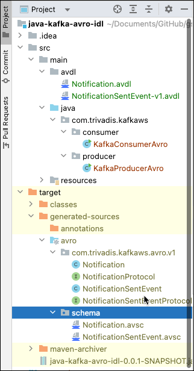
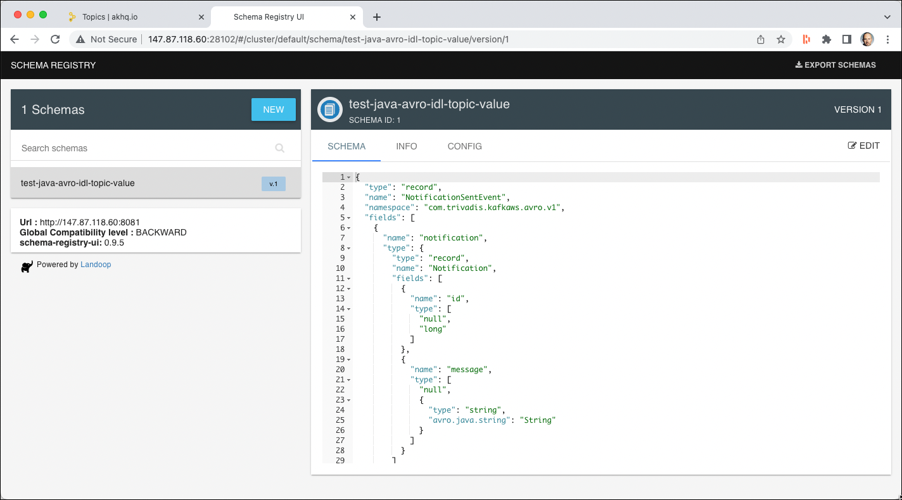

# Using Kafka from Java with Avro IDL & Schema Registry

In this workshop we will learn how to produce and consume messages using the [Kafka Java API](https://kafka.apache.org/documentation/#api) using Avro for serialising and deserialising messages. 
Compared to workshop 4a, here we will use the [Avro IDL language](https://avro.apache.org/docs/current/idl-language/) for defining the Avro Schema. The advantage of using the Avro IDL language is first better readability when a schema get's more complex, better [IDE support](https://avro.apache.org/docs/current/idl-language/#ide-support) and the possibility for importing schema definitions from another file.
But for the Schema Registry, we will still need the schemas in the JSON language, but the can be generated from the IDL (using Avro Tools).

## Create the project in your Java IDE

Create a new Maven Project (using the functionality of your IDE) and in the last step use `com.trivadis.kafkaws` for the **Group Id** and `java-avro-idl-kafka` for the **Artifact Id**.

Navigate to the **pom.xml** and double-click on it. The POM Editor will be displayed.

You can either use the GUI to edit your `pom.xml` or navigate to the last tab **pom.xml** to switch to the "code view". Let's do that.

You will see the still rather empty definition.

```xml
<project xmlns="http://maven.apache.org/POM/4.0.0" xmlns:xsi="http://www.w3.org/2001/XMLSchema-instance" xsi:schemaLocation="http://maven.apache.org/POM/4.0.0 http://maven.apache.org/xsd/maven-4.0.0.xsd">
  <modelVersion>4.0.0</modelVersion>
  <groupId>com.trivadis.kafkaws</groupId>
  <artifactId>java-avro-idl-kafka</artifactId>
  <version>0.0.1-SNAPSHOT</version>
</project>
```

Let's add some initial dependencies for our project. We will add some more dependencies to the POM throughout this workshop.

Copy the following block right after the `<version>` tag, before the closing `</project>` tag.

```xml
   <properties>
		<kafka.version>3.0.0</kafka.version>
		<confluent.version>7.2.0</confluent.version>
		<avro.version>1.11.0</avro.version>
		<java.version>1.8</java.version>
		<slf4j-version>1.7.5</slf4j-version>

       <!-- use utf-8 encoding -->
       <project.build.sourceEncoding>UTF-8</project.build.sourceEncoding>
       <project.reporting.outputEncoding>UTF-8</project.reporting.outputEncoding>
    </properties>

    <dependencies>
     	<dependency>
           <groupId>org.apache.kafka</groupId>
           <artifactId>kafka-clients</artifactId>
           <version>${kafka.version}</version>
       </dependency>    

		<dependency>
			<groupId>io.confluent</groupId>
			<artifactId>kafka-avro-serializer</artifactId>
			<version>${confluent.version}</version>
		</dependency>

     	<dependency>
           <groupId>org.apache.avro</groupId>
           <artifactId>avro</artifactId>
           <version>${avro.version}</version>
       </dependency>    

		<dependency>
		    <groupId>org.slf4j</groupId>
		    <artifactId>slf4j-log4j12</artifactId>
		    <version>${slf4j-version}</version>
		</dependency>
    </dependencies>

	<repositories>
		<repository>
			<id>confluent</id>
			<url>http://packages.confluent.io/maven/</url>
		</repository>
	</repositories>
	<pluginRepositories>
		<pluginRepository>
			<id>confluent</id>
			<url>http://packages.confluent.io/maven/</url>
		</pluginRepository>
		<pluginRepository>
			<id>Trivadis Maven Repo</id>
			<url>https://github.com/TrivadisPF/avdl2avsc-maven-plugin/raw/mvn-repo/</url>
			<snapshots>
				<enabled>true</enabled>
				<updatePolicy>always</updatePolicy>
			</snapshots>
		</pluginRepository>		
	</pluginRepositories>    

	<build>
		<defaultGoal>install</defaultGoal>

		<plugins>
			<plugin>
				<groupId>org.apache.maven.plugins</groupId>
				<artifactId>maven-compiler-plugin</artifactId>
				<version>2.5</version>
				<configuration>
					<source>1.8</source>
					<target>1.8</target>
					<maxmem>256M</maxmem>
					<showDeprecation>true</showDeprecation>
				</configuration>
			</plugin>
			<plugin>
				<groupId>org.codehaus.mojo</groupId>
				<artifactId>exec-maven-plugin</artifactId>
				<version>1.6.0</version>
				<executions>
					<execution>
						<id>producer</id>
						<goals>
							<goal>java</goal>
						</goals>
						<configuration>
							<mainClass>com.trivadis.kafkaws.producer.KafkaProducerAvro</mainClass>
						</configuration>
					</execution>
					<execution>
						<id>consumer</id>
						<goals>
							<goal>java</goal>
						</goals>
						<configuration>
							<mainClass>com.trivadis.kafkaws.consumer.KafkaConsumerAvro</mainClass>
						</configuration>
					</execution>
				</executions>
			</plugin>
			<plugin>
				<groupId>org.apache.avro</groupId>
				<artifactId>avro-maven-plugin</artifactId>
				<version>${avro.version}</version>
				<executions>
					<execution>
						<id>schemas</id>
						<phase>generate-sources</phase>
						<goals>
							<goal>schema</goal>
							<goal>idl-protocol</goal>
						</goals>
						<configuration>
							<stringType>String</stringType>
							<excludes>
								<exclude>**/mapred/tether/**</exclude>
							</excludes>
							<sourceDirectory>${project.basedir}/src/main/avdl/</sourceDirectory>
							<testSourceDirectory>${project.basedir}/src/test/avro/</testSourceDirectory>
						</configuration>
					</execution>
				</executions>
			</plugin>
			
			<plugin>
				<groupId>com.trivadis.plugins</groupId>
				<artifactId>avdl2avsc-maven-plugin</artifactId>
				<version>1.0.1-SNAPSHOT</version>
				<executions>
					<execution>
						<phase>generate-sources</phase>
						<goals>
							<goal>genschema</goal>
						</goals>
						<configuration>
							<inputAvdlDirectory>${basedir}/src/main/avdl</inputAvdlDirectory>
							<outputSchemaDirectory>${basedir}/target/generated-sources/avro/schema
							</outputSchemaDirectory>
						</configuration>
					</execution>
				</executions>
			</plugin>			
			
		</plugins>
	</build>
```

The `pom.xml` is the same as for workshop 4a, except the additional maven plugin `avdl2avsc-maven-plugin`, which we can get from the Maven Repo hosted on GitHub. 

This plugin will be used to generate the Avro JSON Schema definition from the IDL. It wraps the necessary functionality of the Avro tools library.

Additionally we changed the `sourceDirectory` of the `avro-maven-plugin` to reflect the directory where we will place the Avro IDL schemas (`${project.basedir}/src/main/avdl`).

## Create log4j settings

Let's also create the necessary log4j configuration.

In the code we are using the [Log4J Logging Framework](https://logging.apache.org/log4j/2.x/), which we have to configure using a property file.

Create a new file `log4j.properties` in the folder **src/main/resources** and add the following configuration properties.

```
## ------------------------------------------------------------------------
## Licensed to the Apache Software Foundation (ASF) under one or more
## contributor license agreements.  See the NOTICE file distributed with
## this work for additional information regarding copyright ownership.
## The ASF licenses this file to You under the Apache License, Version 2.0
## (the "License"); you may not use this file except in compliance with
## the License.  You may obtain a copy of the License at
##
## http://www.apache.org/licenses/LICENSE-2.0
##
## Unless required by applicable law or agreed to in writing, software
## distributed under the License is distributed on an "AS IS" BASIS,
## WITHOUT WARRANTIES OR CONDITIONS OF ANY KIND, either express or implied.
## See the License for the specific language governing permissions and
## limitations under the License.
## ------------------------------------------------------------------------

#
# The logging properties used for testing, We want to see INFO output on the console.
#
log4j.rootLogger=INFO, out

#log4j.logger.org.apache.kafka=INFO

log4j.logger.org.apache.camel.impl.converter=INFO
log4j.logger.org.apache.camel.util.ResolverUtil=INFO

log4j.logger.org.springframework=WARN
log4j.logger.org.hibernate=WARN

# CONSOLE appender not used by default
log4j.appender.out=org.apache.log4j.ConsoleAppender
log4j.appender.out.layout=org.apache.log4j.PatternLayout
log4j.appender.out.layout.ConversionPattern=[%30.30t] %-30.30c{1} %-5p %m%n
#log4j.appender.out.layout.ConversionPattern=%d [%-15.15t] %-5p %-30.30c{1} - %m%n

log4j.throwableRenderer=org.apache.log4j.EnhancedThrowableRenderer
```

## Creating the necessary Kafka Topic

We will use the topic `test-java-avro-idl-topic` in the Producer and Consumer code below. Due to the fact that `auto.topic.create.enable` is set to `false`, we have to manually create the topic.

In a terminal window, connect to the `kafka-1` container

```
docker exec -ti kafka-1 bash
```

and execute the necessary kafka-topics command.

```
kafka-topics --create \
--replication-factor 3 \
--partitions 8 \
--topic test-java-avro-idl-topic \
--bootstrap-server kafka-1:19092,kafka-2:19093
```

This finishes the setup steps and our new project is ready to be used. Next we will start implementing the **Kafka Producer** which uses Avro for the serialisation.

## Create an Avro Schema representing the Notification Message

First create a new Folder `avdl` under the existing folder **src/main/**.

Create a new File `Notification.avdl` in the folder  **src/main/avdl** just created above.

Add the following Avro schema to the empty file, using the Avro IDL language. 

```
@namespace("com.trivadis.kafkaws.avro.v1")
protocol NotificationProtocol {
		record Notification {
			union {null, long} id;
			union {null, string}  message;
		}
}
```

This represent the Notification object. 

We will use another schema to define the `NotificationSentEvent` event and import the `Notification` object. Create a new file `NotificationSentEvent-v1.avdl` in the `avdl` folder and add the folllowing schema defintion:

```
@namespace("com.trivadis.kafkaws.avro.v1")
protocol NotificationSentEventProtocol {
	import idl "Notification.avdl";

	record NotificationSentEvent {
		Notification  notification;
	}
}
```

Let's now run a Maven compile to generate both the Avro JSON schema as well as the Java code for the Avro Serialization/Deserialization.

```
mvn compile
```

After running this command, refresh the project and you should see a new folder named `target/generated-sources/avro`. Expand into this folder and you should see both the generated Java classes as well as a `schema` folder with the two `avsc` schemas. We get two classes for each IDL file, one for the `protocol` and one for the `record`, although we will only use the one for the `record` definitions, `Notification.java` and `NotificationSentEvent.java`. 



Double click on the `Notification.avsc` file to inspect the Avro schema in JSON.

```json
{
  "type" : "record",
  "name" : "Notification",
  "namespace" : "com.trivadis.kafkaws.avro.v1",
  "fields" : [ {
    "name" : "id",
    "type" : [ "null", "long" ]
  }, {
    "name" : "message",
    "type" : [ "null", "string" ]
  } ]
}
```

and let's inspect also the `NotificationSentEvent.avsc`

```json
{
  "type" : "record",
  "name" : "NotificationSentEvent",
  "namespace" : "com.trivadis.kafkaws.avro.v1",
  "fields" : [ {
    "name" : "notification",
    "type" : {
      "type" : "record",
      "name" : "Notification",
      "fields" : [ {
        "name" : "id",
        "type" : [ "null", "long" ]
      }, {
        "name" : "message",
        "type" : [ "null", "string" ]
      } ]
    }
  } ]
}
```

You can see that `NotificationSentEvent.avsc` embeds the definition of the `Notification`, due to the import we did. 

## Create a Kafka Producer using Avro for serialisation

First create a new Java Package `com.trivadis.kafkaws.producer` in the folder **src/main/java**.

Create a new Java Class `KafkaProducerAvro` in the package `com.trivadis.kafakws.producer` just created.

Add the following code to the empty class to create a Kafka Producer. It is similar to the code we have seen in the workshop 4a, except that we now use the `NotificationSentEvent` class and we produce to a different topic (`test-java-avro-idl-topic`).

```java
package com.trivadis.kafkaws.producer;

import java.util.Properties;

import com.trivadis.kafkaws.avro.v1.Notification;
import com.trivadis.kafkaws.avro.v1.NotificationSentEvent;
import org.apache.kafka.clients.producer.*;
import org.apache.kafka.common.serialization.LongSerializer;
import org.apache.kafka.common.serialization.StringSerializer;

import io.confluent.kafka.serializers.KafkaAvroSerializer;
import io.confluent.kafka.serializers.KafkaAvroSerializerConfig;

public class KafkaProducerAvro {

    private final static String TOPIC = "test-java-avro-idl-topic";
    private final static String BOOTSTRAP_SERVERS =
            "dataplatform:9092, dataplatform:9093, dataplatform:9094";
    private final static String SCHEMA_REGISTRY_URL = "http://dataplatform:8081";

    private static Producer<Long, NotificationSentEvent> createProducer() {
        Properties props = new Properties();
        props.put(ProducerConfig.BOOTSTRAP_SERVERS_CONFIG, BOOTSTRAP_SERVERS);
        props.put(ProducerConfig.CLIENT_ID_CONFIG, "KafkaExampleProducer");
        //props.put(KafkaAvroSerializerConfig.AUTO_REGISTER_SCHEMAS, "false");
        props.put(ProducerConfig.KEY_SERIALIZER_CLASS_CONFIG, KafkaAvroSerializer.class.getName());
        props.put(ProducerConfig.VALUE_SERIALIZER_CLASS_CONFIG, KafkaAvroSerializer.class.getName());
        props.put(KafkaAvroSerializerConfig.SCHEMA_REGISTRY_URL_CONFIG, SCHEMA_REGISTRY_URL);   // use constant for "schema.registry.url"

        return new KafkaProducer<>(props);
    }

    static void runProducer(final int sendMessageCount, final int waitMsInBetween, final long id) throws Exception {
        final Producer<Long, NotificationSentEvent> producer = createProducer();
        long time = System.currentTimeMillis();
        Long key = (id > 0) ? id : null;

        try {
            for (long index = 0; index < sendMessageCount; index++) {
                NotificationSentEvent notification = NotificationSentEvent.newBuilder()
                    .setNotification(Notification.newBuilder()
                        .setId(id)
                        .setMessage("Hello Kafka " + index)
                        .build())
                    .build();

                final ProducerRecord<Long, NotificationSentEvent> record =
                        new ProducerRecord<>(TOPIC, key, notification);

                RecordMetadata metadata = producer.send(record).get();

                long elapsedTime = System.currentTimeMillis() - time;
                System.out.printf("[" + id + "] sent record(key=%s value=%s) " +
                                "meta(partition=%d, offset=%d) time=%d\n",
                        record.key(), record.value(), metadata.partition(),
                        metadata.offset(), elapsedTime);
                time = System.currentTimeMillis();

                Thread.sleep(waitMsInBetween);
            }
        } finally {
            producer.flush();
            producer.close();
        }
    }

    public static void main(String... args) throws Exception {
        if (args.length == 0) {
            runProducer(100,10,0);
        } else {
            runProducer(Integer.parseInt(args[0]),Integer.parseInt(args[1]),Long.parseLong(args[2]));
        }
    }
}
```

We will be are using the synchronous way for producing messages to the Kafka topic but the other methods would work as well.

The `main()` method accepts 3 parameters, the number of messages to produce, the time in ms to wait in-between sending each message and the ID of the producer.

Use `kcat` or `kafka-console-consumer` to consume the messages from the topic `test-java-avro-idl-topic `.

```bash
kcat -b kafka-1 -t test-java-avro-idl-topic -s value=avro -r http://schema-registry-1:8081
```

Now run it using the `mvn exec:java` command. It will generate 1000 messages, waiting 10ms in-between sending each message and use 0 for the ID.

```
mvn exec:java@producer -Dexec.args="1000 10 0"
```

**Note:** if your maven version does not support profiles, then you have to specify the main class as well: `mvn exec:java -Dexec.mainClass="com.trivadis.kafkaws.producer.KafkaProducerSync" -Dexec.args="1000 100 0"`

In a browser, navigate to <http://dataplatform:28039> and you should see the home page of the Schema Registry UI. Le's make sure that the schema has been registered automatically.



## Create a Kafka Consumer using Avro for serialization

First create a new Java Package `com.trivadis.kafkaws.consumer` in the folder **src/main/java**.

Create a new Java Class `KafkaConsumerAvro` in the package `com.trivadis.kafakws.consumer` just created.

Add the following code to the empty class.

```java
package com.trivadis.kafkaws.consumer;

import java.util.Collections;
import java.util.Properties;

import com.trivadis.kafkaws.avro.v1.NotificationSentEvent;
import org.apache.kafka.clients.consumer.Consumer;
import org.apache.kafka.clients.consumer.ConsumerConfig;
import org.apache.kafka.clients.consumer.ConsumerRecords;
import org.apache.kafka.clients.consumer.KafkaConsumer;
import org.apache.kafka.clients.producer.ProducerConfig;
import org.apache.kafka.common.serialization.LongDeserializer;
import org.apache.kafka.common.serialization.StringDeserializer;

import com.trivadis.kafkaws.avro.v1.Notification;

import io.confluent.kafka.serializers.KafkaAvroDeserializer;
import io.confluent.kafka.serializers.KafkaAvroSerializer;
import io.confluent.kafka.serializers.KafkaAvroSerializerConfig;

public class KafkaConsumerAvro {
    private final static String TOPIC = "test-java-avro-idl-topic";
    private final static String BOOTSTRAP_SERVERS =
            "dataplatform:9092, dataplatform:9093, dataplatform:9094";
    private final static String SCHEMA_REGISTRY_URL = "http://dataplatform:8081";

    private static Consumer<Long, NotificationSentEvent> createConsumer() {
        final Properties props = new Properties();
        props.put(ConsumerConfig.BOOTSTRAP_SERVERS_CONFIG, BOOTSTRAP_SERVERS);
        props.put(ConsumerConfig.GROUP_ID_CONFIG, "KafkaConsumerAvro");
        props.put(ConsumerConfig.ENABLE_AUTO_COMMIT_CONFIG, false);
        props.put(ConsumerConfig.AUTO_COMMIT_INTERVAL_MS_CONFIG, 10000);
        props.put(KafkaAvroSerializerConfig.AUTO_REGISTER_SCHEMAS, "false");
        props.put(ConsumerConfig.KEY_DESERIALIZER_CLASS_CONFIG, KafkaAvroDeserializer.class.getName());
        props.put(ConsumerConfig.VALUE_DESERIALIZER_CLASS_CONFIG, KafkaAvroDeserializer.class.getName());
        props.put(KafkaAvroSerializerConfig.SCHEMA_REGISTRY_URL_CONFIG, SCHEMA_REGISTRY_URL);   // use constant for "schema.registry.url"

        // Create the consumer using props.
        final Consumer<Long, NotificationSentEvent> consumer =
                new KafkaConsumer<>(props);

        // Subscribe to the topic.
        consumer.subscribe(Collections.singletonList(TOPIC));
        return consumer;
    }

    static void runConsumer(int waitMsInBetween) throws InterruptedException {
        final Consumer<Long, NotificationSentEvent> consumer = createConsumer();

        final int giveUp = 100;
        int noRecordsCount = 0;

        while (true) {
            final ConsumerRecords<Long, NotificationSentEvent> consumerRecords = consumer.poll(1000);

            if (consumerRecords.count()==0) {
                noRecordsCount++;
                if (noRecordsCount > giveUp)
                    break;
            }

            consumerRecords.forEach(record -> {
                System.out.printf("%d - Consumer Record:(Key: %d, Value: %s, Partition: %d, Offset: %d)\n",
                        consumerRecords.count(), record.key(), record.value(),
                        record.partition(), record.offset());
                try {
                    Thread.sleep(waitMsInBetween);
                } catch (InterruptedException e) {
                }
            });

            consumer.commitSync();
        }
        consumer.close();
        System.out.println("DONE");
    }

    public static void main(String... args) throws Exception {
        if (args.length == 0) {
            runConsumer(10);
        } else {
            runConsumer(Integer.parseInt(args[0]));
        }
    }

}
```

## Register in Schema Registry using Maven

In the test above, the Avro schema has been registered in the schema registry when starting the Producer for the first time. To register an Avro schema through Maven automatically, you can again use the `kafka-schema-registry-maven-plugin ` Maven plugin.

Add the following definition to the `pom.xml`.

```xml
			<plugin>
				<groupId>io.confluent</groupId>
				<artifactId>kafka-schema-registry-maven-plugin</artifactId>
				<version>6.2.0</version>
				<configuration>
					<schemaRegistryUrls>
						<param>http://${DATAPLATFORM_IP}:8081</param>
					</schemaRegistryUrls>
					<subjects>
						<test-java-avro-idl-topic-value>target/generated-sources/avro/schema/NotificationSentEvent.avsc</test-java-avro-idl-topic-value>
					</subjects>
				</configuration>
				<goals>
					<goal>register</goal>
					<goal>test-compatibility</goal>
				</goals>
			</plugin>
```

Note that we now have to get the Avro schema (Json syntax) from the `target/generated-sources` folder.

Now you can use the following command to register the schemas with the Schema Registry:

```
mvn schema-registry:register
```

## Adding documentation to the Avro IDL

The Avro IDL language also [supports comments](https://avro.apache.org/docs/1.11.1/idl-language/#comments). 

All Java-style comments are supported within a Avro IDL file. Any text following `//` on a line is ignored, as is any text between `/*` and `*/`, possibly spanning multiple lines.
Comments that begin with `/**` are used as the documentation string for the type or field definition that follows the comment

Let's extend `Notification.avdl`  with some comments on record as well as on field level:

```
@namespace("com.trivadis.kafkaws.avro.v1")
protocol NotificationProtocol {
	/**
    Notification structure defining a message to be sent as a notification.
    Will be used to notify users of a problem.
    */
	record Notification {
			/**
			This is the ID of a notification, optional
 			*/
			union {null, long} id;		// optional, should be changed in the future to mandatory!

			/** This is the message of the notification */
			union {null, string}  message;
		}
}
```

The same can be done on the `NotificationSentEvent.avdl`:

```
@namespace("com.trivadis.kafkaws.avro.v1")
protocol NotificationSentEventProtocol {
	import idl "Notification.avdl";

	/**
	This is the Notification Event structure which uses an embedded Notification object.
 	*/
	record NotificationSentEvent {
		/** the Notification embedded object */
		Notification  notification;
	}
}
```

Not let's regenerate the code

```bash
mvn compile
```

and we will find the comments also in the generated Java classes, here showing parts of the `Notification` class as an example:

```java
/** Notifcation structure defining a message to be sent as a notification.
Will be used to notify users of a problem. */
@org.apache.avro.specific.AvroGenerated
public class Notification extends org.apache.avro.specific.SpecificRecordBase implements org.apache.avro.specific.SpecificRecord {
  private static final long serialVersionUID = 3582798745986381455L;


  ...
  
  /** This is the ID of a notification, optional */
  private java.lang.Long id;
  /** This is the message of the notification */
  private java.lang.String message;
  
  ...
  
  /**
   * Gets the value of the 'id' field.
   * @return This is the ID of a notification, optional
   */
  public java.lang.Long getId() {
    return id;
  }


  /**
   * Sets the value of the 'id' field.
   * This is the ID of a notification, optional
   * @param value the value to set.
   */
  public void setId(java.lang.Long value) {
    this.id = value;
  }
```

## Adding deprecation to Avro IDL
t.b.d.
