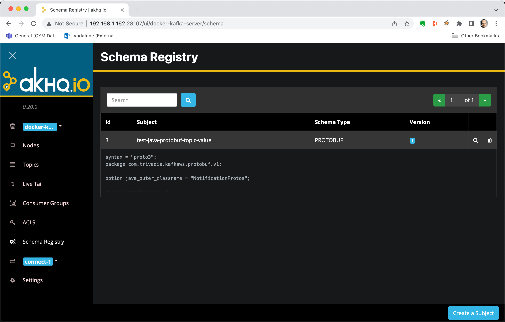
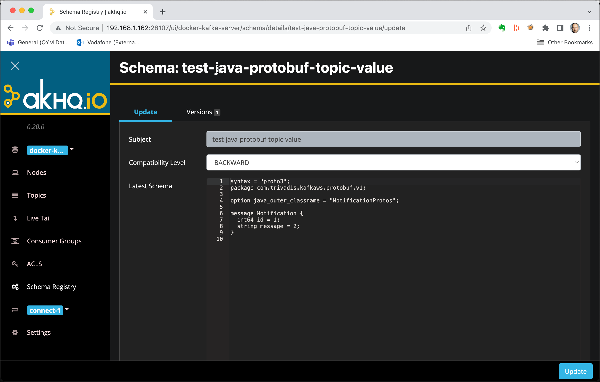

# Using Kafka from Java with Protocol Buffers & Schema Registry

In this workshop we will learn how to produce and consume messages using the [Kafka Java API](https://kafka.apache.org/documentation/#api) using [Google Protocol Buffers](https://developers.google.com/protocol-buffers) for serialising and deserialising messages.

## Create the project in your Java IDE

Create a new Maven Project (using the functionality of your IDE) and in the last step use `com.trivadis.kafkaws` for the **Group Id** and `java-protobuf-kafka` for the **Artifact Id**.

Navigate to the **pom.xml** and double-click on it. The POM Editor will be displayed.

You can either use the GUI to edit your `pom.xml` or navigate to the last tab **pom.xml** to switch to the "code view". Let's do that.

You will see the still rather empty definition.

```xml
<project xmlns="http://maven.apache.org/POM/4.0.0" xmlns:xsi="http://www.w3.org/2001/XMLSchema-instance" xsi:schemaLocation="http://maven.apache.org/POM/4.0.0 http://maven.apache.org/xsd/maven-4.0.0.xsd">
  <modelVersion>4.0.0</modelVersion>
  <groupId>com.trivadis.kafkaws</groupId>
  <artifactId>java-avro-kafka</artifactId>
  <version>0.0.1-SNAPSHOT</version>
</project>
```

Let's add some initial dependencies for our project. We will add some more dependencies to the POM throughout this workshop.

Copy the following block right after the `<version>` tag, before the closing `</project>` tag.

```xml
<properties>
  <kafka.version>2.8.0</kafka.version>
  <confluent.version>6.0.0</confluent.version>
  <protobuf.version>3.19.4</protobuf.version>
  <java.version>1.8</java.version>
  <slf4j-version>1.7.5</slf4j-version>

  <!-- use utf-8 encoding -->
  <project.build.sourceEncoding>UTF-8</project.build.sourceEncoding>
  <project.reporting.outputEncoding>UTF-8</project.reporting.outputEncoding>
</properties>

<dependencies>
  <dependency>
    <groupId>org.apache.kafka</groupId>
    <artifactId>kafka-clients</artifactId>
    <version>${kafka.version}</version>
  </dependency>

  <dependency>
    <groupId>io.confluent</groupId>
    <artifactId>kafka-protobuf-serializer</artifactId>
    <version>${confluent.version}</version>
  </dependency>

  <dependency>
    <groupId>com.google.protobuf</groupId>
    <artifactId>protobuf-java</artifactId>
    <version>${protobuf.version}</version>
  </dependency>

  <dependency>
    <groupId>org.slf4j</groupId>
    <artifactId>slf4j-log4j12</artifactId>
    <version>${slf4j-version}</version>
  </dependency>
</dependencies>

<repositories>
  <repository>
    <id>github-releases</id>
    <url>http://oss.sonatype.org/content/repositories/github-releases/</url>
  </repository>
  <repository>
    <id>clojars.org</id>
    <url>http://clojars.org/repo</url>
  </repository>
  <repository>
    <id>confluent</id>
    <url>https://packages.confluent.io/maven/</url>
  </repository>
</repositories>

<pluginRepositories>
  <pluginRepository>
    <id>confluent</id>
    <url>https://packages.confluent.io/maven/</url>
  </pluginRepository>
</pluginRepositories>

<build>
  <defaultGoal>install</defaultGoal>

  <plugins>
    <plugin>
      <groupId>org.apache.maven.plugins</groupId>
      <artifactId>maven-compiler-plugin</artifactId>
      <version>2.5</version>
      <configuration>
        <source>1.8</source>
        <target>1.8</target>
        <maxmem>256M</maxmem>
        <showDeprecation>true</showDeprecation>
      </configuration>
    </plugin>
    <plugin>
      <groupId>org.codehaus.mojo</groupId>
      <artifactId>exec-maven-plugin</artifactId>
      <version>1.6.0</version>
      <executions>
        <execution>
          <id>producer</id>
          <goals>
            <goal>java</goal>
          </goals>
          <configuration>
            <mainClass>com.trivadis.kafkaws.producer.KafkaProducerProtobuf</mainClass>
          </configuration>
        </execution>
        <execution>
          <id>consumer</id>
          <goals>
            <goal>java</goal>
          </goals>
          <configuration>
            <mainClass>com.trivadis.kafkaws.consumer.KafkaConsumerProtobuf</mainClass>
          </configuration>
        </execution>        
      </executions>
    </plugin>
  </plugins>
</build>
```

## Create log4j settings

Let's also create the necessary log4j configuration.

In the code we are using the [Log4J Logging Framework](https://logging.apache.org/log4j/2.x/), which we have to configure using a property file.

Create a new file `log4j.properties` in the folder **src/main/resources** and add the following configuration properties.

```properties
## ------------------------------------------------------------------------
## Licensed to the Apache Software Foundation (ASF) under one or more
## contributor license agreements.  See the NOTICE file distributed with
## this work for additional information regarding copyright ownership.
## The ASF licenses this file to You under the Apache License, Version 2.0
## (the "License"); you may not use this file except in compliance with
## the License.  You may obtain a copy of the License at
##
## http://www.apache.org/licenses/LICENSE-2.0
##
## Unless required by applicable law or agreed to in writing, software
## distributed under the License is distributed on an "AS IS" BASIS,
## WITHOUT WARRANTIES OR CONDITIONS OF ANY KIND, either express or implied.
## See the License for the specific language governing permissions and
## limitations under the License.
## ------------------------------------------------------------------------

#
# The logging properties used for testing, We want to see INFO output on the console.
#
log4j.rootLogger=INFO, out

#log4j.logger.org.apache.kafka=INFO

log4j.logger.org.apache.camel.impl.converter=INFO
log4j.logger.org.apache.camel.util.ResolverUtil=INFO

log4j.logger.org.springframework=WARN
log4j.logger.org.hibernate=WARN

# CONSOLE appender not used by default
log4j.appender.out=org.apache.log4j.ConsoleAppender
log4j.appender.out.layout=org.apache.log4j.PatternLayout
log4j.appender.out.layout.ConversionPattern=[%30.30t] %-30.30c{1} %-5p %m%n
#log4j.appender.out.layout.ConversionPattern=%d [%-15.15t] %-5p %-30.30c{1} - %m%n

log4j.throwableRenderer=org.apache.log4j.EnhancedThrowableRenderer
```

## Creating the necessary Kafka Topic

We will use the topic `test-java-avro-topic` in the Producer and Consumer code below. Due to the fact that `auto.topic.create.enable` is set to `false`, we have to manually create the topic.

In a terminal window, connect to the `kafka-1` container

```
docker exec -ti kafka-1 bash
```

and execute the necessary kafka-topics command.

```
kafka-topics --create \
--replication-factor 3 \
--partitions 8 \
--topic test-java-avro-topic \
--bootstrap-server kafka-1:19092,kafka-2:19093
```

This finishes the setup steps and our new project is ready to be used. Next we will start implementing the **Kafka Producer** which uses Protocol Buffers for the serialisation.

## Create an Avro Schema representing the Notification Message

First create a new Folder `protobuf` under the existing folder **src/main/**.

Create a new File `Notification-v1.proto` in the folder  **src/main/protobuf** just created above.

Add the following Avro schema to the empty file.  

```
syntax = "proto3";

package com.trivadis.kafkaws.protobuf.v1;
option java_outer_classname = "NotificationProtos";

message Notification {
	int64 id = 1;
	string message = 2;
}
```

In the `pom.xml`, add the `protoc-jar-maven-plugin` plugin to the `<build><plugins>` section, just below the `exec-maven-plugin`.

```xml
      <plugin>
        <groupId>com.github.os72</groupId>
        <artifactId>protoc-jar-maven-plugin</artifactId>
        <version>3.11.4</version>
        <executions>
          <execution>
            <phase>generate-sources</phase>
            <goals>
              <goal>run</goal>
            </goals>
            <configuration>
              <inputDirectories>
                <include>${project.basedir}/src/main/protobuf</include>
              </inputDirectories>
              <outputTargets>
                <outputTarget>
                  <type>java</type>
                  <addSources>main</addSources>
                  <outputDirectory>${project.basedir}/target/generated-sources/protobuf</outputDirectory>
                </outputTarget>
              </outputTargets>
            </configuration>
          </execution>
        </executions>
      </plugin>
```

This plugin will make sure, that classes are generated based on the Protocol Buffer schema, whenever a `mvn compile` is executed. Execute the following command, to do that:

```
mvn compile
```

After running this command, refresh the project and you should see a new folder named `target/generated-sources/protobuf`. Expand into this folder and you should see one generated Java class named `NotificationProtos`.

Double click on the `NotificationProtos` class to inspect the code.

```java
package com.trivadis.kafkaws.protobuf.v1;

public final class NotificationProtos {
  private NotificationProtos() {}
  public static void registerAllExtensions(
      com.google.protobuf.ExtensionRegistryLite registry) {
  }

  public static void registerAllExtensions(
      com.google.protobuf.ExtensionRegistry registry) {
    registerAllExtensions(
        (com.google.protobuf.ExtensionRegistryLite) registry);
  }
  public interface NotificationOrBuilder extends
      // @@protoc_insertion_point(interface_extends:com.trivadis.kafkaws.protobuf.v1.Notification)
      com.google.protobuf.MessageOrBuilder {

    /**
     * <code>int64 id = 1;</code>
     * @return The id.
     */
    long getId();

    /**
     * <code>string message = 2;</code>
     * @return The message.
     */
    java.lang.String getMessage();
    /**
     * <code>string message = 2;</code>
     * @return The bytes for message.
     */
    com.google.protobuf.ByteString
        getMessageBytes();
  }
  ...
```

You can see that the code is based on the information in the Protobuf schema. We will use this class when we produce and consume Protocol Buffer messages to/from Kafka.

## Create a Kafka Producer using Protocol Buffers for serialisation

First create a new Java Package `com.trivadis.kafkaws.producer` in the folder **src/main/java**.

Create a new Java Class `KafkaProducerProtobuf` in the package `com.trivadis.kafakws.producer` just created.

Add the following code to the empty class to create a Kafka Producer. It is similar to the code we have seen in the previous workshop. We have changed both the key and the value serialier to use the Confluent `KafkaProtobufSerializer` class and added the URL to the Confluent Schema Registry API.

```java
package com.trivadis.kafkaws.producer;

import com.trivadis.kafkaws.protobuf.v1.NotificationProtos.Notification;
import io.confluent.kafka.serializers.protobuf.KafkaProtobufSerializer;
import io.confluent.kafka.serializers.protobuf.KafkaProtobufSerializerConfig;
import org.apache.kafka.clients.producer.*;

import java.util.Properties;

public class KafkaProducerProtobuf {

    private final static String TOPIC = "test-java-protobuf-topic";
    private final static String BOOTSTRAP_SERVERS =
            "dataplatform:9092, dataplatform:9093, dataplatform:9094";
    private final static String SCHEMA_REGISTRY_URL = "http://dataplatform:8081";

    private static Producer<Long, Notification> createProducer() {
        Properties props = new Properties();
        props.put(ProducerConfig.BOOTSTRAP_SERVERS_CONFIG, BOOTSTRAP_SERVERS);
        props.put(ProducerConfig.CLIENT_ID_CONFIG, "KafkaExampleProducer");
        //props.put(KafkaProtobufSerializerConfig.AUTO_REGISTER_SCHEMAS, "false");
        props.put(ProducerConfig.KEY_SERIALIZER_CLASS_CONFIG, KafkaProtobufSerializer.class.getName());
        props.put(ProducerConfig.VALUE_SERIALIZER_CLASS_CONFIG, KafkaProtobufSerializer.class.getName());
        props.put(KafkaProtobufSerializerConfig.SCHEMA_REGISTRY_URL_CONFIG, SCHEMA_REGISTRY_URL);   // use constant for "schema.registry.url"

        return new KafkaProducer<>(props);
    }
}
```

We will be using the synchronous way for producing messages to the Kafka topic we created above, but the other methods would work as well with Protobuf.

```java
static void runProducer(final int sendMessageCount, final int waitMsInBetween, final long id) throws Exception {
    final Producer<Long, Notification> producer = createProducer();
    long time = System.currentTimeMillis();
    Long key = (id > 0) ? id : null;

    try {
        for (long index = 0; index < sendMessageCount; index++) {
            Notification notification = Notification.newBuilder().setId(id).setMessage("Hello Kafka " + index).build();

            final ProducerRecord<Long, Notification> record =
                    new ProducerRecord<>(TOPIC, key, notification);

            RecordMetadata metadata = producer.send(record).get();

            long elapsedTime = System.currentTimeMillis() - time;
            System.out.printf("[" + id + "] sent record(key=%s value=%s) " +
                            "meta(partition=%d, offset=%d) time=%d\n",
                    record.key(), record.value(), metadata.partition(),
                    metadata.offset(), elapsedTime);
            time = System.currentTimeMillis();

            Thread.sleep(waitMsInBetween);
        }
    } finally {
        producer.flush();
        producer.close();
    }
}
```

Next you define the main method.

```
    public static void main(String... args) throws Exception {
        if (args.length == 0) {
            runProducer(100,10,0);
        } else {
            runProducer(Integer.parseInt(args[0]),Integer.parseInt(args[1]),Long.parseLong(args[2]));
        }
    }
```

The `main()` method accepts 3 parameters, the number of messages to produce, the time in ms to wait in-between sending each message and the ID of the producer.

Use `kafkacat` or `kafka-console-consumer` to consume the messages from the topic `test-java-protobuf-topic `.

```
kafkacat -b $PUBLIC_IP -t test-java-protobuf-topic
```

Now run it using the `mvn exec:java` command. It will generate 1000 messages, waiting 10ms in-between sending each message and use 0 for the ID.

```
mvn exec:java@producer -Dexec.args="1000 100 0"
```

You can see that kafkacat shows some special, non-printable characters. This is due to the Avro format. If you want to display the Avro, you can use the `kafka-protobuf-console-consumer` CLI, which is part of the Schema Registry.

So let's connect to the schema registry container:

```
docker exec -ti schema-registry-1 bash
```

And then invoke the `kafka-protobuf-console-consumer` similar to the "normal" consumer seen so far.

```
kafka-protobuf-console-consumer --bootstrap-server kafka-1:19092 --topic test-java-protobuf-topic
```

You should see an output similar to the one below.

```
...
[2018-07-11 21:32:43,155] INFO [Consumer clientId=consumer-1, groupId=console-consumer-88150] Resetting offset for partition test-java-avro-topic-6 to offset 0. (org.apache.kafka.clients.consumer.internals.Fetcher)
{"id":"0","message":"Hello Kafka 0"}
{"id":"0","message":"Hello Kafka 3"}
{"id":"0","message":"Hello Kafka 1"}
{"id":"0","message":"Hello Kafka 2"}
{"id":"0","message":"Hello Kafka 6"}
{"id":"0","message":"Hello Kafka 5"}
{"id":"0","message":"Hello Kafka 4"}
{"id":"0","message":"Hello Kafka 7"}
{"id":"0","message":"Hello Kafka 8"}
{"id":"0","message":"Hello Kafka 9"}
{"id":"0","message":"Hello Kafka 10"}
{"id":"0","message":"Hello Kafka 11"}
{"id":"0","message":"Hello Kafka 12"}
{"id":"0","message":"Hello Kafka 13"}
{"id":"0","message":"Hello Kafka 14"}
{"id":"0","message":"Hello Kafka 15"}
{"id":"0","message":"Hello Kafka 16"}
{"id":"0","message":"Hello Kafka 17"}
{"id":"0","message":"Hello Kafka 18"}
{"id":"0","message":"Hello Kafka 19"}
...
```

Consuming with `kcat` and specifying the serialisation format `-s` and the address of the schema registry `-r` does not yet work for Protocol Buffers, it only works for Avro.

**Note:** There is an [open ticket](https://github.com/edenhill/kcat/issues/353) to add Protobuf support to `kcat`.

## View the Schema in the Registry

The Protobuf Serializer and Deserializer automatically register the Avro schema, if it is not already in the registry.

The Streamingplatform also contains a tool made by a company called Landoop which allows us to see what's in the registry. But it does not support Protocol Buffer schemas! But we can use [AKHQ](https://akhq.io/) to view the schema registry.

In a browser, navigate to <http://dataplatform:28107> and navigate to the **Schema Registry** menu item on the left.



Click on the hourglass icon on the schema to view the details of the schema



## Create a Kafka Consumer using Protobuf for serialisation

First create a new Java Package `com.trivadis.kafkaws.consumer` in the folder **src/main/java**.

Create a new Java Class `KafkaConsumerProtobuf` in the package `com.trivadis.kafakws.consumer` just created.

Add the following code to the empty class.

```java
package com.trivadis.kafkaws.consumer;

import com.trivadis.kafkaws.protobuf.v1.NotificationProtos.Notification;
import io.confluent.kafka.serializers.protobuf.KafkaProtobufDeserializer;
import io.confluent.kafka.serializers.protobuf.KafkaProtobufDeserializerConfig;
import org.apache.kafka.clients.consumer.Consumer;
import org.apache.kafka.clients.consumer.ConsumerConfig;
import org.apache.kafka.clients.consumer.ConsumerRecords;
import org.apache.kafka.clients.consumer.KafkaConsumer;

import java.util.Collections;
import java.util.Properties;

public class KafkaConsumerProtobuf {
    private final static String TOPIC = "test-java-protobuf-topic";
    private final static String BOOTSTRAP_SERVERS =
            "dataplatform:9092, dataplatform:9093, dataplatform:9094";
    private final static String SCHEMA_REGISTRY_URL = "http://dataplatform:8081";

    private static Consumer<Long, Notification> createConsumer() {
        final Properties props = new Properties();
        props.put(ConsumerConfig.BOOTSTRAP_SERVERS_CONFIG, BOOTSTRAP_SERVERS);
        props.put(ConsumerConfig.GROUP_ID_CONFIG, "KakfaConsumerAvro");
        props.put(ConsumerConfig.ENABLE_AUTO_COMMIT_CONFIG, false);
        props.put(ConsumerConfig.AUTO_COMMIT_INTERVAL_MS_CONFIG, 10000);
        props.put(KafkaProtobufDeserializerConfig.AUTO_REGISTER_SCHEMAS, "false");
        props.put(ConsumerConfig.KEY_DESERIALIZER_CLASS_CONFIG, KafkaProtobufDeserializer.class.getName());
        props.put(ConsumerConfig.VALUE_DESERIALIZER_CLASS_CONFIG, KafkaProtobufDeserializer.class.getName());
        props.put(KafkaProtobufDeserializerConfig.SCHEMA_REGISTRY_URL_CONFIG, SCHEMA_REGISTRY_URL);   // use constant for "schema.registry.url"

        // Create the consumer using props.
        final Consumer<Long, Notification> consumer =
                new KafkaConsumer<>(props);

        // Subscribe to the topic.
        consumer.subscribe(Collections.singletonList(TOPIC));
        return consumer;
    }

    static void runConsumer(int waitMsInBetween) throws InterruptedException {
        final Consumer<Long, Notification> consumer = createConsumer();

        final int giveUp = 100;
        int noRecordsCount = 0;

        while (true) {
            final ConsumerRecords<Long, Notification> consumerRecords = consumer.poll(1000);

            if (consumerRecords.count()==0) {
                noRecordsCount++;
                if (noRecordsCount > giveUp)
                    break;
            }

            consumerRecords.forEach(record -> {
                System.out.printf("%d - Consumer Record:(Key: %d, Value: %s, Partition: %d, Offset: %d)\n",
                        consumerRecords.count(), record.key(), record.value(),
                        record.partition(), record.offset());
                try {
                    Thread.sleep(waitMsInBetween);
                } catch (InterruptedException e) {
                }
            });

            consumer.commitSync();
        }
        consumer.close();
        System.out.println("DONE");
    }

    public static void main(String... args) throws Exception {
        if (args.length == 0) {
            runConsumer(10);
        } else {
            runConsumer(Integer.parseInt(args[0]));
        }
    }

}
```

## Register in Schema Registry using Maven

In the test above, the Protocol Buffer schema has been registered in the schema registry when starting the Producer for the first time. To register an Protocol Buffer schema through Maven automatically, you can use the following Maven plugin.

Add the following definition to the `pom.xml`.

```xml
    <plugin>
      <groupId>io.confluent</groupId>
      <artifactId>kafka-schema-registry-maven-plugin</artifactId>
      <version>7.0.0</version>
      <configuration>
        <schemaRegistryUrls>
          <param>http://${DATAPLATFORM_IP}:8081</param>
        </schemaRegistryUrls>
        <schemaTypes>
          <test-java-protobuf-topic-value>PROTOBUF</test-java-protobuf-topic-value>
        </schemaTypes>
        <subjects>
          <test-java-protobuf-topic-value>src/main/protobuf/Notification-v1.proto</test-java-protobuf-topic-value>
        </subjects>
      </configuration>
      <goals>
        <goal>register</goal>
        <goal>test-compatibility</goal>
      </goals>
    </plugin>
```

Now you can use the following command to register the schemas with the Schema Registry:

```
mvn schema-registry:register
```
