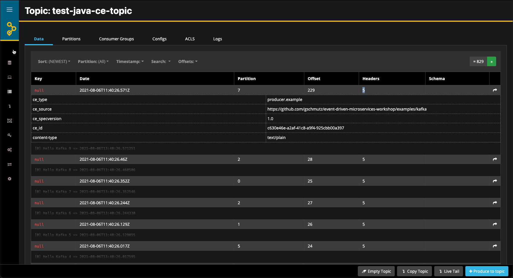

# Working with CloudEvents and Java

In this workshop we will learn how to produce and consume messages using the [Kafka Java API](https://kafka.apache.org/documentation/#api) using CloudEvents for serialising and deserialising messages.

## Create the project in your Java IDE


Create a new [Maven project](../99-misc/97-working-with-eclipse/README.md) and in the last step use `com.trivadis.kafkaws` for the **Group Id** and `java-cloudevents-kafka` for the **Artifact Id**.

Navigate to the **pom.xml** and double-click on it. The POM Editor will be displayed. 

You can either use the GUI to edit your `pom.xml` or navigate to the last tab **pom.xml** to switch to the "code view". Let's do that. 

You will see the still rather empty definition.

```xml
<project xmlns="http://maven.apache.org/POM/4.0.0" xmlns:xsi="http://www.w3.org/2001/XMLSchema-instance" xsi:schemaLocation="http://maven.apache.org/POM/4.0.0 http://maven.apache.org/xsd/maven-4.0.0.xsd">
  <modelVersion>4.0.0</modelVersion>
  <groupId>com.trivadis.kafkaws</groupId>
  <artifactId>java-cloudevents-kafka</artifactId>
  <version>0.0.1-SNAPSHOT</version>
</project>
```

Let's add some initial dependencies for our project. We will add some more dependencies to the POM throughout this workshop. 

Copy the following block right after the `<version>` tag, before the closing `</project>` tag.

```xml
   <properties>
       <cloudevents-sdk.version>2.2.0</cloudevents-sdk.version>
       <slf4j-version>1.7.5</slf4j-version>
       
       <!-- use utf-8 encoding -->
       <project.build.sourceEncoding>UTF-8</project.build.sourceEncoding>
       <project.reporting.outputEncoding>UTF-8</project.reporting.outputEncoding>
    </properties>


    <dependencies>
        <dependency>
            <groupId>io.cloudevents</groupId>
            <artifactId>cloudevents-kafka</artifactId>
            <version>${cloudevents-sdk.version}</version>
        </dependency>
        <dependency>
            <groupId>io.cloudevents</groupId>
            <artifactId>cloudevents-json-jackson</artifactId>
            <version>${cloudevents-sdk.version}</version>
        </dependency>

		<dependency>
		    <groupId>org.slf4j</groupId>
		    <artifactId>slf4j-log4j12</artifactId>
		    <version>${slf4j-version}</version>
		</dependency>
    </dependencies>
    
    <build>
        <defaultGoal>install</defaultGoal>

        <plugins>

            <plugin>
                <groupId>org.codehaus.mojo</groupId>
                <artifactId>exec-maven-plugin</artifactId>
                <version>3.0.0</version>
                <executions>
                    <execution>
                        <id>producer</id>
                        <goals>
                            <goal>java</goal>
                        </goals>
                        <configuration>
                            <mainClass>com.trivadis.kafkaws.producer.KafkaProducerCloudEvents</mainClass>
                        </configuration>
                    </execution>
                </executions>
            </plugin>
        </plugins>
    </build>    
```

## Creating the necessary Kafka Topic 

We will use the topic `test-java-ce-topic` in the Producer and Consumer code below. Due to the fact that `auto.topic.create.enable` is set to `false`, we have to manually create the topic. 

In a terminal window, connect to the `kafka-1` container

```
docker exec -ti kafka-1 bash
```

and execute the necessary kafka-topics command. 

```
kafka-topics --create \
--replication-factor 3 \
--partitions 12 \
--topic test-java-ce-topic \
--zookeeper zookeeper-1:2181
```

This finishes the setup steps and our new project is ready to be used. Next we will start implementing the **Kafka Producer** which uses CloudEvents for the serialization. 

## Create a Kafka Producer using CloudEvents for serialisation

First create a new Java Package `com.trivadis.kafkaws.producer` in the folder **src/main/java**.

Create a new Java Class `KafkaProducerCloudEvents` in the package `com.trivadis.kafakws.producer` just created. 

Add the following code to the empty class to create a Kafka Producer. It is similar to the code we have seen in the previous workshop. We have changed both serializer to use the Confluent `CloudEventsSerializer` class and added the URL to the Confluent Schema Registry API. 

```java
package com.trivadis.kafkaws.producer;

import java.util.Properties;

import io.cloudevents.CloudEvent;
import io.cloudevents.core.builder.CloudEventBuilder;
import io.cloudevents.core.message.Encoding;
import io.cloudevents.jackson.JsonFormat;
import io.cloudevents.kafka.CloudEventSerializer;
import org.apache.kafka.clients.producer.*;
import org.apache.kafka.common.serialization.LongSerializer;

import java.net.URI;
import java.time.LocalDateTime;
import java.util.Properties;
import java.util.UUID;

public class KafkaProducerCloudEvents {

    private final static String TOPIC = "test-java-ce-topic";
    private final static String BOOTSTRAP_SERVERS =
            "dataplatform:9092, dataplatform:9093, dataplatform:9094";
            
    private static Producer<Long, CloudEvent> createProducer() {
        Properties props = new Properties();
        props.put(ProducerConfig.BOOTSTRAP_SERVERS_CONFIG, BOOTSTRAP_SERVERS);
        props.put(ProducerConfig.CLIENT_ID_CONFIG, "KafkaExampleProducer");
        props.put(ProducerConfig.KEY_SERIALIZER_CLASS_CONFIG, LongSerializer.class);
        props.put(ProducerConfig.VALUE_SERIALIZER_CLASS_CONFIG, CloudEventSerializer.class);

        // Configure the CloudEventSerializer to emit events as json structured events
        props.put(ProducerConfig.VALUE_SERIALIZER_CLASS_CONFIG, CloudEventSerializer.class);
        props.put(CloudEventSerializer.ENCODING_CONFIG, Encoding.STRUCTURED);
        props.put(CloudEventSerializer.EVENT_FORMAT_CONFIG, JsonFormat.CONTENT_TYPE);

        return new KafkaProducer<>(props);
    }	
```

We will be using the synchronous way for producing messages to the Kafka topic we created above, but the other methods would work as well with CloudEvents.

```java
    static void runProducer(final int sendMessageCount, final int waitMsInBetween, final long id) throws Exception {
        final Producer<Long, CloudEvent> producer = createProducer();
        long time = System.currentTimeMillis();
        Long key = (id > 0) ? id : null;

        // Create an event template to set basic CloudEvent attributes
        CloudEventBuilder eventTemplate = CloudEventBuilder.v1()
                .withSource(URI.create("https://github.com/gschmutz/event-driven-microservices-workshop/examples/kafka"))
                .withType("producer.example");

        try {
            for (long index = 0; index < sendMessageCount; index++) {
                String data = "[" + id + "] Hello Kafka " + index + " => " + LocalDateTime.now();

                // Create the event starting from the template
                CloudEvent event = eventTemplate.newBuilder()
                        .withId(UUID.randomUUID().toString())
                        .withData("text/plain", data.getBytes())
                        .build();

                ProducerRecord<Long, CloudEvent> record = new ProducerRecord<>(TOPIC, id, event);
                RecordMetadata metadata = producer.send(record).get();

                long elapsedTime = System.currentTimeMillis() - time;
                System.out.printf("[" + id + "] sent record(key=%s value=%s) " +
                                "meta(partition=%d, offset=%d) time=%d\n",
                        record.key(), record.value(), metadata.partition(),
                        metadata.offset(), elapsedTime);
                time = System.currentTimeMillis();

                Thread.sleep(waitMsInBetween);
            }
        } finally {
            producer.flush();
            producer.close();
        }
    }
```

Next you define the main method.
    
```java
    public static void main(String... args) throws Exception {
        if (args.length == 0) {
            runProducer(100,10,0);
        } else {
            runProducer(Integer.parseInt(args[0]),Integer.parseInt(args[1]),Long.parseLong(args[2]));
        }
    }
```

The `main()` method accepts 3 parameters, the number of messages to produce, the time in ms to wait in-between sending each message and the ID of the producer.

Use `kafkacat` or `kafka-console-consumer` to consume the messages from the topic `test-java-ce-topic `.

```bash
kafkacat -b $DATAPLATFORM_IP -t test-java-ce-topic
```

Now run it using the `mvn exec:java` command. It will generate 100 messages, waiting 100ms in-between sending each message and use 0 for the ID. 

```bash
mvn exec:java@producer -Dexec.args="100 100 0"
```

from `kafkacat` you should see an output similar to the one below

```bash
$ kafkacat -b $DATAPLATFORM_IP -t test-java-ce-topic
% Auto-selecting Consumer mode (use -P or -C to override)
% Reached end of topic test-java-ce-topic [0] at offset 0
% Reached end of topic test-java-ce-topic [6] at offset 0
% Reached end of topic test-java-ce-topic [1] at offset 0
% Reached end of topic test-java-ce-topic [4] at offset 0
% Reached end of topic test-java-ce-topic [7] at offset 0
% Reached end of topic test-java-ce-topic [2] at offset 0
% Reached end of topic test-java-ce-topic [5] at offset 0
{"specversion":"1.0","id":"11dfa767-7fcd-414e-a088-7554afe8b56b","source":"https://github.com/gschmutz/event-driven-microservices-workshop/examples/kafka","type":"producer.example","datacontenttype":"text/plain","data_base64":"TWVzc2FnZSBudW1iZXIgMA=="}
% Reached end of topic test-java-ce-topic [3] at offset 7902
{"specversion":"1.0","id":"e9765637-9bb6-4eb2-850c-95d02e4d226c","source":"https://github.com/gschmutz/event-driven-microservices-workshop/examples/kafka","type":"producer.example","datacontenttype":"text/plain","data_base64":"TWVzc2FnZSBudW1iZXIgMQ=="}
% Reached end of topic test-java-ce-topic [3] at offset 7903
{"specversion":"1.0","id":"2f2652ef-e481-46cd-9e9a-b1957fda48c6","source":"https://github.com/gschmutz/event-driven-microservices-workshop/examples/kafka","type":"producer.example","datacontenttype":"text/plain","data_base64":"TWVzc2FnZSBudW1iZXIgMg=="}
% Reached end of topic test-java-ce-topic [3] at offset 7904
{"specversion":"1.0","id":"6e239b0e-5dd4-468d-aa89-6272872a18a8","source":"https://github.com/gschmutz/event-driven-microservices-workshop/examples/kafka","type":"producer.example","datacontenttype":"text/plain","data_base64":"TWVzc2FnZSBudW1iZXIgMw=="}
% Reached end of topic test-java-ce-topic [3] at offset 7905
{"specversion":"1.0","id":"573c3005-235f-4bbd-8d6e-3f952ad55ab8","source":"https://github.com/gschmutz/event-driven-microservices-workshop/examples/kafka","type":"producer.example","datacontenttype":"text/plain","data_base64":"TWVzc2FnZSBudW1iZXIgNA=="}
% Reached end of topic test-java-ce-topic [3] at offset 7906
{"specversion":"1.0","id":"899543a1-4c52-4bd5-9d2d-5925c073cc60","source":"https://github.com/gschmutz/event-driven-microservices-workshop/examples/kafka","type":"producer.example","datacontenttype":"text/plain","data_base64":"TWVzc2FnZSBudW1iZXIgNQ=="}
% Reached end of topic test-java-ce-topic [3] at offset 7907
{"specversion":"1.0","id":"e12098c6-6470-4d05-9141-c68132f5e5c0","source":"https://github.com/gschmutz/event-driven-microservices-workshop/examples/kafka","type":"producer.example","datacontenttype":"text/plain","data_base64":"TWVzc2FnZSBudW1iZXIgNg=="}
...
```

As we can see, the messages are formatted as JSON. You can even make it more visible by piping the output of `kafkacat` to `jq`

```bash
kafkacat -b $DATAPLATFORM_IP -t test-java-ce-topic -q -u | jq
```

Now we can see the CloudEvents messages formatted in a more visible way

```bash
docker@ubuntu:~$ kafkacat -b $DATAPLATFORM_IP -t test-java-ce-topic -q -u | jq
{
  "specversion": "1.0",
  "id": "8892a8a5-1ab7-44b6-aee7-30913cf7dd24",
  "source": "https://github.com/gschmutz/event-driven-microservices-workshop/examples/kafka",
  "type": "producer.example",
  "datacontenttype": "text/plain",
  "data_base64": "TWVzc2FnZSBudW1iZXIgMA=="
}
{
  "specversion": "1.0",
  "id": "7dffd066-5a28-4949-b9dc-923f367057c2",
  "source": "https://github.com/gschmutz/event-driven-microservices-workshop/examples/kafka",
  "type": "producer.example",
  "datacontenttype": "text/plain",
  "data_base64": "TWVzc2FnZSBudW1iZXIgMQ=="
}
{
  "specversion": "1.0",
  "id": "016cae8e-91b3-44ca-bb85-63f4d4059e4e",
  "source": "https://github.com/gschmutz/event-driven-microservices-workshop/examples/kafka",
  "type": "producer.example",
  "datacontenttype": "text/plain",
  "data_base64": "TWVzc2FnZSBudW1iZXIgMg=="
}
```

## Create a Kafka Consumer using CloudEvents for serialization

First create a new Java Package `com.trivadis.kafkaws.consumer` in the folder **src/main/java**.

Create a new Java Class `KafkaConsumerCloudEvents` in the package `com.trivadis.kafakws.consumer` just created. 

Add the following code to the empty class. 

```java
package com.trivadis.kafkaws.consumer;

import io.cloudevents.CloudEvent;
import io.cloudevents.kafka.CloudEventDeserializer;
import org.apache.kafka.clients.consumer.Consumer;
import org.apache.kafka.clients.consumer.ConsumerConfig;
import org.apache.kafka.clients.consumer.ConsumerRecords;
import org.apache.kafka.clients.consumer.KafkaConsumer;
import org.apache.kafka.common.serialization.LongDeserializer;

import java.util.Collections;
import java.util.Properties;

public class KafkaConsumerCloudEvents {

    private final static String TOPIC = "test-java-ce-topic";
    private final static String BOOTSTRAP_SERVERS =
            "dataplatform:9092, dataplatform:9093, dataplatform:9094";

    private static Consumer<Long, CloudEvent> createConsumer() {
        final Properties props = new Properties();
        props.put(ConsumerConfig.BOOTSTRAP_SERVERS_CONFIG, BOOTSTRAP_SERVERS);
        props.put(ConsumerConfig.GROUP_ID_CONFIG, "KakfaConsumerAvro");
        props.put(ConsumerConfig.ENABLE_AUTO_COMMIT_CONFIG, false);
        props.put(ConsumerConfig.AUTO_COMMIT_INTERVAL_MS_CONFIG, 10000);
        props.put(ConsumerConfig.KEY_DESERIALIZER_CLASS_CONFIG, LongDeserializer.class);
        props.put(ConsumerConfig.VALUE_DESERIALIZER_CLASS_CONFIG, CloudEventDeserializer.class);

        // Create the consumer using props.
        final Consumer<Long, CloudEvent> consumer = new KafkaConsumer<>(props);

        // Subscribe to the topic.
        consumer.subscribe(Collections.singletonList(TOPIC));
        return consumer;
    }

    static void runConsumer(int waitMsInBetween) throws InterruptedException {
        final Consumer<Long, CloudEvent> consumer = createConsumer();

        final int giveUp = 100;
        int noRecordsCount = 0;

        while (true) {
            final ConsumerRecords<Long, CloudEvent> consumerRecords = consumer.poll(1000);

            if (consumerRecords.count() == 0) {
                noRecordsCount++;
                if (noRecordsCount > giveUp)
                    break;
            }

            consumerRecords.forEach(record -> {
                System.out.printf("%d - Consumer Record:(Key: %d, Value: %s, Data: %s, Partition: %d, Offset: %d)\n",
                        consumerRecords.count(), record.key(), record.value(), new String(record.value().getData().toBytes()),
                        record.partition(), record.offset());
                try {
                    Thread.sleep(waitMsInBetween);
                } catch (InterruptedException e) {
                }
            });

            consumer.commitSync();
        }
        consumer.close();
        System.out.println("DONE");
    }

    public static void main(String... args) throws Exception {
        if (args.length == 0) {
            runConsumer(10);
        } else {
            runConsumer(Integer.parseInt(args[0]));
        }
    }


}
```

Add an additional `execution` element to the `pom.xml`

```xml
                    <execution>
                        <id>consumer</id>
                        <goals>
                            <goal>java</goal>
                        </goals>
                        <configuration>
                            <mainClass>com.trivadis.kafkaws.consumer.KafkaConsumerCloudEvents</mainClass>
                        </configuration>
                    </execution>
```

Now run it using the `mvn exec:java` command.

```
mvn exec:java@consumer -Dexec.args="0"
```


## Change the Producer to use Encoding.BINARY

In the binary content mode, the value of the event data is be placed into the Kafka message's value section as-is, with the content-type header value declaring its media type; all other event attributes are mapped to the Kafka message's header section.

In the producer, change the `ENCODING_CONFIG` to `Encoding.BINARY` and comment the `EVENT_FORMAT_CONFIG` as it is of no value in that case

```java
        // Configure the CloudEventSerializer to emit events with Encoding.BINARY
        props.put(ProducerConfig.VALUE_SERIALIZER_CLASS_CONFIG, CloudEventSerializer.class);
        props.put(CloudEventSerializer.ENCODING_CONFIG, Encoding.BINARY);
        //props.put(CloudEventSerializer.EVENT_FORMAT_CONFIG, JsonFormat.CONTENT_TYPE);
```
	
Restart the producer 	
	
```bash
mvn clean package -Dmaven.test.skip=true
mvn exec:java@producer -Dexec.args="100 100 0"
```	

while running `kafkacat` with default settings

```bash
kafkacat -b $DATAPLATFORM_IP -t test-java-ce-topic
```

With only the value shown, we no longer see all the attributes of the CloudEvent but only the `data` portion of the CloudEvent

```bash
$ kafkacat -b $DATAPLATFORM_IP -t test-java-ce-topic
[0] Hello Kafka 1 => 2021-08-06T13:24:07.379838
[0] Hello Kafka 16 => 2021-08-06T13:24:09.066303
[0] Hello Kafka 22 => 2021-08-06T13:24:09.728372
[0] Hello Kafka 25 => 2021-08-06T13:24:10.069345
[0] Hello Kafka 34 => 2021-08-06T13:24:11.044915
[0] Hello Kafka 38 => 2021-08-06T13:24:11.481955
[0] Hello Kafka 43 => 2021-08-06T13:24:12.028414
[0] Hello Kafka 67 => 2021-08-06T13:24:14.645988
[0] Hello Kafka 71 => 2021-08-06T13:24:15.078429
[0] Hello Kafka 76 => 2021-08-06T13:24:15.617898
```

Let's adapt `kafkacat` to also show the Kafka headers:

```
kafkacat -b $DATAPLATFORM_IP -t test-java-ce-topic -f '%k - %s - %h\n' 
```	
	
Now you will get more information	
	
```bash
$ kafkacat -b $DATAPLATFORM_IP -t test-java-ce-topic -f '%k - %s - %h\n'
% Auto-selecting Consumer mode (use -P or -C to override)
% Reached end of topic test-java-ce-topic [0] at offset 24
% Reached end of topic test-java-ce-topic [2] at offset 25
% Reached end of topic test-java-ce-topic [1] at offset 25
% Reached end of topic test-java-ce-topic [4] at offset 963
% Reached end of topic test-java-ce-topic [7] at offset 227
% Reached end of topic test-java-ce-topic [5] at offset 22
% Reached end of topic test-java-ce-topic [3] at offset 8150
% Reached end of topic test-java-ce-topic [6] at offset 31
 - [0] Hello Kafka 0 => 2021-08-06T13:43:18.031782 - ce_specversion=1.0,ce_id=ad6f5812-fb2f-4909-9d34-c05817246ebd,ce_source=https://github.com/gschmutz/event-driven-microservices-workshop/examples/kafka,ce_type=producer.example,content-type=text/plain
% Reached end of topic test-java-ce-topic [1] at offset 28
 - [0] Hello Kafka 1 => 2021-08-06T13:43:18.493542 - ce_specversion=1.0,ce_id=85643982-36da-4be0-a579-fb54d9fd0702,ce_source=https://github.com/gschmutz/event-driven-microservices-workshop/examples/kafka,ce_type=producer.example,content-type=text/plain
% Reached end of topic test-java-ce-topic [4] at offset 965
 - [0] Hello Kafka 2 => 2021-08-06T13:43:18.601782 - ce_specversion=1.0,ce_id=5812d7f5-1351-41d9-b37d-b2b5b65fede6,ce_source=https://github.com/gschmutz/event-driven-microservices-workshop/examples/kafka,ce_type=producer.example,content-type=text/plain
% Reached end of topic test-java-ce-topic [5] at offset 26
 - [0] Hello Kafka 3 => 2021-08-06T13:43:18.717177 - ce_specversion=1.0,ce_id=f36e5f65-9149-44f8-ad82-f3ce9dedec8f,ce_source=https://github.com/gschmutz/event-driven-microservices-workshop/examples/kafka,ce_type=producer.example,content-type=text/plain
```

If we view the message in AKHQ (<http://dataplatform:28107/ui/docker-kafka-server/topic/test-java-ce-topic/data?sort=NEWEST&partition=All>) then we can see the headers very nicely:



Double click on the number 5 shown in the Headers column to show the headers.


## Producing CloudEvents so that a Kafka Key is published

So far we are producing a key as a separate information when creating the `ProducerRecord`

```
ProducerRecord<Long, CloudEvent> record = new ProducerRecord<>(TOPIC, id, event);
```

CloudEvents specification defines a [Partitioning](https://github.com/cloudevents/spec/blob/v1.0.1/extensions/partitioning.md) extension, which can be used to pass the information for the partitioning as part of the CloudEvent.

This can be used in Kafka for the key when producing records.

For that you first have to add the `partitionkey` attribute to the CloudEvent

```java
                // Create the event starting from the template
                CloudEvent event = eventTemplate.newBuilder()
                        .withId(UUID.randomUUID().toString())
                        .withData("text/plain", data.getBytes())
                        .withExtension(PartitionKeyExtensionInterceptor.PARTITION_KEY_EXTENSION, 5L)
                        .build();
```

We hard-code the value of the `partitionkey` to `5` (as Long), so that we can see the overwrite in action. In real-life this would be of course a variable value.

If you want a producer to use the `partitionkey` extension, you can use the `PartitionKeyExtensionInterceptor`.

```java
        // add Interceptor for the partitionKey extension
        props.put(ProducerConfig.INTERCEPTOR_CLASSES_CONFIG, io.cloudevents.kafka.PartitionKeyExtensionInterceptor.class.getName());
```

When using in your producer, this interceptor will pick the `partitionkey` extension from the event and will set it as record key, regardless of the input record key. 

Check out the [PartitionKeyExtensionInterceptor](https://github.com/cloudevents/sdk-java/tree/master/kafka/src/main/java/io/cloudevents/kafka/PartitionKeyExtensionInterceptor.java) javadoc for more info.

If you run the producer without a key

```bash
mvn clean package -Dmaven.test.skip=true
mvn exec:java@producer -Dexec.args="100 100 0"
```