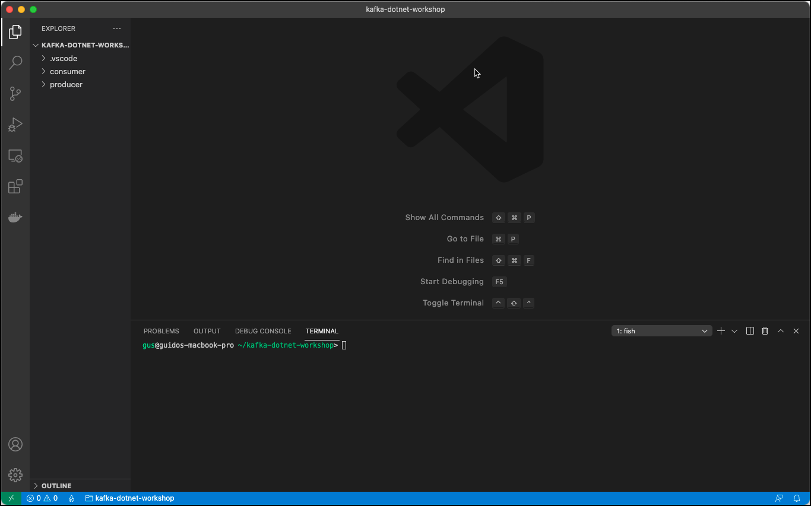

# Working with Kafka from .NET

In this workshop we will learn how to produce and consume messages using the [Kafka .NET API](https://docs.confluent.io/clients-confluent-kafka-dotnet/current/overview.html).

We will show how to build the .NET application using the Visual Code IDE, but anyother IDE or just a simple Editor would be fine as well. 

We asume that .NET Core is installed on your client as well as Visual Code with the C# extension (ms-dotnettools.csharp) enabled. We will use the .NET CLI (`dotnet`) for creating projects and running the code.

## Create the project structure

We will create two projects, one acting as the producer to Kafka and the other one as the consumer from Kafka.

First create the workspace folder, which will hold our projects and navigate into it.

```
mkdir kafka-dotnet-workshop
cd kafka-dotnet-workshop
```

Now let's create the producer project

```
dotnet new console -o producer
```

and also the consumer project

```
dotnet new console -o consumer
```

Now start Visual Code, on Mac if installed using the [following documentation](https://code.visualstudio.com/docs/setup/linux), then it can be started with `code`. 

```
code
```

On the **Getting Started** page, click on **Open...** and select the `kafka-dotnet-workspace` folder created above. Confirm the **Required assets to build and debug are missing from ... Add them?** message pop-up with **Yes**. Open a Terminal in Visual Code over the menu **Terminal** | **New Terminal**. 



We are now ready to add code to the classes which have been created with the `dotnet new` command. 

But before we do that, let's create the topic we will use to produce to and to consume from. 

### Creating the necessary Kafka Topic 

We will use the topic `test-dotnet-topic` in the Producer and Consumer code below. Due to the fact that `auto.topic.create.enable` is set to `false`, we have to manually create the topic. 

Connect to the `kafka-1` container

```
docker exec -ti kafka-1 bash
```

and execute the necessary kafka-topics command. 

```
kafka-topics --create \
    --replication-factor 3 \
    --partitions 8 \
    --topic test-dotnet-topic \
    --zookeeper zookeeper-1:2181
```

Cross check that the topic has been created.

```
kafka-topics --list \
    --zookeeper zookeeper-1:2181
```

This finishes the setup steps and our new project is ready to be used. Next we will start implementing a **Kafka Producer**.

## Create a Kafka Producer

To communicate with Kafka, we need to use the [**confluent-kafka-dotnet**](https://docs.confluent.io/clients-confluent-kafka-dotnet/current/overview.html) .NET library].

The reference the library from the .NET Core project, execute the following command from within the `kafka-dotnet-workspace` folder. 

```
dotnet add producer package Confluent.Kafka
```

The following reference will be added to project metadata

```
<Project Sdk="Microsoft.NET.Sdk">

  ...
   
  <ItemGroup>
    <PackageReference Include="Confluent.Kafka" Version="1.6.3" />
  </ItemGroup>

</Project>
```

Now let's add the code for producing messages to the Kafka topic. Navigate to the `Program.cs` C# class in the `producer` project and open it in the editor. 

Add the following directives on the top

```csharp
using System.Threading;
using Confluent.Kafka;
```

add the following two constants for the Broker List and the Topic name:

```csharp
    class Program
    {
        const string brokerList = "dataplatform:9092,dataplatform:9093";
        const string topicName = "test-dotnet-topic";
```

Replace the code of the ```static void Main``` method by the following block:

```csharp
        static void Main(string[] args)
        {
            if (args.Length == 0) {
                runProducer(100, 10, 0);
            } else {
                runProducer(int.Parse(args[0]), int.Parse(args[1]), int.Parse(args[2]));
            }
        }
```

The `Main()` method accepts 3 parameters, the number of messages to produce, the time in ms to wait in-between sending each message and the ID of the producer.


Add the following additional method for implementing the Kafka producer. We are producing just a value and leave the key empty (`Null`):


```csharp
        static void runProducer(int totalMessages, int waitMsInBetween, int id)
        {
            var config = new ProducerConfig { BootstrapServers = brokerList };

            // Create the Kafka Producer
            using (var producer = new ProducerBuilder<Null, string>(config).Build())
            {
                for (int index = 0; index < totalMessages; index++)
                {
                    long time = DateTimeOffset.Now.ToUnixTimeMilliseconds();

                    // Construct the message value
                    string value = "[" + index + ":" + id + "] Hello Kafka " + DateTimeOffset.Now;
                    
                    try
                        {
                            // send the message to Kafka
                            var task =  producer.ProduceAsync(topicName, new Message<Null, string> { Value = value});    
                            if (task.IsFaulted) {
                                
                            } else {
                                long elapsedTime = DateTimeOffset.Now.ToUnixTimeMilliseconds() - time;

                                Console.WriteLine($"[{id}] sent record (key={task.Result.Key} value={task.Result.Value}) meta (partition={task.Result.TopicPartition.Partition}, offset={task.Result.TopicPartitionOffset.Offset}, time={elapsedTime})");
                            }
                        }
                        catch (ProduceException<string, string> e)
                        {
                            Console.WriteLine($"failed to deliver message: {e.Message} [{e.Error.Code}]");
                        }

                        Thread.Sleep(waitMsInBetween);
                }
           
            }  
        }
```        

Now run it using the `dotnet run` command. It will generate 1000 messages, waiting 10ms in-between sending each message and use 0 for the ID. 

```
dotnet run -p ./producer/producer.csproj 1000 100 0
```

Use `kafkacat` or `kafka-console-consumer` to consume the messages from the topic `test-dotnet-topic`.

```
docker exec -ti kafkacat kafkacat -b kafka-1 -t test-dotnet-topic -f 'Part-%p => %k:%s\n' -q
```

```
Part-1 => :[0:0] Hello Kafka 19/05/2021 19:05:34 +02:00
Part-7 => :[1:0] Hello Kafka 19/05/2021 19:05:35 +02:00
Part-7 => :[2:0] Hello Kafka 19/05/2021 19:05:35 +02:00
Part-4 => :[3:0] Hello Kafka 19/05/2021 19:05:35 +02:00
Part-0 => :[4:0] Hello Kafka 19/05/2021 19:05:35 +02:00
Part-3 => :[5:0] Hello Kafka 19/05/2021 19:05:35 +02:00
Part-3 => :[6:0] Hello Kafka 19/05/2021 19:05:35 +02:00
Part-1 => :[7:0] Hello Kafka 19/05/2021 19:05:35 +02:00
Part-1 => :[8:0] Hello Kafka 19/05/2021 19:05:35 +02:00
Part-1 => :[9:0] Hello Kafka 19/05/2021 19:05:35 +02:00
Part-1 => :[10:0] Hello Kafka 19/05/2021 19:05:35 +02:00
Part-2 => :[11:0] Hello Kafka 19/05/2021 19:05:35 +02:00
Part-7 => :[12:0] Hello Kafka 19/05/2021 19:05:35 +02:00
Part-7 => :[13:0] Hello Kafka 19/05/2021 19:05:35 +02:00
Part-1 => :[14:0] Hello Kafka 19/05/2021 19:05:35 +02:00
Part-1 => :[15:0] Hello Kafka 19/05/2021 19:05:35 +02:00
Part-5 => :[16:0] Hello Kafka 19/05/2021 19:05:35 +02:00
Part-5 => :[17:0] Hello Kafka 19/05/2021 19:05:35 +02:00
Part-0 => :[18:0] Hello Kafka 19/05/2021 19:05:35 +02:00
Part-0 => :[19:0] Hello Kafka 19/05/2021 19:05:35 +02:00
Part-0 => :[20:0] Hello Kafka 19/05/2021 19:05:35 +02:00
Part-2 => :[21:0] Hello Kafka 19/05/2021 19:05:35 +02:00
Part-2 => :[22:0] Hello Kafka 19/05/2021 19:05:35 +02:00
Part-7 => :[23:0] Hello Kafka 19/05/2021 19:05:35 +02:00
Part-7 => :[24:0] Hello Kafka 19/05/2021 19:05:36 +02:00
Part-5 => :[25:0] Hello Kafka 19/05/2021 19:05:36 +02:00
Part-5 => :[26:0] Hello Kafka 19/05/2021 19:05:36 +02:00
Part-0 => :[27:0] Hello Kafka 19/05/2021 19:05:36 +02:00
Part-7 => :[28:0] Hello Kafka 19/05/2021 19:05:36 +02:00
Part-7 => :[29:0] Hello Kafka 19/05/2021 19:05:36 +02:00
Part-0 => :[30:0] Hello Kafka 19/05/2021 19:05:36 +02:00
Part-0 => :[31:0] Hello Kafka 19/05/2021 19:05:36 +02:00
Part-3 => :[32:0] Hello Kafka 19/05/2021 19:05:36 +02:00
Part-1 => :[33:0] Hello Kafka 19/05/2021 19:05:36 +02:00
Part-1 => :[34:0] Hello Kafka 19/05/2021 19:05:36 +02:00
Part-2 => :[35:0] Hello Kafka 19/05/2021 19:05:36 +02:00
Part-2 => :[36:0] Hello Kafka 19/05/2021 19:05:36 +02:00
Part-1 => :[37:0] Hello Kafka 19/05/2021 19:05:36 +02:00
Part-1 => :[38:0] Hello Kafka 19/05/2021 19:05:36 +02:00
Part-4 => :[39:0] Hello Kafka 19/05/2021 19:05:36 +02:00
Part-4 => :[40:0] Hello Kafka 19/05/2021 19:05:36 +02:00
Part-4 => :[41:0] Hello Kafka 19/05/2021 19:05:36 +02:00
Part-4 => :[42:0] Hello Kafka 19/05/2021 19:05:36 +02:00
Part-1 => :[43:0] Hello Kafka 19/05/2021 19:05:36 +02:00
Part-1 => :[44:0] Hello Kafka 19/05/2021 19:05:36 +02:00
Part-1 => :[45:0] Hello Kafka 19/05/2021 19:05:36 +02:00
Part-5 => :[46:0] Hello Kafka 19/05/2021 19:05:36 +02:00
Part-5 => :[47:0] Hello Kafka 19/05/2021 19:05:36 +02:00
Part-1 => :[48:0] Hello Kafka 19/05/2021 19:05:36 +02:00
Part-6 => :[49:0] Hello Kafka 19/05/2021 19:05:36 +02:00
Part-6 => :[50:0] Hello Kafka 19/05/2021 19:05:36 +02:00
Part-6 => :[51:0] Hello Kafka 19/05/2021 19:05:36 +02:00
Part-2 => :[52:0] Hello Kafka 19/05/2021 19:05:36 +02:00
Part-5 => :[53:0] Hello Kafka 19/05/2021 19:05:36 +02:00
Part-4 => :[54:0] Hello Kafka 19/05/2021 19:05:36 +02:00
Part-7 => :[55:0] Hello Kafka 19/05/2021 19:05:36 +02:00
Part-0 => :[56:0] Hello Kafka 19/05/2021 19:05:36 +02:00
Part-0 => :[57:0] Hello Kafka 19/05/2021 19:05:36 +02:00
...
```

### Using the Id field as the key

Instead of producing a `Null` key as before, let's use the `id` argument as the key

```java
        static void runProducerWithKey(int totalMessages, int waitMsInBetween, int id)
        {

            string brokerList = "dataplatform:9092,dataplatform:9093";
            string topicName = "test-dotnet-topic";

            var config = new ProducerConfig { BootstrapServers = brokerList };

            // Create the Kafka Producer
            using (var producer = new ProducerBuilder<long, string>(config).Build())
            {
                for (int index = 0; index < totalMessages; index++)
                {
                    long time = DateTimeOffset.Now.ToUnixTimeMilliseconds();

                    // Construct the message value
                    string value = "[" + index + ":" + id + "] Hello Kafka " + DateTimeOffset.Now;
                    
                    try
                        {
                            // send the message to Kafka
                            var task =  producer.ProduceAsync(topicName, new Message<long, string> { Key = id, Value = value});    
                            if (task.IsFaulted) {
                                
                            } else {
                                long elapsedTime = DateTimeOffset.Now.ToUnixTimeMilliseconds() - time;

                                Console.WriteLine($"[{id}] sent record (key={task.Result.Key} value={task.Result.Value}) meta (partition={task.Result.TopicPartition.Partition}, offset={task.Result.TopicPartitionOffset.Offset}, time={elapsedTime})");
                            }
                        }
                        catch (ProduceException<string, string> e)
                        {
                            Console.WriteLine($"failed to deliver message: {e.Message} [{e.Error.Code}]");
                        }
                        
                        Thread.Sleep(waitMsInBetween);
                }
           
            }  
        }
```

Change the `Main()` method to run the new method

```csharp
        static void Main(string[] args)
        {
            if (args.Length == 0) {
                runProducerWithKey(100, 10, 0);
            } else {
                runProducerWithKey(int.Parse(args[0]), int.Parse(args[1]), int.Parse(args[2]));
            }
        }
```

Run the program again and check the output in kafka console consumer

```bash
dotnet run -p ./producer/producer.csproj 1000 100 0
```

## Create a Kafka Consumer

Now let's create the consumer, which consumes the messages from the Kafka topic. 

Again add a reference to library from the .NET Core project, by executing the following command from within the `kafka-dotnet-workspace` folder.  

```bash
dotnet add consumer package Confluent.Kafka
```

Add the following directives on the top

```csharp
using System.Threading;
using Confluent.Kafka;
```

add the following two constants for the Broker List and the Topic name. 

```csharp
    class Program
    {
        const string brokerList = "dataplatform:9092,dataplatform:9093";
        const string topicName = "test-dotnet-topic";
        const string groupId = "KafkaConsumerAuto";
```

Replace the code of the ```static void Main``` method by the following block:

```csharp
        static void Main(string[] args)
        {
            if (args.Length == 0) {
                runConsumerAuto(10);
            } else {
                runConsumerAuto(int.Parse(args[0]));
            }
        }
```

Add the following additional method for implementing the Kafka conusmer. First we implement a consumer with using Auto Commit mode. 

```csharp
        static void runConsumerAuto()
        {
            var config = new ConsumerConfig
            {
                BootstrapServers = brokerList,
                GroupId = groupId,
                AutoOffsetReset = AutoOffsetReset.Earliest,
                EnableAutoCommit = true,
                AutoCommitIntervalMs = 10000
            };

            bool cancelled = false;

            using (var consumer = new ConsumerBuilder<Ignore, string>(config).Build())
            {
                consumer.Subscribe(topicName);
                var cancelToken = new CancellationTokenSource();

                while (!cancelled) {
                    var consumeResult = consumer.Consume(cancelToken.Token);
                    // handle message
                    Console.WriteLine($"Consumer Record:(Key: {consumeResult.Message.Key}, Value: {consumeResult.Message.Value} Partition: {consumeResult.TopicPartition.Partition} Offset: {consumeResult.TopicPartitionOffset.Offset}");
                }
                consumer.Close();
            }
        }   
    } 
```

Now run it using the `dotnet run` command. It will print the consumed messages to the console.

```
dotnet run -p ./consumer/consumer.csproj 
```

You can check the commits by consuming from the internal `__consumer_offsets` topic. We need a special formatter for deserializing the messages.

```
docker exec -ti kafka-1 kafka-console-consumer  --formatter "kafka.coordinator.group.GroupMetadataManager\$OffsetsMessageFormatter" --bootstrap-server kafka-1:19092 --topic __consumer_offsets --from-beginning
```

### Kafka Consumer with Manual Commit 

Create a new method `runConsumerManual` which uses the manual method to commit offsets. We use a hardcoded value (`50`) for the commit block size, so that a commit will happen every 50 messages.

```csharp
        static void runConsumerManual()
        {
            var config = new ConsumerConfig
            {
                BootstrapServers = brokerList,
                GroupId = groupId,
                EnableAutoCommit = false
            };

            bool cancelled = false;         
            int noRecordsCount = 0;

            using (var consumer = new ConsumerBuilder<Ignore, string>(config).Build())
            {
                consumer.Subscribe(topicName);
                var cancelToken = new CancellationTokenSource();
                ConsumeResult<Ignore, string> consumeResult = null;

                while (!cancelled) {
                    consumeResult = consumer.Consume(cancelToken.Token);
                    noRecordsCount++;
                    
                    // handle message
                    Console.WriteLine($"Consumer Record:(Key: {consumeResult.Message.Key}, Value: {consumeResult.Message.Value} Partition: {consumeResult.TopicPartition.Partition} Offset: {consumeResult.TopicPartitionOffset.Offset}");

                    if (consumeResult.Offset % 50 == 0) {
                        consumer.Commit(consumeResult);
                    }

                }
                
                // commit the rest
                consumer.Commit(consumeResult);

                consumer.Close();
            }
        }  
```

Run the program again

```bash
dotnet run -p ./consumer/consumer.csproj
```

and check the commits by consuming again from the internal `__consumer_offsets` topic. 

```
docker exec -ti kafka-1 kafka-console-consumer  --formatter "kafka.coordinator.group.GroupMetadataManager\$OffsetsMessageFormatter" --bootstrap-server kafka-1:19092 --topic __consumer_offsets --from-beginning
```

## Try running Producer and Consumer

Run the consumer from one terminal window and the producer from another one. You should see the consumer get the records that the producer sent.

### Three Consumers in same group and one Producer sending 25 messages

Make sure that you switch back to the first version of the producer where no key is produced (method `runProducer`).

Start the consumer 3 times by executing the following command in 3 different terminal windows.

```bash
dotnet run -p ./consumer/consumer.csproj
```

and then start the producer

```bash
dotnet run -p ./producer/producer.csproj 25 0 0
```

#### Producer Output

you see the 25 records being created to different partitions.

```
[0] sent record (key= value=[0:0] Hello Kafka 05/19/2021 21:54:44 +02:00) meta (partition=[3], offset=555, time=61)
[0] sent record (key= value=[1:0] Hello Kafka 05/19/2021 21:54:45 +02:00) meta (partition=[5], offset=544, time=0)
[0] sent record (key= value=[2:0] Hello Kafka 05/19/2021 21:54:45 +02:00) meta (partition=[5], offset=545, time=0)
[0] sent record (key= value=[3:0] Hello Kafka 05/19/2021 21:54:45 +02:00) meta (partition=[6], offset=526, time=0)
[0] sent record (key= value=[4:0] Hello Kafka 05/19/2021 21:54:45 +02:00) meta (partition=[6], offset=527, time=0)
[0] sent record (key= value=[5:0] Hello Kafka 05/19/2021 21:54:45 +02:00) meta (partition=[5], offset=546, time=0)
[0] sent record (key= value=[6:0] Hello Kafka 05/19/2021 21:54:45 +02:00) meta (partition=[5], offset=547, time=0)
[0] sent record (key= value=[7:0] Hello Kafka 05/19/2021 21:54:45 +02:00) meta (partition=[5], offset=548, time=0)
[0] sent record (key= value=[8:0] Hello Kafka 05/19/2021 21:54:45 +02:00) meta (partition=[5], offset=549, time=0)
[0] sent record (key= value=[9:0] Hello Kafka 05/19/2021 21:54:45 +02:00) meta (partition=[4], offset=617, time=0)
[0] sent record (key= value=[10:0] Hello Kafka 05/19/2021 21:54:45 +02:00) meta (partition=[4], offset=618, time=0)
[0] sent record (key= value=[11:0] Hello Kafka 05/19/2021 21:54:45 +02:00) meta (partition=[4], offset=619, time=1)
[0] sent record (key= value=[12:0] Hello Kafka 05/19/2021 21:54:45 +02:00) meta (partition=[4], offset=620, time=0)
[0] sent record (key= value=[13:0] Hello Kafka 05/19/2021 21:54:45 +02:00) meta (partition=[0], offset=582, time=0)
[0] sent record (key= value=[14:0] Hello Kafka 05/19/2021 21:54:45 +02:00) meta (partition=[0], offset=583, time=0)
[0] sent record (key= value=[15:0] Hello Kafka 05/19/2021 21:54:45 +02:00) meta (partition=[0], offset=584, time=0)
[0] sent record (key= value=[16:0] Hello Kafka 05/19/2021 21:54:45 +02:00) meta (partition=[0], offset=585, time=0)
[0] sent record (key= value=[17:0] Hello Kafka 05/19/2021 21:54:45 +02:00) meta (partition=[2], offset=540, time=0)
[0] sent record (key= value=[18:0] Hello Kafka 05/19/2021 21:54:45 +02:00) meta (partition=[2], offset=541, time=0)
[0] sent record (key= value=[19:0] Hello Kafka 05/19/2021 21:54:45 +02:00) meta (partition=[1], offset=9765, time=0)
[0] sent record (key= value=[20:0] Hello Kafka 05/19/2021 21:54:45 +02:00) meta (partition=[1], offset=9766, time=0)
[0] sent record (key= value=[21:0] Hello Kafka 05/19/2021 21:54:45 +02:00) meta (partition=[0], offset=586, time=0)
[0] sent record (key= value=[22:0] Hello Kafka 05/19/2021 21:54:45 +02:00) meta (partition=[0], offset=587, time=0)
[0] sent record (key= value=[23:0] Hello Kafka 05/19/2021 21:54:45 +02:00) meta (partition=[7], offset=709, time=0)
[0] sent record (key= value=[24:0] Hello Kafka 05/19/2021 21:54:45 +02:00) meta (partition=[7], offset=710, time=0)
```

#### Consumer 1 Output (same consumer group)
```
Consumer Record:(Key: , Value: [5:0] Hello Kafka 05/19/2021 21:54:00 +02:00 Partition: [4] Offset: 613
Consumer Record:(Key: , Value: [6:0] Hello Kafka 05/19/2021 21:54:00 +02:00 Partition: [4] Offset: 614
Consumer Record:(Key: , Value: [19:0] Hello Kafka 05/19/2021 21:54:00 +02:00 Partition: [4] Offset: 615
Consumer Record:(Key: , Value: [20:0] Hello Kafka 05/19/2021 21:54:00 +02:00 Partition: [4] Offset: 616
Consumer Record:(Key: , Value: [13:0] Hello Kafka 05/19/2021 21:54:00 +02:00 Partition: [5] Offset: 542
Consumer Record:(Key: , Value: [14:0] Hello Kafka 05/19/2021 21:54:00 +02:00 Partition: [5] Offset: 543
Consumer Record:(Key: , Value: [1:0] Hello Kafka 05/19/2021 21:54:45 +02:00 Partition: [5] Offset: 544
Consumer Record:(Key: , Value: [2:0] Hello Kafka 05/19/2021 21:54:45 +02:00 Partition: [5] Offset: 545
Consumer Record:(Key: , Value: [5:0] Hello Kafka 05/19/2021 21:54:45 +02:00 Partition: [5] Offset: 546
Consumer Record:(Key: , Value: [6:0] Hello Kafka 05/19/2021 21:54:45 +02:00 Partition: [5] Offset: 547
Consumer Record:(Key: , Value: [7:0] Hello Kafka 05/19/2021 21:54:45 +02:00 Partition: [5] Offset: 548
Consumer Record:(Key: , Value: [8:0] Hello Kafka 05/19/2021 21:54:45 +02:00 Partition: [5] Offset: 549
Consumer Record:(Key: , Value: [9:0] Hello Kafka 05/19/2021 21:54:45 +02:00 Partition: [4] Offset: 617
Consumer Record:(Key: , Value: [10:0] Hello Kafka 05/19/2021 21:54:45 +02:00 Partition: [4] Offset: 618
Consumer Record:(Key: , Value: [11:0] Hello Kafka 05/19/2021 21:54:45 +02:00 Partition: [4] Offset: 619
Consumer Record:(Key: , Value: [12:0] Hello Kafka 05/19/2021 21:54:45 +02:00 Partition: [4] Offset: 620
```
#### Consumer 2 Output (same consumer group)

```
Consumer Record:(Key: , Value: [7:0] Hello Kafka 05/19/2021 21:54:00 +02:00 Partition: [7] Offset: 705
Consumer Record:(Key: , Value: [8:0] Hello Kafka 05/19/2021 21:54:00 +02:00 Partition: [7] Offset: 706
Consumer Record:(Key: , Value: [9:0] Hello Kafka 05/19/2021 21:54:00 +02:00 Partition: [7] Offset: 707
Consumer Record:(Key: , Value: [10:0] Hello Kafka 05/19/2021 21:54:00 +02:00 Partition: [7] Offset: 708
Consumer Record:(Key: , Value: [11:0] Hello Kafka 05/19/2021 21:54:00 +02:00 Partition: [6] Offset: 522
Consumer Record:(Key: , Value: [12:0] Hello Kafka 05/19/2021 21:54:00 +02:00 Partition: [6] Offset: 523
Consumer Record:(Key: , Value: [23:0] Hello Kafka 05/19/2021 21:54:00 +02:00 Partition: [6] Offset: 524
Consumer Record:(Key: , Value: [24:0] Hello Kafka 05/19/2021 21:54:00 +02:00 Partition: [6] Offset: 525
Consumer Record:(Key: , Value: [3:0] Hello Kafka 05/19/2021 21:54:45 +02:00 Partition: [6] Offset: 526
Consumer Record:(Key: , Value: [4:0] Hello Kafka 05/19/2021 21:54:45 +02:00 Partition: [6] Offset: 527
Consumer Record:(Key: , Value: [23:0] Hello Kafka 05/19/2021 21:54:45 +02:00 Partition: [7] Offset: 709
Consumer Record:(Key: , Value: [24:0] Hello Kafka 05/19/2021 21:54:45 +02:00 Partition: [7] Offset: 710
```

#### Consumer 3 Output (same consumer group)

```
Consumer Record:(Key: , Value: [3:0] Hello Kafka 05/19/2021 21:54:00 +02:00 Partition: [1] Offset: 9763
Consumer Record:(Key: , Value: [4:0] Hello Kafka 05/19/2021 21:54:00 +02:00 Partition: [1] Offset: 9764
Consumer Record:(Key: , Value: [1:0] Hello Kafka 05/19/2021 21:54:00 +02:00 Partition: [0] Offset: 578
Consumer Record:(Key: , Value: [2:0] Hello Kafka 05/19/2021 21:54:00 +02:00 Partition: [0] Offset: 579
Consumer Record:(Key: , Value: [15:0] Hello Kafka 05/19/2021 21:54:00 +02:00 Partition: [0] Offset: 580
Consumer Record:(Key: , Value: [16:0] Hello Kafka 05/19/2021 21:54:00 +02:00 Partition: [0] Offset: 581
Consumer Record:(Key: , Value: [13:0] Hello Kafka 05/19/2021 21:54:45 +02:00 Partition: [0] Offset: 582
Consumer Record:(Key: , Value: [14:0] Hello Kafka 05/19/2021 21:54:45 +02:00 Partition: [0] Offset: 583
Consumer Record:(Key: , Value: [15:0] Hello Kafka 05/19/2021 21:54:45 +02:00 Partition: [0] Offset: 584
Consumer Record:(Key: , Value: [16:0] Hello Kafka 05/19/2021 21:54:45 +02:00 Partition: [0] Offset: 585
Consumer Record:(Key: , Value: [19:0] Hello Kafka 05/19/2021 21:54:45 +02:00 Partition: [1] Offset: 9765
Consumer Record:(Key: , Value: [20:0] Hello Kafka 05/19/2021 21:54:45 +02:00 Partition: [1] Offset: 9766
Consumer Record:(Key: , Value: [21:0] Hello Kafka 05/19/2021 21:54:45 +02:00 Partition: [0] Offset: 586
Consumer Record:(Key: , Value: [22:0] Hello Kafka 05/19/2021 21:54:45 +02:00 Partition: [0] Offset: 587
```

### Three Consumers in same group and one Producer sending 10 messages using key

Switch the producer to use the method with key (`runProducerWithKey`).

Start the consumer 3 times by executing the following command in 3 different terminal windows.

```
dotnet run -p ./consumer/consumer.csproj
```

and then start the producer (using 10 for the ID)

```
dotnet run -p ./producer/producer.csproj 25 0 10
```

#### Producer Output

```
[0] sent record (key=0 value=[0:0] Hello Kafka 05/19/2021 22:25:51 +02:00) meta (partition=[1], offset=12532, time=51)
[0] sent record (key=0 value=[1:0] Hello Kafka 05/19/2021 22:25:52 +02:00) meta (partition=[1], offset=12533, time=0)
[0] sent record (key=0 value=[2:0] Hello Kafka 05/19/2021 22:25:52 +02:00) meta (partition=[1], offset=12534, time=0)
[0] sent record (key=0 value=[3:0] Hello Kafka 05/19/2021 22:25:52 +02:00) meta (partition=[1], offset=12535, time=0)
[0] sent record (key=0 value=[4:0] Hello Kafka 05/19/2021 22:25:52 +02:00) meta (partition=[1], offset=12536, time=0)
[0] sent record (key=0 value=[5:0] Hello Kafka 05/19/2021 22:25:52 +02:00) meta (partition=[1], offset=12537, time=0)
[0] sent record (key=0 value=[6:0] Hello Kafka 05/19/2021 22:25:52 +02:00) meta (partition=[1], offset=12538, time=0)
[0] sent record (key=0 value=[7:0] Hello Kafka 05/19/2021 22:25:52 +02:00) meta (partition=[1], offset=12539, time=1)
[0] sent record (key=0 value=[8:0] Hello Kafka 05/19/2021 22:25:52 +02:00) meta (partition=[1], offset=12540, time=0)
[0] sent record (key=0 value=[9:0] Hello Kafka 05/19/2021 22:25:52 +02:00) meta (partition=[1], offset=12541, time=0)
[0] sent record (key=0 value=[10:0] Hello Kafka 05/19/2021 22:25:52 +02:00) meta (partition=[1], offset=12542, time=0)
[0] sent record (key=0 value=[11:0] Hello Kafka 05/19/2021 22:25:52 +02:00) meta (partition=[1], offset=12543, time=0)
[0] sent record (key=0 value=[12:0] Hello Kafka 05/19/2021 22:25:52 +02:00) meta (partition=[1], offset=12544, time=0)
[0] sent record (key=0 value=[13:0] Hello Kafka 05/19/2021 22:25:52 +02:00) meta (partition=[1], offset=12545, time=0)
[0] sent record (key=0 value=[14:0] Hello Kafka 05/19/2021 22:25:52 +02:00) meta (partition=[1], offset=12546, time=0)
[0] sent record (key=0 value=[15:0] Hello Kafka 05/19/2021 22:25:52 +02:00) meta (partition=[1], offset=12547, time=0)
[0] sent record (key=0 value=[16:0] Hello Kafka 05/19/2021 22:25:52 +02:00) meta (partition=[1], offset=12548, time=0)
[0] sent record (key=0 value=[17:0] Hello Kafka 05/19/2021 22:25:52 +02:00) meta (partition=[1], offset=12549, time=0)
[0] sent record (key=0 value=[18:0] Hello Kafka 05/19/2021 22:25:52 +02:00) meta (partition=[1], offset=12550, time=0)
[0] sent record (key=0 value=[19:0] Hello Kafka 05/19/2021 22:25:52 +02:00) meta (partition=[1], offset=12551, time=0)
[0] sent record (key=0 value=[20:0] Hello Kafka 05/19/2021 22:25:52 +02:00) meta (partition=[1], offset=12552, time=0)
[0] sent record (key=0 value=[21:0] Hello Kafka 05/19/2021 22:25:52 +02:00) meta (partition=[1], offset=12553, time=0)
[0] sent record (key=0 value=[22:0] Hello Kafka 05/19/2021 22:25:52 +02:00) meta (partition=[1], offset=12554, time=0)
[0] sent record (key=0 value=[23:0] Hello Kafka 05/19/2021 22:25:52 +02:00) meta (partition=[1], offset=12555, time=0)
[0] sent record (key=0 value=[24:0] Hello Kafka 05/19/2021 22:25:52 +02:00) meta (partition=[1], offset=12556, time=0)
```

#### Consumer 1 Output (same consumer group)

```
Consumer Record:(Key: , Value: [0:0] Hello Kafka 05/19/2021 22:25:51 +02:00 Partition: [1] Offset: 12532
Consumer Record:(Key: , Value: [1:0] Hello Kafka 05/19/2021 22:25:52 +02:00 Partition: [1] Offset: 12533
Consumer Record:(Key: , Value: [2:0] Hello Kafka 05/19/2021 22:25:52 +02:00 Partition: [1] Offset: 12534
Consumer Record:(Key: , Value: [3:0] Hello Kafka 05/19/2021 22:25:52 +02:00 Partition: [1] Offset: 12535
Consumer Record:(Key: , Value: [4:0] Hello Kafka 05/19/2021 22:25:52 +02:00 Partition: [1] Offset: 12536
Consumer Record:(Key: , Value: [5:0] Hello Kafka 05/19/2021 22:25:52 +02:00 Partition: [1] Offset: 12537
Consumer Record:(Key: , Value: [6:0] Hello Kafka 05/19/2021 22:25:52 +02:00 Partition: [1] Offset: 12538
Consumer Record:(Key: , Value: [7:0] Hello Kafka 05/19/2021 22:25:52 +02:00 Partition: [1] Offset: 12539
Consumer Record:(Key: , Value: [8:0] Hello Kafka 05/19/2021 22:25:52 +02:00 Partition: [1] Offset: 12540
Consumer Record:(Key: , Value: [9:0] Hello Kafka 05/19/2021 22:25:52 +02:00 Partition: [1] Offset: 12541
Consumer Record:(Key: , Value: [10:0] Hello Kafka 05/19/2021 22:25:52 +02:00 Partition: [1] Offset: 12542
Consumer Record:(Key: , Value: [11:0] Hello Kafka 05/19/2021 22:25:52 +02:00 Partition: [1] Offset: 12543
Consumer Record:(Key: , Value: [12:0] Hello Kafka 05/19/2021 22:25:52 +02:00 Partition: [1] Offset: 12544
Consumer Record:(Key: , Value: [13:0] Hello Kafka 05/19/2021 22:25:52 +02:00 Partition: [1] Offset: 12545
Consumer Record:(Key: , Value: [14:0] Hello Kafka 05/19/2021 22:25:52 +02:00 Partition: [1] Offset: 12546
Consumer Record:(Key: , Value: [15:0] Hello Kafka 05/19/2021 22:25:52 +02:00 Partition: [1] Offset: 12547
Consumer Record:(Key: , Value: [16:0] Hello Kafka 05/19/2021 22:25:52 +02:00 Partition: [1] Offset: 12548
Consumer Record:(Key: , Value: [17:0] Hello Kafka 05/19/2021 22:25:52 +02:00 Partition: [1] Offset: 12549
Consumer Record:(Key: , Value: [18:0] Hello Kafka 05/19/2021 22:25:52 +02:00 Partition: [1] Offset: 12550
Consumer Record:(Key: , Value: [19:0] Hello Kafka 05/19/2021 22:25:52 +02:00 Partition: [1] Offset: 12551
Consumer Record:(Key: , Value: [20:0] Hello Kafka 05/19/2021 22:25:52 +02:00 Partition: [1] Offset: 12552
Consumer Record:(Key: , Value: [21:0] Hello Kafka 05/19/2021 22:25:52 +02:00 Partition: [1] Offset: 12553
Consumer Record:(Key: , Value: [22:0] Hello Kafka 05/19/2021 22:25:52 +02:00 Partition: [1] Offset: 12554
Consumer Record:(Key: , Value: [23:0] Hello Kafka 05/19/2021 22:25:52 +02:00 Partition: [1] Offset: 12555
Consumer Record:(Key: , Value: [24:0] Hello Kafka 05/19/2021 22:25:52 +02:00 Partition: [1] Offset: 12556
```

#### Consumer 2 Output (same consumer group)

nothing consumed

#### Consumer 3 Output (same consumer group)

nothing consumed

