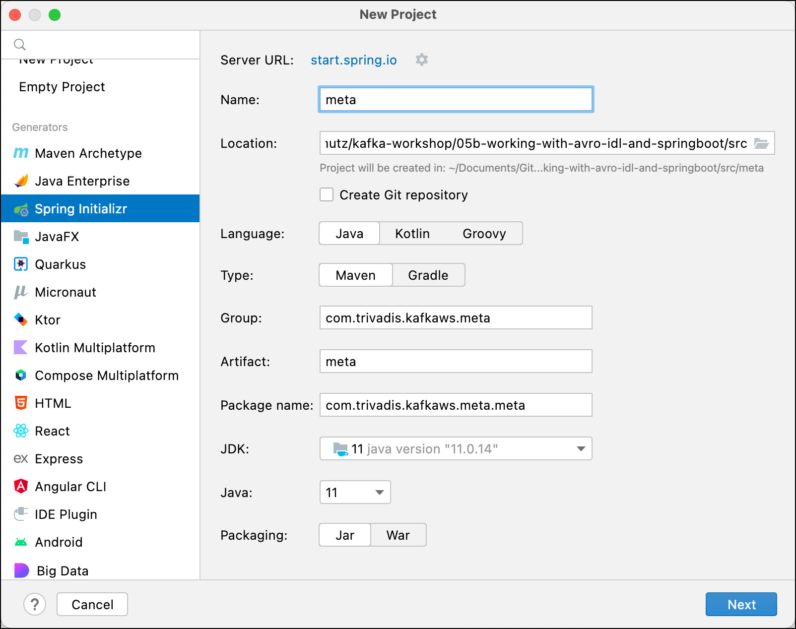

# Using Kafka from Spring Boot with Avro & Schema Registry

In this workshop we will learn how to use the Spring Kafka abstraction with Avro message serialization from within a Spring Boot application. We will implement both a consumer and a producer. We are using the same Avro schema of [Workshop 4a: Working with Avro and Java](../04a-working-with-avro-and-java). 

We will create two Spring Boot projects, one for the Producer and one for the Consumer, simulating two independent microservices interacting with eachother via events. Additionally we will create another Maven project called `meta` which holds the Avro Schema(s). A dependency to that project will be added to both Spring Boot projects.  

## Create the Avro Metadata Project

First we will define the Avro schema and generate the classes. As both Mircorservices will need the generated class to work, we do that in a separate project, and then use it as a dependency in the two Micorservices.

### Create a new Maven project

From your IDE (screenshot taken from IntelliJ), create a new Maven project and use `meta` for the **Name**, `com.trivadis.kafkaws.meta` for the **GroupId** and leave the **Version** as is.



Click on **Finish**.

### Add some configuration to Maven pom

Edit the `pom.xml` and . First add an additional property to the `<properties>`  

```xml
    <properties>
        ...
        <avro.version>1.10.1</avro.version>
    </properties>
```    

and now add the dependency to [Avro](https://mvnrepository.com/artifact/org.apache.avro/avro) right after the `</properties>` element

```xml
    <dependencies>
        <!-- https://mvnrepository.com/artifact/org.apache.avro/avro -->
        <dependency>
            <groupId>org.apache.avro</groupId>
            <artifactId>avro</artifactId>
            <version>${avro.version}</version>
        </dependency>
    </dependencies>
```    

We are using Avro 1.10.1 because that is the version used by Confluent 6.2.

Now add the following section at the end before the `</project>` element.
 
```xml
    <build>
        <plugins>
            <plugin>
                <groupId>org.apache.avro</groupId>
                <artifactId>avro-maven-plugin</artifactId>
                <version>${avro.version}</version>
                <executions>
                    <execution>
                        <phase>generate-sources</phase>
                        <goals>
                            <goal>schema</goal>
                            <goal>protocol</goal>
                            <goal>idl-protocol</goal>
                        </goals>
                        <configuration>
                            <stringType>String</stringType>
                            <fieldVisibility>private</fieldVisibility>
                            <sourceDirectory>${project.basedir}/src/main/avro</sourceDirectory>
                        </configuration>
                    </execution>
                </executions>
            </plugin>
            <plugin>
                <groupId>io.confluent</groupId>
                <artifactId>kafka-schema-registry-maven-plugin</artifactId>
                <version>3.2.0</version>
                <configuration>
                    <schemaRegistryUrls>
                        <param>http://${env.DATAPLATFORM_IP}:8081</param>
                    </schemaRegistryUrls>
                    <subjects>
                        <test-java-avro-topic-value>src/main/avro/Notification-v1.avsc</test-java-avro-topic-value>
                    </subjects>
                </configuration>
                <goals>
                    <goal>register</goal>
                    <goal>test-compatibility</goal>
                </goals>
            </plugin>
        </plugins>
    </build>
```

The first plugin will make sure, that classes are generated based on the Avro schema, whenever a `mvn compile` is executed.

To second plugin will help to register the Avro schema(s) via Maven into the Confluent Schema Registry.


We also have to specify the additional Maven repository, where the plugins can be found. Add the following XML fragement at the end right before the `project` element.

```xml
    <pluginRepositories>
        <pluginRepository>
            <id>confluent</id>
            <url>https://packages.confluent.io/maven/</url>
        </pluginRepository>
    </pluginRepositories>
```

### Create an Avro Schema representing the Avro Message to send

First create a new Folder `avro` under the existing folder **src/main/**.

Create a new File `Notification-v1.avsc` in the folder  **src/main/avro** just created above.

Add the following Avro schema to the empty file.  

```json
{
  "type" : "record",
  "namespace" : "com.trivadis.kafkaws.avro.v1",
  "name" : "Notification",
  "description" : "A simple Notification Event message",
  "fields" : [
	    {   "name" : "id",
	        "type" : ["long", "null"]
	    },
	    {   "name" : "message",
	        "type" : ["string", "null"]
	    },
	    {   "name" : "createdAt",
            "type" : {
              "type" : "long",
              "logicalType" : "timestamp-millis"
            }
        }
  ]
}
```

The Maven plugin added above will make sure, that classes are generated based on the Avro schema, whenever a `mvn compile` is executed. Let's exactly do that on the still rather empty project. 

```bash
mvn compile
```

After running this command, refresh the project in your IDE and you should see a new folder named `target/generated-sources/avro`. Navigate into this folder and you should see one generated Java class named `Notification`.


### Register the Avro Schema with the registry

Register the schema with the Schema Registry:

For the IP address of the platform the Schema Registry is running on, we refer to an environment variable, which we have to declare.

```bash
export DATAPLATFORM_IP=nnn.nnn.nnn.nnn
```

Now use the maven command

```bash
mvn schema-registry:register
```

### Publish the artefact to the local Maven repo

Now let's make sure that the project is available as a Maven dependency:

```bash
mvn install
```

## Create the Spring Boot Producer Project

First we create an test the Producer microservice.

### Creating the Spring Boot Project

First, let’s navigate to [Spring Initializr](https://start.spring.io/) to generate our project. Our project will need the Apache Kafka support. 

Select Generate a **Maven Project** with **Java** and Spring Boot **2.5.3**. Enter `com.trivadis.kafkaws` for the **Group**, `spring-boot-kafka-producer-avro` for the **Artifact** field and `Kafka Producer with Avro project for Spring Boot` for the **Description** field. 

Click on **Add Dependencies** and search for the  **Spring for Apache Kafka** depencency. 

Select the dependency and hit the **Enter** key. You should now see the dependency on the right side of the screen.

Click on **Generate Project** and unzip the ZIP file to a convenient location for development. 

Once you have unzipped the project, you’ll have a very simple structure. 

Import the project as a Maven Project into your favourite IDE for further development. 

### Extend the Maven POM with some configurations

In oder to use the Avro serializer and the class generated above, we have to add the following dependencies to the `pom.xml`. 

```xml
	<dependencies>
	   ...
	   
		<dependency>
			<groupId>io.confluent</groupId>
			<artifactId>kafka-avro-serializer</artifactId>
			<version>${confluent.version}</version>
		</dependency>
		
		<dependency>
			<groupId>com.trivadis.kafkaws.meta</groupId>
			<artifactId>meta</artifactId>
			<version>1.0-SNAPSHOT</version>
		</dependency>
```

Add the version of the Confluent Platform to use as an additional property

```xml
	<properties>
	   ...
		<confluent.version>6.2.0</confluent.version>
	</properties>
```

We also have to specify the additional Maven repository 

```xml
	<repositories>
		<repository>
			<id>confluent</id>
			<url>https://packages.confluent.io/maven/</url>
		</repository>
	</repositories>
```

### Implement a Kafka Producer in Spring

Now create a simple Java class `KafkaEventProducer` within the `com.trivadis.kafkaws.springbootkafkaproducer ` package, which we will use to produce messages to Kafka.

```java
package com.trivadis.kafkaws.springbootkafkaproducer;

import com.trivadis.kafkaws.avro.v1.Notification;
import org.apache.kafka.clients.producer.ProducerRecord;
import org.slf4j.Logger;
import org.slf4j.LoggerFactory;
import org.springframework.beans.factory.annotation.Autowired;
import org.springframework.beans.factory.annotation.Value;
import org.springframework.kafka.core.KafkaTemplate;
import org.springframework.kafka.support.SendResult;
import org.springframework.messaging.Message;
import org.springframework.messaging.support.MessageBuilder;
import org.springframework.stereotype.Component;

import java.time.Instant;
import java.util.concurrent.ExecutionException;
import java.util.concurrent.TimeUnit;
import java.util.concurrent.TimeoutException;

@Component
public class KafkaEventProducer {
    private static final Logger LOGGER = LoggerFactory.getLogger(KafkaEventProducer.class);

    @Autowired
    private KafkaTemplate<Long, Notification> kafkaTemplate;

    @Value("${topic.name}")
    String kafkaTopic;

    public void produce(Integer id, Long key, Notification notification) {
        long time = System.currentTimeMillis();

        SendResult<Long, Notification> result = null;
        try {
            result = kafkaTemplate.send(kafkaTopic, key, notification).get(10, TimeUnit.SECONDS);
        } catch (InterruptedException e) {
            e.printStackTrace();
        } catch (ExecutionException e) {
            e.printStackTrace();
        } catch (TimeoutException e) {
            e.printStackTrace();
        }

        long elapsedTime = System.currentTimeMillis() - time;
        System.out.printf("[" + id + "] sent record(key=%s value=%s) "
                        + "meta(partition=%d, offset=%d) time=%d\n",
                key, notification, result.getRecordMetadata().partition(),
                result.getRecordMetadata().offset(), elapsedTime);
    }
}
```

We no longer use `String` as type for the value but the `Nofification` class, which has been generated based on the Avro schema above.

### Create the necessary Topics through code

Spring Kafka can automatically add topics to the broker, if they do not yet exists. By that you can replace the `kafka-topics` CLI commands seen so far to create the topics, if you like. This code is exactly the same as in workshop 4 with the non-avro version.

```java
package com.trivadis.kafkaws.springbootkafkaproducer;

import org.apache.kafka.clients.admin.NewTopic;
import org.springframework.beans.factory.annotation.Value;
import org.springframework.context.annotation.Bean;
import org.springframework.kafka.config.TopicBuilder;
import org.springframework.stereotype.Component;

@Component
public class TopicCreator {
    @Value(value = "${topic.name}")
    private String testTopic;

    @Value(value = "${topic.partitions}")
    private Integer testTopicPartitions;

    @Value(value = "${topic.replication-factor}")
    private short testTopicReplicationFactor;

    @Bean
    public NewTopic testTopic() {
        return TopicBuilder.name(testTopic)
                        .partitions(testTopicPartitions)
                        .replicas(testTopicReplicationFactor)
                        .build();
    }
}
```

We again refer to properties, which will be defined later in the `application.yml` config file. 

### Add Producer logic to the SpringBootKafkaProducerApplication class

We change the generated Spring Boot application to be a console appliation by implementing the `CommandLineRunner` interface. The `run` method holds the same code as the `main()` method in [Workshop 4: Working with Kafka from Java](../04-producing-consuming-kafka-with-java). The `runProducer` method is also similar, we just use the `kafkaEventProducer` instance injected by Spring to produce the messages to Kafka.

```java
package com.trivadis.kafkaws.springbootkafkaproducer;

import com.trivadis.kafkaws.avro.v1.Notification;
import org.slf4j.Logger;
import org.slf4j.LoggerFactory;
import org.springframework.beans.factory.annotation.Autowired;
import org.springframework.boot.CommandLineRunner;
import org.springframework.boot.SpringApplication;
import org.springframework.boot.autoconfigure.SpringBootApplication;

import java.time.Instant;
import java.time.LocalDateTime;

@SpringBootApplication
public class SpringBootKafkaProducerApplication implements CommandLineRunner {

	private static Logger LOG = LoggerFactory.getLogger(SpringBootKafkaProducerApplication.class);

	@Autowired
	private KafkaEventProducer kafkaEventProducer;

	public static void main(String[] args) {
		SpringApplication.run(SpringBootKafkaProducerApplication.class, args);
	}

	@Override
	public void run(String... args) throws Exception {
		LOG.info("EXECUTING : command line runner");

		if (args.length == 0) {
			runProducer(100, 10, 0);
		} else {
			runProducer(Integer.parseInt(args[0]), Integer.parseInt(args[1]), Long.parseLong(args[2]));
		}

	}

	private void runProducer(int sendMessageCount, int waitMsInBetween, long id) throws Exception {
		Long key = (id > 0) ? id : null;

		for (int index = 0; index < sendMessageCount; index++) {
			Notification notification = Notification.newBuilder()
												.setId(id)
												.setMessage("[" + id + "] Hello Kafka " + index)
												.setCreatedAt(Instant.now())
												.build();

			kafkaEventProducer.produce(index, key, notification);

			// Simulate slow processing
			Thread.sleep(waitMsInBetween);

		}
	}

}
```

The difference here to the non-avro version is, that we are using the builder of the generated `Nofification` class to create an instance of a notification, which we then pass as the value to the `produce()` method.

### Configure Kafka through application.yml configuration file

First let's rename the existing `application.properties` file to `application.yml` to use the `yml` format. 

Add the following settings to configure the Kafka cluster and the name of the topic:

```yml
topic:
  name: test-spring-avro-topic
  replication-factor: 3
  partitions: 8

spring:
  kafka:
    bootstrap-servers:
      - ${DATAPLATFORM_IP}:9092
      - ${DATAPLATFORM_IP}:9093
    producer:
      key-serializer: org.apache.kafka.common.serialization.LongSerializer
      value-serializer: io.confluent.kafka.serializers.KafkaAvroSerializer
      properties:
        auto.register.schemas: false
        use.latest.version: true
    properties:
      schema.registry.url: http://${DATAPLATFORM_IP}:8081
```

Here again we swith the value-serializer from `StringSerializer` to the `KafkaAvroSerializer` and add the property `schema.registry.url` to configure the location of the Confluent Schema Registry REST API.

For the IP address of the Kafka cluster we refer to an environment variable, which we have to declare before running the application.

```bash
export DATAPLATFORM_IP=nnn.nnn.nnn.nnn
```

### Build the application

First lets build the application:

```bash
mvn package -Dmaven.test.skip=true
```

### Use Console to test the application

In a terminal window start consuming from the output topic:

```bash
kafkacat -b $DATAPLATFORM_IP -t test-spring-avro-topic -s avro -r http://$DATAPLATFORM_IP:8081 -o end
```

### Run the application

Now let's run the application

```bash
mvn spring-boot:run
```

Make sure that you see the messages through the console consumer.

To run the producer with custom parameters (for example to specify the key to use), use the `-Dspring-boot.run.arguments`:

```bash
mvn spring-boot:run -Dspring-boot.run.arguments="100 10 10"
```

## Create the Spring Boot Consumer Project

Now let's create an test the Consumer microservice.

### Creating the Spring Boot Project

Use again the [Spring Initializr](https://start.spring.io/) to generate the project.

Select Generate a **Maven Project** with **Java** and Spring Boot **2.5.3**. Enter `com.trivadis.kafkaws` for the **Group**, `spring-boot-kafka-consumer-avro` for the **Artifact** field and `Kafka Consumer with Avro project for Spring Boot` for the **Description** field. 

Click on **Add Dependencies** and search for the  **Spring for Apache Kafka** depencency. 

Select the dependency and hit the **Enter** key. You should now see the dependency on the right side of the screen.

Click on **Generate Project** and unzip the ZIP file to a convenient location for development. 

Once you have unzipped the project, you’ll have a very simple structure. 

Import the project as a Maven Project into your favourite IDE for further development. 

### Extend the Maven POM with some configurations

In oder to use the Avro deserializer and the Avro generated classes, we have to add the following dependencies to the `pom.xml`. 

```xml
	<dependencies>
	   ...
	   
		<dependency>
			<groupId>io.confluent</groupId>
			<artifactId>kafka-avro-serializer</artifactId>
			<version>${confluent.version}</version>
		</dependency>
		
		<dependency>
			<groupId>com.trivadis.kafkaws.meta</groupId>
			<artifactId>meta</artifactId>
			<version>1.0-SNAPSHOT</version>
		</dependency>
```

Add the version of the Confluent Platform to use as an additional property

```xml
	<properties>
	   ...
		<confluent.version>6.2.0</confluent.version>
	</properties>
```

We also have to specify the additional Maven repository 

```xml
	<repositories>
		<repository>
			<id>confluent</id>
			<url>https://packages.confluent.io/maven/</url>
		</repository>
	</repositories>
```

### Implement a Kafka Consumer in Spring

Start by creating a simple Java class `KafkaEventConsumer` within the `com.trivadis.kafkaws.springbootkafkaconsumer` package, which we will use to consume messages from Kafka. 

```java
package com.trivadis.kafkaws.springbootkafkaconsumeravro;

import com.trivadis.kafkaws.avro.v1.Notification;
import org.apache.kafka.clients.consumer.ConsumerRecord;
import org.slf4j.Logger;
import org.slf4j.LoggerFactory;
import org.springframework.kafka.annotation.KafkaListener;
import org.springframework.stereotype.Component;

@Component
public class KafkaEventConsumer {
    private static final Logger LOGGER = LoggerFactory.getLogger(KafkaEventConsumer.class);

    @KafkaListener(topics = "${topic.name}", groupId = "simple-consumer-group")
    public void receive(ConsumerRecord<Long, Notification> consumerRecord) {
        Notification value = consumerRecord.value();
        Long key = consumerRecord.key();
        LOGGER.info("received key = '{}' with payload='{}'", key, value);
    }
}
```

This class uses the `Component` annotation to have it registered as bean in the Spring context and the `KafkaListener` annotation to specify a listener method to be called for each record consumed from the Kafka input topic. The name of the topic is specified as a property to be read again from the `application.yml` configuration file.

In the code we only log the key and value received to the console. In real life, we would probably inject another bean into the `KafkaEventConsumer` to perform the message processing.
 
### Configure Kafka through application.yml configuration file

First let's rename the existing `application.properties` file to `application.yml` to use the `yml` format. 

Add the following settings to configure the Kafka cluster and the name of the two topics:

```yml
topic:
  name: test-spring-avro-topic

spring:
  kafka:
    bootstrap-servers:
      - ${DATAPLATFORM_IP}:9092
      - ${DATAPLATFORM_IP}:9093
    consumer:
      key-deserializer: org.apache.kafka.common.serialization.LongDeserializer
      value-deserializer: io.confluent.kafka.serializers.KafkaAvroDeserializer
      properties:
        auto.register.schemas: false
        specific.avro.reader: true
    properties:
      schema.registry.url: http://${DATAPLATFORM_IP}:8081
```

For the IP address of the Kafka cluster we refer to an environment variable, which we have to declare before running the application.

```bash
export DATAPLATFORM_IP=nnn.nnn.nnn.nnn
```

### Build the application

First lets build the application:

```bash
mvn package -Dmaven.test.skip=true
```

### Run the application

Now let's run the application

```bash
mvn spring-boot:run
```


