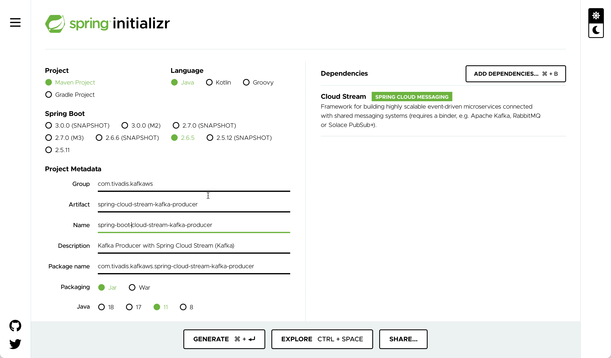

# Using Kafka from Spring Boot using Cloud Stream

In this workshop we will learn how to use the **Spring Cloud Stream** abstraction from within a Spring Boot application. We will implement both a consumer and a producer implementing the same behaviour as in [Workshop 4: Working with Kafka from Java](../04-producing-consuming-kafka-with-java). 

We will create two Spring Boot projects, one for the **Producer** and one for the **Consumer**, simulating two independent microservices interacting with eachother via events.

## Create the Spring Boot Producer

First we create an test the Producer microservice.

### Creating the Spring Boot Project

First, let’s navigate to [Spring Initializr](https://start.spring.io/) to generate our project. Our project will need the Spring Cloud Stream support. 

Select Generate a **Maven Project** with **Java** and Spring Boot **2.6.5**. Enter `com.trivadis.kafkaws` for the **Group**, `spring-boot-cloud-stream-kafka-producer` for the **Artifact** field and `Kafka Producer with Spring Cloud Stream (Kafka)` for the **Description** field. 

Click on **Add Dependencies** and search for the  **Cloud Stream** depencency. 

Select the dependency and hit the **Enter** key. You should now see the dependency on the right side of the screen.



Click on **Generate Project** and unzip the ZIP file to a convenient location for development. 

Once you have unzipped the project, you’ll have a very simple structure. 

Import the project as a Maven Project into your favourite IDE for further development. 

### Implement a Kafka Producer in Spring

Now create a simple Java class `KafkaEventProducer` within the `com.trivadis.kafkaws.springbootkafkaproducer ` package, which we will use to produce messages to Kafka.

```java
package com.trivadis.kafkaws.springbootkafkaproducer;

import org.slf4j.Logger;
import org.slf4j.LoggerFactory;
import org.springframework.beans.factory.annotation.Autowired;
import org.springframework.beans.factory.annotation.Value;
import org.springframework.cloud.stream.messaging.Processor;
import org.springframework.kafka.support.KafkaHeaders;
import org.springframework.messaging.Message;
import org.springframework.messaging.support.MessageBuilder;
import org.springframework.stereotype.Service;

@Service
public class KafkaEventProducer {
    private static final Logger LOGGER = LoggerFactory.getLogger(KafkaEventProducer.class);

    @Autowired
    private Processor processor;

    @Value("${topic.name}")
    String kafkaTopic;

    public void produce(Integer id, Long key, String value) {
        long time = System.currentTimeMillis();

        Message<String> message = MessageBuilder.withPayload(value)
                .setHeader(KafkaHeaders.MESSAGE_KEY, key)
                .build();

        processor.output()
                .send(message);

        long elapsedTime = System.currentTimeMillis() - time;

        System.out.printf("[" + id + "] sent record(key=%s value=%s) time=%d\n",key, value,elapsedTime);
    }
}
```

It uses the `Component` annotation to have it registered as bean in the Spring context. The topic to produce to is specified as a property, which we will specify later in the `applicaiton.yml` file.

We produce the messages synchronously.

### Create the necessary Topics through code

Spring Kafka can automatically add topics to the broker, if they do not yet exists. By that you can replace the `kafka-topics` CLI commands seen so far to create the topics, if you like.

Spring Kafka provides a `TopicBuilder` which makes the creation of the topics very convenient. 

```java
package com.trivadis.kafkaws.springbootkafkaproducer;

import org.apache.kafka.clients.admin.NewTopic;
import org.springframework.beans.factory.annotation.Value;
import org.springframework.context.annotation.Bean;
import org.springframework.kafka.config.TopicBuilder;
import org.springframework.stereotype.Component;

@Component
public class TopicCreator {
    @Value(value = "${topic.name}")
    private String testTopic;

    @Value(value = "${topic.partitions}")
    private Integer testTopicPartitions;

    @Value(value = "${topic.replication-factor}")
    private short testTopicReplicationFactor;

    @Bean
    public NewTopic testTopic() {
        return TopicBuilder.name(testTopic)
                        .partitions(testTopicPartitions)
                        .replicas(testTopicReplicationFactor)
                        .build();
    }
}
```

We again refer to properties, which will be defined later in the `application.yml` config file. 

### Add Producer logic to the SpringBootKafkaProducerApplication class

We change the generated Spring Boot application to be a console appliation by implementing the `CommandLineRunner` interface. The `run` method holds the same code as the `main()` method in [Workshop 4: Working with Kafka from Java](../04-producing-consuming-kafka-with-java). The `runProducer` method is also similar, we just use the `kafkaEventProducer` instance injected by Spring to produce the messages to Kafka.

```java
package com.trivadis.kafkaws.springbootkafkaproducer;

import org.slf4j.Logger;
import org.slf4j.LoggerFactory;
import org.springframework.beans.factory.annotation.Autowired;
import org.springframework.boot.CommandLineRunner;
import org.springframework.boot.SpringApplication;
import org.springframework.boot.autoconfigure.SpringBootApplication;
import org.springframework.cloud.stream.annotation.EnableBinding;
import org.springframework.cloud.stream.messaging.Processor;

import java.time.LocalDateTime;

@SpringBootApplication
@EnableBinding(Processor.class)
public class SpringBootKafkaProducerApplication implements CommandLineRunner {

	private static Logger LOG = LoggerFactory.getLogger(SpringBootKafkaProducerApplication.class);

	@Autowired
	private KafkaEventProducer kafkaEventProducer;

	public static void main(String[] args) {
		SpringApplication.run(SpringBootKafkaProducerApplication.class, args);
	}

	@Override
	public void run(String... args) throws Exception {
		LOG.info("EXECUTING : command line runner");

		if (args.length == 0) {
			runProducer(100, 10, 0);
		} else {
			runProducer(Integer.parseInt(args[0]), Integer.parseInt(args[1]), Long.parseLong(args[2]));
		}

	}

	private void runProducer(int sendMessageCount, int waitMsInBetween, long id) throws Exception {
		Long key = (id > 0) ? id : null;

		for (int index = 0; index < sendMessageCount; index++) {
			String value =  "[" + id + "] Hello Kafka " + index + " => " + LocalDateTime.now();

			kafkaEventProducer.produce(index, key, value);

			// Simulate slow processing
			Thread.sleep(waitMsInBetween);

		}
	}

}
```

### Configure Kafka through application.yml configuration file

First let's rename the existing `application.properties` file to `application.yml` to use the `yml` format. 

Add the following settings to configure the Kafka cluster and the name of the topic:

```yml
topic:
  name: test-spring-cloud-stream-topic
  replication-factor: 3
  partitions: 8

spring:
  cloud:
    stream:
      default:
        producer:
          useNativeEncoding: true

      kafka:
        binder:
          producer-properties:
            key.serializer: org.apache.kafka.common.serialization.LongSerializer
            value.serializer: org.apache.kafka.common.serialization.StringSerializer

      bindings:
        output:
          destination: ${topic.name}
  kafka:
    bootstrap-servers: ${DATAPLATFORM_IP}:9092
```

For the IP address of the Kafka cluster we refer to an environment variable, which we have to declare before running the application.

```bash
export DATAPLATFORM_IP=nnn.nnn.nnn.nnn
```

### Build the application

First lets build the application:

```bash
mvn package -Dmaven.test.skip=true
```

### Run the application

Now let's run the application

```bash
mvn spring-boot:run
```

Make sure that you see the messages through the console consumer.

To run the producer with custom parameters (for example to specify the key to use), use the `-Dspring-boot.run.arguments`:

```bash
mvn spring-boot:run -Dspring-boot.run.arguments="100 10 10"
```

### Use Console to test the application

In a terminal window start consuming from the output topic:

```bash
kafkacat -b $DATAPLATFORM_IP -t test-spring-topic
```

## Create the Spring Boot Consumer

Now let's create an test the Consumer microservice.

### Creating the Spring Boot Project

Use again the [Spring Initializr](https://start.spring.io/) to generate the project.

Select Generate a **Maven Project** with **Java** and Spring Boot **2.6.5**. Enter `com.trivadis.kafkaws` for the **Group**, `spring-boot-cloud-stram-kafka-consumer` for the **Artifact** field and `Kafka Consumer project for Spring Boot` for the **Description** field. 

Click on **Add Dependencies** and search for the  **Spring for Apache Kafka** depencency. 

Select the dependency and hit the **Enter** key. You should now see the dependency on the right side of the screen.

Click on **Generate Project** and unzip the ZIP file to a convenient location for development. 

Once you have unzipped the project, you’ll have a very simple structure. 

Import the project as a Maven Project into your favourite IDE for further development. 

### Implement a Kafka Consumer in Spring

Start by creating a simple Java class `KafkaEventConsumer` within the `com.trivadis.kafkaws.springbootkafkaconsumer` package, which we will use to consume messages from Kafka. 

```java
package com.trivadis.kafkaws.springbootkafkaconsumer;

import org.slf4j.Logger;
import org.slf4j.LoggerFactory;
import org.springframework.cloud.stream.annotation.StreamListener;
import org.springframework.cloud.stream.messaging.Processor;
import org.springframework.kafka.support.KafkaHeaders;
import org.springframework.messaging.Message;
import org.springframework.stereotype.Component;

@Component
public class KafkaEventConsumer {
    private static final Logger LOGGER = LoggerFactory.getLogger(KafkaEventConsumer.class);

    @StreamListener(Processor.INPUT)
    public void receive(Message<String> msg) {
        String value = msg.getPayload();
        Long key = (Long)msg.getHeaders().get(KafkaHeaders.RECEIVED_MESSAGE_KEY);
        LOGGER.info("received key = '{}' with payload='{}'", key, value);
    }
}
```

This class uses the `Component` annotation to have it registered as bean in the Spring context and the `StreamListener` annotation to specify a listener method to be called for each record consumed from the Kafka input topic. The name of the topic is specified as a property to be read again from the `application.yml` configuration file.

In the code we only log the key and value received to the console. In real life, we would probably inject another bean into the `KafkaEventConsumer` to perform the message processing.
 
### Configure Kafka through application.yml configuration file

First let's rename the existing `application.properties` file to `application.yml` to use the `yml` format. 

Add the following settings to configure the Kafka cluster and the name of the two topics:

```yml
spring:
  cloud:
    stream:
      default:
        consumer:
          useNativeEncoding: true

      bindings:
        input:
          destination: test-spring-cloud-stream-topic
          group: group-1
          concurrency: 3
      kafka:
        binder:
          consumer-properties:
            key.deserializer: org.apache.kafka.common.serialization.LongDeserializer
            value.deserializer: org.apache.kafka.common.serialization.StringDeserializer
  kafka:
    bootstrap-servers: ${DATAPLATFORM_IP}:9092
```

For the IP address of the Kafka cluster we refer to an environment variable, which we have to declare before running the application.

```bash
export DATAPLATFORM_IP=nnn.nnn.nnn.nnn
```

### Build the application

First lets build the application:

```bash
mvn package -Dmaven.test.skip=true
```

### Run the application

Now let's run the application

```bash
mvn spring-boot:run
```

