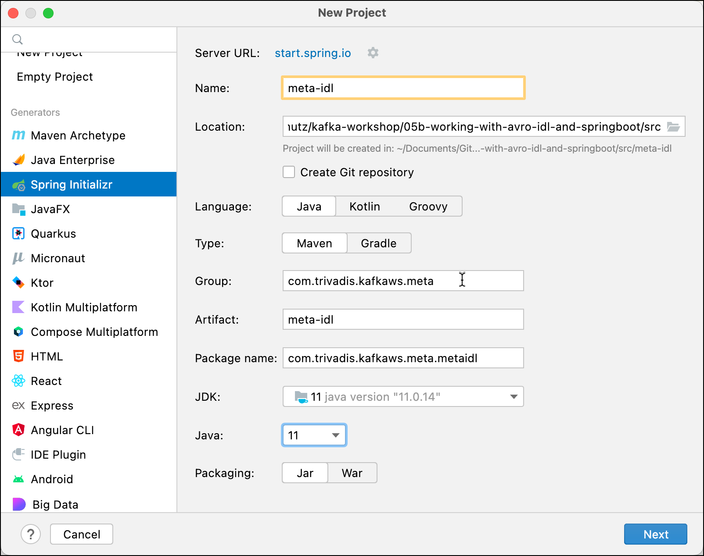

# Kafka Heterogenous topic from Spring Boot with Avro IDL & Schema Registry

In this workshop we will learn how to use the Spring Kafka abstraction with a heterogenous topic, accepting different Avro objects for the message serialization. We will use Spring Kafka from within a Spring Boot application and implement both a consumer and a producer. 

We will again use the [Avro IDL language](https://avro.apache.org/docs/current/idl-language/) for defining the Avro Schema but it would work with the Avro JSON language as wwell. 

We will create two Spring Boot projects, one for the **Producer** and one for the **Consumer**, simulating two independent micro-services interacting with each other via events. 

Additionally we will create another Maven project called `meta` which holds the Avro Schema(s). A dependency to that project will be added to both Spring Boot projects.  

## Create the Avro Metadata Project

First we will define the Avro schema and generate the classes. As both Mircorservices will need the generated class to work, we do that in a separate project, and then use it as a dependency in the two Microservices.

### Create a new Maven project

From your IDE (screenshot taken from IntelliJ), create a new Maven project and use `meta-idl-heterogenous` for the **Name**, `com.trivadis.kafkaws.meta` for the **GroupId** and leave the **Version** as is.



Click on **Finish**.

### Add some configuration to Maven pom

Edit the `pom.xml` and . First add an additional property to the `<properties>`  

```xml
    <properties>
        ...
        <avro.version>1.11.0</avro.version>
    </properties>
```    

and now add the dependency to [Avro](https://mvnrepository.com/artifact/org.apache.avro/avro) right after the `</properties>` element

```xml
    <dependencies>
        <!-- https://mvnrepository.com/artifact/org.apache.avro/avro -->
        <dependency>
            <groupId>org.apache.avro</groupId>
            <artifactId>avro</artifactId>
            <version>${avro.version}</version>
        </dependency>
    </dependencies>
```    

We are using Avro 1.11.1 because that is the version used by Confluent 7.2.0.

Now add the following section at the end before the `</project>` element.
 
```xml
    <build>
        <plugins>
            <plugin>
                <groupId>org.apache.avro</groupId>
                <artifactId>avro-maven-plugin</artifactId>
                <version>${avro.version}</version>
                <executions>
                    <execution>
                        <phase>generate-sources</phase>
                        <goals>
                            <goal>schema</goal>
                            <goal>protocol</goal>
                            <goal>idl-protocol</goal>
                        </goals>
                        <configuration>
                            <stringType>String</stringType>
                            <fieldVisibility>private</fieldVisibility>
                            <sourceDirectory>${project.basedir}/src/main/avdl/</sourceDirectory>
                        </configuration>
                    </execution>
                </executions>
            </plugin>

            <plugin>
                <groupId>com.trivadis.plugins</groupId>
                <artifactId>avdl2avsc-maven-plugin</artifactId>
                <version>1.0.1-SNAPSHOT</version>
                <executions>
                    <execution>
                        <phase>generate-sources</phase>
                        <goals>
                            <goal>genschema</goal>
                        </goals>
                        <configuration>
                            <inputAvdlDirectory>${basedir}/src/main/avdl</inputAvdlDirectory>
                            <outputSchemaDirectory>${basedir}/target/generated-sources/avro/schema
                            </outputSchemaDirectory>
                        </configuration>
                    </execution>
                </executions>
            </plugin>
        </plugins>
    </build>
```

The first plugin will make sure, that classes are generated based on the Avro schema, whenever a `mvn compile` is executed.

The second plugin will generate schemas with the JSON dialect from schemas with IDL dialect, which we will use to define our Avro schemas.

To third plugin will help to register the Avro schema(s) via Maven into the Confluent Schema Registry.

We also have to specify the additional Maven repositories, where the plugins can be found. Add the following XML fragment at the end right before the `project` element.

```xml
    <pluginRepositories>
        <pluginRepository>
            <id>confluent</id>
            <url>https://packages.confluent.io/maven/</url>
        </pluginRepository>
        <pluginRepository>
            <id>Avdl2Avsc Maven Repo</id>
            <url>https://github.com/TrivadisPF/avdl2avsc-maven-plugin/raw/mvn-repo/</url>
            <snapshots>
                <enabled>true</enabled>
                <updatePolicy>always</updatePolicy>
            </snapshots>
        </pluginRepository>        
    </pluginRepositories>
```

### Create Avro Schemas representing the Avro Messages to send

In this workshop we will use 2 different message types, one of type `Notification` and a second one of type `Alert`.

First create a new Folder `avdl` under the existing folder **src/main/**.

#### Notification

Create a new File `Notification.avdl` in the folder  **src/main/avdl** just created above.

Add the following Avro schema to the empty file, using the Avro IDL language. 

```
@namespace("com.trivadis.kafkaws.avro.v1")
protocol NotificationProtocol {
		record Notification {
			union {null, long} id;
			union {null, string}  message;
			timestamp_ms createdAt;
		}
}
```

This represent the Notification object. 

We will use another schema to define the `NotificationSentEvent` event and import the `Notification` object. Create a new file `NotificationSentEvent-v1.avdl` in the `avdl` folder and add the folllowing schema defintion:

```
@namespace("com.trivadis.kafkaws.avro.v1")
protocol NotificationSentEventProtocol {
	import idl "Notification.avdl";

	record NotificationSentEvent {
		Notification  notification;
	}
}
```

#### Alert

Create a new File `Alert.avdl` in the folder  **src/main/avdl** just created above.

Add the following Avro schema to the empty file, using the Avro IDL language. 

```
@namespace("com.trivadis.kafkaws.avro.v1")

protocol AlertProtocol {
	record Alert {
		uuid id;
		string message;
		string severity;
		timestamp_ms when;
	}
}
```

This represent the Alert object. 

We will use another schema to define the `AlertSentEvent` event and import the `Alert` object. Create a new file `AlertSentEvent-v1.avdl` in the `avdl` folder and add the following schema definition:

```
@namespace("com.trivadis.kafkaws.avro.v1")
protocol AlertSentEventProtocol {
	import idl "Alert.avdl";

	record AlertSentEvent {
		Alert  alert;
	}
}
```


Let's now run a Maven compile to generate both the Avro JSON schema as well as the Java code for the Avro Serialization/Deserialization.

```
mvn compile
```

After running this command, refresh the project and you should see a new folder named `target/generated-sources/avro`. Expand into this folder and you should see both the generated Java classes as well as a `schema` folder with the two `avsc` schemas. We get two classes for each IDL file, one for the `protocol` and one for the `record`, although we will only use the one for the `record` definitions, `Notification.java` and `NotificationSentEvent.java`. 

### Register the Avro Schema with the registry

In order to support heterogenous topics with Avro and Schema Registry, we have to change the [**Subject Name Strategy**](https://docs.confluent.io/platform/current/schema-registry/serdes-develop/index.html#subject-name-strategy) used for the lookup of the schema in the Schema Registry, to either the `RecordNameStrategy` or the `TopicRecordNameStrategy` instead of the default `TopicNameStrategy`. In this workshop we will use the `TopicRecordNameStrategy`, which we will have to configure in the producer and consumer. 

With the `TopicRecordNameStrategy` the schema needs to be registered in the registry under the subject name `<topicName>-<recordName>`, where `<recordName>` is the fully-qualified record name. This is reflected in the Maven Schema Registry plugin shown below:

```xml
            <plugin>
                <groupId>io.confluent</groupId>
                <artifactId>kafka-schema-registry-maven-plugin</artifactId>
                <version>3.2.0</version>
                <configuration>
                    <schemaRegistryUrls>
                        <param>http://${env.DATAPLATFORM_IP}:8081</param>
                    </schemaRegistryUrls>
                    <subjects>
                        <test-spring-avro-idl-heterogenous-topic-com.trivadis.kafkaws.avro.v1.NotificationSentEvent>target/generated-sources/avro/schema/NotificationSentEvent.avsc</test-spring-avro-idl-heterogenous-topic-com.trivadis.kafkaws.avro.v1.NotificationSentEvent>
                        <test-spring-avro-idl-heterogenous-topic-com.trivadis.kafkaws.avro.v1.AlertSentEvent>target/generated-sources/avro/schema/AlertSentEvent.avsc</test-spring-avro-idl-heterogenous-topic-com.trivadis.kafkaws.avro.v1.AlertSentEvent>
                    </subjects>
                </configuration>
                <goals>
                    <goal>register</goal>
                    <goal>test-compatibility</goal>
                </goals>
            </plugin>
```

We register once the Avro schema for the `NotificationSentEvent` and once for the `AlertSentEvent`, both for the same topic named `test-spring-avro-idl-heterogenous-topic`.

Now we can register the schema with the Schema Registry.

For the IP address of the platform the Schema Registry is running on, we refer to an environment variable, which we have to declare.

```bash
export DATAPLATFORM_IP=nnn.nnn.nnn.nnn
```

Now use the maven command

```bash
mvn schema-registry:register
```

### Publish the artefact to the local Maven repo

Now let's make sure that the project is available as a Maven dependency:

```bash
mvn install
```

## Create the Spring Boot Producer Project

First we create and test the Producer micro-service.

### Creating the Spring Boot Project

First, let’s navigate to [Spring Initializr](https://start.spring.io/) to generate our project. Our project will need the Apache Kafka support. 

Select Generate a **Maven Project** with **Java** and Spring Boot **3.0.1**. Enter `com.trivadis.kafkaws` for the **Group**, `spring-boot-kafka-producer-avro-idl-heterogenous` for the **Artifact** field and `Kafka Producer with Avro project for Spring Boot` for the **Description** field. 

Click on **Add Dependencies** and search for the  **Spring for Apache Kafka** dependency. 

Select the dependency and hit the **Enter** key. You should now see the dependency on the right side of the screen.

Click on **Generate Project** and unzip the ZIP file to a convenient location for development. 

Once you have unzipped the project, you’ll have a very simple structure. 

Import the project as a Maven Project into your favourite IDE for further development. 

### Extend the Maven POM with some configurations

In order to use the Avro serializer and the class generated above, we have to add the following dependencies to the `pom.xml`. 

```xml
	<dependencies>
	   ...
	   
		<dependency>
			<groupId>io.confluent</groupId>
			<artifactId>kafka-avro-serializer</artifactId>
			<version>${confluent.version}</version>
		</dependency>
		
		<dependency>
			<groupId>com.trivadis.kafkaws.meta</groupId>
			<artifactId>meta-idl-heterogenous</artifactId>
			<version>1.0-SNAPSHOT</version>
		</dependency>
```

Add the version of the Confluent Platform to use as an additional property

```xml
	<properties>
	   ...
		<confluent.version>7.3.0</confluent.version>
	</properties>
```

We also have to specify the additional Maven repository 

```xml
	<repositories>
		<repository>
			<id>confluent</id>
			<url>https://packages.confluent.io/maven/</url>
		</repository>
	</repositories>
```

### Implement a Kafka Producer in Spring

Now create a simple Java class `KafkaEventProducer` within the `com.trivadis.kafkaws.springbootkafkaproducer ` package, which we will use to produce messages to Kafka.

```java
package com.trivadis.kafkaws.springbootkafkaproducer;

import com.trivadis.kafkaws.avro.v1.Notification;
import com.trivadis.kafkaws.avro.v1.NotificationSentEvent;
import org.apache.avro.specific.SpecificRecord;
import org.apache.kafka.clients.producer.ProducerRecord;
import org.slf4j.Logger;
import org.slf4j.LoggerFactory;
import org.springframework.beans.factory.annotation.Autowired;
import org.springframework.beans.factory.annotation.Value;
import org.springframework.kafka.core.KafkaTemplate;
import org.springframework.kafka.support.SendResult;
import org.springframework.messaging.Message;
import org.springframework.messaging.support.MessageBuilder;
import org.springframework.stereotype.Component;

import java.time.Instant;
import java.util.concurrent.ExecutionException;
import java.util.concurrent.TimeUnit;
import java.util.concurrent.TimeoutException;

@Component
public class KafkaEventProducer {
    private static final Logger LOGGER = LoggerFactory.getLogger(KafkaEventProducer.class);

    @Autowired
    private KafkaTemplate<Long, SpecificRecord> kafkaTemplate;

    @Value("${topic.name}")
    String kafkaTopic;

    public void produce(Integer id, Long key, SpecificRecord event) {
        long time = System.currentTimeMillis();

        SendResult<Long, SpecificRecord> result = null;
        try {
            result = kafkaTemplate.send(kafkaTopic, key, event).get(10, TimeUnit.SECONDS);
        } catch (InterruptedException e) {
            e.printStackTrace();
        } catch (ExecutionException e) {
            e.printStackTrace();
        } catch (TimeoutException e) {
            e.printStackTrace();
        }

        long elapsedTime = System.currentTimeMillis() - time;
        System.out.printf("[" + id + "] sent record(key=%s value=%s) "
                        + "meta(partition=%d, offset=%d) time=%d\n",
                key, event, result.getRecordMetadata().partition(),
                result.getRecordMetadata().offset(), elapsedTime);
    }
}
```

We no longer use the specific Avro generated Java class `Notification` as type for the value but the `SpecificRecord` interface, which all Avro generated Java classes implement.

### Create the necessary Topics through code

Spring Kafka can automatically add topics to the broker, if they do not yet exists. By that you can replace the `kafka-topics` CLI commands seen so far to create the topics, if you like. 

```java
package com.trivadis.kafkaws.springbootkafkaproducer;

import org.apache.kafka.clients.admin.NewTopic;
import org.springframework.beans.factory.annotation.Value;
import org.springframework.context.annotation.Bean;
import org.springframework.kafka.config.TopicBuilder;
import org.springframework.stereotype.Component;

@Component
public class TopicCreator {
    @Value(value = "${topic.name}")
    private String testTopic;

    @Value(value = "${topic.partitions}")
    private Integer testTopicPartitions;

    @Value(value = "${topic.replication-factor}")
    private short testTopicReplicationFactor;

    @Bean
    public NewTopic testTopic() {
        return TopicBuilder.name(testTopic)
                        .partitions(testTopicPartitions)
                        .replicas(testTopicReplicationFactor)
                        .build();
    }
}
```

We again refer to properties, which will be defined later in the `application.yml` config file. 

### Add Producer logic to the SpringBootKafkaProducerApplication class

We change the generated Spring Boot application to be a console appliation by implementing the `CommandLineRunner` interface. The `run` method holds the same code as the `main()` method in [Workshop 4: Working with Kafka from Java](../04-producing-consuming-kafka-with-java). The `runProducer` method is also similar, we just use the `kafkaEventProducer` instance injected by Spring to produce the messages to Kafka.

The code will first send the requested amount of `NotificationSentEvent` followed by the same amount of `AlertSentEvent`.

```java
package com.trivadis.kafkaws.springbootkafkaproducer;

import com.trivadis.kafkaws.avro.v1.Alert;
import com.trivadis.kafkaws.avro.v1.AlertSentEvent;
import com.trivadis.kafkaws.avro.v1.Notification;
import com.trivadis.kafkaws.avro.v1.NotificationSentEvent;
import org.slf4j.Logger;
import org.slf4j.LoggerFactory;
import org.springframework.beans.factory.annotation.Autowired;
import org.springframework.boot.CommandLineRunner;
import org.springframework.boot.SpringApplication;
import org.springframework.boot.autoconfigure.SpringBootApplication;

import java.time.Instant;
import java.time.LocalDateTime;
import java.util.UUID;

@SpringBootApplication
public class SpringBootKafkaProducerApplication implements CommandLineRunner {

	private static Logger LOG = LoggerFactory.getLogger(SpringBootKafkaProducerApplication.class);

	@Autowired
	private KafkaEventProducer kafkaEventProducer;

	public static void main(String[] args) {
		SpringApplication.run(SpringBootKafkaProducerApplication.class, args);
	}

	@Override
	public void run(String... args) throws Exception {
		LOG.info("EXECUTING : command line runner");

		if (args.length == 0) {
			runProducer(100, 10, 0);
		} else {
			runProducer(Integer.parseInt(args[0]), Integer.parseInt(args[1]), Long.parseLong(args[2]));
		}

	}

	private void runProducer(int sendMessageCount, int waitMsInBetween, long id) throws Exception {
		Long key = (id > 0) ? id : null;

		for (int index = 0; index < sendMessageCount; index++) {
			NotificationSentEvent notificationSentEvent = NotificationSentEvent.newBuilder()
					.setNotification(
							Notification.newBuilder()
									.setId(id)
									.setMessage("[" + id + "] Hello Kafka " + index)
									.setCreatedAt(Instant.now()).build()
					).build();

			kafkaEventProducer.produce(index, key, notificationSentEvent);

			// Simulate slow processing
			Thread.sleep(waitMsInBetween);
		}

		for (int index = 0; index < sendMessageCount; index++) {
			AlertSentEvent alertSentEvent = AlertSentEvent.newBuilder()
					.setAlert(
							Alert.newBuilder()
									.setId(UUID.randomUUID())
									.setMessage("Alert")
									.setSeverity("HIGH")
									.setWhen(Instant.now()).build()
					).build();

			kafkaEventProducer.produce(index, key, alertSentEvent);

			// Simulate slow processing
			Thread.sleep(waitMsInBetween);
		}
	}

}
```

### Configure Kafka through application.yml configuration file

First let's rename the existing `application.properties` file to `application.yml` to use the `yml` format. 

Add the following settings to configure the Kafka cluster and the name of the topic:

```yml
topic:
  name: test-spring-avro-idl-heterogenous-topic
  replication-factor: 3
  partitions: 12

spring:
  kafka:
    bootstrap-servers:
      - ${DATAPLATFORM_IP}:9092
      - ${DATAPLATFORM_IP}:9093
      - ${DATAPLATFORM_IP}:9094
    producer:
      key-serializer: org.apache.kafka.common.serialization.LongSerializer
      value-serializer: io.confluent.kafka.serializers.KafkaAvroSerializer
      properties:
        auto.register.schemas: false
        use.latest.version: true
        value.subject.name.strategy: io.confluent.kafka.serializers.subject.TopicRecordNameStrategy
    properties:
      schema.registry.url: http://${DATAPLATFORM_IP}:8081
```

Take notice of the configuration setting `value.subject.name.strategy: io.confluent.kafka.serializers.subject.TopicRecordNameStrategy` which changes the [Subject Name Strategy](https://docs.confluent.io/platform/current/schema-registry/serdes-develop/index.html#subject-name-strategy) to `TopicRecordNameStrategy`. 

This will change the behaviour of the `KafkaAvroSerializer` when doing the schema lookup in the Schema Registry.

For the IP address of the Kafka cluster we refer to an environment variable, which we have to declare before running the application.

```bash
export DATAPLATFORM_IP=nnn.nnn.nnn.nnn
```

### Build the application

First lets build the application:

```bash
mvn package -Dmaven.test.skip=true
```

### Use Console to test the application

In a terminal window start consuming from the output topic:

```bash
kcat -b $DATAPLATFORM_IP -t test-spring-avro-idl-heterogenous-topic -s value=avro -r http://$DATAPLATFORM_IP:8081 -o end -q
```

### Run the application

Now let's run the application for 5 messages

```bash
mvn spring-boot:run -Dspring-boot.run.arguments="5 10 0"
```

and you should get the following output from `kcat`:

```bash
> kcat -b $DATAPLATFORM_IP -t test-spring-avro-idl-heterogenous-topic -s value=avro -r http://$DATAPLATFORM_IP:8081 -end -q
{"notification": {"id": {"long": 10}, "message": {"string": "[10] Hello Kafka 0"}, "createdAt": 1674079618162}}
{"notification": {"id": {"long": 10}, "message": {"string": "[10] Hello Kafka 1"}, "createdAt": 1674079618546}}
{"notification": {"id": {"long": 10}, "message": {"string": "[10] Hello Kafka 2"}, "createdAt": 1674079618615}}
{"notification": {"id": {"long": 10}, "message": {"string": "[10] Hello Kafka 3"}, "createdAt": 1674079618646}}
{"notification": {"id": {"long": 10}, "message": {"string": "[10] Hello Kafka 4"}, "createdAt": 1674079618669}}
{"alert": {"id": "2ce46f6d-dc9a-4710-953d-ccbc1814be03", "message": "Alert", "severity": "HIGH", "when": 1674079618695}}
{"alert": {"id": "0047de60-91fc-441b-bb03-883d0bf9af77", "message": "Alert", "severity": "HIGH", "when": 1674079618816}}
{"alert": {"id": "a2ac4922-ffcd-4274-ada3-0206acab1e6f", "message": "Alert", "severity": "HIGH", "when": 1674079618873}}
{"alert": {"id": "37eada99-3ab2-4a08-acba-801159a31b1d", "message": "Alert", "severity": "HIGH", "when": 1674079618895}}
{"alert": {"id": "a39d6b3f-1c54-40ee-a0af-bcdc99e54b02", "message": "Alert", "severity": "HIGH", "when": 1674079618917}}
```

## Create the Spring Boot Consumer Project

Now let's create and test the Consumer micro-service.

### Creating the Spring Boot Project

Use again the [Spring Initializr](https://start.spring.io/) to generate the project.

Select Generate a **Maven Project** with **Java** and Spring Boot **3.0.1**. Enter `com.trivadis.kafkaws` for the **Group**, `spring-boot-kafka-consumer-avro` for the **Artifact** field and `Kafka Consumer with Avro project for Spring Boot` for the **Description** field. 

Click on **Add Dependencies** and search for the  **Spring for Apache Kafka** dependency. 

Select the dependency and hit the **Enter** key. You should now see the dependency on the right side of the screen.

Click on **Generate Project** and unzip the ZIP file to a convenient location for development. 

Once you have unzipped the project, you’ll have a very simple structure. 

Import the project as a Maven Project into your favourite IDE for further development. 

### Extend the Maven POM with some configurations

In oder to use the Avro deserializer and the Avro generated classes, we have to add the following dependencies to the `pom.xml`. 

```xml
	<dependencies>
	   ...
	   
		<dependency>
			<groupId>io.confluent</groupId>
			<artifactId>kafka-avro-serializer</artifactId>
			<version>${confluent.version}</version>
		</dependency>
		
		<dependency>
			<groupId>com.trivadis.kafkaws.meta</groupId>
			<artifactId>meta-idl</artifactId>
			<version>1.0-SNAPSHOT</version>
		</dependency>
```

Add the version of the Confluent Platform to use as an additional property

```xml
	<properties>
	   ...
		<confluent.version>7.3.0</confluent.version>
	</properties>
```

We also have to specify the additional Maven repository 

```xml
	<repositories>
		<repository>
			<id>confluent</id>
			<url>https://packages.confluent.io/maven/</url>
		</repository>
	</repositories>
```

### Implement a Kafka Consumer in Spring

Start by creating a simple Java class `KafkaEventConsumer` within the `com.trivadis.kafkaws.springbootkafkaconsumer` package, which we will use to consume messages from Kafka. 

```java
package com.trivadis.kafkaws.springbootkafkaconsumeravro;

import com.trivadis.kafkaws.avro.v1.AlertSentEvent;
import com.trivadis.kafkaws.avro.v1.Notification;
import com.trivadis.kafkaws.avro.v1.NotificationSentEvent;
import org.apache.avro.specific.SpecificRecord;
import org.apache.kafka.clients.consumer.ConsumerRecord;
import org.slf4j.Logger;
import org.slf4j.LoggerFactory;
import org.springframework.kafka.annotation.KafkaListener;
import org.springframework.stereotype.Component;

@Component
public class KafkaEventConsumer {
    private static final Logger LOGGER = LoggerFactory.getLogger(KafkaEventConsumer.class);

    @KafkaListener(topics = "${topic.name}", groupId = "simple-consumer-group")
    public void receive(ConsumerRecord<Long, SpecificRecord> consumerRecord) {
        SpecificRecord value = consumerRecord.value();
        Long key = consumerRecord.key();

        if (value instanceof AlertSentEvent alertSentEvent) {
            LOGGER.info("AlertSentEvent: received key = '{}' with payload='{}'", key, alertSentEvent);
        } else if (value instanceof NotificationSentEvent notificationSentEvent) {
            LOGGER.info("NotificationSentEvent: received key = '{}' with payload='{}'", key, notificationSentEvent);
        } else {
            LOGGER.info("Event not supported by consumer: received key = '{}' with payload='{}'", key, value);
        };
    }
}
```

This class uses the `Component` annotation to have it registered as bean in the Spring context and the `KafkaListener` annotation to specify a listener method to be called for each record consumed from the Kafka input topic. The name of the topic is specified as a property to be read again from the `application.yml` configuration file.

We agin use `SpecificRecord` for the type of the value, so that we can consume different Avro types. We the of course have to use Java `instanceof` to check what kind of message `NotificationSentEvent` or `AlertSentEvent` we consumed and to process it specifically.

In the code we only log the key and value received to the console. In real life, we would probably inject another bean into the `KafkaEventConsumer` to perform the message processing.
 
### Configure Kafka through application.yml configuration file

First let's rename the existing `application.properties` file to `application.yml` to use the `yml` format. 

Add the following settings to configure the Kafka cluster and the name of the two topics:

```yml
topic:
  name: test-spring-avro-idl-heterogenous-topic

spring:
  kafka:
    bootstrap-servers:
      - ${DATAPLATFORM_IP}:9092
      - ${DATAPLATFORM_IP}:9093
    consumer:
      key-deserializer: org.apache.kafka.common.serialization.LongDeserializer
      value-deserializer: io.confluent.kafka.serializers.KafkaAvroDeserializer
      properties:
        auto.register.schemas: false
        specific.avro.reader: true
        value.subject.name.strategy: io.confluent.kafka.serializers.subject.TopicRecordNameStrategy

    properties:
      schema.registry.url: http://${DATAPLATFORM_IP}:8081
```

For the IP address of the Kafka cluster we refer to an environment variable, which we have to declare before running the application.

```bash
export DATAPLATFORM_IP=nnn.nnn.nnn.nnn
```

### Build the application

First lets build the application:

```bash
mvn package -Dmaven.test.skip=true
```

### Run the application

Now let's run the application

```bash
mvn spring-boot:run
```


