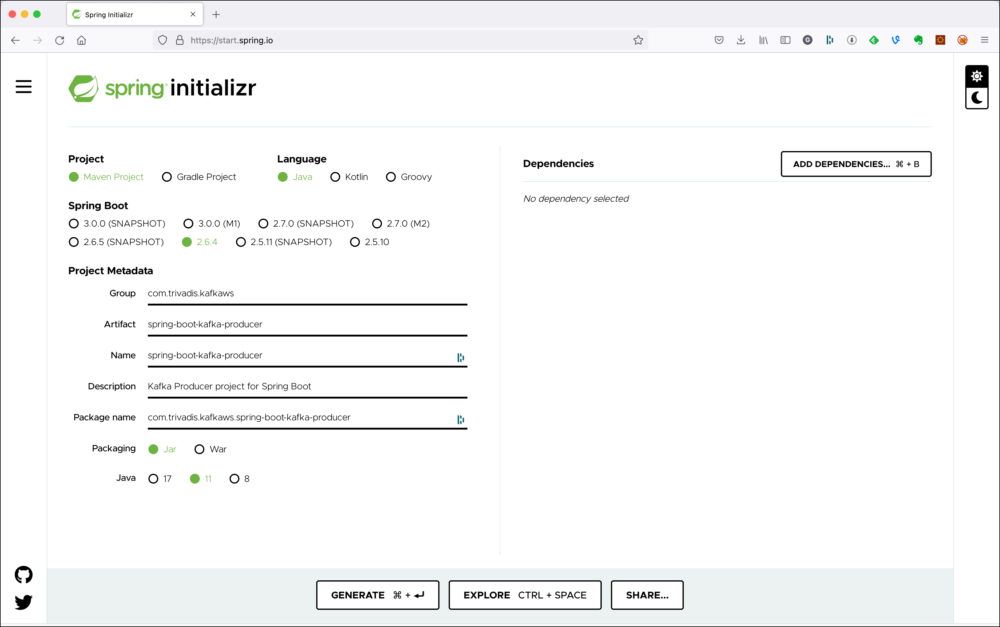
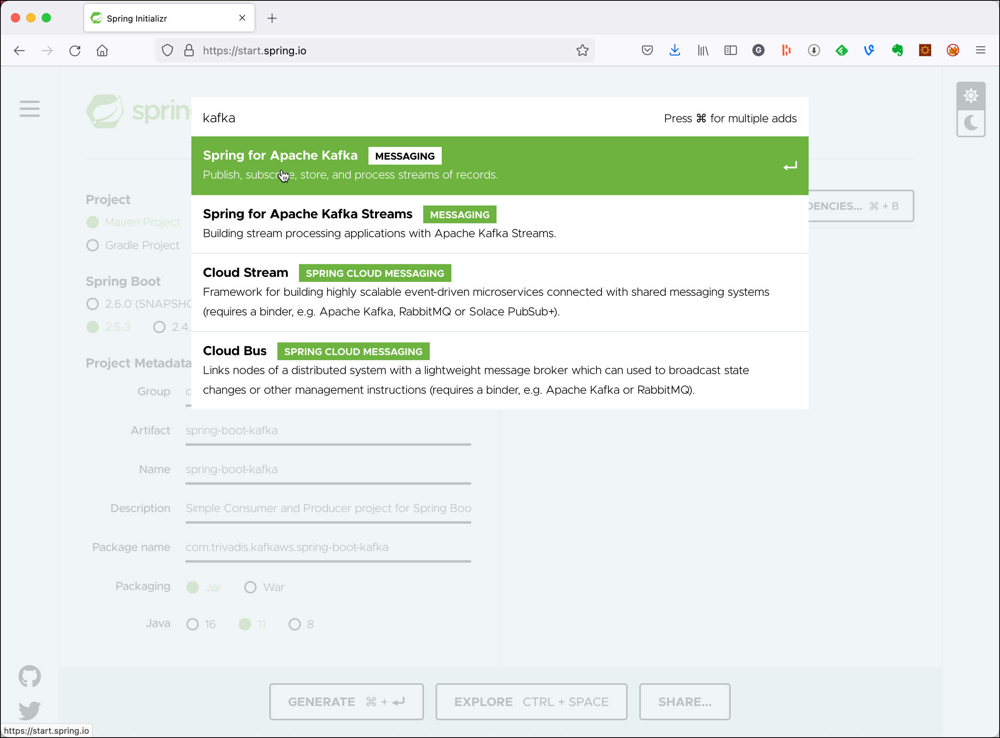
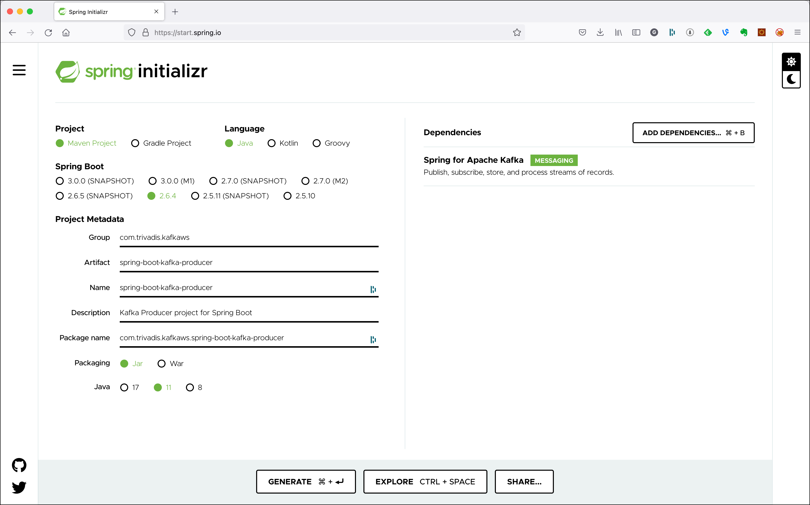

# Using Kafka Transactions from Spring Boot with Kafka Spring

In this workshop we will learn how to use Kafka's transaction with the **Spring Kafka** abstraction from within a Spring Boot application.

We will create two Spring Boot projects, one for the **Producer** and one for the **Consumer**, simulating two independent microservices interacting with each other via events.

## Create the Spring Boot Producer

First we create and test the Producer microservice.

### Creating the Spring Boot Project

First, let’s navigate to [Spring Initializr](https://start.spring.io/) to generate our project. Our project will need the Apache Kafka support. 

Select Generate a **Maven Project** with **Java** and Spring Boot **2.6.4**. Enter `com.trivadis.kafkaws` for the **Group**, `spring-boot-kafka-producer` for the **Artifact** field and `Kafka Producer project for Spring Boot` for the **Description** field. 



Click on **Add Dependencies** and search for the  **Spring for Apache Kafka** depencency. 



Select the dependency and hit the **Enter** key. You should now see the dependency on the right side of the screen.



Click on **Generate Project** and unzip the ZIP file to a convenient location for development. 

Once you have unzipped the project, you’ll have a very simple structure. 

Import the project as a Maven Project into your favourite IDE for further development. 

### Implement a Kafka Producer in Spring

Now create a simple Java class `KafkaEventProducer` within the `com.trivadis.kafkaws.springbootkafkaproducer ` package, which we will use to produce messages to Kafka.

```java
package com.trivadis.kafkaws.springbootkafkaproducer;

import org.apache.kafka.clients.producer.ProducerRecord;
import org.slf4j.Logger;
import org.slf4j.LoggerFactory;
import org.springframework.beans.factory.annotation.Autowired;
import org.springframework.beans.factory.annotation.Value;
import org.springframework.kafka.core.KafkaProducerException;
import org.springframework.kafka.core.KafkaSendCallback;
import org.springframework.kafka.core.KafkaTemplate;
import org.springframework.kafka.support.SendResult;
import org.springframework.stereotype.Component;
import org.springframework.transaction.annotation.Transactional;
import org.springframework.util.concurrent.ListenableFuture;

import java.util.concurrent.ExecutionException;
import java.util.concurrent.TimeUnit;
import java.util.concurrent.TimeoutException;

@Component
public class KafkaEventProducer {
    private static final Logger LOGGER = LoggerFactory.getLogger(KafkaEventProducer.class);

    @Autowired
    private KafkaTemplate<Long, String> kafkaTemplate;

    @Value("${topic.name}")
    String kafkaTopic;
    public void produce(Integer id, Long key, String value) {
        long time = System.currentTimeMillis();

        ListenableFuture<SendResult<Long,String>> future = kafkaTemplate.send(kafkaTopic, key, value);
        future.addCallback(new KafkaSendCallback<Long, String>() {
            @Override
            public void onSuccess(SendResult<Long, String> result) {
                long elapsedTime = System.currentTimeMillis() - time;
                System.out.printf("[" + id + "] sent record(key=%s value=%s) "
                                + "meta(partition=%d, offset=%d) time=%d\n",
                        key, value, result.getRecordMetadata().partition(),
                        result.getRecordMetadata().offset(), elapsedTime);
            }

            @Override
            public void onFailure(KafkaProducerException ex) {
                ProducerRecord<Long, String> failed = ex.getFailedProducerRecord();
            }
        } );

    }
}
```

It uses the `Component` annotation to have it registered as bean in the Spring context. The topic to produce to is specified as a property, which we will specify later in the `application.yml` file.

We produce the messages synchronously.

### Create the necessary Topics through code

Spring Kafka can automatically add topics to the broker, if they do not yet exists. By that you can replace the `kafka-topics` CLI commands seen so far to create the topics, if you like.

Spring Kafka provides a `TopicBuilder` which makes the creation of the topics very convenient. 

```java
package com.trivadis.kafkaws.springbootkafkaproducer;

import org.apache.kafka.clients.admin.NewTopic;
import org.springframework.beans.factory.annotation.Value;
import org.springframework.context.annotation.Bean;
import org.springframework.kafka.config.TopicBuilder;
import org.springframework.stereotype.Component;

@Component
public class TopicCreator {
    @Value(value = "${topic.name}")
    private String testTopic;

    @Value(value = "${topic.partitions}")
    private Integer testTopicPartitions;

    @Value(value = "${topic.replication-factor}")
    private short testTopicReplicationFactor;

    @Bean
    public NewTopic testTopic() {
        return TopicBuilder.name(testTopic)
                        .partitions(testTopicPartitions)
                        .replicas(testTopicReplicationFactor)
                        .build();
    }
}
```

We again refer to properties, which will be defined later in the `application.yml` config file. 

### Add Producer logic to the SpringBootKafkaProducerApplication class

We change the generated Spring Boot application to be a console appliation by implementing the `CommandLineRunner` interface. The `run` method holds the same code as the `main()` method in [Workshop 4: Working with Kafka from Java](../04-producing-consuming-kafka-with-java). The `runProducer` method is also similar, we just use the `kafkaEventProducer` instance injected by Spring to produce the messages to Kafka.

Additionally we specify the `@Transactional` annotation on the `run()` method to mark the whole procedure as one transaction. With the `forceErrorAfter` property injected from the `appplication.yml` we can control if and when an exception should be thrown inside the `runProducer()` method:

```java
package com.trivadis.kafkaws.springbootkafkaproducer;

import org.slf4j.Logger;
import org.slf4j.LoggerFactory;
import org.springframework.beans.factory.annotation.Autowired;
import org.springframework.boot.CommandLineRunner;
import org.springframework.boot.SpringApplication;
import org.springframework.boot.autoconfigure.SpringBootApplication;
import org.springframework.transaction.annotation.Transactional;

import java.time.LocalDateTime;

@SpringBootApplication
public class SpringBootKafkaProducerApplication implements CommandLineRunner {

	private static Logger LOG = LoggerFactory.getLogger(SpringBootKafkaProducerApplication.class);

	@Autowired
	private KafkaEventProducer kafkaEventProducer;

	@Value("${force.error.after}")
	private Integer forceErrorAfter;

	public static void main(String[] args) {
		SpringApplication.run(SpringBootKafkaProducerApplication.class, args);
	}

	@Override
	@Transactional
	public void run(String... args) throws Exception {
		LOG.info("EXECUTING : command line runner");

		if (args.length == 0) {
			runProducer(100, 10, 0);
		} else {
			runProducer(Integer.parseInt(args[0]), Integer.parseInt(args[1]), Long.parseLong(args[2]));
		}

	}

	private void runProducer(int sendMessageCount, int waitMsInBetween, long id) throws Exception {
		Long key = (id > 0) ? id : null;

		for (int index = 0; index < sendMessageCount; index++) {
			String value =  "[" + id + "] Hello Kafka " + index + " => " + LocalDateTime.now();

			if (forceErrorAfter != -1 && index > forceErrorAfter) {
				throw new RuntimeException();
			}

			kafkaEventProducer.produce(index, key, value);

			// Simulate slow processing
			Thread.sleep(waitMsInBetween);

		}
	}

}
```

### Configure Kafka through application.yml configuration file

First let's rename the existing `application.properties` file to `application.yml` to use the `yml` format. 

Add the following settings to configure the Kafka cluster and the name of the topic:

```yml
force.error.after: -1

topic:
  name: test-spring-tx-topic
  replication-factor: 3
  partitions: 12

spring:
  kafka:
    bootstrap-servers: ${DATAPLATFORM_IP}:9092
    producer:
      key-serializer: org.apache.kafka.common.serialization.LongSerializer
      value-serializer: org.apache.kafka.common.serialization.StringSerializer
      transaction-id-prefix: tx-

logging:
  pattern.console: "%clr(%d{HH:mm:ss.SSS}){blue} %clr(---){faint} %clr([%15.15t]){yellow} %clr(:){red} %clr(%m){faint}%n"
  level:
    org.springframework.transaction: trace
    org.springframework.kafka.transaction: debug
#    org.springframework.data: debug
```

A value of `-1` for the `force.error. after` property does not throw any error. Any value > `0` will throw and error after that many number of messages have been sent.

For the IP address of the Kafka cluster we refer to an environment variable, which we have to declare before running the application.

```bash
export DATAPLATFORM_IP=nnn.nnn.nnn.nnn
```

### Build the application

First lets build the application:

```bash
mvn package -Dmaven.test.skip=true
```

### Run the application

Now let's run the application

```bash
mvn spring-boot:run
```

Make sure that you see the messages through the console consumer.

To run the producer with custom parameters (for example to specify the key to use), use the `-Dspring-boot.run.arguments`:

```bash
mvn spring-boot:run -Dspring-boot.run.arguments="100 10 10"
```

### Use Console to test the application

In a terminal window start consuming from the output topic:

```bash
kafkacat -b $DATAPLATFORM_IP -t test-spring-topic
```

## Create the Spring Boot Consumer

Now let's create an test the Consumer microservice.

### Creating the Spring Boot Project

Use again the [Spring Initializr](https://start.spring.io/) to generate the project.

Select Generate a **Maven Project** with **Java** and Spring Boot **2.6.4**. Enter `com.trivadis.kafkaws` for the **Group**, `spring-boot-kafka-consumer` for the **Artifact** field and `Kafka Consumer project for Spring Boot` for the **Description** field. 

Click on **Add Dependencies** and search for the  **Spring for Apache Kafka** depencency. 

Select the dependency and hit the **Enter** key. You should now see the dependency on the right side of the screen.

Click on **Generate Project** and unzip the ZIP file to a convenient location for development. 

Once you have unzipped the project, you’ll have a very simple structure. 

Import the project as a Maven Project into your favourite IDE for further development. 

### Implement a Kafka Consumer with another Producer in Spring

Start by creating a simple Java class `KafkaEventConsumer` within the `com.trivadis.kafkaws.springbootkafkaconsumer` package, which we will use to consume messages from Kafka. 

We use a `@Transactional` method to mark the start of the Kafka transaction before entering the `receive()` method and consuming the messages from Kafka. The whole processing logic inside the `receive()`method will be executed inside a Kafka transaction, including the produce to the output topic. 

```java
package com.trivadis.kafkaws.springbootkafkaconsumer;

import org.apache.kafka.clients.consumer.ConsumerRecord;
import org.slf4j.Logger;
import org.slf4j.LoggerFactory;
import org.springframework.beans.factory.annotation.Autowired;
import org.springframework.beans.factory.annotation.Value;
import org.springframework.kafka.annotation.KafkaListener;
import org.springframework.kafka.core.KafkaTemplate;
import org.springframework.stereotype.Component;
import org.springframework.transaction.annotation.Transactional;

@Component
public class KafkaEventConsumer {
    private static final Logger LOGGER = LoggerFactory.getLogger(KafkaEventConsumer.class);

    @Autowired
    private KafkaTemplate<Long, String> kafkaTemplate;

    @Value("${topic.out.name}")
    private String outputTopic;

    @Value("${force.error.after}")
    private Integer forceErrorAfter;

    private Integer count = 0;

    @KafkaListener(id = "spring-boot-tx", topics = "${topic.in.name}", groupId = "simple-consumer-group", concurrency = "3")
    @Transactional
    public void receive(ConsumerRecord<Long, String> consumerRecord) throws NoSuchMethodException {
        String value = consumerRecord.value();
        Long key = consumerRecord.key();
        LOGGER.info("received key = '{}' with payload='{}'", key, value);

        kafkaTemplate.send(outputTopic, key, value);

        // force failure?
        if (forceErrorAfter != -1 && count > forceErrorAfter) {
            // throwing an NoSuchMethodException to force stopping the KafkaListener (so that no retries are done)
            throw new NoSuchMethodException();
        }

        count++;
    }
}
```

We can again provide the `force.error.after` property through the `application.yml` to control if and when an exception should be raised from within the processing logic. 
 
### Configure Kafka through application.yml configuration file

First let's rename the existing `application.properties` file to `application.yml` to use the `yml` format. 

Add the following settings to configure the Kafka cluster and the name of the two topics:

```yml
force.error.after: -1

topic:
  in.name: test-spring-tx-topic
  out.name: out-test-spring-tx-topic
  out.replication-factor: 3
  out.partitions: 12

spring:
  kafka:

    bootstrap-servers: ${DATAPLATFORM_IP}:9092
    consumer:
      key-deserializer: org.apache.kafka.common.serialization.LongDeserializer
      value-deserializer: org.apache.kafka.common.serialization.StringDeserializer
      properties:
        isolation.level: read_committed
#        isolation.level: read_uncommitted

    producer:
      key-serializer: org.apache.kafka.common.serialization.LongSerializer
      value-serializer: org.apache.kafka.common.serialization.StringSerializer
      transaction-id-prefix: tx-

logging:
  pattern.console: "%clr(%d{HH:mm:ss.SSS}){blue} %clr(---){faint} %clr([%15.15t]){yellow} %clr(:){red} %clr(%m){faint}%n"
  level:
    org.springframework.transaction: trace
    org.springframework.kafka.transaction: debug```

For the IP address of the Kafka cluster we refer to an environment variable, which we have to declare before running the application.

```bash
export DATAPLATFORM_IP=nnn.nnn.nnn.nnn
```

### Build the application

First lets build the application:

```bash
mvn package -Dmaven.test.skip=true
```

### Run the application

Now let's run the application

```bash
mvn spring-boot:run
```

