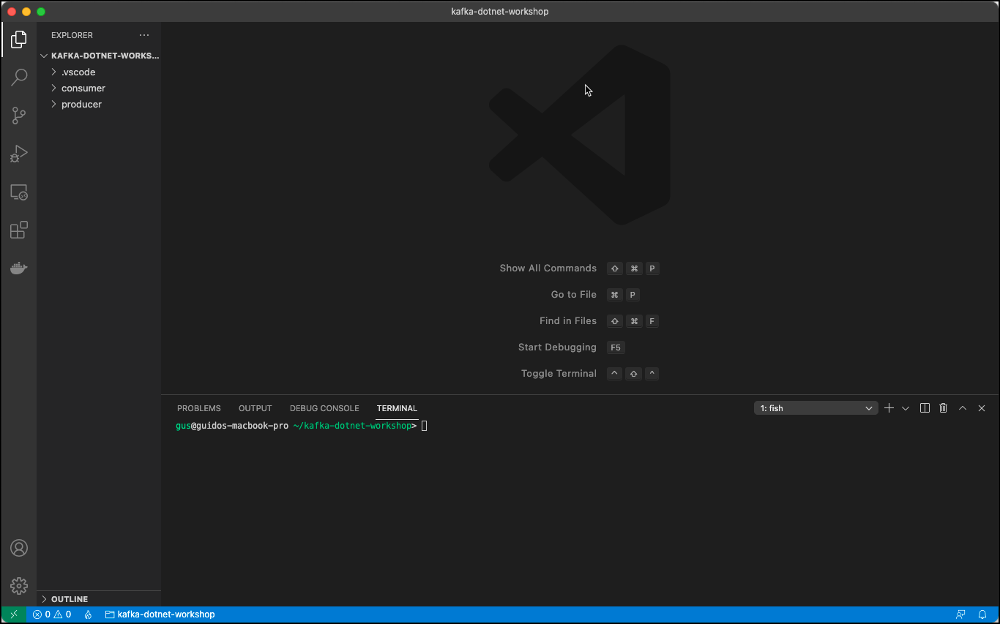

# Working with Kafka from .NET

In this workshop we will learn how to produce and consume messages using the [Kafka .NET API](https://docs.confluent.io/clients-confluent-kafka-dotnet/current/overview.html).

We will show how to build the .NET application using the Visual Code IDE, but any other IDE or just a simple Editor would be fine as well.

We assume that .NET Core is installed on your client as well as Visual Code with the C# extension (ms-dotnettools.csharp) enabled. We will use the .NET CLI (`dotnet`) for creating projects and running the code.

## Create the project structure

We will create two projects, one acting as the producer to Kafka and the other one as the consumer from Kafka.

First create the workspace folder, which will hold our projects and navigate into it.

```bash
mkdir kafka-dotnet-workshop
cd kafka-dotnet-workshop
```

Now let's create the producer project

```bash
dotnet new console -o producer
```

Now start Visual Code, on Linux if installed using the [following documentation](https://code.visualstudio.com/docs/setup/linux), then it can be started with `code`.

```bash
code
```

On the **Getting Started** page, click on **Open...** and select the `kafka-dotnet-workspace` folder created above. Confirm the **Required assets to build and debug are missing from ... Add them?** message pop-up with **Yes**. Open a Terminal in Visual Code over the menu **Terminal** | **New Terminal**.



We are now ready to add code to the classes which have been created with the `dotnet new` command.

But before we do that, let's create the topic we will use to produce to and to consume from.

### Creating the necessary Kafka Topic

We will use the topic `test-dotnet-topic` in the Producer and Consumer code below. Because `auto.topic.create.enable` is set to `false`, we have to manually create the topic.

Connect to the `kafka-1` container

```
docker exec -ti kafka-1 bash
```

and execute the necessary kafka-topics command.

```
kafka-topics --create \
    --replication-factor 3 \
    --partitions 8 \
    --topic test-dotnet-topic \
    --bootstrap-server kafka-1:19092,kafka-2:19093
```

Cross check that the topic has been created.

```
kafka-topics --list --bootstrap-server kafka-1:19092
```

This finishes the setup steps and our new project is ready to be used. Next we will start implementing a **Kafka Producer**.

## Create a Kafka Producer

To communicate with Kafka, we need to use the [**confluent-kafka-dotnet**](https://docs.confluent.io/clients-confluent-kafka-dotnet/current/overview.html) .NET library].

The reference the library from the .NET Core project, execute the following command from within the `kafka-dotnet-workspace` folder.

```
dotnet add producer package Confluent.Kafka
```

The following reference will be added to project metadata

```
<Project Sdk="Microsoft.NET.Sdk">

  ...

  <ItemGroup>
    <PackageReference Include="Confluent.Kafka" Version="1.8.2" />
  </ItemGroup>

</Project>
```

Now let's add the code for producing messages to the Kafka topic. Navigate to the `Program.cs` C# class in the `producer` project and rename it to `KafkaProducer.cs` and then open it in the editor.

Add the following directives on the top with the class and the following two constants for the Broker List and the Topic name:

```csharp
using System;
using Confluent.Kafka;

class KafkaProducer
{
    const string brokerList = "dataplatform:9092,dataplatform:9093";
    const string topicName = "test-dotnet-topic";
}
```

Add the following main method to the class:

```csharp
    static void Main(string[] args)
    {
        long startTime = DateTimeOffset.Now.ToUnixTimeMilliseconds();
        if (args.Length == 0)
        {
            runProducerSync(100, 10, 0);
        }
        else
        {
            runProducerSync(int.Parse(args[0]), int.Parse(args[1]), int.Parse(args[2]));
        }
        long endTime = DateTimeOffset.Now.ToUnixTimeMilliseconds();

        Console.WriteLine("Producing all records took : " + (endTime - startTime) + " ms = (" + (endTime - startTime) / 1000 + " sec)" );
    }

    // place the runProducerXXXX methods below
```

The `Main()` method accepts 3 parameters, the number of messages to produce, the time in ms to wait in-between sending each message and the ID of the producer.

Add the following additional method for implementing the Kafka producer. To write messages to Kafka, we can either use the `ProduceAsync` or `Produce` method.

### Produce Synchronously with a `Null` key

We will first use the `ProducerAsync` method in a synchronous way using the `await` operator. We are producing just a value and leave the key empty (`Null`).

```csharp
    static void runProducerSync(int totalMessages, int waitMsInBetween, int id)
    {
        var config = new ProducerConfig { BootstrapServers = brokerList };

        Func<Task> mthd = async () =>
        {

            // Create the Kafka Producer
            using (var producer = new ProducerBuilder<Null, string>(config).Build())
            {
                for (int index = 0; index < totalMessages; index++)
                {
                    long time = DateTimeOffset.Now.ToUnixTimeMilliseconds();

                    // Construct the message value
                    string value = "[" + index + ":" + id + "] Hello Kafka " + DateTimeOffset.Now;

                    // send the message to Kafka
                    var deliveryReport = await producer.ProduceAsync(topicName, new Message<Null, string> { Value = value });
                    Console.WriteLine($"[{id}] sent record (key={deliveryReport.Key} value={deliveryReport.Value}) meta (partition={deliveryReport.TopicPartition.Partition}, offset={deliveryReport.TopicPartitionOffset.Offset}, time={deliveryReport.Timestamp.UnixTimestampMs})");

                    Thread.Sleep(waitMsInBetween);
                }
            }
        };

        mthd().Wait();
    }
```        

Before starting the producer, in an additional terminal, let's use `kcat` or `kafka-console-consumer` to consume the messages from the topic `test-dotnet-topic`.

```bash
kcat -b kafka-1 -t test-dotnet-topic -f 'Part-%p => %k:%s\n' -q
```

Now run it using the `dotnet run` command. It will generate 1000 messages, waiting 10ms in-between sending each message and use 0 for the `id`.

```bash
dotnet run -p ./producer/producer.csproj 1000 10 0
```

The log will show each messages metadata after it has been sent and at the end you can see that it took **20 seconds** to send the 1000 records

```bash
[0] sent record (key= value=[0:0] Hello Kafka 04/03/2022 12:33:21 +02:00) meta (partition=[2], offset=652, time=1648982001348)
[0] sent record (key= value=[1:0] Hello Kafka 04/03/2022 12:33:22 +02:00) meta (partition=[5], offset=649, time=1648982002348)
[0] sent record (key= value=[2:0] Hello Kafka 04/03/2022 12:33:22 +02:00) meta (partition=[5], offset=650, time=1648982002357)
[0] sent record (key= value=[3:0] Hello Kafka 04/03/2022 12:33:22 +02:00) meta (partition=[2], offset=653, time=1648982002368)
[0] sent record (key= value=[4:0] Hello Kafka 04/03/2022 12:33:22 +02:00) meta (partition=[2], offset=654, time=1648982002377)
[0] sent record (key= value=[5:0] Hello Kafka 04/03/2022 12:33:22 +02:00) meta (partition=[4], offset=1566, time=1648982002386)
[0] sent record (key= value=[6:0] Hello Kafka 04/03/2022 12:33:22 +02:00) meta (partition=[4], offset=1567, time=1648982002396)
[0] sent record (key= value=[7:0] Hello Kafka 04/03/2022 12:33:22 +02:00) meta (partition=[7], offset=2244, time=1648982002405)
[0] sent record (key= value=[8:0] Hello Kafka 04/03/2022 12:33:22 +02:00) meta (partition=[7], offset=2245, time=1648982002415)
[0] sent record (key= value=[9:0] Hello Kafka 04/03/2022 12:33:22 +02:00) meta (partition=[1], offset=974, time=1648982002425)
[0] sent record (key= value=[10:0] Hello Kafka 04/03/2022 12:33:22 +02:00) meta (partition=[4], offset=1568, time=1648982002436)
[0] sent record (key= value=[11:0] Hello Kafka 04/03/2022 12:33:22 +02:00) meta (partition=[3], offset=1619, time=1648982002447)
[0] sent record (key= value=[12:0] Hello Kafka 04/03/2022 12:33:22 +02:00) meta (partition=[0], offset=1479, time=1648982002457)
[0] sent record (key= value=[13:0] Hello Kafka 04/03/2022 12:33:22 +02:00) meta (partition=[7], offset=2246, time=1648982002469)
...
Producing all records took : 20589 ms = (20 sec)
```

On the console consumer window, we can see in the output that the data is distributed over all 8 partitions using the round robin partition strategy. This is caused by the key being `Null`.

```bash
Part-6 => :[0:0] Hello Kafka 04/03/2022 13:07:53 +02:00
Part-2 => :[1:0] Hello Kafka 04/03/2022 13:07:54 +02:00
Part-4 => :[2:0] Hello Kafka 04/03/2022 13:07:54 +02:00
Part-7 => :[3:0] Hello Kafka 04/03/2022 13:07:54 +02:00
Part-6 => :[4:0] Hello Kafka 04/03/2022 13:07:54 +02:00
Part-1 => :[5:0] Hello Kafka 04/03/2022 13:07:54 +02:00
Part-2 => :[6:0] Hello Kafka 04/03/2022 13:07:54 +02:00
Part-6 => :[7:0] Hello Kafka 04/03/2022 13:07:54 +02:00
Part-1 => :[8:0] Hello Kafka 04/03/2022 13:07:54 +02:00
Part-2 => :[9:0] Hello Kafka 04/03/2022 13:07:54 +02:00
Part-6 => :[10:0] Hello Kafka 04/03/2022 13:07:54 +02:00
Part-2 => :[11:0] Hello Kafka 04/03/2022 13:07:54 +02:00
Part-3 => :[12:0] Hello Kafka 04/03/2022 13:07:54 +02:00
Part-7 => :[13:0] Hello Kafka 04/03/2022 13:07:54 +02:00
Part-3 => :[14:0] Hello Kafka 04/03/2022 13:07:54 +02:00
Part-5 => :[15:0] Hello Kafka 04/03/2022 13:07:54 +02:00
Part-5 => :[16:0] Hello Kafka 04/03/2022 13:07:54 +02:00
...
```

### Produce Synchronously using the `id` field as the key

Instead of producing a `Null` key as before, let's use the `id` argument as the key. You can either change the current method or copy/paste it to a new one as we do here:

```csharp
    static void runProducerSyncWithKey(int totalMessages, int waitMsInBetween, int id)
    {
        var config = new ProducerConfig { BootstrapServers = brokerList };

        Func<Task> mthd = async () =>
        {

            // Create the Kafka Producer
            using (var producer = new ProducerBuilder<int, string>(config).Build())
            {
                for (int index = 0; index < totalMessages; index++)
                {
                    long time = DateTimeOffset.Now.ToUnixTimeMilliseconds();

                    // Construct the message value
                    string value = "[" + index + ":" + id + "] Hello Kafka " + DateTimeOffset.Now;

                    // send the message to Kafka
                    var deliveryReport = await producer.ProduceAsync(topicName, new Message<int, string> { Key = id, Value = value });
                    Console.WriteLine($"[{id}] sent record (key={deliveryReport.Key} value={deliveryReport.Value}) meta (partition={deliveryReport.TopicPartition.Partition}, offset={deliveryReport.TopicPartitionOffset.Offset}, time={deliveryReport.Timestamp.UnixTimestampMs})");

                    Thread.Sleep(waitMsInBetween);
                }
            }
        };

        mthd().Wait();
    }
```

Change the `Main()` method to run the new method

```csharp
        static void Main(string[] args)
        {
            if (args.Length == 0) {
                runProducerSyncWithKey(100, 10, 0);
            } else {
                runProducerSyncWithKey(int.Parse(args[0]), int.Parse(args[1]), int.Parse(args[2]));
            }
        }
        ...
```

Again use `kcat` or `kafka-console-consumer` to consume the messages from the topic `test-dotnet-topic` before starting the producer.

```bash
kcat -b kafka-1 -t test-dotnet-topic -f 'Part-%p => %k:%s\n' -q
```

Now run the producer and check the output in kafka console consumer

```bash
dotnet run --project ./producer/producer.csproj 1000 10 0
```

you can see from the log that all the message have been sent to the same partitions

```bash
[0] sent record (key=0 value=[0:0] Hello Kafka 04/03/2022 12:36:15 +02:00) meta (partition=[4], offset=1587, time=1648982175963)
[0] sent record (key=0 value=[1:0] Hello Kafka 04/03/2022 12:36:16 +02:00) meta (partition=[4], offset=1588, time=1648982176961)
[0] sent record (key=0 value=[2:0] Hello Kafka 04/03/2022 12:36:16 +02:00) meta (partition=[4], offset=1589, time=1648982176971)
[0] sent record (key=0 value=[3:0] Hello Kafka 04/03/2022 12:36:16 +02:00) meta (partition=[4], offset=1590, time=1648982176981)
[0] sent record (key=0 value=[4:0] Hello Kafka 04/03/2022 12:36:16 +02:00) meta (partition=[4], offset=1591, time=1648982176991)
[0] sent record (key=0 value=[5:0] Hello Kafka 04/03/2022 12:36:17 +02:00) meta (partition=[4], offset=1592, time=1648982177001)
[0] sent record (key=0 value=[6:0] Hello Kafka 04/03/2022 12:36:17 +02:00) meta (partition=[4], offset=1593, time=1648982177012)
[0] sent record (key=0 value=[7:0] Hello Kafka 04/03/2022 12:36:17 +02:00) meta (partition=[4], offset=1594, time=1648982177023)
[0] sent record (key=0 value=[8:0] Hello Kafka 04/03/2022 12:36:17 +02:00) meta (partition=[4], offset=1595, time=1648982177033)
[0] sent record (key=0 value=[9:0] Hello Kafka 04/03/2022 12:36:17 +02:00) meta (partition=[4], offset=1596, time=1648982177043)
[0] sent record (key=0 value=[10:0] Hello Kafka 04/03/2022 12:36:17 +02:00) meta (partition=[4], offset=1597, time=1648982177052)
...
Producing all records took : 20643 ms = (20 sec)
```

On the console consumer, we can see in the output that the data is distributed over all 8 partitions using the round robin partition strategy. This is caused by the key being `Null`.

```bash
Part-4 => :[0:0] Hello Kafka 04/03/2022 12:36:15 +02:00
Part-4 => :[1:0] Hello Kafka 04/03/2022 12:36:16 +02:00
Part-4 => :[2:0] Hello Kafka 04/03/2022 12:36:16 +02:00
Part-4 => :[3:0] Hello Kafka 04/03/2022 12:36:16 +02:00
Part-4 => :[4:0] Hello Kafka 04/03/2022 12:36:16 +02:00
Part-4 => :[5:0] Hello Kafka 04/03/2022 12:36:17 +02:00
Part-4 => :[6:0] Hello Kafka 04/03/2022 12:36:17 +02:00
Part-4 => :[7:0] Hello Kafka 04/03/2022 12:36:17 +02:00
Part-4 => :[8:0] Hello Kafka 04/03/2022 12:36:17 +02:00
Part-4 => :[9:0] Hello Kafka 04/03/2022 12:36:17 +02:00
Part-4 => :[10:0] Hello Kafka 04/03/2022 12:36:17 +02:00
Part-4 => :[11:0] Hello Kafka 04/03/2022 12:36:17 +02:00
Part-4 => :[12:0] Hello Kafka 04/03/2022 12:36:17 +02:00
Part-4 => :[13:0] Hello Kafka 04/03/2022 12:36:17 +02:00
Part-4 => :[14:0] Hello Kafka 04/03/2022 12:36:17 +02:00
Part-4 => :[15:0] Hello Kafka 04/03/2022 12:36:17 +02:00
Part-4 => :[16:0] Hello Kafka 04/03/2022 12:36:17 +02:00
Part-4 => :[17:0] Hello Kafka 04/03/2022 12:36:17 +02:00
Part-4 => :[18:0] Hello Kafka 04/03/2022 12:36:17 +02:00
Part-4 => :[19:0] Hello Kafka 04/03/2022 12:36:17 +02:00
Part-4 => :[20:0] Hello Kafka 04/03/2022 12:36:17 +02:00
Part-4 => :[21:0] Hello Kafka 04/03/2022 12:36:17 +02:00
Part-4 => :[22:0] Hello Kafka 04/03/2022 12:36:17 +02:00
Part-4 => :[23:0] Hello Kafka 04/03/2022 12:36:17 +02:00
Part-4 => :[24:0] Hello Kafka 04/03/2022 12:36:17 +02:00
Part-4 => :[25:0] Hello Kafka 04/03/2022 12:36:17 +02:00
Part-4 => :[26:0] Hello Kafka 04/03/2022 12:36:17 +02:00
Part-4 => :[27:0] Hello Kafka 04/03/2022 12:36:17 +02:00
Part-4 => :[28:0] Hello Kafka 04/03/2022 12:36:17 +02:00
...
```

### Produce Asynchronously

To produce asynchronously, we can either use the `ProduceAsync` or the `Produce` method. We first show the `ProduceAsync` method and basically adapt the version used for the synchronous produce.

To asynchronously handle delivery result notifications, we can use `Task.ContinueWith` as shown by the `runProducerASync` method:

```csharp
    static void runProducerASync(int totalMessages, int waitMsInBetween, int id)
    {
        var config = new ProducerConfig { BootstrapServers = brokerList };

        // Create the Kafka Producer
        using (var producer = new ProducerBuilder<Null, string>(config).Build())
        {
            for (int index = 0; index < totalMessages; index++)
            {
                long time = DateTimeOffset.Now.ToUnixTimeMilliseconds();

                // Construct the message value
                string value = "[" + index + ":" + id + "] Hello Kafka " + DateTimeOffset.Now;

                // send the message to Kafka
                var deliveryReport = producer.ProduceAsync(topicName, new Message<Null, string> { Value = value });

                deliveryReport.ContinueWith(task =>
                {
                    if (task.IsFaulted)
                    {
                    }
                    else
                    {
                        Console.WriteLine($"[{id}] sent record (key={task.Result.Key} value={task.Result.Value}) meta (partition={task.Result.TopicPartition.Partition}, offset={task.Result.TopicPartitionOffset.Offset}, time={task.Result.Timestamp.UnixTimestampMs})");
                    }

                });
                Thread.Sleep(waitMsInBetween);
            }
            producer.Flush(TimeSpan.FromSeconds(10));
        }
    }
```

Change the `Main()` method to use the new method

```csharp
        static void Main(string[] args)
        {
            if (args.Length == 0) {
                runProducerASync(100, 10, 0);
            } else {
                runProducerASync(int.Parse(args[0]), int.Parse(args[1]), int.Parse(args[2]));
            }
        }
        ...
```

Once again use `kcat` or `kafka-console-consumer` to consume the messages from the topic `test-dotnet-topic` before starting the producer.

```bash
kcat -b kafka-1 -t test-dotnet-topic -f 'Part-%p => %k:%s\n' -q
```

Now run the producer and check the output in kafka console consumer.

```bash
dotnet run --project ./producer/producer.csproj 1000 10 0
```

We can see that asynchronously the processing went down to **12 seconds** compared to the **20 seconds** it took for the synchronous way. The speed up is only because we no longer wait for the metadata before sending the next message.

```bash
[0] sent record (key= value=[16:0] Hello Kafka 04/03/2022 13:12:10 +02:00) meta (partition=[7], offset=3776, time=1648984330895)
[0] sent record (key= value=[67:0] Hello Kafka 04/03/2022 13:12:11 +02:00) meta (partition=[7], offset=3783, time=1648984331533)
[0] sent record (key= value=[51:0] Hello Kafka 04/03/2022 13:12:11 +02:00) meta (partition=[7], offset=3780, time=1648984331340)
[0] sent record (key= value=[14:0] Hello Kafka 04/03/2022 13:12:10 +02:00) meta (partition=[5], offset=1995, time=1648984330870)
[0] sent record (key= value=[28:0] Hello Kafka 04/03/2022 13:12:11 +02:00) meta (partition=[5], offset=1997, time=1648984331036)
[0] sent record (key= value=[26:0] Hello Kafka 04/03/2022 13:12:11 +02:00) meta (partition=[5], offset=1996, time=1648984331015)
[0] sent record (key= value=[34:0] Hello Kafka 04/03/2022 13:12:11 +02:00) meta (partition=[5], offset=1998, time=1648984331116)
[0] sent record (key= value=[18:0] Hello Kafka 04/03/2022 13:12:10 +02:00) meta (partition=[7], offset=3777, time=1648984330921)
[0] sent record (key= value=[35:0] Hello Kafka 04/03/2022 13:12:11 +02:00) meta (partition=[7], offset=3779, time=1648984331128)
[0] sent record (key= value=[60:0] Hello Kafka 04/03/2022 13:12:11 +02:00) meta (partition=[5], offset=2001, time=1648984331452)
[0] sent record (key= value=[13:0] Hello Kafka 04/03/2022 13:12:10 +02:00) meta (partition=[6], offset=2977, time=1648984330857)
[0] sent record (key= value=[79:0] Hello Kafka 04/03/2022 13:12:11 +02:00) meta (partition=[5], offset=2002, time=1648984331682)
[0] sent record (key= value=[70:0] Hello Kafka 04/03/2022 13:12:11 +02:00) meta (partition=[7], offset=3784, time=1648984331574)
[0] sent record (key= value=[21:0] Hello Kafka 04/03/2022 13:12:10 +02:00) meta (partition=[6], offset=2979, time=1648984330959)
[0] sent record (key= value=[25:0] Hello Kafka 04/03/2022 13:12:11 +02:00) meta (partition=[6], offset=2980, time=1648984331004)
[0] sent record (key= value=[36:0] Hello Kafka 04/03/2022 13:12:11 +02:00) meta (partition=[6], offset=2982, time=1648984331139)
[0] sent record (key= value=[30:0] Hello Kafka 04/03/2022 13:12:11 +02:00) meta (partition=[6], offset=2981, time=1648984331062)
[0] sent record (key= value=[39:0] Hello Kafka 04/03/2022 13:12:11 +02:00) meta (partition=[6], offset=2983, time=1648984331178)
[0] sent record (key= value=[42:0] Hello Kafka 04/03/2022 13:12:11 +02:00) meta (partition=[6], offset=2984, time=1648984331220)
[0] sent record (key= value=[11:0] Hello Kafka 04/03/2022 13:12:10 +02:00) meta (partition=[7], offset=3775, time=1648984330832)
[0] sent record (key= value=[47:0] Hello Kafka 04/03/2022 13:12:11 +02:00) meta (partition=[6], offset=2985, time=1648984331284)
...
Producing all records took : 12978 ms = (12 sec)
```

**Note:** We will later see (after seeing how to consume) how we can increase the producer rate by enabling batching on the producer side.

As we said before, there is a second was to produce asynchronously using the `Produce` method, which takes a delivery handler delegate as a parameter. Let's add it as another method called `runProducerAsync2`

```csharp
static void runProducerASync2(int totalMessages, int waitMsInBetween, int id)
{
    var config = new ProducerConfig { BootstrapServers = brokerList };

    // Create the Kafka Producer
    using (var producer = new ProducerBuilder<Null, string>(config).Build())
    {
        for (int index = 0; index < totalMessages; index++)
        {
            long time = DateTimeOffset.Now.ToUnixTimeMilliseconds();

            // Construct the message value
            string value = "[" + index + ":" + id + "] Hello Kafka " + DateTimeOffset.Now;

            try
            {
                // send the message to Kafka
                producer.Produce(topicName, new Message<Null, string> { Value = value },
                    (deliveryReport) =>
                    {
                        if (deliveryReport.Error.Code != ErrorCode.NoError)
                        {
                            Console.WriteLine($"Failed to deliver message: {deliveryReport.Error.Reason}");
                        }
                        else
                        {
                            Console.WriteLine($"[{id}] sent record (key={deliveryReport.Key} value={deliveryReport.Value}) meta (partition={deliveryReport.TopicPartition.Partition}, offset={deliveryReport.TopicPartitionOffset.Offset}, time={deliveryReport.Timestamp.UnixTimestampMs})");
                        }
                    });

            }
            catch (ProduceException<Null, string> e)
            {
                Console.WriteLine($"failed to deliver message: {e.Message} [{e.Error.Code}]");
            }

            Thread.Sleep(waitMsInBetween);
        }
        producer.Flush(TimeSpan.FromSeconds(10));

    }
}
```
Change the `Main()` method to use the new method `runProducerAsync2`

```csharp
        static void Main(string[] args)
        {
            if (args.Length == 0) {
                runProducerASync2(100, 10, 0);
            } else {
                runProducerASync2(int.Parse(args[0]), int.Parse(args[1]), int.Parse(args[2]));
            }
        }
        ...
```

Once again use `kcat` or `kafka-console-consumer` to consume the messages from the topic `test-dotnet-topic` before starting the producer.

```bash
kcat -b kafka-1 -t test-dotnet-topic -f 'Part-%p => %k:%s\n' -q
```

Now run the producer and check the output in kafka console consumer.

```bash
dotnet run --project ./producer/producer.csproj 1000 10 0
```

We can see that asynchronously the processing took the same **12 seconds** as with the `AsyncProduce` method.

```bash
[0] sent record (key= value=[16:0] Hello Kafka 04/03/2022 13:12:10 +02:00) meta (partition=[7], offset=3776, time=1648984330895)
[0] sent record (key= value=[67:0] Hello Kafka 04/03/2022 13:12:11 +02:00) meta (partition=[7], offset=3783, time=1648984331533)
[0] sent record (key= value=[51:0] Hello Kafka 04/03/2022 13:12:11 +02:00) meta (partition=[7], offset=3780, time=1648984331340)
[0] sent record (key= value=[14:0] Hello Kafka 04/03/2022 13:12:10 +02:00) meta (partition=[5], offset=1995, time=1648984330870)
[0] sent record (key= value=[28:0] Hello Kafka 04/03/2022 13:12:11 +02:00) meta (partition=[5], offset=1997, time=1648984331036)
[0] sent record (key= value=[26:0] Hello Kafka 04/03/2022 13:12:11 +02:00) meta (partition=[5], offset=1996, time=1648984331015)
[0] sent record (key= value=[34:0] Hello Kafka 04/03/2022 13:12:11 +02:00) meta (partition=[5], offset=1998, time=1648984331116)
[0] sent record (key= value=[18:0] Hello Kafka 04/03/2022 13:12:10 +02:00) meta (partition=[7], offset=3777, time=1648984330921)
[0] sent record (key= value=[35:0] Hello Kafka 04/03/2022 13:12:11 +02:00) meta (partition=[7], offset=3779, time=1648984331128)
[0] sent record (key= value=[60:0] Hello Kafka 04/03/2022 13:12:11 +02:00) meta (partition=[5], offset=2001, time=1648984331452)
[0] sent record (key= value=[13:0] Hello Kafka 04/03/2022 13:12:10 +02:00) meta (partition=[6], offset=2977, time=1648984330857)
[0] sent record (key= value=[79:0] Hello Kafka 04/03/2022 13:12:11 +02:00) meta (partition=[5], offset=2002, time=1648984331682)
[0] sent record (key= value=[70:0] Hello Kafka 04/03/2022 13:12:11 +02:00) meta (partition=[7], offset=3784, time=1648984331574)
[0] sent record (key= value=[21:0] Hello Kafka 04/03/2022 13:12:10 +02:00) meta (partition=[6], offset=2979, time=1648984330959)
[0] sent record (key= value=[25:0] Hello Kafka 04/03/2022 13:12:11 +02:00) meta (partition=[6], offset=2980, time=1648984331004)
[0] sent record (key= value=[36:0] Hello Kafka 04/03/2022 13:12:11 +02:00) meta (partition=[6], offset=2982, time=1648984331139)
[0] sent record (key= value=[30:0] Hello Kafka 04/03/2022 13:12:11 +02:00) meta (partition=[6], offset=2981, time=1648984331062)
[0] sent record (key= value=[39:0] Hello Kafka 04/03/2022 13:12:11 +02:00) meta (partition=[6], offset=2983, time=1648984331178)
[0] sent record (key= value=[42:0] Hello Kafka 04/03/2022 13:12:11 +02:00) meta (partition=[6], offset=2984, time=1648984331220)
[0] sent record (key= value=[11:0] Hello Kafka 04/03/2022 13:12:10 +02:00) meta (partition=[7], offset=3775, time=1648984330832)
[0] sent record (key= value=[47:0] Hello Kafka 04/03/2022 13:12:11 +02:00) meta (partition=[6], offset=2985, time=1648984331284)
...
Producing all records took : 12959 ms = (12 sec)
```

As noted before, we will later see how we can increase the throughput by adding batching. But first let's see how to write a consumer in C#.

## Create a Kafka Consumer

Now let's create the consumer, which consumes the messages from the Kafka topic.

First let's create a new project

```bash
dotnet new console -o consumer
```

Again add a reference to library from the .NET Core project, by executing the following command from within the `kafka-dotnet-workspace` folder.  

```bash
dotnet add consumer package Confluent.Kafka
```

Now let's add the code for consuming the messages from the Kafka topic. Navigate to the `Program.cs` C# class in the consumer project and rename it to `KafkaConsumer.cs` and then open it in the editor.

Add the following directives on the top with the class and the following two constants for the Broker List, the Topic name and the consumer group to use

```csharp
using System.Threading;
using Confluent.Kafka;

class KafkaConsumer
{
    const string brokerList = "dataplatform:9092,dataplatform:9093";
    const string topicName = "test-dotnet-topic";
    const string groupId = "KafkaConsumerAuto";
}
```

Add the following main method to the class:

```csharp
static void Main(string[] args)
{
    if (args.Length == 0)
    {
        runConsumerAuto(10);
    }
    else
    {
        runConsumerAuto(int.Parse(args[0]));
    }
}
```

Add the following additional method for implementing the Kafka consumer. First we implement a consumer with using Auto Commit mode.

```csharp
static void runConsumerAuto(int waitMsInBetween)
{
    var config = new ConsumerConfig
    {
        BootstrapServers = brokerList,
        GroupId = groupId,
        AutoOffsetReset = AutoOffsetReset.Earliest,
        EnableAutoCommit = true,
        AutoCommitIntervalMs = 2000
    };

    bool cancelled = false;

    using (var consumer = new ConsumerBuilder<Ignore, string>(config).Build())
    {
        consumer.Subscribe(topicName);
        var cancelToken = new CancellationTokenSource();

        while (!cancelled)
        {
            var consumeResult = consumer.Consume(cancelToken.Token);
            // handle message
            Console.WriteLine($"Consumer Record:(Key: {consumeResult.Message.Key}, Value: {consumeResult.Message.Value} Partition: {consumeResult.TopicPartition.Partition} Offset: {consumeResult.TopicPartitionOffset.Offset}");
            Thread.Sleep(waitMsInBetween);
        }
        consumer.Close();
    }
}
```

Now run it using the `dotnet run` command. It will print the consumed messages to the console.

```
dotnet run -p ./consumer/consumer.csproj
```

Rerun one of the producers, if you need additional messages.

You can check the commits by consuming from the internal `__consumer_offsets` topic. For that we have to specify a special formatter for deserialising the commit messages.

```
docker exec -ti kafka-1 kafka-console-consumer  --formatter "kafka.coordinator.group.GroupMetadataManager\$OffsetsMessageFormatter" --bootstrap-server kafka-1:19092 --topic __consumer_offsets
```

In the output of the consumer you can see that a commit message is issued every **5 seconds**, due to the `AutoCommitIntervalMs = 5000` setting.

```bash
[KafkaConsumerAuto,test-dotnet-topic,1]::OffsetAndMetadata(offset=9253, leaderEpoch=Optional.empty, metadata=, commitTimestamp=1648988661678, expireTimestamp=None)
[KafkaConsumerAuto,test-dotnet-topic,2]::OffsetAndMetadata(offset=6160, leaderEpoch=Optional.empty, metadata=, commitTimestamp=1648988661678, expireTimestamp=None)
[KafkaConsumerAuto,test-dotnet-topic,3]::OffsetAndMetadata(offset=3731, leaderEpoch=Optional.empty, metadata=, commitTimestamp=1648988661678, expireTimestamp=None)
[KafkaConsumerAuto,test-dotnet-topic,7]::OffsetAndMetadata(offset=4185, leaderEpoch=Optional.empty, metadata=, commitTimestamp=1648988666697, expireTimestamp=None)
[KafkaConsumerAuto,test-dotnet-topic,0]::OffsetAndMetadata(offset=4834, leaderEpoch=Optional.empty, metadata=, commitTimestamp=1648988666697, expireTimestamp=None)
[KafkaConsumerAuto,test-dotnet-topic,4]::OffsetAndMetadata(offset=5563, leaderEpoch=Optional.empty, metadata=, commitTimestamp=1648988666697, expireTimestamp=None)
[KafkaConsumerAuto,test-dotnet-topic,3]::OffsetAndMetadata(offset=3748, leaderEpoch=Optional.empty, metadata=, commitTimestamp=1648988666697, expireTimestamp=None)
[KafkaConsumerAuto,test-dotnet-topic,5]::OffsetAndMetadata(offset=2479, leaderEpoch=Optional.empty, metadata=, commitTimestamp=1648988666697, expireTimestamp=None)
[KafkaConsumerAuto,test-dotnet-topic,6]::OffsetAndMetadata(offset=3455, leaderEpoch=Optional.empty, metadata=, commitTimestamp=1648988671713, expireTimestamp=None)
[KafkaConsumerAuto,test-dotnet-topic,7]::OffsetAndMetadata(offset=4279, leaderEpoch=Optional.empty, metadata=, commitTimestamp=1648988671713, expireTimestamp=None)
```

Now let's switch from auto commit mode to manual commit.

### Kafka Consumer with Manual Commit

Create a new method `runConsumerManual` which uses the manual method to commit offsets.

We use a hardcoded value (`50`) for the commit block size, so that a commit will happen every 50 messages.

```csharp
static void runConsumerManual(int waitMsInBetween)
{
    var config = new ConsumerConfig
    {
        BootstrapServers = brokerList,
        GroupId = groupId,
        EnableAutoCommit = false
    };

    bool cancelled = false;
    int noRecordsCount = 0;

    using (var consumer = new ConsumerBuilder<Ignore, string>(config).Build())
    {
        consumer.Subscribe(topicName);
        var cancelToken = new CancellationTokenSource();
        ConsumeResult<Ignore, string> consumeResult = null;

        while (!cancelled)
        {
            consumeResult = consumer.Consume(cancelToken.Token);
            noRecordsCount++;

            // handle message
            Console.WriteLine($"Consumer Record:(Key: {consumeResult.Message.Key}, Value: {consumeResult.Message.Value} Partition: {consumeResult.TopicPartition.Partition} Offset: {consumeResult.TopicPartitionOffset.Offset}");
            Thread.Sleep(waitMsInBetween);

            if (consumeResult.Offset % 50 == 0)
            {
                consumer.Commit(consumeResult);
            }
        }

        // commit the rest
        consumer.Commit(consumeResult);

        consumer.Close();
    }
}
```

Change the `Main` method to use the new `runConsumerManual` method.

```csharp
static void Main(string[] args)
{
    if (args.Length == 0)
    {
        runConsumerManual(10);
    }
    else
    {
        runConsumerManual(int.Parse(args[0]));
    }
}
```

Run the program again (produce some new messages before, if you have consumed all messages in the previous run)

```bash
dotnet run -p ./consumer/consumer.csproj
```

and check the commits by consuming again from the internal `__consumer_offsets` topic.

```
docker exec -ti kafka-1 kafka-console-consumer  --formatter "kafka.coordinator.group.GroupMetadataManager\$OffsetsMessageFormatter" --bootstrap-server kafka-1:19092 --topic __consumer_offsets
```

We can see that we clearly commit every 50 records

```bash
[KafkaConsumerAuto,test-dotnet-topic,1]::OffsetAndMetadata(offset=9301, leaderEpoch=Optional.empty, metadata=, commitTimestamp=1648989071728, expireTimestamp=None)
[KafkaConsumerAuto,test-dotnet-topic,1]::OffsetAndMetadata(offset=9351, leaderEpoch=Optional.empty, metadata=, commitTimestamp=1648989072383, expireTimestamp=None)
[KafkaConsumerAuto,test-dotnet-topic,1]::OffsetAndMetadata(offset=9401, leaderEpoch=Optional.empty, metadata=, commitTimestamp=1648989073024, expireTimestamp=None)
[KafkaConsumerAuto,test-dotnet-topic,0]::OffsetAndMetadata(offset=4901, leaderEpoch=Optional.empty, metadata=, commitTimestamp=1648989073987, expireTimestamp=None)
[KafkaConsumerAuto,test-dotnet-topic,0]::OffsetAndMetadata(offset=4951, leaderEpoch=Optional.empty, metadata=, commitTimestamp=1648989074610, expireTimestamp=None)
[KafkaConsumerAuto,test-dotnet-topic,5]::OffsetAndMetadata(offset=2551, leaderEpoch=Optional.empty, metadata=, commitTimestamp=1648989075843, expireTimestamp=None)
[KafkaConsumerAuto,test-dotnet-topic,5]::OffsetAndMetadata(offset=2601, leaderEpoch=Optional.empty, metadata=, commitTimestamp=1648989076468, expireTimestamp=None)
[KafkaConsumerAuto,test-dotnet-topic,4]::OffsetAndMetadata(offset=5601, leaderEpoch=Optional.empty, metadata=, commitTimestamp=1648989077335, expireTimestamp=None)
[KafkaConsumerAuto,test-dotnet-topic,4]::OffsetAndMetadata(offset=5651, leaderEpoch=Optional.empty, metadata=, commitTimestamp=1648989077976, expireTimestamp=None)
[KafkaConsumerAuto,test-dotnet-topic,4]::OffsetAndMetadata(offset=5701, leaderEpoch=Optional.empty, metadata=, commitTimestamp=1648989078622, expireTimestamp=None)
[KafkaConsumerAuto,test-dotnet-topic,3]::OffsetAndMetadata(offset=3801, leaderEpoch=Optional.empty, metadata=, commitTimestamp=1648989079600, expireTimestamp=None)
```

## Using Batching with ProducerAsync

Let's see how we can add the throughput by enabling batching on producer side.
For that we have to add either one or both of `LingerMs` and `BatchSize` to the `ProducerConfig`.

Before we add it, let's see how fast we can produce by running the producer with 5x more records (`5000`) and no wait in between each produce (`waitMsInBetween = 0`).

First using the `runProducerSync` method, producing the 5000 records with no delay takes 43 seconds:

```bash
Producing all records took : 43324 ms = (43 sec)
```

Now lets run the `runProducerASync` method, first with `LingerMs` set to `0`, no batching.

```bash
var config = new ProducerConfig { BootstrapServers = brokerList, LingerMs = 0 };
```

we can see that in this case, producing is down to 1 second:

```bash
Producing all records took : 1068 ms = (1 sec)
```

Lets increase `linger.ms` to 1 second:

```bash
var config = new ProducerConfig { BootstrapServers = brokerList, LingerMs = 1000 };
```

Running it reveals the better throughput with batching, we are down to **377ms** for producing the 5000 records.

```bash
Producing all records took : 377 ms = (0 sec)
```

## Try running Producer and Consumer together

To see how scalability on the consumer side works, let's start multiple consumers consuming the records sent by the producer. Run the various consumers from a terminal window each and the producer from another one.

You should see that the consumers get the records that the producer sent.

### Three Consumers in same group and one Producer sending 25 messages

Make sure that you switch back to the first version of the producer where no key is produced (method `runProducer`). Start the consumer 3 times by executing the following command in 3 different terminal windows.

```bash
dotnet run -p ./consumer/consumer.csproj
```

and then start one of the producer which distributes the messages over all partitions:

```bash
dotnet run -p ./producer/producer.csproj 25 0 0
```

#### Producer Output

you see the 25 records being created to different partitions.

```bash
[0] sent record (key= value=[0:0] Hello Kafka 05/19/2021 21:54:44 +02:00) meta (partition=[3], offset=555, time=61)
[0] sent record (key= value=[1:0] Hello Kafka 05/19/2021 21:54:45 +02:00) meta (partition=[5], offset=544, time=0)
[0] sent record (key= value=[2:0] Hello Kafka 05/19/2021 21:54:45 +02:00) meta (partition=[5], offset=545, time=0)
[0] sent record (key= value=[3:0] Hello Kafka 05/19/2021 21:54:45 +02:00) meta (partition=[6], offset=526, time=0)
[0] sent record (key= value=[4:0] Hello Kafka 05/19/2021 21:54:45 +02:00) meta (partition=[6], offset=527, time=0)
[0] sent record (key= value=[5:0] Hello Kafka 05/19/2021 21:54:45 +02:00) meta (partition=[5], offset=546, time=0)
[0] sent record (key= value=[6:0] Hello Kafka 05/19/2021 21:54:45 +02:00) meta (partition=[5], offset=547, time=0)
[0] sent record (key= value=[7:0] Hello Kafka 05/19/2021 21:54:45 +02:00) meta (partition=[5], offset=548, time=0)
[0] sent record (key= value=[8:0] Hello Kafka 05/19/2021 21:54:45 +02:00) meta (partition=[5], offset=549, time=0)
[0] sent record (key= value=[9:0] Hello Kafka 05/19/2021 21:54:45 +02:00) meta (partition=[4], offset=617, time=0)
[0] sent record (key= value=[10:0] Hello Kafka 05/19/2021 21:54:45 +02:00) meta (partition=[4], offset=618, time=0)
[0] sent record (key= value=[11:0] Hello Kafka 05/19/2021 21:54:45 +02:00) meta (partition=[4], offset=619, time=1)
[0] sent record (key= value=[12:0] Hello Kafka 05/19/2021 21:54:45 +02:00) meta (partition=[4], offset=620, time=0)
[0] sent record (key= value=[13:0] Hello Kafka 05/19/2021 21:54:45 +02:00) meta (partition=[0], offset=582, time=0)
[0] sent record (key= value=[14:0] Hello Kafka 05/19/2021 21:54:45 +02:00) meta (partition=[0], offset=583, time=0)
[0] sent record (key= value=[15:0] Hello Kafka 05/19/2021 21:54:45 +02:00) meta (partition=[0], offset=584, time=0)
[0] sent record (key= value=[16:0] Hello Kafka 05/19/2021 21:54:45 +02:00) meta (partition=[0], offset=585, time=0)
[0] sent record (key= value=[17:0] Hello Kafka 05/19/2021 21:54:45 +02:00) meta (partition=[2], offset=540, time=0)
[0] sent record (key= value=[18:0] Hello Kafka 05/19/2021 21:54:45 +02:00) meta (partition=[2], offset=541, time=0)
[0] sent record (key= value=[19:0] Hello Kafka 05/19/2021 21:54:45 +02:00) meta (partition=[1], offset=9765, time=0)
[0] sent record (key= value=[20:0] Hello Kafka 05/19/2021 21:54:45 +02:00) meta (partition=[1], offset=9766, time=0)
[0] sent record (key= value=[21:0] Hello Kafka 05/19/2021 21:54:45 +02:00) meta (partition=[0], offset=586, time=0)
[0] sent record (key= value=[22:0] Hello Kafka 05/19/2021 21:54:45 +02:00) meta (partition=[0], offset=587, time=0)
[0] sent record (key= value=[23:0] Hello Kafka 05/19/2021 21:54:45 +02:00) meta (partition=[7], offset=709, time=0)
[0] sent record (key= value=[24:0] Hello Kafka 05/19/2021 21:54:45 +02:00) meta (partition=[7], offset=710, time=0)
```

#### Consumer 1 Output (same consumer group)

The first consumer only consumes part of the messages, in this case from Partition 4 and 5:

```bash
Consumer Record:(Key: , Value: [5:0] Hello Kafka 05/19/2021 21:54:00 +02:00 Partition: [4] Offset: 613
Consumer Record:(Key: , Value: [6:0] Hello Kafka 05/19/2021 21:54:00 +02:00 Partition: [4] Offset: 614
Consumer Record:(Key: , Value: [19:0] Hello Kafka 05/19/2021 21:54:00 +02:00 Partition: [4] Offset: 615
Consumer Record:(Key: , Value: [20:0] Hello Kafka 05/19/2021 21:54:00 +02:00 Partition: [4] Offset: 616
Consumer Record:(Key: , Value: [13:0] Hello Kafka 05/19/2021 21:54:00 +02:00 Partition: [5] Offset: 542
Consumer Record:(Key: , Value: [14:0] Hello Kafka 05/19/2021 21:54:00 +02:00 Partition: [5] Offset: 543
Consumer Record:(Key: , Value: [1:0] Hello Kafka 05/19/2021 21:54:45 +02:00 Partition: [5] Offset: 544
Consumer Record:(Key: , Value: [2:0] Hello Kafka 05/19/2021 21:54:45 +02:00 Partition: [5] Offset: 545
Consumer Record:(Key: , Value: [5:0] Hello Kafka 05/19/2021 21:54:45 +02:00 Partition: [5] Offset: 546
Consumer Record:(Key: , Value: [6:0] Hello Kafka 05/19/2021 21:54:45 +02:00 Partition: [5] Offset: 547
Consumer Record:(Key: , Value: [7:0] Hello Kafka 05/19/2021 21:54:45 +02:00 Partition: [5] Offset: 548
Consumer Record:(Key: , Value: [8:0] Hello Kafka 05/19/2021 21:54:45 +02:00 Partition: [5] Offset: 549
Consumer Record:(Key: , Value: [9:0] Hello Kafka 05/19/2021 21:54:45 +02:00 Partition: [4] Offset: 617
Consumer Record:(Key: , Value: [10:0] Hello Kafka 05/19/2021 21:54:45 +02:00 Partition: [4] Offset: 618
Consumer Record:(Key: , Value: [11:0] Hello Kafka 05/19/2021 21:54:45 +02:00 Partition: [4] Offset: 619
Consumer Record:(Key: , Value: [12:0] Hello Kafka 05/19/2021 21:54:45 +02:00 Partition: [4] Offset: 620
```

#### Consumer 2 Output (same consumer group)

The second consumer  consumes the messages from Partition 6 and 7:

```bash
Consumer Record:(Key: , Value: [7:0] Hello Kafka 05/19/2021 21:54:00 +02:00 Partition: [7] Offset: 705
Consumer Record:(Key: , Value: [8:0] Hello Kafka 05/19/2021 21:54:00 +02:00 Partition: [7] Offset: 706
Consumer Record:(Key: , Value: [9:0] Hello Kafka 05/19/2021 21:54:00 +02:00 Partition: [7] Offset: 707
Consumer Record:(Key: , Value: [10:0] Hello Kafka 05/19/2021 21:54:00 +02:00 Partition: [7] Offset: 708
Consumer Record:(Key: , Value: [11:0] Hello Kafka 05/19/2021 21:54:00 +02:00 Partition: [6] Offset: 522
Consumer Record:(Key: , Value: [12:0] Hello Kafka 05/19/2021 21:54:00 +02:00 Partition: [6] Offset: 523
Consumer Record:(Key: , Value: [23:0] Hello Kafka 05/19/2021 21:54:00 +02:00 Partition: [6] Offset: 524
Consumer Record:(Key: , Value: [24:0] Hello Kafka 05/19/2021 21:54:00 +02:00 Partition: [6] Offset: 525
Consumer Record:(Key: , Value: [3:0] Hello Kafka 05/19/2021 21:54:45 +02:00 Partition: [6] Offset: 526
Consumer Record:(Key: , Value: [4:0] Hello Kafka 05/19/2021 21:54:45 +02:00 Partition: [6] Offset: 527
Consumer Record:(Key: , Value: [23:0] Hello Kafka 05/19/2021 21:54:45 +02:00 Partition: [7] Offset: 709
Consumer Record:(Key: , Value: [24:0] Hello Kafka 05/19/2021 21:54:45 +02:00 Partition: [7] Offset: 710
```

#### Consumer 3 Output (same consumer group)

And the third consumer consumes the message from Partition 0 and 1

```bash
Consumer Record:(Key: , Value: [3:0] Hello Kafka 05/19/2021 21:54:00 +02:00 Partition: [1] Offset: 9763
Consumer Record:(Key: , Value: [4:0] Hello Kafka 05/19/2021 21:54:00 +02:00 Partition: [1] Offset: 9764
Consumer Record:(Key: , Value: [1:0] Hello Kafka 05/19/2021 21:54:00 +02:00 Partition: [0] Offset: 578
Consumer Record:(Key: , Value: [2:0] Hello Kafka 05/19/2021 21:54:00 +02:00 Partition: [0] Offset: 579
Consumer Record:(Key: , Value: [15:0] Hello Kafka 05/19/2021 21:54:00 +02:00 Partition: [0] Offset: 580
Consumer Record:(Key: , Value: [16:0] Hello Kafka 05/19/2021 21:54:00 +02:00 Partition: [0] Offset: 581
Consumer Record:(Key: , Value: [13:0] Hello Kafka 05/19/2021 21:54:45 +02:00 Partition: [0] Offset: 582
Consumer Record:(Key: , Value: [14:0] Hello Kafka 05/19/2021 21:54:45 +02:00 Partition: [0] Offset: 583
Consumer Record:(Key: , Value: [15:0] Hello Kafka 05/19/2021 21:54:45 +02:00 Partition: [0] Offset: 584
Consumer Record:(Key: , Value: [16:0] Hello Kafka 05/19/2021 21:54:45 +02:00 Partition: [0] Offset: 585
Consumer Record:(Key: , Value: [19:0] Hello Kafka 05/19/2021 21:54:45 +02:00 Partition: [1] Offset: 9765
Consumer Record:(Key: , Value: [20:0] Hello Kafka 05/19/2021 21:54:45 +02:00 Partition: [1] Offset: 9766
Consumer Record:(Key: , Value: [21:0] Hello Kafka 05/19/2021 21:54:45 +02:00 Partition: [0] Offset: 586
Consumer Record:(Key: , Value: [22:0] Hello Kafka 05/19/2021 21:54:45 +02:00 Partition: [0] Offset: 587
```

### Three Consumers in same group and one Producer sending 10 messages using key

Switch the producer to use the method with key (`runProducerSyncWithKey`). Start the consumer 3 times by executing the following command in 3 different terminal windows.

```bash
dotnet run -p ./consumer/consumer.csproj
```

and then start the producer (using 10 for the ID)

```
dotnet run -p ./producer/producer.csproj 25 0 10
```

#### Producer Output

```
[0] sent record (key=0 value=[0:0] Hello Kafka 05/19/2021 22:25:51 +02:00) meta (partition=[1], offset=12532, time=51)
[0] sent record (key=0 value=[1:0] Hello Kafka 05/19/2021 22:25:52 +02:00) meta (partition=[1], offset=12533, time=0)
[0] sent record (key=0 value=[2:0] Hello Kafka 05/19/2021 22:25:52 +02:00) meta (partition=[1], offset=12534, time=0)
[0] sent record (key=0 value=[3:0] Hello Kafka 05/19/2021 22:25:52 +02:00) meta (partition=[1], offset=12535, time=0)
[0] sent record (key=0 value=[4:0] Hello Kafka 05/19/2021 22:25:52 +02:00) meta (partition=[1], offset=12536, time=0)
[0] sent record (key=0 value=[5:0] Hello Kafka 05/19/2021 22:25:52 +02:00) meta (partition=[1], offset=12537, time=0)
[0] sent record (key=0 value=[6:0] Hello Kafka 05/19/2021 22:25:52 +02:00) meta (partition=[1], offset=12538, time=0)
[0] sent record (key=0 value=[7:0] Hello Kafka 05/19/2021 22:25:52 +02:00) meta (partition=[1], offset=12539, time=1)
[0] sent record (key=0 value=[8:0] Hello Kafka 05/19/2021 22:25:52 +02:00) meta (partition=[1], offset=12540, time=0)
[0] sent record (key=0 value=[9:0] Hello Kafka 05/19/2021 22:25:52 +02:00) meta (partition=[1], offset=12541, time=0)
[0] sent record (key=0 value=[10:0] Hello Kafka 05/19/2021 22:25:52 +02:00) meta (partition=[1], offset=12542, time=0)
[0] sent record (key=0 value=[11:0] Hello Kafka 05/19/2021 22:25:52 +02:00) meta (partition=[1], offset=12543, time=0)
[0] sent record (key=0 value=[12:0] Hello Kafka 05/19/2021 22:25:52 +02:00) meta (partition=[1], offset=12544, time=0)
[0] sent record (key=0 value=[13:0] Hello Kafka 05/19/2021 22:25:52 +02:00) meta (partition=[1], offset=12545, time=0)
[0] sent record (key=0 value=[14:0] Hello Kafka 05/19/2021 22:25:52 +02:00) meta (partition=[1], offset=12546, time=0)
[0] sent record (key=0 value=[15:0] Hello Kafka 05/19/2021 22:25:52 +02:00) meta (partition=[1], offset=12547, time=0)
[0] sent record (key=0 value=[16:0] Hello Kafka 05/19/2021 22:25:52 +02:00) meta (partition=[1], offset=12548, time=0)
[0] sent record (key=0 value=[17:0] Hello Kafka 05/19/2021 22:25:52 +02:00) meta (partition=[1], offset=12549, time=0)
[0] sent record (key=0 value=[18:0] Hello Kafka 05/19/2021 22:25:52 +02:00) meta (partition=[1], offset=12550, time=0)
[0] sent record (key=0 value=[19:0] Hello Kafka 05/19/2021 22:25:52 +02:00) meta (partition=[1], offset=12551, time=0)
[0] sent record (key=0 value=[20:0] Hello Kafka 05/19/2021 22:25:52 +02:00) meta (partition=[1], offset=12552, time=0)
[0] sent record (key=0 value=[21:0] Hello Kafka 05/19/2021 22:25:52 +02:00) meta (partition=[1], offset=12553, time=0)
[0] sent record (key=0 value=[22:0] Hello Kafka 05/19/2021 22:25:52 +02:00) meta (partition=[1], offset=12554, time=0)
[0] sent record (key=0 value=[23:0] Hello Kafka 05/19/2021 22:25:52 +02:00) meta (partition=[1], offset=12555, time=0)
[0] sent record (key=0 value=[24:0] Hello Kafka 05/19/2021 22:25:52 +02:00) meta (partition=[1], offset=12556, time=0)
```

#### Consumer 1 Output (same consumer group)

```
Consumer Record:(Key: , Value: [0:0] Hello Kafka 05/19/2021 22:25:51 +02:00 Partition: [1] Offset: 12532
Consumer Record:(Key: , Value: [1:0] Hello Kafka 05/19/2021 22:25:52 +02:00 Partition: [1] Offset: 12533
Consumer Record:(Key: , Value: [2:0] Hello Kafka 05/19/2021 22:25:52 +02:00 Partition: [1] Offset: 12534
Consumer Record:(Key: , Value: [3:0] Hello Kafka 05/19/2021 22:25:52 +02:00 Partition: [1] Offset: 12535
Consumer Record:(Key: , Value: [4:0] Hello Kafka 05/19/2021 22:25:52 +02:00 Partition: [1] Offset: 12536
Consumer Record:(Key: , Value: [5:0] Hello Kafka 05/19/2021 22:25:52 +02:00 Partition: [1] Offset: 12537
Consumer Record:(Key: , Value: [6:0] Hello Kafka 05/19/2021 22:25:52 +02:00 Partition: [1] Offset: 12538
Consumer Record:(Key: , Value: [7:0] Hello Kafka 05/19/2021 22:25:52 +02:00 Partition: [1] Offset: 12539
Consumer Record:(Key: , Value: [8:0] Hello Kafka 05/19/2021 22:25:52 +02:00 Partition: [1] Offset: 12540
Consumer Record:(Key: , Value: [9:0] Hello Kafka 05/19/2021 22:25:52 +02:00 Partition: [1] Offset: 12541
Consumer Record:(Key: , Value: [10:0] Hello Kafka 05/19/2021 22:25:52 +02:00 Partition: [1] Offset: 12542
Consumer Record:(Key: , Value: [11:0] Hello Kafka 05/19/2021 22:25:52 +02:00 Partition: [1] Offset: 12543
Consumer Record:(Key: , Value: [12:0] Hello Kafka 05/19/2021 22:25:52 +02:00 Partition: [1] Offset: 12544
Consumer Record:(Key: , Value: [13:0] Hello Kafka 05/19/2021 22:25:52 +02:00 Partition: [1] Offset: 12545
Consumer Record:(Key: , Value: [14:0] Hello Kafka 05/19/2021 22:25:52 +02:00 Partition: [1] Offset: 12546
Consumer Record:(Key: , Value: [15:0] Hello Kafka 05/19/2021 22:25:52 +02:00 Partition: [1] Offset: 12547
Consumer Record:(Key: , Value: [16:0] Hello Kafka 05/19/2021 22:25:52 +02:00 Partition: [1] Offset: 12548
Consumer Record:(Key: , Value: [17:0] Hello Kafka 05/19/2021 22:25:52 +02:00 Partition: [1] Offset: 12549
Consumer Record:(Key: , Value: [18:0] Hello Kafka 05/19/2021 22:25:52 +02:00 Partition: [1] Offset: 12550
Consumer Record:(Key: , Value: [19:0] Hello Kafka 05/19/2021 22:25:52 +02:00 Partition: [1] Offset: 12551
Consumer Record:(Key: , Value: [20:0] Hello Kafka 05/19/2021 22:25:52 +02:00 Partition: [1] Offset: 12552
Consumer Record:(Key: , Value: [21:0] Hello Kafka 05/19/2021 22:25:52 +02:00 Partition: [1] Offset: 12553
Consumer Record:(Key: , Value: [22:0] Hello Kafka 05/19/2021 22:25:52 +02:00 Partition: [1] Offset: 12554
Consumer Record:(Key: , Value: [23:0] Hello Kafka 05/19/2021 22:25:52 +02:00 Partition: [1] Offset: 12555
Consumer Record:(Key: , Value: [24:0] Hello Kafka 05/19/2021 22:25:52 +02:00 Partition: [1] Offset: 12556
```

#### Consumer 2 Output (same consumer group)

nothing consumed

#### Consumer 3 Output (same consumer group)

nothing consumed
