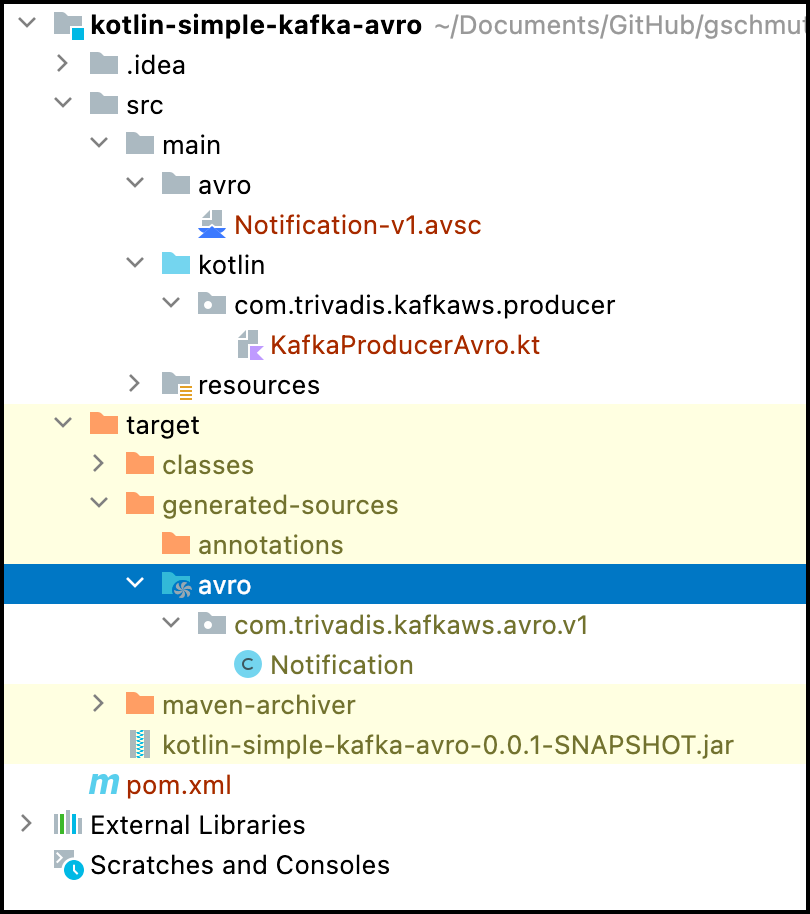
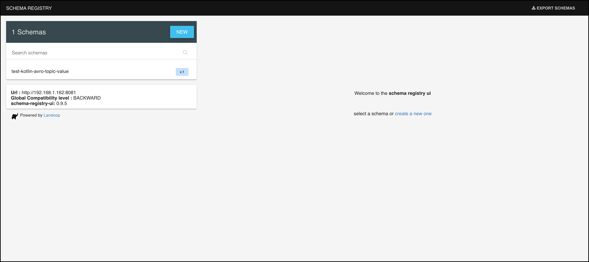
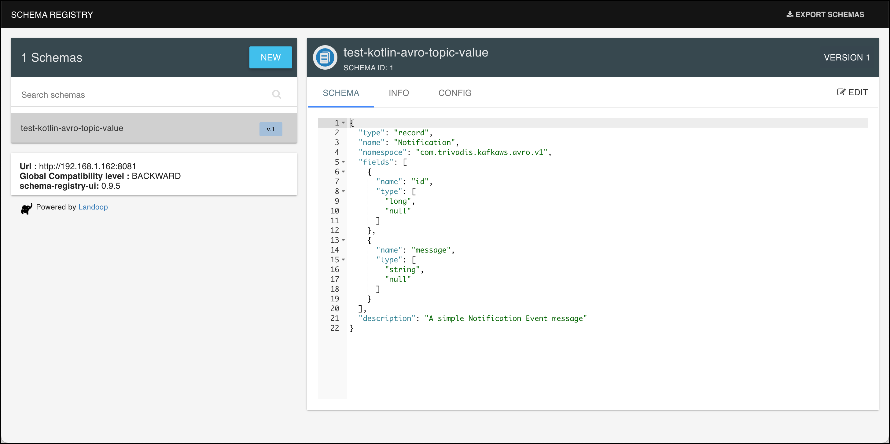

# Using Kafka from Kotlin with Avro & Schema Registry

In this workshop we will learn how to produce and consume messages from **Kotlin** using the [Kafka Java API](https://kafka.apache.org/documentation/#api) with Avro for serialising and deserialising messages.

## Create the project in your favourite IDE

Create a new Maven Project (using the functionality of your IDE) and in the last step use `com.trivadis.kafkaws` for the **Group Id** and `kotlin-simple-kafka-avro` for the **Artifact Id**.

Navigate to the **pom.xml** and double-click on it. The POM Editor will be displayed.

You can either use the GUI to edit your `pom.xml` or navigate to the last tab **pom.xml** to switch to the "code view". Let's do that.

You will see the still rather empty definition.

```xml
<project xmlns="http://maven.apache.org/POM/4.0.0" xmlns:xsi="http://www.w3.org/2001/XMLSchema-instance" xsi:schemaLocation="http://maven.apache.org/POM/4.0.0 http://maven.apache.org/xsd/maven-4.0.0.xsd">
	<modelVersion>4.0.0</modelVersion>
	<groupId>com.trivadis.kafkaws</groupId>
	<artifactId>kotlin-simple-kafka-avro</artifactId>
	<version>0.0.1-SNAPSHOT</version>
</project>
```

Let's add some initial dependencies for our project. We will add some more dependencies to the POM throughout this workshop.

Copy the following block right after the `<version>` tag, before the closing `</project>` tag.

```xml
	<properties>
		<kafka.version>2.8.0</kafka.version>
		<confluent.version>7.0.0</confluent.version>
		<avro.version>1.11.0</avro.version>
		<java.version>11</java.version>
		<kotlin.version>1.6.21</kotlin.version>
		<slf4j-version>1.7.5</slf4j-version>

		<!-- use utf-8 encoding -->
		<project.build.sourceEncoding>UTF-8</project.build.sourceEncoding>
		<project.reporting.outputEncoding>UTF-8</project.reporting.outputEncoding>
	</properties>

	<dependencies>
		<dependency>
			<groupId>org.apache.kafka</groupId>
			<artifactId>kafka-clients</artifactId>
			<version>${kafka.version}</version>
		</dependency>

		<dependency>
			<groupId>io.confluent</groupId>
			<artifactId>kafka-avro-serializer</artifactId>
			<version>${confluent.version}</version>
		</dependency>

		<dependency>
			<groupId>org.apache.avro</groupId>
			<artifactId>avro</artifactId>
			<version>${avro.version}</version>
		</dependency>

		<dependency>
			<groupId>org.jetbrains.kotlin</groupId>
			<artifactId>kotlin-stdlib</artifactId>
			<version>${kotlin.version}</version>
		</dependency>

		<dependency>
			<groupId>org.slf4j</groupId>
			<artifactId>slf4j-log4j12</artifactId>
			<version>${slf4j-version}</version>
		</dependency>
	</dependencies>

	<repositories>
		<repository>
			<id>github-releases</id>
			<url>http://oss.sonatype.org/content/repositories/github-releases/</url>
		</repository>
		<repository>
			<id>clojars.org</id>
			<url>http://clojars.org/repo</url>
		</repository>
		<repository>
			<id>confluent</id>
			<url>https://packages.confluent.io/maven/</url>
		</repository>
	</repositories>

	<pluginRepositories>
		<pluginRepository>
			<id>confluent</id>
			<url>https://packages.confluent.io/maven/</url>
		</pluginRepository>
	</pluginRepositories>

	<build>
		<defaultGoal>install</defaultGoal>

		<plugins>
			<plugin>
				<groupId>org.jetbrains.kotlin</groupId>
				<artifactId>kotlin-maven-plugin</artifactId>
				<version>${kotlin.version}</version>
				<executions>
					<execution>
						<id>compile</id>
						<phase>compile</phase>
						<goals>
							<goal>compile</goal>
						</goals>
						<configuration>
							<sourceDirs>
								<sourceDir>${project.basedir}/src/main/kotlin</sourceDir>
								<sourceDir>${project.basedir}/src/main/java</sourceDir>
							</sourceDirs>
						</configuration>

					</execution>
					<execution>
						<id>test-compile</id>
						<phase>test-compile</phase>
						<goals>
							<goal>test-compile</goal>
						</goals>
					</execution>
				</executions>
			</plugin>
			<plugin>
				<groupId>org.apache.maven.plugins</groupId>
				<artifactId>maven-compiler-plugin</artifactId>
				<version>2.5</version>
				<configuration>
					<source>${java.version}</source>
					<target>${java.version}</target>
					<maxmem>256M</maxmem>
					<showDeprecation>true</showDeprecation>
				</configuration>
			</plugin>
			<plugin>
				<groupId>org.codehaus.mojo</groupId>
				<artifactId>exec-maven-plugin</artifactId>
				<version>1.6.0</version>
				<executions>
					<execution>
						<id>producer</id>
						<goals>
							<goal>java</goal>
						</goals>
						<configuration>
							<mainClass>com.trivadis.kafkaws.producer.KafkaProducerAvro</mainClass>
						</configuration>
					</execution>
					<execution>
						<id>consumer</id>
						<goals>
							<goal>java</goal>
						</goals>
						<configuration>
							<mainClass>com.trivadis.kafkaws.consumer.KafkaConsumerAvro</mainClass>
						</configuration>
					</execution>
				</executions>
			</plugin>
		</plugins>
	</build>

```

## Creating the necessary Kafka Topic

We will use the topic `test-kotlin-avro-topic` in the Producer and Consumer code below. Due to the fact that `auto.topic.create.enable` is set to `false`, we have to manually create the topic.

In a terminal window, connect to the `kafka-1` container

```
docker exec -ti kafka-1 bash
```

and execute the necessary kafka-topics command.

```
kafka-topics --create \
--replication-factor 3 \
--partitions 8 \
--topic test-kotlin-avro-topic \
--bootstrap-server kafka-1:19092,kafka-2:19093
```

This finishes the setup steps and our new project is ready to be used. Next we will start implementing the **Kafka Producer** which uses Avro for the serialisation.

## Create an Avro Schema representing the Notification Message

First create a new Folder `avro` under the existing folder **src/main/**.

Create a new File `Notification-v1.avsc` in the folder  **src/main/avro** just created above.

Add the following Avro schema to the empty file.  

```json
{
  "type" : "record",
  "namespace" : "com.trivadis.kafkaws.avro.v1",
  "name" : "Notification",
  "description" : "A simple Notification Event message",
  "fields" : [
	    { "type" : ["long", "null"],
	      "name" : "id"
	    },
	    { "type" : ["string", "null"],
	      "name" : "message"
	    }
  ]
}
```

In the `pom.xml`, add the `avro-maven-plugin` plugin to the `<build><plugins>` section, just below the `exec-maven-plugin`.

```xml
			<plugin>
				<groupId>org.apache.avro</groupId>
				<artifactId>avro-maven-plugin</artifactId>
				<version>${avro.version}</version>
				<executions>
					<execution>
						<phase>generate-sources</phase>
						<goals>
							<goal>schema</goal>
							<goal>protocol</goal>
							<goal>idl-protocol</goal>
						</goals>
						<configuration>
							<fieldVisibility>private</fieldVisibility>
							<sourceDirectory>${project.basedir}/src/main/avro</sourceDirectory>
						</configuration>
					</execution>
				</executions>
			</plugin>
```

This plugin will make sure, that classes are generated based on the Avro schema, whenever a `mvn compile` is executed. Let's exactly do that on the still rather empty project.

```
mvn compile
```

After running this command, refresh the project and you should see a new folder named `target/generated-sources/avro`. Expand into this folder and you should see one generated Java class named `Notification`.



Double click on the `Notification` class to inspect the code.

```kotlin
package com.trivadis.kafkaws.avro.v1;

import org.apache.avro.specific.SpecificData;

@SuppressWarnings("all")
@org.apache.avro.specific.AvroGenerated
public class Notification extends org.apache.avro.specific.SpecificRecordBase implements org.apache.avro.specific.SpecificRecord {
  private static final long serialVersionUID = 799361421243801515L;
  public static final org.apache.avro.Schema SCHEMA$ = new org.apache.avro.Schema.Parser().parse("{\"type\":\"record\",\"name\":\"Notification\",\"namespace\":\"com.trivadis.kafkaws.avro.v1\",\"fields\":[{\"name\":\"id\",\"type\":[\"long\",\"null\"]},{\"name\":\"message\",\"type\":[\"string\",\"null\"]}],\"description\":\"A simple Notification Event message\"}");
  public static org.apache.avro.Schema getClassSchema() { return SCHEMA$; }
   private java.lang.Long id;
   private java.lang.CharSequence message;

  /**
   * Default constructor.  Note that this does not initialize fields
   * to their default values from the schema.  If that is desired then
   * one should use <code>newBuilder()</code>.
   */
  public Notification() {}

  /**
   * All-args constructor.
   * @param id The new value for id
   * @param message The new value for message
   */
  public Notification(java.lang.Long id, java.lang.CharSequence message) {
    this.id = id;
    this.message = message;
  }
  ...
```
You can see that the code is based on the information in the Avro schema. We will use this class when we produce as well as consume Avro messages to/from Kafka.

Add an addtional source folder to the `kotlin-maven-plugin` so that Maven can find the generated classes

```xml
			<plugin>
				<groupId>org.jetbrains.kotlin</groupId>
				<artifactId>kotlin-maven-plugin</artifactId>
				<version>${kotlin.version}</version>
				<executions>
					<execution>
						<id>compile</id>
						<phase>compile</phase>
						<goals>
							<goal>compile</goal>
						</goals>
						<configuration>
							<sourceDirs>
								<sourceDir>${project.basedir}/src/main/kotlin</sourceDir>
								<sourceDir>${project.basedir}/src/main/java</sourceDir>
								<sourceDir>${project.basedir}/target/generated-sources/avro</sourceDir>
							</sourceDirs>
						</configuration>
```

## Create a Kafka Producer using Avro for serialisation

First create a new Package `com.trivadis.kafkaws.producer` in the folder **src/main/kotlin**.

Create a new Kotlin File `KafkaProducerAvro` in the package `com.trivadis.kafakws.producer` just created.

Add the following code to the empty class to create a Kafka Producer. It is similar to the code we have seen in the previous workshop. We have changed both serialiser to use the Confluent `KafkaAvroSerializer` class and added the URL to the Confluent Schema Registry API.


We will be using the synchronous way for producing messages to the Kafka topic we created above, but the other methods would work as well with Avro.

```kotlin
@file:JvmName("KafkaProducerAvro")

package com.trivadis.kafkaws.producer

import com.trivadis.kafkaws.avro.v1.Notification
import io.confluent.kafka.serializers.KafkaAvroSerializer
import io.confluent.kafka.serializers.KafkaAvroSerializerConfig
import org.apache.kafka.clients.producer.KafkaProducer
import org.apache.kafka.clients.producer.ProducerConfig.*
import org.apache.kafka.clients.producer.ProducerRecord
import org.apache.kafka.common.serialization.LongSerializer
import java.time.LocalDateTime
import java.util.*

private val TOPIC = "test-kotlin-avro-topic"
private val BOOTSTRAP_SERVERS = "dataplatform:9092,dataplatform:9093"
private val SCHEMA_REGISTRY_URL = "http://dataplatform:8081"

fun runProducer(sendMessageCount: Int, waitMsInBetween: Int, id: Long) {
    // Define properties.
    val props = Properties()
    props[BOOTSTRAP_SERVERS_CONFIG] = BOOTSTRAP_SERVERS
    props[ACKS_CONFIG] = "all"
    props[KEY_SERIALIZER_CLASS_CONFIG] = KafkaAvroSerializer::class.qualifiedName
    props[VALUE_SERIALIZER_CLASS_CONFIG] = KafkaAvroSerializer::class.qualifiedName
    props[KafkaAvroSerializerConfig.SCHEMA_REGISTRY_URL_CONFIG] = SCHEMA_REGISTRY_URL

    val key = if (id > 0) id else null

    KafkaProducer<Long, Notification>(props).use { producer ->
        repeat(sendMessageCount) { index ->
            val time = System.currentTimeMillis();

            //val notification = Notification(id, "test")
            val notification = Notification.newBuilder().setId(id)
                .setMessage("[" + id + "] Hello Kafka " + index + " => " + LocalDateTime.now()).build()

            val m = producer.send(ProducerRecord(TOPIC, key, notification)).get()

            val elapsedTime = System.currentTimeMillis() - time;
            println("Produced record to topic ${m.topic()} partition [${m.partition()}] @ offset ${m.offset()} time=${elapsedTime}")

            // Simulate slow processing
            Thread.sleep(waitMsInBetween.toLong());
        }

        producer.flush()
    }
}
```

Next you define the main method.

```kotlin
fun main(args: Array<String>) {
    if (args.size == 0) {
        runProducer(100, 10, 0)
    } else {
        runProducer(args[0].toInt(), args[1].toInt(), args[2].toLong())
    }
}
```

The `main()` method accepts 3 parameters, the number of messages to produce, the time in ms to wait in-between sending each message and the ID of the producer.

Use `kcat` or `kafka-console-consumer` to consume the messages from the topic `test-java-avro-topic `.

```
kcat -b kafka-1:19092 -t test-kotlin-avro-topic
```

Now run it using the `mvn exec:java` command. It will generate 1000 messages, waiting 10ms in-between sending each message and use 0 for the ID.

```
mvn exec:java@producer -Dexec.args="1000 10 0"
```

You can see that `kcat` shows some special, non-printable characters. This is due to the Avro format. If you want to display the Avro, you can use the `kafka-avro-console-consumer` CLI, which is part of the Schema Registry.

So let's connect to the schema registry container:

```
docker exec -ti schema-registry-1 bash
```

And then invoke the `kafka-avro-console-consumer` similar to the "normal" consumer seen so far.

```
kafka-avro-console-consumer --bootstrap-server kafka-1:19092 --topic test-kotlin-avro-topic
```

You should see an output similar to the one below.

```
...
[2018-07-11 21:32:43,155] INFO [Consumer clientId=consumer-1, groupId=console-consumer-88150] Resetting offset for partition test-java-avro-topic-6 to offset 0. (org.apache.kafka.clients.consumer.internals.Fetcher)
{"id":{"long":0},"message":{"string":"[0] Hello Kafka 0 => 2022-06-04T20:45:07.482566"}}
{"id":{"long":0},"message":{"string":"[0] Hello Kafka 1 => 2022-06-04T20:45:07.835552"}}
{"id":{"long":0},"message":{"string":"[0] Hello Kafka 3 => 2022-06-04T20:45:07.954605"}}
{"id":{"long":0},"message":{"string":"[0] Hello Kafka 5 => 2022-06-04T20:45:08.033523"}}
{"id":{"long":0},"message":{"string":"[0] Hello Kafka 2 => 2022-06-04T20:45:07.924455"}}
{"id":{"long":0},"message":{"string":"[0] Hello Kafka 4 => 2022-06-04T20:45:07.992334"}}
{"id":{"long":0},"message":{"string":"[0] Hello Kafka 6 => 2022-06-04T20:45:08.077028"}}
{"id":{"long":0},"message":{"string":"[0] Hello Kafka 7 => 2022-06-04T20:45:08.123285"}}
{"id":{"long":0},"message":{"string":"[0] Hello Kafka 8 => 2022-06-04T20:45:08.166146"}}
{"id":{"long":0},"message":{"string":"[0] Hello Kafka 9 => 2022-06-04T20:45:08.248690"}}
{"id":{"long":0},"message":{"string":"[0] Hello Kafka 10 => 2022-06-04T20:45:08.400525"}}
{"id":{"long":0},"message":{"string":"[0] Hello Kafka 11 => 2022-06-04T20:45:08.441321"}}
{"id":{"long":0},"message":{"string":"[0] Hello Kafka 12 => 2022-06-04T20:45:08.476113"}}
{"id":{"long":0},"message":{"string":"[0] Hello Kafka 13 => 2022-06-04T20:45:08.515611"}}
{"id":{"long":0},"message":{"string":"[0] Hello Kafka 14 => 2022-06-04T20:45:08.564089"}}
{"id":{"long":0},"message":{"string":"[0] Hello Kafka 15 => 2022-06-04T20:45:08.604500"}}
...
```

if you want to consume with `kcat` you need to specify the serialization format `-s` and the address of the schema registry `-r`:

```
kcat -b kafka-1 -t test-kotlin-avro-topic -s value=avro -r http://schema-registry-1:8081
```

**Note**: For Avro support your kafkacat/kcat version needs to be `1.6' or later.

## View the Schema in the Registry

The Avro Serialiser and Deserialiser automatically register the Avro schema, if it is not already in the registry.

The Streamingplatform also contains a tool made by a company called Landoop which allows us to see what's in the registry.

In a browser, navigate to <http://dataplatform:28039> and you should see the home page of the Schema Registry UI.



If you click on the schema to the left, you can view the details of the schema. You can see that version v1 has been assigned automatically.



## Create a Kafka Consumer using Avro for serialization

First create a new Package `com.trivadis.kafkaws.consumer` in the folder **src/main/kotlin**.

Create a new Java Class `KafkaConsumerAvro` in the package `com.trivadis.kafakws.consumer` just created.

Add the following code to the empty class.

```kotlin
@file:JvmName("KafkaConsumerAvro")
package com.trivadis.kafkaws.consumer

import com.trivadis.kafkaws.avro.v1.Notification
import io.confluent.kafka.serializers.KafkaAvroDeserializer
import io.confluent.kafka.serializers.KafkaAvroSerializerConfig
import org.apache.kafka.clients.consumer.ConsumerConfig.*
import org.apache.kafka.clients.consumer.KafkaConsumer
import org.apache.kafka.common.serialization.LongDeserializer
import org.apache.kafka.common.serialization.StringDeserializer
import java.time.Duration
import java.util.*


private val TOPIC = "test-kotlin-avro-topic"
private val BOOTSTRAP_SERVERS = "dataplatform:9092,dataplatform:9093"
private val SCHEMA_REGISTRY_URL = "http://dataplatform:8081"

fun runConsumerManual(waitMsInBetween: Int) {
    // Define properties.
    val props = Properties()
    props[BOOTSTRAP_SERVERS_CONFIG] = BOOTSTRAP_SERVERS
    props[GROUP_ID_CONFIG] = "kotlin-simple-avro-consumer"
    props[ENABLE_AUTO_COMMIT_CONFIG] = false
    props[KEY_DESERIALIZER_CLASS_CONFIG] = KafkaAvroDeserializer::class.qualifiedName
    props[VALUE_DESERIALIZER_CLASS_CONFIG] = KafkaAvroDeserializer::class.qualifiedName
    props[KafkaAvroSerializerConfig.SCHEMA_REGISTRY_URL_CONFIG] = SCHEMA_REGISTRY_URL

    val consumer = KafkaConsumer<Long, Notification>(props).apply {
        subscribe(listOf(TOPIC))
    }

    consumer.use {
        while(true) {
            val messages = consumer.poll(Duration.ofMillis(100))

            messages.forEach {
                println("Consumed record [Key: ${it.key()}, Value: ${it.value()}] @ Partition: ${it.partition()}, Offset:  ${it.offset()}")
            }

            consumer.commitSync();

            // Simulate slow processing
            Thread.sleep(waitMsInBetween.toLong());
        }
    }
}

fun main(args: Array<String>) {
    if (args.size == 0) {
        runConsumerManual(10)
    } else {
        runConsumerManual(args[0].toInt())
    }
}
```

Now compile and start the consumer

```bash
mvn clean package

mvn exec:java@consumer
```

## Register in Schema Registry using Maven

In the test above, the Avro schema has been registered in the schema registry when starting the Producer for the first time. To register an Avro schema through Maven automatically, you can use the following Maven plugin.

Add the following definition to the `pom.xml`.

```xml
			<plugin>
				<groupId>io.confluent</groupId>
				<artifactId>kafka-schema-registry-maven-plugin</artifactId>
				<version>3.2.0</version>
				<configuration>
					<schemaRegistryUrls>
						<param>http://dataplatform:8081</param>
					</schemaRegistryUrls>
					<subjects>
						<test-java-avro-topic-value>src/main/avro/Notification-v1.avsc</test-java-avro-topic-value>
					</subjects>
				</configuration>
				<goals>
					<goal>register</goal>
					<goal>test-compatibility</goal>
				</goals>
			</plugin>
```

Now you can use the following command to register the schemas with the Schema Registry:

```
mvn schema-registry:register
```
