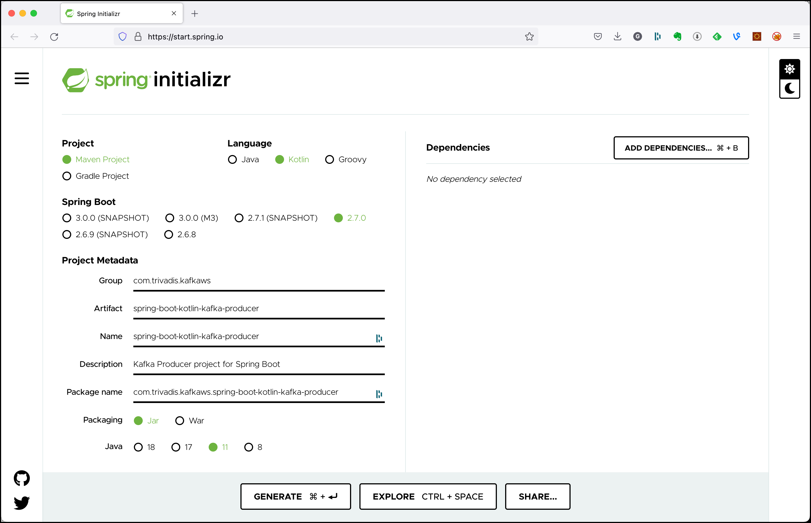
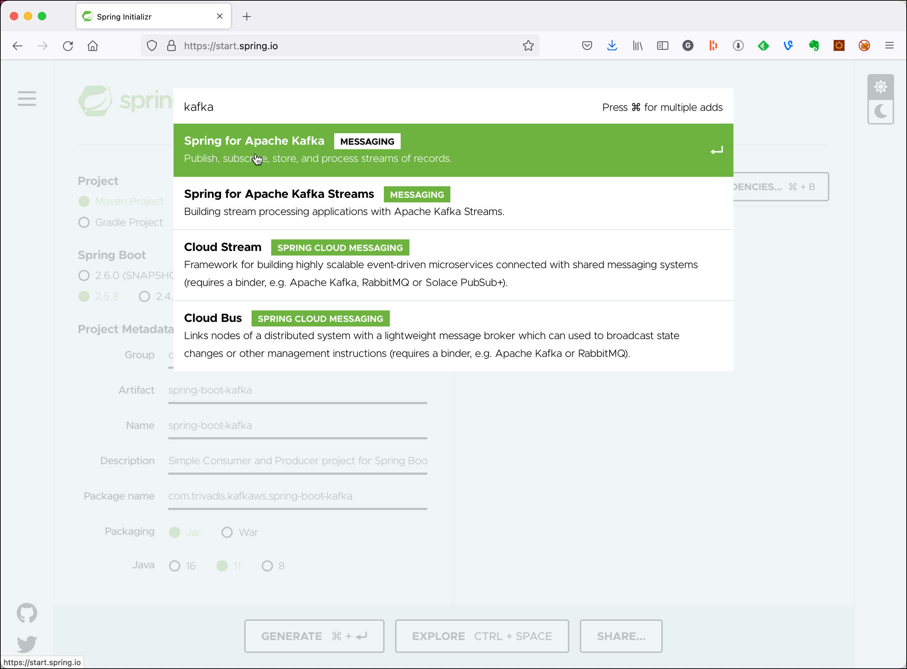
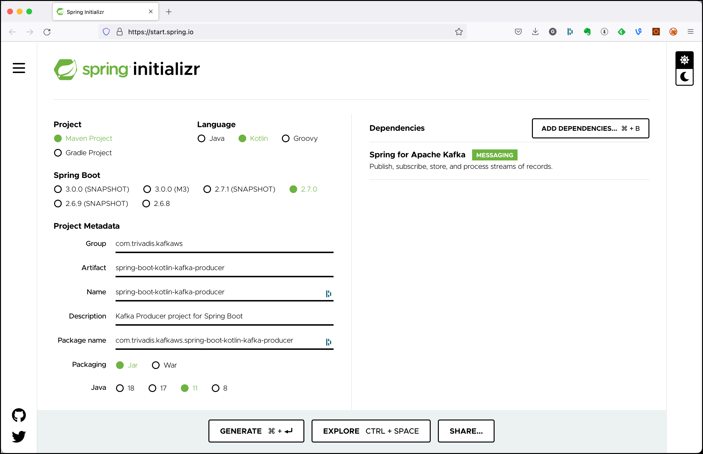

# Using Kafka from Spring Boot with Kotlin using Kafka Spring

In this workshop we will learn how to use the **Spring Kafka** abstraction from within a Spring Boot application using the **Kotlin** language. 

We will implement both a consumer and a producer implementing the same behaviour as in [Workshop 6: Working with Kafka from Kotlin](../06-producing-consuming-kafka-with-kotlin). 

We will create two Spring Boot projects, one for the **Producer** and one for the **Consumer**, simulating two independent microservices interacting with eachother via events.

## Create the Spring Boot Producer

First we create an test the Producer microservice.

### Creating the Spring Boot Project

First, let’s navigate to [Spring Initializr](https://start.spring.io/) to generate our project. Our project will need the Apache Kafka support. 

Select Generate a **Maven Project** with **Kotlin** and Spring Boot **2.7.0**. Enter `com.trivadis.kafkaws` for the **Group**, `spring-boot-kotlin-kafka-producer` for the **Artifact** field and `Kafka Producer project for Spring Boot` for the **Description** field. 



Click on **Add Dependencies** and search for the  **Spring for Apache Kafka** depencency. 



Select the dependency and hit the **Enter** key. You should now see the dependency on the right side of the screen.



Click on **Generate Project** and unzip the ZIP file to a convenient location for development. 

Once you have unzipped the project, you’ll have a very simple structure. 

Import the project as a Maven Project into your favourite IDE for further development. 

### Implement a Kafka Producer in Spring

Now create a simple Kotlin class `KafkaEventProducer` within the `com.trivadis.kafkaws.springbootkotlinkafkaproducer ` package, which we will use to produce messages to Kafka.

```kotlin
package com.trivadis.kafkaws.springbootkotlinkafkaproducer

import org.springframework.beans.factory.annotation.Value
import org.springframework.kafka.core.KafkaTemplate
import org.springframework.kafka.support.SendResult
import org.springframework.stereotype.Component

@Component
class KafkaEventProducer (private val kafkaTemplate: KafkaTemplate<Long, String>) {

    @Value("\${topic.name}")
    private lateinit var kafkaTopic: String

    fun produce(key: Long, value: String) {
        val time = System.currentTimeMillis()
        var result: SendResult<Long, String>

        if (key > 0) {
            result = kafkaTemplate.send(kafkaTopic, key, value).get()
        } else {
            result = kafkaTemplate.send(kafkaTopic, value).get()
        }

        val elapsedTime = System.currentTimeMillis() - time
        println("[$key] sent record(key=$key value=$value) meta(partition=${result.recordMetadata.partition()}, offset=${result.recordMetadata.offset()}) time=$elapsedTime")
    }
}
```

It uses the `Component` annotation to have it registered as bean in the Spring context. The topic to produce to is specified as a property, which we will specify later in the `applicaiton.yml` file.

We produce the messages synchronously. You can see that because we are using `get()` on the `send` method: `result = kafkaTemplate.send(kafkaTopic, key, value).get()`.

### Create the necessary Topics through code

Spring Kafka can automatically add topics to the broker, if they do not yet exists. By that you can replace the `kafka-topics` CLI commands seen so far to create the topics, if you like.

Spring Kafka provides a `TopicBuilder` which makes the creation of the topics very convenient. 

```kotlin
package com.trivadis.kafkaws.springbootkotlinkafkaproducer

import org.apache.kafka.clients.admin.NewTopic
import org.springframework.beans.factory.annotation.Value
import org.springframework.context.annotation.Bean
import org.springframework.kafka.config.TopicBuilder
import org.springframework.stereotype.Component

@Component
class TopicCreator {

    @Value("\${topic.name}")
    private lateinit var kafkaTopic: String

    @Value("\${topic.partitions}")
    private var partitions: Int = 0

    @Value("\${topic.replication-factor}")
    private var replicationFactor: Int = 0

    @Bean
    fun topic(): NewTopic? {
        return TopicBuilder.name(kafkaTopic)
            .partitions(partitions)
            .replicas(replicationFactor)
            .build()
    }
}
```

We again refer to properties, which will be defined later in the `application.yml` config file. 

### Add Producer logic to the SpringBootKafkaProducerApplication class

We change the generated Spring Boot application to be a console appliation by implementing the `CommandLineRunner` interface. 

```kotlin
package com.trivadis.kafkaws.springbootkotlinkafkaproducer

import org.springframework.boot.CommandLineRunner
import org.springframework.boot.autoconfigure.SpringBootApplication
import org.springframework.boot.runApplication
import org.springframework.context.annotation.Bean
import java.time.LocalDateTime


@SpringBootApplication
class SpringBootKotlinKafkaProducerApplication{

	@Bean
	fun init(kafkaEventProducer: KafkaEventProducer) = CommandLineRunner { args ->
		val sendMessageCount = if (args.size==0) 100 else args[0].toInt()
		val waitMsInBetween = if (args.size==0) 10 else args[1].toLong()
		val id = if (args.size==0) 0 else args[2].toLong()

		for (index in 1 .. sendMessageCount) {
			val value = "[$id" + "] Hello Kafka " + index + " => " + LocalDateTime.now()
			kafkaEventProducer.produce(id, value);

			// Simulate slow processing
			Thread.sleep(waitMsInBetween);
		}
	}
}

fun main(args: Array<String>) {
	runApplication<SpringBootKotlinKafkaProducerApplication>(*args)
}
```

### Configure Kafka through application.yml configuration file

First let's rename the existing `application.properties` file to `application.yml` to use the `yml` format. 

Add the following settings to configure the Kafka cluster and the name of the topic:

```yml
topic:
  name: test-kotlin-spring-topic
  replication-factor: 3
  partitions: 12

spring:
  kafka:
    bootstrap-servers: ${DATAPLATFORM_IP}:9092
    producer:
      key-serializer: org.apache.kafka.common.serialization.LongSerializer
      value-serializer: org.apache.kafka.common.serialization.StringSerializer

logging:
  level:
    root: info
```

For the IP address of the Kafka cluster we refer to an environment variable, which we have to declare before running the application.

```bash
export DATAPLATFORM_IP=nnn.nnn.nnn.nnn
```

### Build the application

First lets build the application:

```bash
mvn package -Dmaven.test.skip=true
```

### Run the application

Now let's run the application

```bash
mvn spring-boot:run
```

Make sure that you see the messages through the console consumer.

To run the producer with custom parameters (for example to specify the key to use), use the `-Dspring-boot.run.arguments`:

```bash
mvn spring-boot:run -Dspring-boot.run.arguments="100 10 10"
```

### Use Console to test the application

In a terminal window start consuming from the output topic:

```bash
kcat -b kafka-1:19092 -t test-kotlin-spring-topic
```

## Create the Spring Boot Consumer

Now let's create an test the Consumer microservice.

### Creating the Spring Boot Project

Use again the [Spring Initializr](https://start.spring.io/) to generate the project.

Select Generate a **Maven Project** with **Kotlin** and Spring Boot **2.7.0**. Enter `com.trivadis.kafkaws` for the **Group**, `spring-boot-kotlin-kafka-consumer` for the **Artifact** field and `Kafka Consumer project for Spring Boot` for the **Description** field. 

Click on **Add Dependencies** and search for the  **Spring for Apache Kafka** depencency. 

Select the dependency and hit the **Enter** key. You should now see the dependency on the right side of the screen.

Click on **Generate Project** and unzip the ZIP file to a convenient location for development. 

Once you have unzipped the project, you’ll have a very simple structure. 

Import the project as a Maven Project into your favourite IDE for further development. 

### Implement a Kafka Consumer in Spring

Start by creating a simple Kotlin class `KafkaEventConsumer` within the `com.trivadis.kafkaws.springbootkafkaconsumer` package, which we will use to consume messages from Kafka. 

```kotlin
package com.trivadis.kafkaws.springbootkotlinkafkaconsumer

import org.apache.kafka.clients.consumer.ConsumerRecord
import org.springframework.kafka.annotation.KafkaListener
import org.springframework.stereotype.Component

@Component
class KafkaEventConsumer {
    @KafkaListener(topics = ["\${topic.name}"], groupId = "simple-kotlin-consumer")
    fun receive(consumerRecord: ConsumerRecord<Long, String>) {
        println("received key = ${consumerRecord.key()} with payload=${consumerRecord.value()}")
    }
}
```

This class uses the `Component` annotation to have it registered as bean in the Spring context and the `KafkaListener` annotation to specify a listener method to be called for each record consumed from the Kafka input topic. The name of the topic is specified as a property to be read again from the `application.yml` configuration file.

In the code we only log the key and value received to the console. In real life, we would probably inject another bean into the `KafkaEventConsumer` to perform the message processing.
 
### Configure Kafka through application.yml configuration file

First let's rename the existing `application.properties` file to `application.yml` to use the `yml` format. 

Add the following settings to configure the Kafka cluster and the name of the two topics:

```yml
topic:
  name: test-kotlin-spring-topic

spring:
  kafka:
    bootstrap-servers: ${DATAPLATFORM_IP}:9092
    consumer:
      key-deserializer: org.apache.kafka.common.serialization.LongDeserializer
      value-deserializer: org.apache.kafka.common.serialization.StringDeserializer

logging:
  level:
    root: info
```

For the IP address of the Kafka cluster we refer to an environment variable, which we have to declare before running the application.

```bash
export DATAPLATFORM_IP=nnn.nnn.nnn.nnn
```

### Build the application

First lets build the application:

```bash
mvn package -Dmaven.test.skip=true
```

### Run the application

Now let's run the application

```bash
mvn spring-boot:run
```

## Various Options for Producer & Consumer

### Produce asynchronously

You can also produce asynchronously using Spring Kafka. Let's implement the `KafkaEventProducer` class in an asynchronous way:

```kotlin
package com.trivadis.kafkaws.springbootkotlinkafkaproducer

import org.springframework.beans.factory.annotation.Value
import org.springframework.kafka.core.KafkaTemplate
import org.springframework.kafka.support.SendResult
import org.springframework.stereotype.Component
import org.springframework.util.concurrent.ListenableFuture

@Component
class KafkaEventProducerAsync(private val kafkaTemplate: KafkaTemplate<Long, String>) {

    @Value("\${topic.name}")
    private lateinit var kafkaTopic: String

    fun produce(key: Long, value: String) {
        val time = System.currentTimeMillis()
        var future: ListenableFuture<SendResult<Long, String>>

        if (key > 0) {
            future = kafkaTemplate.send(kafkaTopic, key, value)
        } else {
            future = kafkaTemplate.send(kafkaTopic, value)
        }

        future.addCallback({
            val elapsedTime = System.currentTimeMillis() - time
            println("[$key] sent record(key=$key value=$value) meta(partition=${it?.recordMetadata?.partition()}, offset=${it?.recordMetadata?.offset()}) time=$elapsedTime")
        }, {
            it.printStackTrace()
        })
    }
}
```

To test it, switch the injection in the `SpringBootKotlinKafkaProducerApplication` class to use the `KafkaEventProducerAsync` class:

```kotlin
	fun init(kafkaEventProducer: KafkaEventProducerAsync) = CommandLineRunner { args ->
```

### Adding Message Filters for Listeners

Configuring message filtering is actually very simple. You only need to configure a `RecordFilterStrategy` (message filtering strategy) for the listening container factory. When it returns `true`, the message will be discarded. When it returns `false`, the message can normally reach the listening container.

Add the following additional configuration to the `SpringBootKafkaConsumerApplication` class. Here we just discard all messages which do not contain `Kafka 5' in its value:

```kotlin
package com.trivadis.kafkaws.springbootkotlinkafkaconsumer

import org.apache.kafka.clients.consumer.ConsumerRecord
import org.springframework.beans.factory.annotation.Autowired
import org.springframework.context.annotation.Bean
import org.springframework.context.annotation.Configuration
import org.springframework.kafka.config.ConcurrentKafkaListenerContainerFactory
import org.springframework.kafka.core.ConsumerFactory

@Configuration
class FilterConfiguration {

    @Autowired
    private lateinit var consumerFactory: ConsumerFactory<Long, String>

    @Bean
    fun filterContainerFactory(): ConcurrentKafkaListenerContainerFactory<Long, String> {
        val factory = ConcurrentKafkaListenerContainerFactory<Long, String>()
        factory.setConsumerFactory(consumerFactory)
        factory.setRecordFilterStrategy { record: ConsumerRecord<Long, String> ->
            !record.value().contains("Kafka 5")
        }
        return factory
    }
}
```

To use this factory instead of the default one created by the Spring Boot framework, you have to specify the `containerFactory` parameter in the `@KafakListener` annotation.

```kotlin
        @KafkaListener(topics = ["\${topic.name}"], groupId = "simple-kotlin-consumer", containerFactory = "filterContainerFactory")
    fun receive(consumerRecord: ConsumerRecord<Long, String>) {
```

Message filtering can be used for example to filter duplicate messages.

### Commit after given number of records

Starting with version 2.3, Spring Kafka sets `enable.auto.commit` to `false` unless explicitly set in the configuration. Previously, the Kafka default (true) was used if the property was not set.

If `enable.auto.commit` is false, the containers support several `AckMode` settings ([see documentation](https://docs.spring.io/spring-kafka/reference/html/#committing-offsets)). The default AckMode is `BATCH`, which commit the offset when all the records returned by the `poll()` have been processed. Other options allow to commit manually, after a given time has passed or after a given number of records have been consumed.

To commit offsets after a given number of records have been processed, switch the `AckMode` from `batch` to `count` and add the `ackCount` configuration to the `application.yml` file:

```yml
spring:
  kafka:
    bootstrap-servers: ${DATAPLATFORM_IP}:9092
    consumer:
      key-deserializer: org.apache.kafka.common.serialization.LongDeserializer
      value-deserializer: org.apache.kafka.common.serialization.StringDeserializer
    listener:
      ack-mode: count
      ack-count: 40
```

To check that commits are done after 40 records, you can consume from the `__consumer_offsets` topic using the following enhanced version of the `kafka-console-consumer`:

```bash
docker exec -ti kafka-1 kafka-console-consumer --formatter "kafka.coordinator.group.GroupMetadataManager\$OffsetsMessageFormatter" --bootstrap-server kafka-1:19092 --topic __consumer_offsets
```

An alternative way to check for the commits is to set the logging of the `ConsumerCoordinator` to debug

```yml
logging:
  level:
    root: info
    org:
      apache:
        kafka:
          clients:
            consumer:
              internals:
                ConsumerCoordinator: debug
```

### Manual Commit when consuming records

In the `@KafkaListener` method, add an additional parameter to get the `acknowledgment` bean on which you can invoke the `acknowledge()` method.

```kontlin
class KafkaEventConsumer {
    @KafkaListener(topics = ["\${topic.name}"], groupId = "simple-kotlin-consumer", containerFactory = "filterContainerFactory")
    fun receive(consumerRecord: ConsumerRecord<Long, String>, acknowledgment: Acknowledgment) {
        println("received key = ${consumerRecord.key()} with payload=${consumerRecord.value()}")

        acknowledgment.acknowledge();
    }
}
```

Set the `ack-mode` to `manual` in the `application.yml`. 
