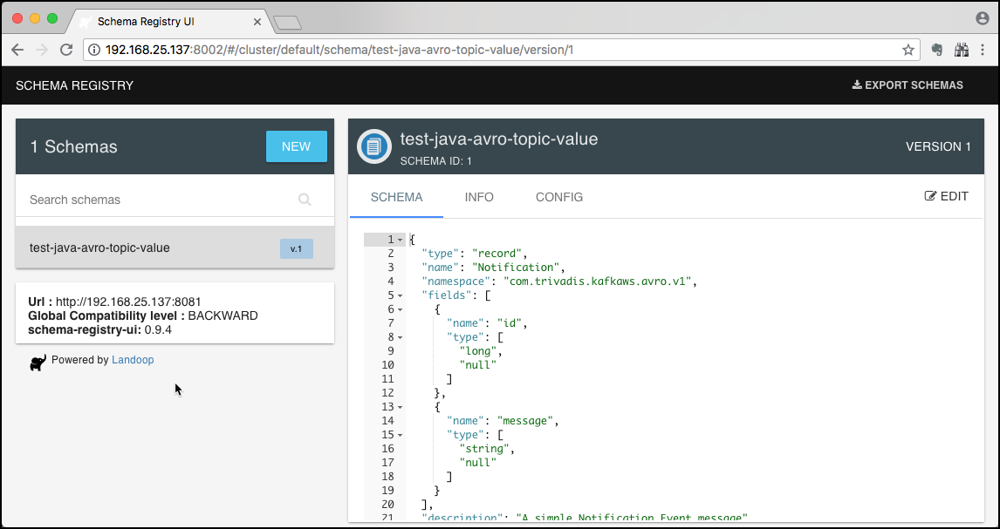

# Using Kafka from #C (.Net) with Avro & Schema Registry

In this workshop we will learn how to produce and consume messages using the [Kafka .NET API](https://docs.confluent.io/clients-confluent-kafka-dotnet/current/overview.html) using Avro for serialising and deserialising messages.

We assume that .NET Core is installed on your client as well as Visual Code with the C# extension (ms-dotnettools.csharp) enabled. We will use the .NET CLI (`dotnet`) for creating projects and running the code.

## Create the project structure

We will create two projects, one acting as the producer to Kafka and the other one as the consumer from Kafka.

First create the workspace folder, which will hold our projects and navigate into it.

```bash
mkdir kafka-dotnet-avro-workshop
cd kafka-dotnet-avro-workshop
```

Now let's create the producer project

```bash
dotnet new console -o producer
```

Now start Visual Code, on Linux if installed using the [following documentation](https://code.visualstudio.com/docs/setup/linux), then it can be started with `code`.

```bash
code
```

We are now ready to add code to the classes which have been created with the `dotnet new` command.

But before we do that, let's create the topic we will use to produce to and to consume from.

### Creating the necessary Kafka Topic

We will use the topic `test-dotnet-avro-topic` in the Producer and Consumer code below. Because `auto.topic.create.enable` is set to `false`, we have to manually create the topic.

Connect to the `kafka-1` container

```
docker exec -ti kafka-1 bash
```

and execute the necessary kafka-topics command.

```
kafka-topics --create \
    --replication-factor 3 \
    --partitions 8 \
    --topic test-dotnet-avro-topic \
    --bootstrap-server kafka-1:19092,kafka-2:19093
```

Cross check that the topic has been created.

```
kafka-topics --list --bootstrap-server kafka-1:19092
```

This finishes the setup steps and our new project is ready to be used. Next we will start implementing a **Kafka Producer**.

## Install the Avro CLI

```bash
dotnet tool install --global Apache.Avro.Tools --version 1.11.0
```

## Create the Avro Schema

```JSON
{
  "type" : "record",
  "namespace" : "com.trivadis.kafkaws.avro.v1",
  "name" : "Notification",
  "description" : "A simple Notification Event message",
  "fields" : [
	    { "type" : ["long", "null"],
	      "name" : "id"
	    },
	    { "type" : ["string", "null"],
	      "name" : "message"
	    }
  ]
}
```

## Generate a C# class for the schema

```csharp
// ------------------------------------------------------------------------------
// <auto-generated>
//    Generated by avrogen, version 1.11.0.0
//    Changes to this file may cause incorrect behavior and will be lost if code
//    is regenerated
// </auto-generated>
// ------------------------------------------------------------------------------
namespace com.trivadis.kafkaws.avro.v1
{
	using System;
	using System.Collections.Generic;
	using System.Text;
	using Avro;
	using Avro.Specific;

	public partial class Notification : ISpecificRecord
	{
		public static Schema _SCHEMA = Avro.Schema.Parse("{\"type\":\"record\",\"name\":\"Notification\",\"namespace\":\"com.trivadis.kafkaws.avro.v1\"" +
				",\"fields\":[{\"name\":\"id\",\"type\":[\"long\",\"null\"]},{\"name\":\"message\",\"type\":[\"strin" +
				"g\",\"null\"]}],\"description\":\"A simple Notification Event message\"}");
		private System.Nullable<System.Int64> _id;
		private string _message;
		public virtual Schema Schema
		{
			get
			{
				return Notification._SCHEMA;
			}
		}
		public System.Nullable<System.Int64> id
		{
			get
			{
				return this._id;
			}
			set
			{
				this._id = value;
			}
		}
		public string message
		{
			get
			{
				return this._message;
			}
			set
			{
				this._message = value;
			}
		}
		public virtual object Get(int fieldPos)
		{
			switch (fieldPos)
			{
			case 0: return this.id;
			case 1: return this.message;
			default: throw new AvroRuntimeException("Bad index " + fieldPos + " in Get()");
			};
		}
		public virtual void Put(int fieldPos, object fieldValue)
		{
			switch (fieldPos)
			{
			case 0: this.id = (System.Nullable<System.Int64>)fieldValue; break;
			case 1: this.message = (System.String)fieldValue; break;
			default: throw new AvroRuntimeException("Bad index " + fieldPos + " in Put()");
			};
		}
	}
}
```

## Create a Kafka Producer

To communicate with Kafka, we need to use the [**confluent-kafka-dotnet**](https://docs.confluent.io/clients-confluent-kafka-dotnet/current/overview.html) .NET library].

The reference the library from the .NET Core project, execute the following command from within the `kafka-dotnet-workspace` folder.

```
dotnet add producer package Confluent.Kafka
dotnet add producer package Confluent.SchemaRegistry.Serdes.Avro --version 1.8.2
```

The following reference will be added to project metadata

```
<Project Sdk="Microsoft.NET.Sdk">

  ...

  <ItemGroup>
    <PackageReference Include="Confluent.Kafka" Version="1.8.2" />
    <PackageReference Include="Confluent.SchemaRegistry.Serdes.Avro" Version="1.8.2" />    
  </ItemGroup>

</Project>
```

Now let's add the code for producing messages to the Kafka topic. Navigate to the `Program.cs` C# class in the `producer` project and rename it to `KafkaProducer.cs` and then open it in the editor.

Add the following directives on the top with the class and the following two constants for the Broker List and the Topic name:

```csharp
using System.Threading;
using Confluent.Kafka;

class KafkaProducer
{
    const string brokerList = "dataplatform:9092,dataplatform:9093";
    const string topicName = "test-dotnet-topic";
}
```

Add the following main method to the class:

```csharp
    static void Main(string[] args)
    {
        long startTime = DateTimeOffset.Now.ToUnixTimeMilliseconds();
        if (args.Length == 0)
        {
            runProducerASync(100, 10, 0);
        }
        else
        {
            runProducerASync(int.Parse(args[0]), int.Parse(args[1]), int.Parse(args[2]));
        }
        long endTime = DateTimeOffset.Now.ToUnixTimeMilliseconds();

        Console.WriteLine("Producing all records took : " + (endTime - startTime) + " ms = (" + (endTime - startTime) / 1000 + " sec)" );
    }

    // place the runProducerXXXX methods below
```

The `Main()` method accepts 3 parameters, the number of messages to produce, the time in ms to wait in-between sending each message and the ID of the producer.

Add the following additional method for implementing the Kafka producer. We are using the asynchronous produce option with the `ProduceAsync`

```csharp
static void runProducerASync(int totalMessages, int waitMsInBetween, int id)
{
    var config = new ProducerConfig { BootstrapServers = brokerList };

    var schemaRegistryConfig = new SchemaRegistryConfig
        {
            // Note: you can specify more than one schema registry url using the
            // schema.registry.url property for redundancy (comma separated list).
            // The property name is not plural to follow the convention set by
            // the Java implementation.
            Url = schemaRegistryUrl
        };
    var avroSerializerConfig = new AvroSerializerConfig
        {
            // optional Avro serializer properties:
            BufferBytes = 100
        };    

    using (var schemaRegistry = new CachedSchemaRegistryClient(schemaRegistryConfig))
    // Create the Kafka Producer
    using (var producer = new ProducerBuilder<Null, Notification>(config)
                .SetValueSerializer(new AvroSerializer<Notification>(schemaRegistry, avroSerializerConfig))
                .Build())
    {
        for (int index = 0; index < totalMessages; index++)
        {
            long time = DateTimeOffset.Now.ToUnixTimeMilliseconds();

            // Construct the message value
            Notification value = new Notification { id = id, message = "[" + index + ":" + id + "] Hello Kafka " + DateTimeOffset.Now };

            // send the message to Kafka
            var deliveryReport = producer.ProduceAsync(topicName, new Message<Null, Notification> { Value = value });

            deliveryReport.ContinueWith(task =>
            {
                if (task.IsFaulted)
                {
                }
                else
                {
                    Console.WriteLine($"[{id}] sent record (key={task.Result.Key} value={task.Result.Value}) meta (partition={task.Result.TopicPartition.Partition}, offset={task.Result.TopicPartitionOffset.Offset}, time={task.Result.Timestamp.UnixTimestampMs})");
                }

            });
            Thread.Sleep(waitMsInBetween);
        }
        producer.Flush(TimeSpan.FromSeconds(10));
    }
}
```

Before starting the producer, in an additional terminal, let's use `kcat` or `kafka-avro-console-consumer` to consume the messages from the topic `test-dotnet-topic`.

```
kafkacat -b $PUBLIC_IP -t test-java-avro-topic
```

Now run it using the `mvn exec:java` command. It will generate 1000 messages, waiting 10ms in-between sending each message and use 0 for the ID.

```
mvn exec:java@producer -Dexec.args="1000 100 0"
```

You can see that kafkacat shows some special, non-printable characters. This is due to the Avro format. If you want to display the Avro, you can use the `kafka-avro-console-consumer` CLI, which is part of the Schema Registry.

So let's connect to the schema registry container:

```
docker exec -ti schema-registry-1 bash
```

And then invoke the `kafka-avro-console-consumer` similar to the "normal" consumer seen so far.

```
kafka-avro-console-consumer --bootstrap-server kafka-1:19092 --topic test-java-avro-topic
```

You should see an output similar to the one below.

```
...
[2018-07-11 21:32:43,155] INFO [Consumer clientId=consumer-1, groupId=console-consumer-88150] Resetting offset for partition test-java-avro-topic-6 to offset 0. (org.apache.kafka.clients.consumer.internals.Fetcher)
{"id":{"long":0},"message":{"string":"Hello Kafka 0"}}
{"id":{"long":0},"message":{"string":"Hello Kafka 3"}}
{"id":{"long":0},"message":{"string":"Hello Kafka 1"}}
{"id":{"long":0},"message":{"string":"Hello Kafka 2"}}
{"id":{"long":0},"message":{"string":"Hello Kafka 4"}}
{"id":{"long":0},"message":{"string":"Hello Kafka 5"}}
{"id":{"long":0},"message":{"string":"Hello Kafka 6"}}
{"id":{"long":0},"message":{"string":"Hello Kafka 9"}}
{"id":{"long":0},"message":{"string":"Hello Kafka 7"}}
{"id":{"long":0},"message":{"string":"Hello Kafka 10"}}
{"id":{"long":0},"message":{"string":"Hello Kafka 8"}}
...
```

if you want to consume with `kcat` you need to specify the serialisation format `-s` and the address of the schema registry `-r`:

```
kcat -b kafka-1 -t test-java-avro-topic -s value=avro -r http://schema-registry-1:8081
```

**Note**: For Avro support your kafkacat version needs to be `1.6' or later.

## View the Schema in the Registry

The Avro Serializer and Deserializer automatically register the Avro schema, if it is not already in the registry.

The Streamingplatform also contains a tool made by a company called Landoop which allows us to see what's in the registry.

In a browser, navigate to <http://dataplatform:28039> and you should see the home page of the Schema Registry UI.


If you click on the schema to the left, you can view the details of the schema. You can see that version v1 has been assigned automatically.


