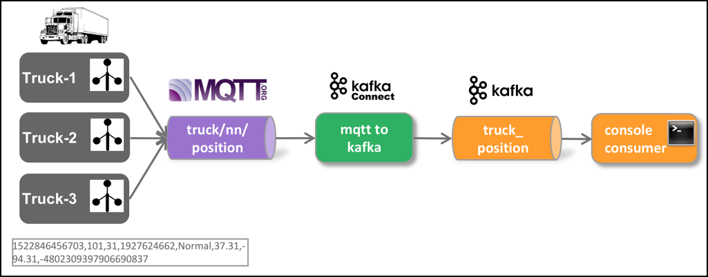

# IoT Data Ingestion through MQTT into Kafka
In this workshop we will be ingesting data not directly into Kafka but rather through MQTT first. We will be using a fictious Trucking company with a fleet of trucks constantly providing some data about the moving vehicles. 

The following diagram shows the setup of the data flow we will be implementing. Of course we will not be using any real-life data, but have a program simulating some drivers and their trucks.



## Adding a MQTT broker to Streaming Platform
Our streaming platform does not yet provide an MQTT broker.

So let's add a new service to the docker-compose.yml file we have created in [Setup of the Streaming Platform](../01-environment/README.md).

[Mosquitto](https://mosquitto.org/) is an easy to use MQTT broker, belonging to the Eclipse project. There is a docker images available for us on Docker Hub. Just make sure that the service is configured in the `docker-compose.yml` with the volume mapping as shown below.

```
  mosquitto-1:
    image: eclipse-mosquitto:latest
    hostname: mosquitto-1
    ports: 
      - "1883:1883"
      - "9001:9001"
    volumes:
      - ./mosquitto/mosquitto-1.conf:/mosquitto/config/mosquitto.conf
```

Mosquitto needs some configurations, which we can pass from outside in a file. First create a folder `mosquitto` below the `streamingplatform` folder. Inside this folder create the `mosquitto-1.conf` file and add the following configurations to this file:

```
persistence true
persistence_location /mosquitto/data/
log_dest file /mosquitto/log/mosquitto.log
```

With Docker Compose, you can easily later add some new services, even if the platform is currently running. If you redo a `docker-compose up -d`, Docker Compose will check if there is a delta between what is currently running and what the `docker-compose.yml` file tells. 

If there is a new service added, such as here with Mosquitto, Docker Compose will start the service, leaving the other, already running services untouched. 

If you change configuration on an already running service, then Docker will recreate that service applying the new settings. 

However, removing a service from the `docker-compose.yml` will not cause a running service to be stopped and removed. You have to do that manually. 

### Installing an MQTT Client
In order to be able to see what we are producing into MQTT, we need something similar to the `kafkacat` and `kafka-console-consumer` utilities. 

There are multiple tools available, some with a Web-UI and some with Rich-Client UI. 

One of the tools is the `mosquitto-sub`, which can be easly started using a docker container. Make sure that the `DOCKER_HOST_IP` is defined before starting it.

```
docker run -it --rm efrecon/mqtt-client sub -h $DOCKER_HOST_IP -t "truck/+/position" -v
```

Another tool is [MQTT.fx](http://mqttfx.jensd.de/), a rich client UI which you can either install on Linux, OS-X or Windows. 

## Running the Truck Simulator to publish to MQTT

Now with the MQTT broker and the MQTT client in place, let's produce some messages to the MQTT topics. 

For that we are using a Java simulator program (source Hortonworks). Download it and compile it locally. 

Java and Maven has already been installed in chapter 0. If it is not available, perform the following steps to both install a Java JDK and [Apache Maven](https://maven.apache.org/):

```
sudo add-apt-repository ppa:openjdk-r/ppa
sudo apt-get update
sudo apt-get install openjdk-8-jdk

sudo apt-get install maven
```

Now download the Zip-File with the Java sources and unzip it.

```
wget https://github.com/gschmutz/stream-processing-workshop/raw/master/06-iot-data-ingestion-over-mqtt/java-simulator/truck-client.zip
unzip truck-client.zip
rm truck-client.zip
```

Now let's compile it using Maven we have installed before. Make sure to execute the `mvn clean package` command where the `pom.xml` is located. 

```
cd truck-client
mvn clean package
```

And finally we can run it. 

```
mvn exec:java -Dexec.args="-s MQTT -f CSV -p 1883"
```

As soon as the simulator is up and running, you should see messages in the window with the `mosquitto-sub` running. 


## Create the Kafka Topic
Now let's create the topic `truck_position` in Kafka, where the message from MQTT should be integrated with. 

Connect into one of the broker containers using the `docker exec` command. 

```
docker exec -ti streamingplatform_broker-1_1 bash
```

Now using the `kafka-topics` command, create the truck_position topic. 

```
kafka-topics --zookeeper zookeeper:2181 --create --topic truck_position --partitions 8 --replication-factor 2
```

After successful creation, start a kafka-console-consumer to listen on messages on the truck_position topic. 

```
kafka-console-consumer --bootstrap-server broker-1:9092 --topic truck_position
```

```
kafkacat -b broker-1 -t truck_position
```

## Using Kafka Connect to bridge between MQTT and Kafka

In order to get the messages from MQTT into Kafka, we will be using Kafka Connect. Luckily, there are multiple Kafka Connectors available for MQTT. We will be using the one available from the [Landoop Stream-Reactor Project](https://github.com/Landoop/stream-reactor/tree/master/kafka-connect-mqtt) called `kafka-connect-mqtt`.

### Re-Configuring the Kafka Connect service
There is already a Kafka Connect service instance running as part of the Streaming Platform. However in order to be able to specify additional connect implementations without having to add them into the container, we need to change the configuration of the service. 
Therefore change the definition of the `connect` service in the `docker-compose.yml` to the following: 

```
  connect:
    image: confluentinc/cp-kafka-connect:5.0.0
    hostname: connect
    depends_on:
      - zookeeper
      - broker-1
      - schema_registry
    ports:
      - "8083:8083"
    environment:
      CONNECT_BOOTSTRAP_SERVERS: 'broker-1:9092'
      CONNECT_REST_ADVERTISED_HOST_NAME: connect
      CONNECT_REST_PORT: 8083
      CONNECT_GROUP_ID: compose-connect-group
      CONNECT_CONFIG_STORAGE_TOPIC: docker-connect-configs
      CONNECT_CONFIG_STORAGE_REPLICATION_FACTOR: 1
      CONNECT_OFFSET_FLUSH_INTERVAL_MS: 10000
      CONNECT_OFFSET_STORAGE_TOPIC: docker-connect-offsets
      CONNECT_OFFSET_STORAGE_REPLICATION_FACTOR: 1
      CONNECT_STATUS_STORAGE_TOPIC: docker-connect-status
      CONNECT_STATUS_STORAGE_REPLICATION_FACTOR: 1
      CONNECT_KEY_CONVERTER: io.confluent.connect.avro.AvroConverter
      CONNECT_KEY_CONVERTER_SCHEMA_REGISTRY_URL: 'http://schema_registry:8081'
      CONNECT_VALUE_CONVERTER: io.confluent.connect.avro.AvroConverter
      CONNECT_VALUE_CONVERTER_SCHEMA_REGISTRY_URL: 'http://schema_registry:8081'
      CONNECT_INTERNAL_KEY_CONVERTER: org.apache.kafka.connect.json.JsonConverter
      CONNECT_INTERNAL_VALUE_CONVERTER: org.apache.kafka.connect.json.JsonConverter
      CONNECT_ZOOKEEPER_CONNECT: 'zookeeper:2181'
      CONNECT_PLUGIN_PATH: "/usr/share/java,/etc/kafka-connect/custom-plugins"
      CONNECT_LOG4J_ROOT_LOGLEVEL: INFO
      CLASSPATH: /usr/share/java/monitoring-interceptors/monitoring-interceptors-4.0.0.jar
    volumes:
      - $PWD/kafka-connect:/etc/kafka-connect/custom-plugins
    restart: always
```

With this configuration in place, we have to re-create the connect service from scratch. One way would be to issue a `docker-compose down` following a `docker-compose up -d`. But this would cause all services to be recreated and we would lose all the work done so far. So instead of doing that, just selectively stop and remove the `connect` service, by executing the following commands.

```
docker stop streamingplatform_connect_1
docker rm streamingplatform_connect_1
```

And then with the `connect` service gone, let's recreate it running the docker-compose command

```
docker-compose up -d
```

### Download and deploy the kafka-connect-mqtt artefact

As part of the restart of the `connect` service, the `kafka-connect` folder mapped into the container should have been created on the Docker host. Make sure that it belongs to the `cas` user by executing the following command:

```
sudo chown cas:cas -R kafka-connect
```

Then navigate into the `kafka-connect` folder, create a folder `mqtt` and navigate into this folder.

```
mkdir mqtt
cd mqtt
```

In here, download the `kafka-connect-mqtt-1.0.0-1.0.0-all.tar.gz` file from the [Landoop Stream-Reactor Project](https://github.com/Landoop/stream-reactor/tree/master/kafka-connect-mqtt).

```
wget https://github.com/Landoop/stream-reactor/releases/download/1.0.0/kafka-connect-mqtt-1.0.0-1.0.0-all.tar.gz
```

Once it is successfully downloaded, untar it using this `tar` command. 

```
tar xvf kafka-connect-mqtt-1.0.0-1.0.0-all.tar.gz
```

Now let's restart Kafka connect in order to pick up the new connector. 

```
docker-compose restart connect
```

### Configure and start an MQTT Connector

Kafka Connect is already started as a service of the Streaming Platform and it exposes a REST API on Port 8083. 

For invoking the API, you can either use a REST client or the Linux `curl` command line utility, which should be available on the Docker host. Curl is what we are going to use here. 

Create a folder scripts and navigate into the folder. 

```
mkdir scripts
cd scripts
```

In there, create a script `start-mqtt.sh` and copy/paste the code below.  

```
#!/bin/bash

echo "removing MQTT Source Connector"

curl -X "DELETE" "$DOCKER_HOST_IP:8083/connectors/mqtt-source"

echo "creating MQTT Source Connector"

curl -X "POST" "$DOCKER_HOST_IP:8083/connectors" \
     -H "Content-Type: application/json" \
     -d $'{
  "name": "mqtt-source",
  "config": {
  	"connector.class": "com.datamountaineer.streamreactor.connect.mqtt.source.MqttSourceConnector",
  	"connect.mqtt.connection.timeout": "1000",
  	"tasks.max": "1",
  	"connect.mqtt.kcql": "INSERT INTO truck_position SELECT * FROM truck/+/position",
  	"name": "mqtt-source",
  	"connect.mqtt.connection.clean": "true",
  	"connect.mqtt.service.quality": "0",
  	"connect.mqtt.connection.keep.alive": "1000",
  	"connect.mqtt.client.id": "tm-mqtt-connect-01",
  	"connect.mqtt.converter.throw.on.error": "true",
  	"connect.mqtt.hosts": "tcp://mosquitto-1:1883"
	}
  }'
```

In there, also create a script `stop-mqtt.sh` for stopping the connector when no longer needed and add add the following code:

```
#!/bin/bash

echo "removing MQTT Source Connector"

curl -X "DELETE" "$DOCKER_HOST_IP:8083/connectors/mqtt-source"
```


The script first removes the MQTT connector, if it already exists and then creates it (again). 

Make sure it is executable

```
sudo chmod +x start-mqtt.sh
```

### Start the connector

Now let's start the connector by running the configure-mqtt script.

```
./scripts/start-mqtt.sh
```

The messages should start appear in the window with the `kafka-console-consumer` running. 

## Using StreamSets Data Collector to bridge between MQTT and Kafka
