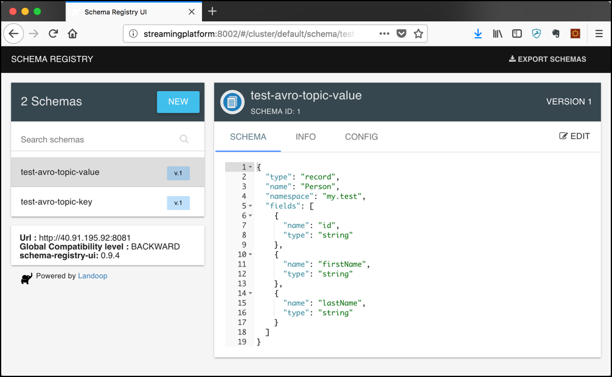

# Using Confluent's Python client for Apache Kafka

## Introduction

In this workshop we will learn how to use the [Confluent Python client for Apache Kafka](https://github.com/confluentinc/confluent-kafka-python).

You can perform this part of the workshop using either the Python installation of the Virtual Machine your Docker Host is running or use the Python as part of the Apache Zeppelin container, running as part of the Streaming Platform. 

To use Python inside the Apache Zeppelin container, use docker exec to connect into the container:

```bash
docker exec -ti zeppelin bash
```

## Installing the Confluent Python Client

If you are using the Python environment on the virtual machine, you first have to install PIP. 

```bash
sudo apt install python-pip
```

After that you can install the self-contained binaries of the Confluent Python client using 

```bash
pip install confluent-kafka
```

To install support for Avro, also perform the following step:

```bash
pip install fastavro
``` 

You can work with scripts and store each code block in a file. You can then execute it using `python script-name.py`. Or you can use the Apache Zeppelin notebook-based environment and just add each code block as a paragraph into a notebook and execute it from there.

## Working with Text Messages

Now let's write a simple program in Python which produces a message to the Kafka topic test-topic. This topic has been created in [Getting started with Apache Kafka](../02-working-with-kafka-broker/README.md).

In order to separate the Avro tests from the other tests, lets create a new topic:

```bash
kafka-topics --create \
             --if-not-exists \
             --bootstrap-server kafka-1:19092 \
             --topic test-python-topic  \
             --partitions 8 \
             --replication-factor 3
```

First we will produce messages. In order to see the results, run `kafkacat` in a separate terminal window and print the partition, key and value of each message:

```bash
kafkacat -b dataplatform -t test-python-topic -f "P-%p: %k=%s\n" -Z 
``` 

The following code segments assume that they are run inside the Zeppelin docker container. If you want to run them from the Docker Host, you have to replace broker-1 and broker-2 by the IP Address of the Docker Host.

### Producing messages with an empty key

The following code block will generate a message with a NULL key. The messages are part 

```python
from confluent_kafka import Producer

p = Producer({'bootstrap.servers': 'kafka-1:19092,kafka-2:19093'})
messages = ["message1","message2","message3"]

def delivery_report(err, msg):
    """ Called once for each message produced to indicate delivery result.
        Triggered by poll() or flush(). """
    if err is not None:
        print('Message delivery failed: {}'.format(err))
    else:
        print('Message delivered to {} [{}]'.format(msg.topic(), msg.partition()))

for data in messages:
    # Trigger any available delivery report callbacks from previous produce() calls
    p.poll(0)

    # Asynchronously produce a message, the delivery report callback
    # will be triggered from poll() above, or flush() below, when the message has
    # been successfully delivered or failed permanently.
    p.produce('test-topic', data.encode('utf-8'), callback=delivery_report)

# Wait for any outstanding messages to be delivered and delivery report
# callbacks to be triggered.
p.flush()
```

### Producing messages with a key and value

To also produce a key, you have to also use the parameter `key` together with the parameter `value`.

```python
    p.produce('test-python-topic'
             , key="1"
             , value = data.encode('utf-8')
             , callback=delivery_report)
```

### Consuming messages

To consume text messages through python, use the following code segment. Make sure that you use a unique `group.id`. 

```python
from confluent_kafka import Consumer, KafkaError

c = Consumer({
    'bootstrap.servers': 'dataplatform:9092, dataplatform:9093',
    'group.id': 'test-consumer-group',
    'default.topic.config': {
        'auto.offset.reset': 'largest'
    }
})

c.subscribe(['test-python-topic'])

go_on = True
while go_on:
    msg = c.poll(1.0)

    if msg is None:
        continue
    if msg.error():
        if msg.error().code() == KafkaError._PARTITION_EOF:
            continue
        else:
            print(msg.error())
            break

    print('Received message: {}'.format(msg.value().decode('utf-8')))
    if msg.value().decode('utf-8') == "STOP":
        go_on = False
        
c.close()
```

When started, this code block will consume messages in an endless loop, so if you use it in the same Zeppelin notebook, you will have to run the producer externally, i.e. using Kafkacat in order to see some messages. 

```bash
kafkacat -P -b dataplatform -t test-python-topic
```

## Working with Avro Messages

The Confluent Python client also supports working with Avro formatted messages. It works together with the [Confluent Schema Registry](https://docs.confluent.io/current/schema-registry/docs/index.html). 

In order to separate the Avro tests from the other tests, lets create a new topic:

```bash
kafka-topics --create \
             --if-not-exists \
             --bootstrap-server kafka-1:19092 \
             --topic test-python-avro-topic \
             --partitions 8 \
             --replication-factor 3
```

Make sure that you change the **kafkacat** command to consume from the new topic.

```bash
kafkacat -b dataplatform -t test-python-avro-topic -f "P-%p: %k=%s\n" -Z 
``` 

### Register Avro Schema

First lets register the Avro schema in the registry, using Python as well

```python
from confluent_kafka.schema_registry import SchemaRegistryClient

def register_schema(schema_registry_url, schema_registry_subject, schema_str):
    sr = SchemaRegistryClient({'url': schema_registry_url})
    schema = Schema(schema_str, schema_type="AVRO")
    schema_id = sr.register_schema(subject_name=schema_registry_subject, schema=schema)

    return schema_id
    
schema_registry_url = 'http://schema-registry-1:8081'

schema_registry_conf = {'url': schema_registry_url}
schema_registry_client = SchemaRegistryClient(schema_registry_conf)

schema_str = """
{
   "namespace": "my.test",
   "name": "Person",
   "type": "record",
   "fields" : [
     {
       "name" : "id",
       "type" : "string"
     },
     {
       "name" : "firstName",
       "type" : "string"
     },
     {
       "name" : "lastName",
       "type" : "string"
     }
   ]
}
"""

topic = "test-avro-topic"
schema_registry_subject = topic + "-value"

schema_id = register_schema(schema_registry_url, schema_registry_subject, schema_str)
print(schema_id)    
```


### View schemas using REST API

The Schema Registry provides a REST API which is documented in the [Confluent documentation](https://docs.confluent.io/current/schema-registry/develop/api.html).

To list all the schemas which are registered through the REST API, perform the following command 

```bash
curl http://dataplatform:8081/subjects
```

You should get back the two subjects:

```bash
$ curl http://dataplatform:8081/subjects
["test-avro-topic-value","test-avro-topic-key"]~
```

You can ask for the versions available for a given subject by using the following command

```bash
curl http://dataplatform:8081/subjects/test-avro-topic-value/versions
```

and you should see that there is currently just one version available

```bash
$ curl http://dataplatform:8081/subjects/test-avro-topic-value/versions
[1]
```

To get the schema definition for that schema, use the following command

```bash
curl http://dataplatform:8081/subjects/test-avro-topic-value/versions/1
```

and the schema is returned as shown below

```bash
$ curl http://dataplatform:8081/subjects/test-avro-topic-value/versions/1

{"subject":"test-avro-topic-value","version":1,"id":1,"schema":"{\"type\":\"record\",
\"name\":\"Person\",\"namespace\":\"my.test\",\"fields\":[{\"name\":\"id\",\"type\":
\"string\"},{\"name\":\"firstName\",\"type\":\"string\"},{\"name\":\"lastName\",
\"type\":\"string\"}]}"}
```

### View schemas using Schema Registry UI

To browse the Schema Registry using the browser-based [Landoop Schema Registry UI](http://www.landoop.com/blog/2016/08/schema-registry-ui/), navigate to the following URL: <http://dataplatform:8081>.

You should see the two schemas registered. If you click on one of them, the Avro Schema will be displayed on the right side:



### Produce a single Avro Message

The following Python code produces an Avro message 

```python
from uuid import uuid4

from confluent_kafka import Producer
from confluent_kafka.serialization import StringSerializer, SerializationContext, MessageField
from confluent_kafka.schema_registry import SchemaRegistryClient
from confluent_kafka.schema_registry.avro import AvroSerializer

def get_schema_from_schema_registry(schema_registry_url, schema_registry_subject):
    sr = SchemaRegistryClient({'url': schema_registry_url})
    latest_version = sr.get_latest_version(schema_registry_subject)

    return sr, latest_version
    
bootstrap_servers = "kafka-1:19092,kafka-2:19093"
topic = "test-avro-topic"
schema_registry_subject = topic + "-value"

schema_registry_url = 'http://schema-registry-1:8081'

schema_registry_conf = {'url': schema_registry_url}
schema_registry_client = SchemaRegistryClient(schema_registry_conf)

sr, latest_version = get_schema_from_schema_registry(schema_registry_url, schema_registry_subject)
schema_str = latest_version.schema.schema_str

def delivery_report(err, msg):
    """ Called once for each message produced to indicate delivery result.
        Triggered by poll() or flush(). """
    if err is not None:
        print('Message delivery failed: {}'.format(err))
    else:
        print('Message delivered to {} [{}]'.format(msg.topic(), msg.partition()))
        
person = {"id":"1001", "firstName": "Peter", "lastName": "Muster"}

value_avro_serializer = AvroSerializer(schema_registry_client,
                                         schema_str,                                        
                                )

string_serializer = StringSerializer('utf_8')

producer_conf = {'bootstrap.servers': bootstrap_servers}

producer = Producer(producer_conf)

producer.produce(topic=topic,
                key=string_serializer(str(uuid4())),
                value=value_avro_serializer(person, SerializationContext(topic, MessageField.VALUE)),
                on_delivery=delivery_report)

producer.flush()                        
```

### Consuming Avro Messages

The following Python code produces an Avro message 

```python
from uuid import uuid4

from confluent_kafka import Consumer
from confluent_kafka.serialization import StringDeserializer, SerializationContext, MessageField
from confluent_kafka.schema_registry import SchemaRegistryClient
from confluent_kafka.schema_registry.avro import AvroDeserializer

def get_schema_from_schema_registry(schema_registry_url, schema_registry_subject):
    sr = SchemaRegistryClient({'url': schema_registry_url})
    latest_version = sr.get_latest_version(schema_registry_subject)

    return sr, latest_version

bootstrap_servers = "kafka-1:19092,kafka-2:19093"
topic = "test-avro-topic"
schema_registry_subject = topic + "-value"

schema_registry_url = 'http://schema-registry-1:8081'

schema_registry_conf = {'url': schema_registry_url}
schema_registry_client = SchemaRegistryClient(schema_registry_conf)

sr, latest_version = get_schema_from_schema_registry(schema_registry_url, schema_registry_subject)
schema_str = latest_version.schema.schema_str

avro_deserializer = AvroDeserializer(schema_registry_client,
                                         schema_str)

consumer_conf = {'bootstrap.servers': bootstrap_servers,
                     'group.id': 'python-cg',
                     'auto.offset.reset': "earliest"}

consumer = Consumer(consumer_conf)
consumer.subscribe([topic])

while True:
    try:
        # SIGINT can't be handled when polling, limit timeout to 1 second.
        msg = consumer.poll(1.0)
        if msg is None:
            continue

        person = avro_deserializer(msg.value(), SerializationContext(msg.topic(), MessageField.VALUE))
        if person is not None: 
            print (person)
    except KeyboardInterrupt: 
        break        
consumer.close() 
```

### Consuming Avro Messages using Kafkacat 

But what about the output of Kafkacat? We can see that the message is shown, although not very readable. 

```bash
> kafkacat -b dataplatform -t test-avro-topic -f "P-%p: %k=%s\n" -Z
% Auto-selecting Consumer mode (use -P or -C to override)
P-5:10011001
Peter
     Muster
```     

This is even more problematic if the Avro message is much larger with much more properties. 
**Kafkacat** cannot yet work with Avro messages. But there is a special version of the `kafka-console-consumer` utility, the `kafka-avro-console-consumer'. 

### Consuming Messages using `kafka-avro-console-consumer`

On the Streaming Platform, this is part of the schema registry docker container. Let's connect to the docker container:

```bash
docker exec -ti schema-registry bash
```

and run the `kafka-avro-console-consumer`

```bash
kafka-avro-console-consumer --bootstrap-server kafka-1:19092,kafka-2:19093 --topic test-avro-topic
```

If you re-run the Avro producer python snippet, then you should see the Avro message in a readable JSON formatted document.

```
{"id":"1001","firstName":"Peter","lastName":"Muster"}
```


