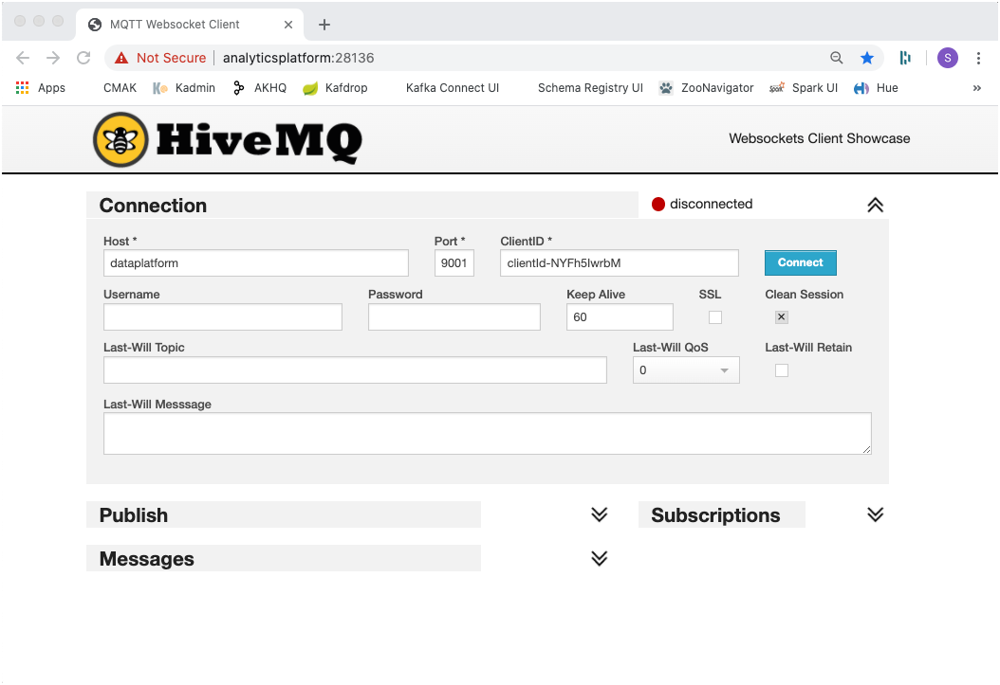

# IoT Data Ingestion through MQTT into Kafka
In this workshop we will be ingesting data not directly into Kafka but rather through MQTT first. We will be using a fictitious Trucking company with a fleet of trucks constantly providing some data about the moving vehicles. 

The following diagram shows the setup of the data flow we will be implementing. 


We will not be using any real-life data, but have a program simulating some drivers and their trucks.

Our **Data Platform** does already provide all the services we need in this workshop, such as an **MQTT broker** and of course **Apache Kafka**. 

The services related to mqtt are `mosquitto-1` an easy to use MQTT broker, belonging to the [Eclipse project](https://mosquitto.org/) and `mqtt-ui`, a UI to browse into any MQTT broker. 

```
  mosquitto-1:
    image: eclipse-mosquitto:latest
    hostname: mosquitto-1
    container_name: mosquitto-1
    ports:
      - 1883:1883
      - 9001:9001
    volumes:
      - ./data-transfer:/data-transfer
      - ./conf/mosquitto/mosquitto.conf:/mosquitto/config/mosquitto.conf
    restart: unless-stopped

  mqtt-ui:
    image: vergissberlin/hivemq-mqtt-web-client:latest
    container_name: mqtt-ui
    hostname: mqtt-ui
    labels:
      com.mdps.service.webui.name: HiveMQ UI
      com.mdps.service.webui.url: http://${PUBLIC_IP}:28136
    ports:
      - 28136:80
    volumes:
      - ./data-transfer:/data-transfer
    restart: unless-stopped
```

The configuration of mosquitto can be found in the  `./conf/mosquittto/mosquitto.conf` file, which is volume mapped into the `mosquitto-1` container:

```
persistence true
persistence_location /mosquitto/data/
log_dest file /mosquitto/log/mosquitto.log

listener 1883
listener 9001
protocol websockets
```

### Using an MQTT Client

In order to be able to see what we are producing into MQTT, we need something similar to the `kafkacat` and `kafka-console-consumer` utilities. 

In this workshop we show two options for consuming from MQTT
 
 * use dockerized MQTT client in the terminal
 * use browser-based HiveMQ Web UI

#### Using Dockerized MQTT Client

To start consuming using through a command line, perform the following docker command:

```
docker run -it --rm efrecon/mqtt-client sub -h $DOCKER_HOST_IP -p 1883 -t "truck/+/position" -v
```

The consumed messages will show up in the terminal.

#### Using HiveMQ Web UI  

To start consuming using the MQTT UI ([HiveMQ Web UI](https://www.hivemq.com/docs/3.4/web-ui/introduction.html)), navigate to <http://dataplatform:28136> and connect using `dataplatform` for the **Host** field, `9001 ` for the **Port** field and then click on **Connect**: 


	
When successfully connected, click on Add New Topic Subscription and enter `truck/+/position` into **Topic** field and click **Subscribe**:
	

	
Alternatively you can also use the [MQTT.fx](https://mqttfx.jensd.de/) or the [MQTT Explorer](https://mqtt-explorer.com/) applications to browse for the messages on the MQTT broker. They are both available for installation on Mac or Windows. 
 
Now with the MQTT broker and the MQTT client in place, let's produce some messages to the MQTT topics. 

## Running the Truck Simulator to publish to MQTT

For simulating truck data, we are going to use a Java program (adapted from Hortonworks) and maintained in this [GitHub project](https://github.com/TrivadisBDS/various-bigdata-prototypes/tree/master/streaming-sources/iot-truck-simulator/impl). It can be started either using Maven or Docker. We will be using it as a Docker container. 

The simulator can produce data either to a **Kafka** or **MQTT**. These two options are shown below. 

Producing truck events to the MQTT broker on port 1883 is as simple as running the `trivadis/iot-truck-simulator` docker image.

```
docker run trivadis/iot-truck-simulator '-s' 'MQTT' '-h' $DOCKER_HOST_IP '-p' '1883' '-f' 'CSV'
```

As soon as messages are produced to MQTT, you should see them either on the CLI or in the MQTT UI (Hive MQ) as shown below.


## Creating the necessary Kafka Topics

The Kafka cluster is configured with `auto.topic.create.enable` set to `false`. Therefore we first have to create all the necessary topics, using the `kafka-topics` command line utility of Apache Kafka. 

We can easily get access to the `kafka-topics` CLI by navigating into one of the containers for the 3 Kafka Brokers. Let's use `broker-1`

```
docker exec -ti broker-1 bash
```

First let's see all existing topics

```
kafka-topics --zookeeper zookeeper-1:2181 --list
```

Now let's create the topic `truck_position` in Kafka, where the message from MQTT should be integrated with. 
```
kafka-topics --zookeeper zookeeper-1:2181 --create --topic truck_position --partitions 8 --replication-factor 2
```

Make sure to exit from the container after the topics have been created successfully.

```
exit
```

If you don't like to work with the CLI, you can also create the Kafka topics using the [CMAK GUI](http://dataplatform:28104). 

After successful creation, start a `kafka-console-consumer` or `kafkacat` to consume messages from the  `truck_position` topic. 

Use either

```
kafka-console-consumer --bootstrap-server kafka-1:19092 --topic truck_position
```

or 

```
kafkacat -b dataplatform -t truck_position
```

## Using Kafka Connect to bridge between MQTT and Kafka

In order to get the messages from MQTT into Kafka, we will be using Kafka Connect. Luckily, there are multiple Kafka Connectors available for MQTT. We can either use the one provided by [Confluent Inc.](https://www.confluent.io/connector/kafka-connect-mqtt/) (in preview and available as evaluation license on Confluent Hub) or the one provided as part of the [Landoop Stream-Reactor Project](https://github.com/Landoop/stream-reactor/tree/master/kafka-connect-mqtt) available on GitHub. We will be using the Landoop MQTT Connector. 

Check-out the [IoT Truck Demo Tutorial](https://github.com/gschmutz/iot-truck-demo) to see the Confluent MQTT Connector in Action. 

### Adding the Kafka Connect Service 

There are two instances of the Kafka Connect service instance running as part of the Streaming Platform, `connect-1` and `connect-2`. To be able to add the connector implementations, without having to copy them into the docker container (or even create a dedicated docker image), both connect services are configured to retrieve additional implementations from the local folder `/etc/kafka-connect/custom-plugins`. This folder is mapped as a volume to the `kafka-connect` folder outside of the container. 

In that `kafka-connect` folder we need to copy the artefacts of the Kafka connectors we want to use. 

### Download and deploy the kafka-connect-mqtt artefact

Navigate into the `kafka-connect` folder 

```
cd plugins/kafka-connect
```

and download the `kafka-connect-mqtt-1.2.3-2.1.0-all.tar.gz` file from the [Landoop Stream-Reactor Project](https://github.com/Landoop/stream-reactor/tree/master/kafka-connect-mqtt) project.

```
wget https://github.com/Landoop/stream-reactor/releases/download/1.2.3/kafka-connect-mqtt-1.2.3-2.1.0-all.tar.gz
```

Once it is successfully downloaded, uncompress it using this `tar` command and remove the file. 

```
mkdir kafka-connect-mqtt-1.2.3-2.1.0-all && tar xvf kafka-connect-mqtt-1.2.3-2.1.0-all.tar.gz -C kafka-connect-mqtt-1.2.3-2.1.0-all
rm kafka-connect-mqtt-1.2.3-2.1.0-all.tar.gz
```

Now let's restart Kafka connect in order to pick up the new connector. 

```
docker-compose restart kafka-connect-1 kafka-connect-2
```

The connector has now been added to the Kafka cluster. You can confirm that by watching the log file of the two containers:

```
docker-compose logs -f kafka-connect-1 kafka-connect-2
```

After some time you should see an output similar to the one below with a message that the MQTT connector has been added and later that the connector finished starting successfully ...

```
...
connect-2             | [2019-06-08 18:01:02,590] INFO Registered loader: PluginClassLoader{pluginLocation=file:/etc/kafka-connect/custom-plugins/kafka-connect-mqtt-1.2.1-2.1.0-all/} (org.apache.kafka.connect.runtime.isolation.DelegatingClassLoader)
connect-2             | [2019-06-08 18:01:02,591] INFO Added plugin 'com.datamountaineer.streamreactor.connect.mqtt.source.MqttSourceConnector' (org.apache.kafka.connect.runtime.isolation.DelegatingClassLoader)
connect-2             | [2019-06-08 18:01:02,591] INFO Added plugin 'com.datamountaineer.streamreactor.connect.mqtt.sink.MqttSinkConnector' (org.apache.kafka.connect.runtime.isolation.DelegatingClassLoader)
connect-2             | [2019-06-08 18:01:02,592] INFO Added plugin 'com.datamountaineer.streamreactor.connect.converters.source.JsonResilientConverter' (org.apache.kafka.connect.runtime.isolation.DelegatingClassLoader)
connect-2             | [2019-06-08 18:01:02,592] INFO Added plugin 'com.landoop.connect.sql.Transformation' (org.apache.kafka.connect.runtime.isolation.DelegatingClassLoader)
...
connect-2             | [2019-06-08 18:01:11,520] INFO Starting connectors and tasks using config offset -1 (org.apache.kafka.connect.runtime.distributed.DistributedHerder)
connect-2             | [2019-06-08 18:01:11,520] INFO Finished starting connectors and tasks (org.apache.kafka.connect.runtime.distributed.DistributedHerder)

```

### Configure the MQTT Connector

For creating an instance of the connector over the API, you can either use a REST client or the Linux `curl` command line utility, which should be available on the Docker host. Curl is what we are going to use here. 

Create a folder scripts and navigate into the folder. 

```
mkdir scripts
cd scripts
```

In the `scripts` folder, create a file `start-mqtt.sh` and add the code below.  

```
#!/bin/bash

echo "removing MQTT Source Connector"

curl -X "DELETE" "$DOCKER_HOST_IP:8083/connectors/mqtt-truck-position-source"


echo "creating MQTT Source Connector"

curl -X "POST" "$DOCKER_HOST_IP:8083/connectors" \
     -H "Content-Type: application/json" \
     -d '{
  "name": "mqtt-truck-position-source",
  "config": {
    "connector.class": "com.datamountaineer.streamreactor.connect.mqtt.source.MqttSourceConnector",
    "connect.mqtt.connection.timeout": "1000",
    "tasks.max": "1",
    "connect.mqtt.kcql": "INSERT INTO truck_position SELECT * FROM truck/+/position",
    "connect.mqtt.connection.clean": "true",
    "connect.mqtt.service.quality": "0",
    "connect.mqtt.connection.keep.alive": "1000",
    "connect.mqtt.client.id": "tm-mqtt-connect-01",
    "connect.mqtt.converter.throw.on.error": "true",
    "connect.mqtt.hosts": "tcp://mosquitto-1:1883"
  }
  }'
```

The script first removes the MQTT connector, if it already exists and then creates it (again). 

Also create a separate script `stop-mqtt.sh` for just stopping the connector and add the following code:

```
#!/bin/bash

echo "removing MQTT Source Connector"

curl -X "DELETE" "$DOCKER_HOST_IP: 8083/connectors/mqtt-source"
```


Make sure that the both scripts are executable

```
sudo chmod +x start-mqtt.sh
sudo chmod +x stop-mqtt.sh
```

### Start the MQTT connector

Finally let's start the connector by running the `start-mqtt` script.

```
./scripts/start-mqtt.sh
```

A soon as the connector starts getting the messages from MQTT, they should start appearing on the console where the Kafka consumer is running. 

### Monitor connector in Kafka Connect UI

Navigate to the [Kafka Connect UI](http://dataplatform:28103) to see the connector running.
