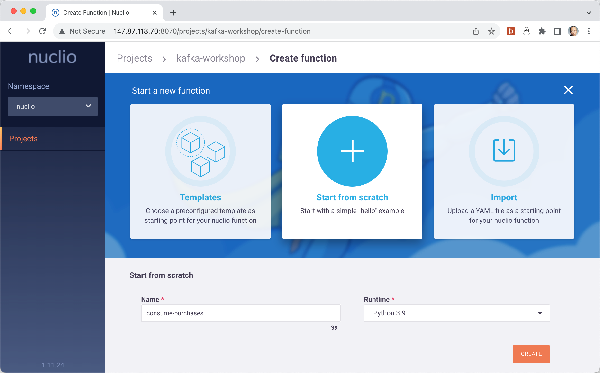

# Function as a Service (FaaS) with Kafka and Nuclio

In this workshop we will learn how to use [Nuclio](https://nuclio.io/) to implement serverless functions to consume from Kafka. We will be using Python to implement the function.

You can find many examples of using Nuclio with various languages [here](https://nuclio.io/docs/latest/examples/).

This guide assumes that you already have a dataplatform with Kafka and Nuclio available.

We will be using the [Streaming Synthetic Sales Data Generator](https://github.com/garystafford/streaming-sales-generator) we have used in [Getting started with Apache Kafka](./02-working-with-kafka-broker) to produce sales orders to a Kafka topic. Nuclio will then be used to consume the messages and process them with a serverless functions.

For the creation of the serverless function, we will use the [Nuclio GUI](http://dataplatform:8070). 

## Setup

### Creating the necessary Kafka Topics

Let's create the necessary 3 topics, if they no longer exist:

```bash
docker exec -ti kafka-1 kafka-topics --create --bootstrap-server kafka-1:19092 --topic demo.products --replication-factor 3 --partitions 8

docker exec -ti kafka-1 kafka-topics --create --bootstrap-server kafka-1:19092 --topic demo.purchases --replication-factor 3 --partitions 8

docker exec -ti kafka-1 kafka-topics --create --bootstrap-server kafka-1:19092 --topic demo.inventories --replication-factor 3 --partitions 8
```

## Working with Nuclio

Let's navigate to the [Nuclio GUI](http://dataplatform:8070). You should see the projects, with the **default** project being the only one available.


Let's create a new project by clicking **NEW PROJECT**. In the pop-up window, enter `kafka-workshop` for **Project name** and `Kafka Workshop` for the **Description** and click **CREATE**. The new project should appear in the list of projects. 

Navigate into the newly created project and you will see the 3 different options to **Start a new function**:


Let's start from scratch by clicking on **Start from scratch**. Enter `consume-purchases` into **Name**, select `Python 3.9` for the **Runtime** and click **CREATE**.



A new page will appear, with the function code to the left.


Let's implement the handler

```python
def handler(context, event):
    body = event.body.decode('utf-8')
    context.logger.info('New message received from Kafka:' + body)
    return ""
```

Navigate to **TRIGGERS** 


and click on **Create a new trigger**

Enter `kafka-purchases` into the **Name** field and select `Kafka` from the **Class** drop-down.

Now enter `kafka-1:19092` into the **Brokers** field, `demo.purchases` into the **Topics** field and `nuclio-purchases-cg` into the **Consumer group name**. Select `3` for the **Max workers** drop-down. We don't need to change any of the **Advanced** options.


Navigate back to **CODE**. As we have used the container name of Kafka to connect to the Kafka broker, we have to make sure, that the Docker container, Nuclio will create for the function is started in the same network as the Kafka cluster. 

We can not control that over the Nuclio GUI, but it is available as an [inline configuration snippet](https://github.com/nuclio/nuclio/blob/master/docs/tasks/deploying-functions.md#providing-configuration-via-inline-configuration) in your functions source code

```
# @nuclio.configure
# function.yaml:
#   spec:
#     platform:
#       attributes:
#         network: kafka-workshop
def handler(context, event):
    context.logger.info('message received from Kafka')
    return ""
```

Click on **DEPLOY** to deploy the serverless function for the first time. You should see a **Successfully deployed** message.

Let's do a `docker ps | grep nuclio` to see the docker container started by 

```bash
$ docker ps | grep nuclio
bbdfd35cb484   nuclio/processor-consume-purchases:latest   "processor"               32 second ago  Up Less than 31 second    0.0.0.0:32770->8080/tcp            nuclio-nuclio-consume-purchases
b519d987df2d   gcr.io/iguazio/alpine:3.17                  "/bin/sh -c '/bin/sl…"    5 hours ago    Up 5 hours                                                   nuclio-local-storage-reader
82f8a1f8707a   quay.io/nuclio/dashboard:stable-amd64       "/docker-entrypoint.…"    7 hours ago    Up 7 hours (healthy)      80/tcp, 0.0.0.0:8070->8070/tcp     nuclio
```

We can see that a new container named `nuclio-nuclio-consume-purchases` has been started a few seconds ago. This is the container running the Nuclio serverless function. 


Now let's quickly test that the serverless function is invoked. We are not yet using the simulator but only send one single example message using `kcat`. 

Before we send to Kafka, let's see the log of the container where the function is running in

```bash
docker logs -f nuclio-nuclio-consume-purchases
```

And in another terminal, now let's send a sample message.

Add the following sample purchase to a file named `purchase-1.json`

```json
{
  "transaction_time": "2023-08-12 18:53:00.114048",
  "transaction_id": "6951846465568416216",
  "product_id": "SF07",
  "price": 5.99,
  "quantity": 1,
  "is_member": true,
  "member_discount": 0.1,
  "add_supplements": false,
  "supplement_price": 0.0,
  "total_purchase": 5.39
}
```

Now use `kcat` to send the message to the Kafka topic

```bash
kcat -b dataplatform -t demo.purchases -P purchase-1.json
```

and you should see the output of the log message from the serverless function in the log of the container

```bash
$ docker logs -f nuclio-nuclio-consume-purchases
...
23.08.13 17:13:00.537 er.kafka-purchases.sarama (D) Sarama: client/metadata fetching metadata for all topics from broker kafka-1:19092
23.08.13 17:23:00.537 er.kafka-purchases.sarama (D) Sarama: client/metadata fetching metadata for all topics from broker kafka-1:19092
23.08.13 17:33:00.537 er.kafka-purchases.sarama (D) Sarama: client/metadata fetching metadata for all topics from broker kafka-1:19092
23.08.13 17:43:00.537 er.kafka-purchases.sarama (D) Sarama: client/metadata fetching metadata for all topics from broker kafka-1:19092
23.08.13 17:52:40.359 -cluster.w0.python.logger (I) New message received from Kafka:{
  "transaction_time": "2023-08-12 18:53:00.114048",
  "transaction_id": "6951846465568416216",
  "product_id": "SF07",
  "price": 5.99,
  "quantity": 1,
  "is_member": true,
  "member_discount": 0.1,
  "add_supplements": false,
  "supplement_price": 0.0,
  "total_purchase": 5.39
}
 {"worker_id": "0"}
23.08.13 17:53:00.536 er.kafka-purchases.sarama (D) Sarama: client/metadata fetching metadata for all topics from broker kafka-1:19092
```

So the basic functionality of retrieving a message from Kafka works. Now let's add some functionality to process the message. We will simply write each message to a Redis Key/Value store. 

For Redis will use the [`redis-py`](https://github.com/redis/redis-py#advanced-topics) Python Redis client. We can install it into the container by adding it to the Configuration of the image. 

In the Nuclio GUI, navigate back to the `consume-purchases` function and select the **CONFIGURATION** tab. Scroll down to the **Build** canvas and add  `pip install redis` to the **Build commands** edit field.


Again click on **DEPLOY** to redeploy the container. You can also click on **STATUS** to see the log of the deployment


Again the deployment should be successful. 

Now let's add the necessary code to the function.

The `body` we get into the function is of type String. So we are using the built-in `json` package to parse the JSON string into a Python dictionary. 
Next we connect to Redis using the `redis` package and then use the `set` command to add the purchase document as a value to Redis, using the `transaction_id` as the key. We will add it to Redis with a time to live of 120 seconds. 


```python
# @nuclio.configure
# function.yaml:
#   spec:
#     platform:
#       attributes:
#         network: kafka-workshop
import redis
import json

def handler(context, event):
    body = event.body.decode('utf-8')
    body_json = json.loads(body)
    
    context.logger.info('New message received from Kafka:' + body)
    
    r = redis.Redis(host='redis-1', port=6379, password='abc123!', db=0)
    r.set(body_json["transaction_id"], body, ex=120)
    return ""
```

Let's test it once again with our sample purchase message:

```bash
kcat -b dataplatform -t demo.purchases -P purchase-1.json
```

Navigate to Redis Commander on <http://dataplatform:28119> to see the new entry:


It will automatically "disappear" once the 120 seconds have expired. 

Now let's see the solution in action using the Sales Data Generator to generate messages.

```bash
docker run -ti --network kafka-workshop trivadis/sales-data-generator:latest
```

Refresh the Redis Commander window to see new key/value pairs constantly be added and after 120 seconds being automatically removed.


