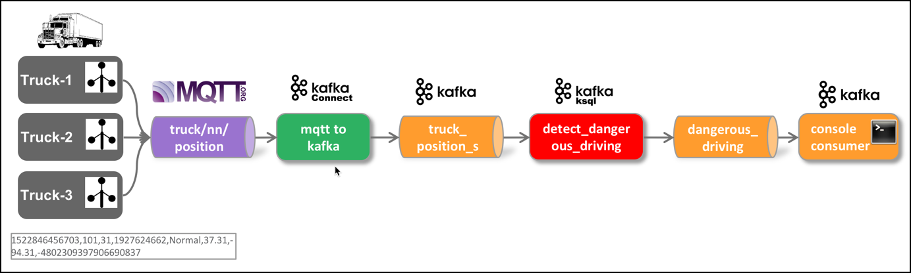

# Stream Processing using Kafka Streams

Let's redo the simple message filtering process of the previous workshop, using Kafka Streams instead of KSQL. 



## Create the project in Eclipse IDE

Start the Eclipse IDE if not yet done. 

Create a new [Maven project](../99-misc/97-working-with-eclipse/README.md) and in the last step use `com.trivadis.kafkastreams` for the **Group Id** and `kafka-streams-truck` for the **Artifact Id**.

Navigate to the **pom.xml** and double-click on it. The POM Editor will be displayed. 

You can either use the GUI to edit your pom.xml or click on the last tab **pom.xml** to switch to the "code view". Let's do that. 

You will see the still rather empty definition.

```xml
<project xmlns="http://maven.apache.org/POM/4.0.0" xmlns:xsi="http://www.w3.org/2001/XMLSchema-instance" xsi:schemaLocation="http://maven.apache.org/POM/4.0.0 http://maven.apache.org/xsd/maven-4.0.0.xsd">
  <modelVersion>4.0.0</modelVersion>
  <groupId>com.trivadis.kafkastreams</groupId>
  <artifactId>kafka-streams-truck</artifactId>
  <version>0.0.1-SNAPSHOT</version>
  
  <properties>
    <project.build.sourceEncoding>UTF-8</project.build.sourceEncoding>
  </properties>

  <dependencies>
    <dependency>
      <groupId>junit</groupId>
      <artifactId>junit</artifactId>
      <version>3.8.1</version>
      <scope>test</scope>
    </dependency>
  </dependencies>  
</project>
```

Let's add some initial dependencies for our project. We will add some more dependencies to the POM throughout this workshop.

Copy the following block right after the <version> tag, before the closing </project> tag.


```xml
    <properties>
    	<confluent.version>5.3.0</confluent.version>
    	<kafka.version>2.3.0</kafka.version>
        <avro.version>1.9.0</avro.version>
        <docker.skip-build>false</docker.skip-build>
        <docker.skip-test>false</docker.skip-test>
	        <java.version>1.8</java.version>
		<maven.compiler.target>1.8</maven.compiler.target>
		<maven.compiler.source>1.8</maven.compiler.source>
        <project.build.sourceEncoding>UTF-8</project.build.sourceEncoding>
    </properties>
    
	<repositories>
		<repository>
			<id>confluent</id>
			<url>https://packages.confluent.io/maven/</url>
		</repository>
	</repositories>

	<dependencies>

		<!-- https://mvnrepository.com/artifact/org.slf4j/slf4j-log4j12 -->
        <dependency>
            <groupId>org.slf4j</groupId>
            <artifactId>slf4j-log4j12</artifactId>
            <version>1.7.26</version>
        </dependency>
        
        <dependency>
            <groupId>io.confluent</groupId>
            <artifactId>kafka-streams-avro-serde</artifactId>
            <version>${confluent.version}</version>
        </dependency>
        <dependency>
            <groupId>io.confluent</groupId>
            <artifactId>kafka-avro-serializer</artifactId>
            <version>${confluent.version}</version>
        </dependency>
        <dependency>
            <groupId>io.confluent</groupId>
            <artifactId>kafka-schema-registry-client</artifactId>
            <version>${confluent.version}</version>
        </dependency>
        <dependency>
            <groupId>org.apache.kafka</groupId>
            <artifactId>kafka-streams</artifactId>
            <version>${kafka.version}</version>
        </dependency>

        <dependency>
            <groupId>org.apache.avro</groupId>
            <artifactId>avro</artifactId>
            <version>${avro.version}</version>
        </dependency>
		
		<dependency>
			<groupId>commons-cli</groupId>
			<artifactId>commons-cli</artifactId>
			<version>1.4</version>
		</dependency>
		
		<dependency>
			<groupId>org.apache.commons</groupId>
			<artifactId>commons-lang3</artifactId>
			<version>3.7</version>
		</dependency>
	</dependencies>
	<build>
		<extensions>
			<extension>
				<groupId>org.apache.maven.archetype</groupId>
				<artifactId>archetype-packaging</artifactId>
				<version>2.2</version>
			</extension>
		</extensions>
		<pluginManagement>
			<plugins>
				<plugin>
					<groupId>org.apache.maven.plugins</groupId>
					<artifactId>maven-archetype-plugin</artifactId>
					<version>2.2</version>
				</plugin>
			</plugins>
		</pluginManagement>
		<plugins>
			<plugin>
				<groupId>org.apache.maven.plugins</groupId>
				<artifactId>maven-compiler-plugin</artifactId>
				<version>3.6.1</version>
				<configuration>
					<source>1.8</source>
					<target>1.8</target>
				</configuration>
			</plugin>
			<plugin>
				<groupId>org.codehaus.mojo</groupId>
				<artifactId>exec-maven-plugin</artifactId>
				<version>1.2.1</version>
				<executions>
					<execution>
						<goals>
							<goal>java</goal>
						</goals>
					</execution>
				</executions>
				<configuration>
					<mainClass>KafkaStreamsExample</mainClass>
					<arguments>
					</arguments>
				</configuration>
			</plugin>

			<plugin>
				<artifactId>maven-archetype-plugin</artifactId>
				<version>2.2</version>
				<configuration>
					<skip>true</skip>
				</configuration>
			</plugin>
			<!-- deactivate the shade plugin for the quickstart archetypes -->
			<plugin>
				<groupId>org.apache.maven.plugins</groupId>
				<artifactId>maven-shade-plugin</artifactId>
				<executions>
					<execution>
						<phase />
					</execution>
				</executions>
			</plugin>

			<plugin>
				<groupId>com.github.siom79.japicmp</groupId>
				<artifactId>japicmp-maven-plugin</artifactId>
				<configuration>
					<skip>true</skip>
				</configuration>
			</plugin>

			<!-- use alternative delimiter for filtering resources -->
			<plugin>
				<groupId>org.apache.maven.plugins</groupId>
				<artifactId>maven-resources-plugin</artifactId>
				<configuration>
					<useDefaultDelimiters>false</useDefaultDelimiters>
					<delimiters>
						<delimiter>@</delimiter>
					</delimiters>
				</configuration>
			</plugin>
			<plugin>
				<groupId>org.apache.maven.plugins</groupId>
				<artifactId>maven-gpg-plugin</artifactId>
				<version>1.6</version>
				<executions>
					<execution>
						<id>sign-artifacts</id>
						<phase>verify</phase>
						<goals>
							<goal>sign</goal>
						</goals>
						<configuration>
							<keyname>${gpg.keyname}</keyname>
							<passphraseServerId>${gpg.keyname}</passphraseServerId>
						</configuration>
					</execution>
				</executions>
			</plugin>
		</plugins>
		<resources>
			<resource>
				<directory>src/main/resources</directory>
				<filtering>true</filtering>
			</resource>
		</resources>
	</build>
```


In a terminal window, perform the following command to update the Eclipse IDE project settings. 

```bash
mvn eclipse:eclipse
```

Refresh the project in Eclipse to re-read the project settings.

## Create log4j settings

Let's also create the necessary log4j configuration. 

In the code we are using the [Log4J Logging Framework](https://logging.apache.org/log4j/2.x/), which we have to configure using a property file. 

Create a new file `log4j.properties` in the folder **src/main/resources** and add the following configuration properties. 

```bash
log4j.rootLogger=OFF, stdout

log4j.appender.stdout=org.apache.log4j.ConsoleAppender
log4j.appender.stdout.layout=org.apache.log4j.PatternLayout
log4j.appender.stdout.layout.ConversionPattern=[%d] %p [%t] %m (%c)%n

# Enable for debugging if need be
#log4j.logger.org.apache.kafka.streams=DEBUG, stdout
#log4j.additivity.org.apache.kafka.streams=false

# Squelch expected error messages like:
#     java.lang.IllegalStateException: This consumer has already been closed.
log4j.logger.org.apache.kafka.streams.processor.internals.StreamThread=INFO, stdout
log4j.additivity.org.apache.kafka.streams.processor.internals.StreamThread=false

# Enable for debugging if need be
#log4j.logger.io.confluent=DEBUG, stdout
#log4j.additivity.io.confluent=false
```

### Creating the necessary Kafka Topic 

We will use the topic `dangerous_driving_kstreams` in the Kafka Streams code below. Due to the fact that `auto.topic.create.enable` is set to `false`, we have to manually create the topic. 

Connect to the `broker-1` container

```bash
docker exec -ti broker-1 bash
```

and execute the necessary `kafka-topics` command. 

```bash
kafka-topics --bootstrap-server kafka-1:19092,kafka-2:19093 --create --topic dangerous_driving_kstreams --partitions 8 --replication-factor 2
```

Cross check that the topic has been created.

```bash
kafka-topics --list --bootstrap-server kafka-1:19092,kafka-2:19093
```

This finishes the setup steps and our new project is ready to be used. Next we will start implementing the **Kafka Streams Topology**.

## Create a Kafka Streams Topology

First create a new Java Package `com.trivadis.kafkastreams` in the folder **src/main/java**.

Create a new Java Class `TruckPosition ` in the package `com.trivadis.kafkastreams ` just created. 

```java
package com.trivadis.kafkastreams;

import org.apache.commons.lang3.StringUtils;
import org.apache.kafka.streams.KeyValue;

public class TruckPosition {
	public Long timestamp;
	public Integer truckId;
	public Integer driverId;
	public Integer routeId;
	public String eventType;
	public Double latitude;
	public Double longitude;
	public String correlationId;
	
	public TruckPosition() {		
	}
	
	public static TruckPosition create(String csvRecord) {
		TruckPosition truckPosition = new TruckPosition();
		String[] values = StringUtils.split(csvRecord, ',');
		truckPosition.timestamp = new Long(values[0]);
		truckPosition.truckId = new Integer(values[1]);
		truckPosition.driverId = new Integer(values[2]);		
		truckPosition.routeId = new Integer(values[3]);	
		truckPosition.eventType = values[4];
		truckPosition.latitude = new Double(values[5]);
		truckPosition.longitude = new Double(values[6]);
		truckPosition.correlationId = values[7];
		
		return truckPosition;
	}

	public String toCSV() {
		return timestamp + "," + truckId + "," + driverId + "," + routeId + "," + eventType + "," + latitude + "," + longitude + "," + correlationId;
	}

    public static boolean filterNonNORMAL(String key, TruckPosition value) {
        boolean result = false;
        result = !value.eventType.equals("Normal");
        return result;
    }	
	
	@Override
	public String toString() {
		return "TruckPosition [timestamp=" + timestamp + ", truckId=" + truckId + ", driverId=" + driverId + ", routeId=" + routeId
				+ ", eventType=" + eventType + ", latitude=" + latitude + ", longitude="
				+ longitude + ", correlationId=" + correlationId + "]";
	}

	
}
```

Create a new Java Class `TruckFilterTopology` in the package `com.trivadis.kafkastreams ` just created. 

Add the following code to the empty class to create a Kafka Producer. 

```java
package com.trivadis.kafkastreams;

import java.util.Properties;

import org.apache.kafka.clients.consumer.ConsumerConfig;
import org.apache.kafka.common.serialization.Serde;
import org.apache.kafka.common.serialization.Serdes;
import org.apache.kafka.streams.KafkaStreams;
import org.apache.kafka.streams.KeyValue;
import org.apache.kafka.streams.StreamsBuilder;
import org.apache.kafka.streams.StreamsConfig;
import org.apache.kafka.streams.kstream.Consumed;
import org.apache.kafka.streams.kstream.KStream;
import org.apache.kafka.streams.kstream.Printed;

public class TruckFilterTopology {

	public static void main(String[] args) {
		
		// Serializers/deserializers (serde) for String and Long types
		final Serde<String> stringSerde = Serdes.String();
		final Serde<Long> longSerde = Serdes.Long();
		
	    final String bootstrapServers = args.length > 0 ? args[0] : "dataplatform:9092";
	    final Properties streamsConfiguration = new Properties();
	    
	    // Give the Streams application a unique name.  The name must be unique in the Kafka cluster
	    // against which the application is run.
	    streamsConfiguration.put(StreamsConfig.APPLICATION_ID_CONFIG, "kafka-streams-truck-filter");

	    // Where to find Kafka broker(s).
	    streamsConfiguration.put(StreamsConfig.BOOTSTRAP_SERVERS_CONFIG, bootstrapServers);
	    streamsConfiguration.put(ConsumerConfig.AUTO_OFFSET_RESET_CONFIG, "latest");
	    
	    // Specify default (de)serializers for record keys and for record values.
	    streamsConfiguration.put(StreamsConfig.DEFAULT_KEY_SERDE_CLASS_CONFIG, Serdes.String().getClass().getName());
	    streamsConfiguration.put(StreamsConfig.DEFAULT_VALUE_SERDE_CLASS_CONFIG, Serdes.String().getClass().getName());		
	    		
		// In the subsequent lines we define the processing topology of the Streams application.
		// used to be KStreamBuilder ....
	    final StreamsBuilder builder = new StreamsBuilder();

		/*
		 * Consume TruckPositions data from Kafka topic
		 */
		KStream<String, String> positions = builder.stream("truck_position", Consumed.with(stringSerde, stringSerde));

		/*
		 * Create a Stream of TruckPosition's by parsing the CSV into TruckPosition instances
		 */
		KStream<String, TruckPosition> positionsTruck = positions.mapValues(value -> TruckPosition.create(value.substring(7, value.length())));
		
		positionsTruck.peek((k, v) -> System.out.println (k + ":" +v));
		
		/*
		 * Non stateful transformation => filter out normal behaviour
		 */
		KStream<String, TruckPosition> positionsTruckFiltered = positionsTruck.filter(TruckPosition::filterNonNORMAL);
		
		/*
		 * Convert the Truck Position back into a CSV format and publish to the dangerous_driving_kstreams topic
		 */
		positionsTruckFiltered.mapValues(value -> value.toCSV()).to("dangerous_driving_kstreams");
		
		// Create the topology
		final KafkaStreams streams = new KafkaStreams(builder.build(), streamsConfiguration);
		
		// clean up all local state by application-id
		streams.cleanUp();

	    streams.setUncaughtExceptionHandler((Thread thread, Throwable throwable) -> {
	    	System.out.println("Within UncaughtExceptionHandler =======>");
	    	System.out.println(throwable);
	    	  // here you should examine the throwable/exception and perform an appropriate action!
	    	});

		// Start the topology
		streams.start();

	    // Add shutdown hook to respond to SIGTERM and gracefully close Kafka Streams
	    Runtime.getRuntime().addShutdownHook(new Thread(streams::close));
	    
	}	
	
}
```

With these 2 classes in place, we can run the TruckFilterTopology as an Application from within the IDE. 

After some time you should start seeing the output of the `peek` operation on the `positionsTruck` stream.

Now let's see that we actually produce data on that new topic by running a `kafka-console-consumer` or alternatively a `kafkacat`.

```bash
docker exec -ti borker-1 bash
```

```bash
kafka-console-consumer --bootstrap-server broker-1:9092 \
     --topic dangerous_driving_kstreams
```

You should only see events for abnormal driving behaviour.        


