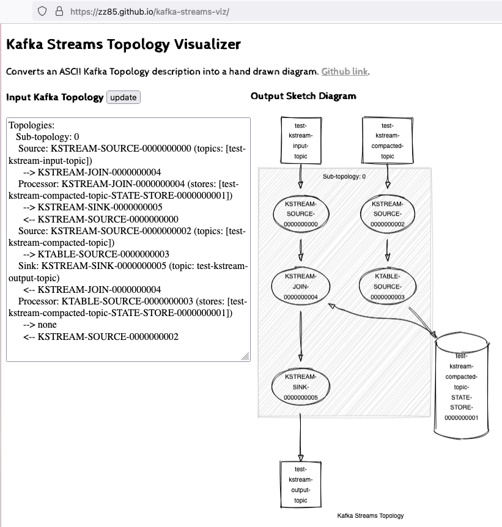
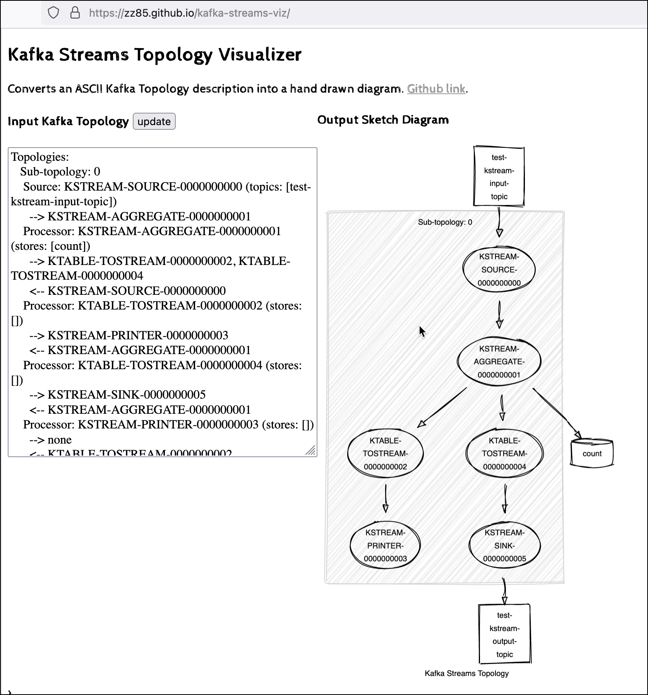

# Using Kafka Streams for Stream Analytics

In this workshop we will learn how to process messages using the [KafkaStreams](https://kafka.apache.org/documentation/streams/) library.

We will create a basic processor which consumes messages from a topic, processes them and produces the result into a new topic. We will be using once using the High-Level DSL and once the more low-level Processor API.

## Create the project in your Java IDE

In your favorite IDE, create a new Maven project and use `com.trivadis.kafkaws` for the **Group Id** and `kafka-streams-simple` for the **Artifact Id**.

Navigate to the **pom.xml** and double-click on it. The POM Editor will be displayed. 

Let's add some initial dependencies for our project. We will add some more dependencies to the POM throughout this workshop.

First add the following property into the already existing `<properties>` section


```xml
   <properties>
       ...
       <confluent.version>6.2.0</confluent.version>
       <kafka.version>2.8.0</kafka.version>
       <slf4j.version>1.7.32</slf4j.version>
    </properties>
```

Copy the following block right after the `<properties>` tag, before the closing `</project>` tag.
    
```xml
    <dependencies>
        <dependency>
            <groupId>org.apache.kafka</groupId>
            <artifactId>kafka-streams</artifactId>
            <version>${kafka.version}</version>
        </dependency>
        
        <dependency>
            <groupId>org.slf4j</groupId>
            <artifactId>slf4j-log4j12</artifactId>
            <version>${slf4j.version}</version>
        </dependency>        
    </dependencies>
    
	<build>
		<defaultGoal>install</defaultGoal>

		<plugins>
			<plugin>
				<groupId>org.apache.maven.plugins</groupId>
				<artifactId>maven-compiler-plugin</artifactId>
				<version>2.5</version>
				<configuration>
					<source>15</source>
					<target>15</target>
					<maxmem>256M</maxmem>
					<showDeprecation>true</showDeprecation>
				</configuration>
			</plugin>
			<plugin>
				<groupId>org.codehaus.mojo</groupId>
				<artifactId>exec-maven-plugin</artifactId>
				<version>3.0.0</version>
				<executions>
					<execution>
						<id>producer</id>
						<goals>
							<goal>java</goal>
						</goals>
						<configuration>
							<mainClass>com.trivadis.kafkaws.processor.KafkaStreamsRunner</mainClass>
						</configuration>						
					</execution>
				</executions>
			</plugin>
		</plugins>
	</build>
```

## Create a log4j.properties file

In the `resources` folder, create a `log4j.properties` file and add the following content:

```properties
log4j.rootLogger=WARN, stdout

log4j.appender.stdout=org.apache.log4j.ConsoleAppender
log4j.appender.stdout.layout=org.apache.log4j.PatternLayout
log4j.appender.stdout.layout.ConversionPattern=[%d] %p [%t] %m (%c)%n

# Enable for debugging if need be
#log4j.logger.org.apache.kafka.streams=DEBUG, stdout
#log4j.additivity.org.apache.kafka.streams=false

# Squelch expected error messages like:
#     java.lang.IllegalStateException: This consumer has already been closed.
log4j.logger.org.apache.kafka.streams.processor.internals.StreamThread=WARN, stdout
log4j.additivity.org.apache.kafka.streams.processor.internals.StreamThread=false

#Enable info for Microservices
log4j.logger.io.confluent.examples.streams.microservices=INFO, stdout
log4j.additivity.io.confluent.examples.streams.microservices=false

# Enable for debugging if need be
#log4j.logger.io.confluent=DEBUG, stdout
#log4j.additivity.io.confluent=false
```

## Creating the necessary Kafka Topic 

We will use the topics `test-kstream-input-topic` and `test-kstream-output-topic` in all of the various KafkaStream implementations below. Addionally in one of the implementations, we need the compacted log topic `test-kstream-compacted-topic`. 

Due to the fact that `auto.topic.create.enable` is set to `false`, we have to manually create the topic. 

Connect to the `kafka-1` container and execute the following `kafka-topics` command

```bash
docker exec -ti kafka-1 kafka-topics --create \
    --replication-factor 3 \
    --partitions 8 \
    --topic test-kstream-input-topic \
    --bootstrap-server kafka-1:19092
    
docker exec -ti kafka-1 kafka-topics --create \
    --replication-factor 3 \
    --partitions 8 \
    --topic test-kstream-input2-topic \
    --bootstrap-server kafka-1:19092

docker exec -ti kafka-1 kafka-topics --create \
    --replication-factor 3 \
    --partitions 8 \
    --topic test-kstream-output-topic \
    --bootstrap-server kafka-1:19092
    
docker exec -ti kafka-1 kafka-topics --create \
    --replication-factor 3 \
    --partitions 8 \
    --topic test-kstream-compacted-topic \
    --bootstrap-server kafka-1:19092 \
    --config cleanup.policy=compact \
    --config segment.ms=100 \
    --config delete.retention.ms=100 \
    --config min.cleanable.dirty.ratio=0.001
```

This finishes the setup steps and our new project is ready to be used. Next we will implement the KafkaStreams Processor Topology, first using the DSL and second using the Processor API.

## Implementing the Kafka Streams Processor using the DSL

Create a new Java package `com.trivadis.kafkaws.kstream.simple` and in it a Java class `KafkaStreamsRunnerDSL`. 

Add the following code for the implementation

```java
package com.trivadis.kafkaws.kstream.simple;

import java.util.Properties;
import org.apache.kafka.clients.consumer.ConsumerConfig;
import org.apache.kafka.common.serialization.Serdes;
import org.apache.kafka.streams.KafkaStreams;
import org.apache.kafka.streams.StreamsBuilder;
import org.apache.kafka.streams.StreamsConfig;
import org.apache.kafka.streams.kstream.KStream;
import org.apache.kafka.streams.kstream.Printed;

public class KafkaStreamsRunnerDSL {

    public static void main(String[] args) {
        // the builder is used to construct the topology
        StreamsBuilder builder = new StreamsBuilder();

        // read from the source topic, "users"
        KStream<Void, String> stream = builder.stream("test-kstream-input-topic");

        // for each record that appears in the source topic,
        // print the value
        stream.foreach(
                (key, value) -> {
                    System.out.println("(From DSL) " + value);
                });

        // transform the values to upper case
        KStream<Void, String> upperStream = stream.mapValues(value -> value.toUpperCase());

        // you can also print using the `print` operator
        upperStream.print(Printed.<Void, String>toSysOut().withLabel("upperValue"));

        upperStream.to("test-kstream-output-topic");

        // set the required properties for running Kafka Streams
        Properties config = new Properties();
        config.put(StreamsConfig.APPLICATION_ID_CONFIG, "basic");
        config.put(StreamsConfig.BOOTSTRAP_SERVERS_CONFIG, "dataplatform:9092");
        config.put(ConsumerConfig.AUTO_OFFSET_RESET_CONFIG, "earliest");
        config.put(StreamsConfig.DEFAULT_KEY_SERDE_CLASS_CONFIG, Serdes.Void().getClass());
        config.put(StreamsConfig.DEFAULT_VALUE_SERDE_CLASS_CONFIG, Serdes.String().getClass());

        // build the topology and start streaming
        KafkaStreams streams = new KafkaStreams(builder.build(), config);
        streams.start();

        // close Kafka Streams when the JVM shuts down (e.g. SIGTERM)
        Runtime.getRuntime().addShutdownHook(new Thread(streams::close));
    }
}
```

Start the program and then first run a `kcat` consumer on the output topic

```bash
kcat -b dataplatform:9092 -t test-kstream-output-topic
```

with that in place, in 2nd terminal produce some messages using `kcat` in producer mode on the input topic

```bash
kcat -b dataplatform:9092 -t test-kstream-input-topic -P
```

All the values produced should arrive on the consumer in uppercase.

## Joining a stream to a table

Now let's use Kafka Streams to perform joins. In this workshop we will join a data stream with some static data, also known as Stream-Table Join. It is in fact an enrichment of a Stream by some static data (a lookup of a static dataset). The streaming data will still come in through the `test-kstream-input-topic` topic and we will enrich it with the data from the `test-kstream-compacted-topic`.  

Create a new package `com.trivadis.kafkaws.kstream.tablejoin` and in it a Java class `KafkaStreamsRunnerTableJoinDSL `. 

Add the following code for the implementation

```java
package com.trivadis.kafkaws.kstream.tablejoin;

import org.apache.kafka.clients.consumer.ConsumerConfig;
import org.apache.kafka.common.serialization.Serdes;
import org.apache.kafka.streams.KafkaStreams;
import org.apache.kafka.streams.StreamsBuilder;
import org.apache.kafka.streams.StreamsConfig;
import org.apache.kafka.streams.Topology;
import org.apache.kafka.streams.kstream.KStream;
import org.apache.kafka.streams.kstream.KTable;
import org.apache.kafka.streams.kstream.Printed;
import org.apache.kafka.streams.kstream.Produced;

import java.util.Properties;

public class KafkaStreamsRunnerTableJoinDSL {

    public static void main(String[] args) {
        // the builder is used to construct the topology
        StreamsBuilder builder = new StreamsBuilder();

        // read from the source topic, "test-kstream-input-topic"
        KStream<String, String> stream = builder.stream("test-kstream-input-topic");

        // read from the source topic, "test-kstream-input-topic"
        KTable<String, String> table = builder.table("test-kstream-compacted-topic");

        // join the stream with the table
        KStream<String, String> joined = stream.join(table, (s,t) -> String.join (":",s, t));

        // output the joined values
        joined.to("test-kstream-output-topic", Produced.with(Serdes.String(), Serdes.String()));

        // set the required properties for running Kafka Streams
        Properties config = new Properties();
        config.put(StreamsConfig.APPLICATION_ID_CONFIG, "tablejoin");
        config.put(StreamsConfig.BOOTSTRAP_SERVERS_CONFIG, "dataplatform:9092");
        config.put(ConsumerConfig.AUTO_OFFSET_RESET_CONFIG, "earliest");
        config.put(StreamsConfig.DEFAULT_KEY_SERDE_CLASS_CONFIG, Serdes.String().getClass());
        config.put(StreamsConfig.DEFAULT_VALUE_SERDE_CLASS_CONFIG, Serdes.String().getClass());

        // build the topology and start streaming
        Topology topology = builder.build();
        System.out.println(topology.describe());
        KafkaStreams streams = new KafkaStreams(topology, config);
        streams.start();

        // close Kafka Streams when the JVM shuts down (e.g. SIGTERM)
        Runtime.getRuntime().addShutdownHook(new Thread(streams::close));
    }
}
```

First let's add the "static" data to the compacted log topic. This is the data we are doing the lookup against. In a terminal window run the following `kcat` command

```bash
kcat -b dataplatform:9092 -t test-kstream-compacted-topic -P -K , 
```

produce some values with `<key>,<value>` syntax, such as

```bash
A,Entity A
B,Entity B
C,Entity C
D,Entity D
```

As we are reusing the topics from the previous solution, you might want to clear (empty) both the input and the out topic before starting the program. You can easily do that using AKHQ (navigate to the topic, i.e. <http://dataplatform:28107/ui/docker-kafka-server/topic/test-kstream-input-topic> and click on **Empty Topic** on the bottom). 

Start the program and in another terminal window run a `kcat` consumer on the output topic

```bash
kcat -b dataplatform:9092 -t test-kstream-output-topic -o end -f "%k,%s\n" -q
```

with that in place, in a 3rd terminal window, produce some messages using `kcat` in producer mode on the input topic

```bash
kcat -b dataplatform:9092 -t test-kstream-input-topic -P -K , 
```

produce some values with `<key>,<value>` syntax, such as

```bash
A,AAA
B,BBB
C,CCC
A,AAA
D,DDD
E,EEE
A,AAA
```

immediately the count should start to add up for each key and the output from the consumer should be similar to the one shown below

```bash
A,AAA;Entity A
B,BBB;Entity B
C,CCC;Entity C
A,AAA;Entity A
D,DDD;Entity D
A,AAA;Entity A
```

you can see that there has been no output for the input of `E,EEE`, because there is no entry for key `E` in the compacted topic.

Let's add the "entity" to the compacted topic, by entering the following value on the terminal where `kcat -b dataplatform:9092 -t test-kstream-compacted-topic -P -K ,` is still running

```bash
E,Entity E
```

if you try again with an entry of `E,EEE` on the stream topic

```bash
E,EEE
```

then you should get an output of `E,EEE:Entity E`.

You can also change from an `join` to a `leftJoin`, so that in case where there is no value in the table, there is still an output shown, with a `null` from the table. 

```java
        // join the stream with the table
        KStream<String, String> joined = stream.join(table, (s,t) -> String.join (":",s, t));
``` 

Also try to update a value in the table, for example by publishing a new message to topic `test-kstream-compacted-topic`

```bash
A,Object A
```

if you send another two events on the topic `test-kstream-input-topic`

```bash
A,AAA
B,BBB
```

then you can see that immediately the join shows the updated value for `A` whereas `B` still shows the same value

```bash
A,AAA;Object A
B,BBB;Entity B
```

In this example we also use the `Topology.describe()` command, which will show a string representation of the Kafka Streams topology. 

```
Topologies:
   Sub-topology: 0
    Source: KSTREAM-SOURCE-0000000000 (topics: [test-kstream-input-topic])
      --> KSTREAM-JOIN-0000000004
    Processor: KSTREAM-JOIN-0000000004 (stores: [test-kstream-compacted-topic-STATE-STORE-0000000001])
      --> KSTREAM-SINK-0000000005
      <-- KSTREAM-SOURCE-0000000000
    Source: KSTREAM-SOURCE-0000000002 (topics: [test-kstream-compacted-topic])
      --> KTABLE-SOURCE-0000000003
    Sink: KSTREAM-SINK-0000000005 (topic: test-kstream-output-topic)
      <-- KSTREAM-JOIN-0000000004
    Processor: KTABLE-SOURCE-0000000003 (stores: [test-kstream-compacted-topic-STATE-STORE-0000000001])
      --> none
      <-- KSTREAM-SOURCE-0000000002
```

You can use the [Kafka Streams Topology Visualizer](https://zz85.github.io/kafka-streams-viz/) utility to visualize the topology in a graphical manner. Copy the string representation into the **Input Kafka Topology** field and click **Update**. You should a visualization like the one below



You can see that the compacted topic `test-kstream-compacted-topic` is read into a state store and the `test-kstream-input-topic` is joined against that state store to enrich the stream.   

## Joining a stream to another stream

Now let's use Kafka Streams to perform joins. In this example we will join a data stream with another data stream, also known as Stream-Stream Join. It is in fact an enrichment of a Stream by some static data (a lookup of a static dataset). The streaming data will still come in through the `test-kstream-input-topic` topic and we will join it with data from the `test-kstream-input2-topic `.  

Create a new package `com.trivadis.kafkaws.kstream.streamjoin` and in it a Java class `KafkaStreamsRunnerStreamJoinDSL `. 

Add the following code for the implementation

```java
package com.trivadis.kafkaws.kstream.streamjoin;

import org.apache.kafka.clients.consumer.ConsumerConfig;
import org.apache.kafka.common.serialization.Serdes;
import org.apache.kafka.streams.KafkaStreams;
import org.apache.kafka.streams.StreamsBuilder;
import org.apache.kafka.streams.StreamsConfig;
import org.apache.kafka.streams.Topology;
import org.apache.kafka.streams.kstream.*;

import java.time.Duration;
import java.util.Properties;

public class KafkaStreamsRunnerStreamJoinDSL {

    public static void main(String[] args) {
        // the builder is used to construct the topology
        StreamsBuilder builder = new StreamsBuilder();

        // read from the source topic, "test-kstream-input-topic"
        KStream<String, String> streamA = builder.stream("test-kstream-input-topic");

        // read from the source topic, "test-kstream-input-topic"
        KStream<String, String> streamB = builder.stream("test-kstream-input2-topic");

        // join the stream with the other stream
        KStream<String, String> joined = streamA.leftJoin(streamB,
                    (leftValue, rightValue) -> new String(leftValue + "->" + rightValue),
                    JoinWindows.ofTimeDifferenceWithNoGrace(Duration.ofSeconds(15)),
                    StreamJoined.with(Serdes.String(),Serdes.String(), Serdes.String())
                    );

        // output the joined values
        joined.to("test-kstream-output-topic", Produced.with(Serdes.String(), Serdes.String()));

        // set the required properties for running Kafka Streams
        Properties config = new Properties();
        config.put(StreamsConfig.APPLICATION_ID_CONFIG, "streamjoin2");
        config.put(StreamsConfig.BOOTSTRAP_SERVERS_CONFIG, "dataplatform:9092");
        config.put(ConsumerConfig.AUTO_OFFSET_RESET_CONFIG, "earliest");
        config.put(StreamsConfig.DEFAULT_KEY_SERDE_CLASS_CONFIG, Serdes.String().getClass());
        config.put(StreamsConfig.DEFAULT_VALUE_SERDE_CLASS_CONFIG, Serdes.String().getClass());

        // build the topology and start streaming
        Topology topology = builder.build();
        //System.out.println(topology.describe());
        KafkaStreams streams = new KafkaStreams(topology, config);
        streams.start();

        // close Kafka Streams when the JVM shuts down (e.g. SIGTERM)
        Runtime.getRuntime().addShutdownHook(new Thread(streams::close));
    }
}
```

First let's add the "static" data to the compacted log topic. This is the data we are doing the lookup against. In a terminal window run the following `kcat` command

```bash
kcat -b dataplatform:9092 -t test-kstream-compacted-topic -P -K , 
```

produce some values with `<key>,<value>` syntax, such as

```bash

```

As we are reusing the topics from the previous solution, you might want to clear (empty) both the input and the out topic before starting the program. You can easily do that using AKHQ (navigate to the topic, i.e. <http://dataplatform:28107/ui/docker-kafka-server/topic/test-kstream-input-topic> and click on **Empty Topic** on the bottom). 

Start the program and in another terminal window run a `kcat` consumer on the output topic

```bash
kcat -b dataplatform:9092 -t test-kstream-output-topic -o end -f "%k,%s\n" -q
```

with that in place, in a 3rd terminal window, produce some messages using `kcat` in producer mode on the input topic

```bash
kcat -b dataplatform:9092 -t test-kstream-input-topic -P -K , 
```

produce some values with `<key>,<value>` syntax, such as

```bash
A,AAA
B,BBB
C,CCC
A,AAA
D,DDD
E,EEE
A,AAA
```

immediately the count should start to add up for each key and the output from the consumer should be similar to the one shown below

```bash
A,AAA;Entity A
B,BBB;Entity B
C,CCC;Entity C
A,AAA;Entity A
D,DDD;Entity D
A,AAA;Entity A
```

you can see that there has been no output for the input of `E,EEE`, because there is no entry for key `E` in the compacted topic.

Let's add the "entity" to the compacted topic, by entering the following value on the terminal where `kcat -b dataplatform:9092 -t test-kstream-compacted-topic -P -K ,` is still running

```bash
E,Entity E
```

if you try again with an entry of `E,EEE` on the stream topic

```bash
E,EEE
```

then you should get an output of `E,EEE:Entity E`.

You can also change from an `join` to a `leftJoin`, so that in case where there is no value in the table, there is still an output shown, with a `null` from the table. 

```java
        // join the stream with the table
        KStream<String, String> joined = stream.join(table, (s,t) -> String.join (":",s, t));
``` 

Also try to update a value in the table, for example by publishing a new message to topic `test-kstream-compacted-topic`

```bash
A,Object A
```

if you send another two events on the topic `test-kstream-input-topic`

```bash
A,AAA
B,BBB
```

then you can see that immediately the join shows the updated value for `A` whereas `B` still shows the same value

```bash
A,AAA;Object A
B,BBB;Entity B
```

In this example we also use the `Topology.describe()` command, which will show a string representation of the Kafka Streams topology. 

```
Topologies:
   Sub-topology: 0
    Source: KSTREAM-SOURCE-0000000000 (topics: [test-kstream-input-topic])
      --> KSTREAM-JOIN-0000000004
    Processor: KSTREAM-JOIN-0000000004 (stores: [test-kstream-compacted-topic-STATE-STORE-0000000001])
      --> KSTREAM-SINK-0000000005
      <-- KSTREAM-SOURCE-0000000000
    Source: KSTREAM-SOURCE-0000000002 (topics: [test-kstream-compacted-topic])
      --> KTABLE-SOURCE-0000000003
    Sink: KSTREAM-SINK-0000000005 (topic: test-kstream-output-topic)
      <-- KSTREAM-JOIN-0000000004
    Processor: KTABLE-SOURCE-0000000003 (stores: [test-kstream-compacted-topic-STATE-STORE-0000000001])
      --> none
      <-- KSTREAM-SOURCE-0000000002
```

You can use the [Kafka Streams Topology Visualizer](https://zz85.github.io/kafka-streams-viz/) utility to visualize the topology in a graphical manner. Copy the string representation into the **Input Kafka Topology** field and click **Update**. You should a visualization like the one below


You can see that the compacted topic `test-kstream-compacted-topic` is read into a state store and the `test-kstream-input-topic` is joined against that state store to enrich the stream.   

## Counting Values

Now let's use Kafka Streams to perform some stateful operations. We will group the messages by key and count the number of messages per key. We will be doing it without a time window and add it in the next iteration.

Create a new Java package `com.trivadis.kafkaws.kstream.count` and in it a Java class `KafkaStreamsRunnerCountDSL`. 

Add the following code for the implementation

```java
package com.trivadis.kafkaws.kstream.count;

import org.apache.kafka.clients.consumer.ConsumerConfig;
import org.apache.kafka.common.serialization.Serde;
import org.apache.kafka.common.serialization.Serdes;
import org.apache.kafka.streams.KafkaStreams;
import org.apache.kafka.streams.StreamsBuilder;
import org.apache.kafka.streams.StreamsConfig;
import org.apache.kafka.streams.Topology;
import org.apache.kafka.streams.kstream.*;
import org.apache.kafka.streams.state.KeyValueStore;

import java.time.Duration;
import java.time.ZoneId;
import java.util.Properties;

public class KafkaStreamsRunnerCountDSL {

    public static void main(String[] args) {
        // the builder is used to construct the topology
        StreamsBuilder builder = new StreamsBuilder();

        // read from the source topic, "test-kstream-input-topic"
        KStream<String, String> stream = builder.stream("test-kstream-input-topic");

        KGroupedStream<String,String> groupedByKey = stream.groupByKey();
        KTable<String, Long> counts = groupedByKey.count(Materialized.as("count"));

        counts.toStream().print(Printed.<String, Long>toSysOut().withLabel("counts"));

        final Serde<String> stringSerde = Serdes.String();
        final Serde<Long> longSerde = Serdes.Long();
        counts.toStream().to("test-kstream-output-topic", Produced.with(stringSerde, longSerde));

        // set the required properties for running Kafka Streams
        Properties config = new Properties();
        config.put(StreamsConfig.APPLICATION_ID_CONFIG, "count");
        config.put(StreamsConfig.STATE_DIR_CONFIG, "/tmp/count");
        config.put(StreamsConfig.BOOTSTRAP_SERVERS_CONFIG, "dataplatform:9092");
        config.put(ConsumerConfig.AUTO_OFFSET_RESET_CONFIG, "latest");
        config.put(StreamsConfig.DEFAULT_KEY_SERDE_CLASS_CONFIG, Serdes.String().getClass());
        config.put(StreamsConfig.DEFAULT_VALUE_SERDE_CLASS_CONFIG, Serdes.String().getClass());
        config.put(StreamsConfig.CACHE_MAX_BYTES_BUFFERING_CONFIG, 0);

        // build the topology and start streaming
        Topology topology = builder.build();
        System.out.println(topology.describe());
        KafkaStreams streams = new KafkaStreams(topology, config);
        streams.start();

        // close Kafka Streams when the JVM shuts down (e.g. SIGTERM)
        Runtime.getRuntime().addShutdownHook(new Thread(streams::close));
    }
}
```

We are deliberately disabling the cache by setting the `CACHE_MAX_BYTES_BUFFERING_CONFIG` to the value of `0`. By that the output is shown immediately, otherwise it would take a while until the buffer is full, especially because we are manually sending messages.


As we are reusing the topics from the previous solution, you might want to clear (empty) both the input and the out topic before starting the program. You can easily do that using AKHQ (navigate to the topic, i.e. <http://dataplatform:28107/ui/docker-kafka-server/topic/test-kstream-input-topic> and click on **Empty Topic** on the bottom). 

Start the programm and then first run a `kcat` consumer on the output topic

```bash
kcat -b dataplatform:9092 -t test-kstream-output-topic -s value=q -o end -f "%k,%s\n"
```

with that in place, in 2nd terminal produce some messages using `kcat` in producer mode on the input topic

```bash
kcat -b dataplatform:9092 -t test-kstream-input-topic -P -K , 
```

produce some values with `<key>,<value>` syntax, such as

```bash
A,AAA
A,AAA
B,BBB
B,BBB
C,CCC
D,DDD
E,EEE
D,DDD
```

immediately the count should start to add up for each key and the output from the consumer should be similar to the one shown below

```bash
C,1
D,1
B,1
B,2
A,1
A,2
E,1
```

We can again visualize the topology printed to the console output using the [Kafka Streams Topology Visualizer](https://zz85.github.io/kafka-streams-viz/) and should see the following output



Now let's see the reliabilty of the state store in action. If you check for the topics in AKHQ (<http://dataplatform:28107>), you can see that there is a new topic `count-count-changelog`. This is the change log topic of the state store which is holding our counts by key.

Let's stop the topology simulating a problem with the process. Now start it again and publish some additional data to the input topic. The count should restart from where it left off and will not start again from 0. 

## Counting Values over a Time Window

Now let's use Kafka Streams to perform a stateful operation on a Time Window. We will group the messages by key and count the number of messages per key over 60 seconds.

Create a new Java package `com.trivadis.kafkaws.kstream.countwindowed` and in it a Java class `KafkaStreamsRunnerCountDSL`. 

Add the following code for the implementation

```java
package com.trivadis.kafkaws.kstream.countwindowed;

import org.apache.kafka.clients.consumer.ConsumerConfig;
import org.apache.kafka.common.serialization.Serde;
import org.apache.kafka.common.serialization.Serdes;
import org.apache.kafka.streams.KafkaStreams;
import org.apache.kafka.streams.StreamsBuilder;
import org.apache.kafka.streams.StreamsConfig;
import org.apache.kafka.streams.Topology;
import org.apache.kafka.streams.kstream.*;

import java.time.Duration;
import java.time.ZoneId;
import java.util.Properties;

public class KafkaStreamsRunnerCountWindowedDSL {

    public static void main(String[] args) {
        // the builder is used to construct the topology
        StreamsBuilder builder = new StreamsBuilder();

        // read from the source topic, "test-kstream-input-topic"
        KStream<String, String> stream = builder.stream("test-kstream-input-topic");

        // create a tumbling window of 60 seconds
        TimeWindows tumblingWindow =
                TimeWindows.ofSizeWithNoGrace(Duration.ofSeconds(60));

        KTable<Windowed<String>, Long> counts = stream.groupByKey()
                .windowedBy(tumblingWindow)
                .count(Materialized.as("countWindowed"));

        counts.toStream().print(Printed.<Windowed<String>, Long>toSysOut().withLabel("counts"));

        final Serde<String> stringSerde = Serdes.String();
        final Serde<Long> longSerde = Serdes.Long();
        counts.toStream( (wk,v) -> wk.key() + " : " + wk.window().startTime().atZone(ZoneId.of("Europe/Zurich")) + " to " + wk.window().endTime().atZone(ZoneId.of("Europe/Zurich")) + " : " + v)
                .to("test-kstream-output-topic", Produced.with(stringSerde, longSerde));

        // set the required properties for running Kafka Streams
        Properties config = new Properties();
        config.put(StreamsConfig.APPLICATION_ID_CONFIG, "countWindowed");
        config.put(StreamsConfig.BOOTSTRAP_SERVERS_CONFIG, "dataplatform:9092");
        config.put(ConsumerConfig.AUTO_OFFSET_RESET_CONFIG, "latest");
        config.put(StreamsConfig.DEFAULT_KEY_SERDE_CLASS_CONFIG, Serdes.String().getClass());
        config.put(StreamsConfig.DEFAULT_VALUE_SERDE_CLASS_CONFIG, Serdes.String().getClass());
        config.put(StreamsConfig.CACHE_MAX_BYTES_BUFFERING_CONFIG, 0);

        // build the topology and start streaming
        Topology topology = builder.build();
        System.out.println(topology.describe());
        KafkaStreams streams = new KafkaStreams(topology, config);
        streams.start();

        // close Kafka Streams when the JVM shuts down (e.g. SIGTERM)
        Runtime.getRuntime().addShutdownHook(new Thread(streams::close));
    }
}
```

As we are reusing the topics from the previous solution, you might want to clear (empty) both the input and the out topic before starting the program. You can easily do that using AKHQ (navigate to the topic, i.e. <http://dataplatform:28107/ui/docker-kafka-server/topic/test-kstream-input-topic> and click on **Empty Topic** on the bottom). 

Start the program and then first run a `kcat` consumer on the output topic

```bash
kcat -b dataplatform:9092 -t test-kstream-output-topic -s value=q -o end -f "%k,%s\n"
```

with that in place, in 2nd terminal produce some messages using `kcat` in producer mode on the input topic

```bash
kcat -b dataplatform:9092 -t test-kstream-input-topic -P -K , 
```

produce some values with `<key>,<value>` syntax, such as

```bash
A,AAA
A,AAA
B,BBB
B,BBB
C,CCC
D,DDD
E,EEE
D,DDD
```

within a single minute. After a minute the output from the consumer should be similar to the one shown below

```bash
B : 2021-08-22T15:26+02:00[Europe/Zurich] to 2021-08-22T15:27+02:00[Europe/Zurich],2
D : 2021-08-22T15:26+02:00[Europe/Zurich] to 2021-08-22T15:27+02:00[Europe/Zurich],2
E : 2021-08-22T15:26+02:00[Europe/Zurich] to 2021-08-22T15:27+02:00[Europe/Zurich],1
% Reached end of topic test-kstream-output-topic [4] at offset 3
A : 2021-08-22T15:26+02:00[Europe/Zurich] to 2021-08-22T15:27+02:00[Europe/Zurich],2
% Reached end of topic test-kstream-output-topic [1] at offset 3
C : 2021-08-22T15:26+02:00[Europe/Zurich] to 2021-08-22T15:27+02:00[Europe/Zurich],1
```

## Session Window

Session windows aggregate events (by key) into sessions. A session represents a period of activity followed by inactivity period. Once the defined time for inactivity elapses, the session is considered closed. Session windows are a bit different from other window types (hopping, tumbling) because they don’t have a fixed window size. As long as new records arrive for a key within the inactivity gap, the window continues to grow in size, meaning the amount of time the window spans, not the total number of records in the window. Another way to view session windows is that they are driven by behaviour while other window types are solely time based.

Let's use Kafka Streams to perform a count on a session window.

Create a new package `com.trivadis.kafkaws.kstream.countsession` and in it a Java class `KafkaStreamsRunnerCountSessionWindowedDSL`. 

Add the following code for the implementation

```java
public class KafkaStreamsRunnerCountSessionWindowedDSL {

    public static void main(String[] args) {
        // the builder is used to construct the topology
        StreamsBuilder builder = new StreamsBuilder();

        // read from the source topic, "test-kstream-input-topic"
        KStream<String, String> stream = builder.stream("test-kstream-input-topic");

        // create a session window with an inactivity gap to 30 seconds and a Grace period of 10 seconds
        SessionWindows sessionWindow =
                SessionWindows.ofInactivityGapAndGrace(Duration.ofSeconds(30), Duration.ofSeconds(10));

        KTable<Windowed<String>, Long> counts = stream.groupByKey()
                .windowedBy(sessionWindow)
                .count(Materialized.as("countSessionWindowed"));

        KStream<Windowed<String>, Long> sessionedStream = counts.toStream();

        KStream<String, Long> printableStream = sessionedStream.map((key, value) -> new KeyValue<>(key.key() +
                                                                                                        "@" +
                                                                                                        key.window().startTime().atZone(ZoneId.of("Europe/Zurich")) +
                                                                                                        "->" +
                                                                                                        key.window().endTime().atZone(ZoneId.of("Europe/Zurich"))
                                                                                                , value));
        printableStream.to("test-kstream-output-topic", Produced.with(Serdes.String(), Serdes.Long()));

        // set the required properties for running Kafka Streams
        Properties config = new Properties();
        config.put(StreamsConfig.APPLICATION_ID_CONFIG, "countSessionWindowedWithGrace");
        config.put(StreamsConfig.BOOTSTRAP_SERVERS_CONFIG, "dataplatform:9092");
        config.put(ConsumerConfig.AUTO_OFFSET_RESET_CONFIG, "latest");
        config.put(StreamsConfig.DEFAULT_KEY_SERDE_CLASS_CONFIG, Serdes.String().getClass());
        config.put(StreamsConfig.DEFAULT_VALUE_SERDE_CLASS_CONFIG, Serdes.String().getClass());
        // disable caching to see session merging
        config.put(StreamsConfig.CACHE_MAX_BYTES_BUFFERING_CONFIG, 0);

        // build the topology and start streaming
        Topology topology = builder.build();
        KafkaStreams streams = new KafkaStreams(topology, config);
        streams.start();

        // close Kafka Streams when the JVM shuts down (e.g. SIGTERM)
        Runtime.getRuntime().addShutdownHook(new Thread(streams::close));
    }
```

As we are reusing the topics from the previous solution, you might want to clear (empty) both the input and the out topic before starting the program. You can easily do that using AKHQ (navigate to the topic, i.e. <http://dataplatform:28107/ui/docker-kafka-server/topic/test-kstream-input-topic> and click on **Empty Topic** on the bottom). 

Start the program and then first run a `kcat` consumer on the output topic

```bash
kcat -b dataplatform:9092 -t test-kstream-output-topic -s value=q -o end -f "%k,%s\n"
```

with that in place, in 2nd terminal produce some messages using `kcat` in producer mode on the input topic

```bash
kcat -b dataplatform:9092 -t test-kstream-input-topic -P -K , 
```

produce a first value with key `A`

```bash
A,AAA
```

followed by another one a few seconds apart

```bash
A,AAA
```

in the output you will see a first count of 1, followed by 2 and another message with a value of `NULL` to "delete" the previous key (the one with count 1). You can see that the time has been expanded in the one with count 2

```bash
A : 2021-09-26T15:13:54.354+02:00[Europe/Zurich] to 2021-09-26T15:13:54.354+02:00[Europe/Zurich] : 1,
A : 2021-09-26T15:13:54.354+02:00[Europe/Zurich] to 2021-09-26T15:13:59.711+02:00[Europe/Zurich] : 2,
A : 2021-09-26T15:13:54.354+02:00[Europe/Zurich] to 2021-09-26T15:13:54.354+02:00[Europe/Zurich] : null,
```

wait for 30 seconds and then publish another message for key `A`

```bash
A,AAA
```

and you can see that the previous session has been closed and a new one has been started

```bash
A : 2021-09-26T15:14:46.622+02:00[Europe/Zurich] to 2021-09-26T15:14:46.622+02:00[Europe/Zurich] : 1
```

## Aggregating Values 

Now let's use Kafka Streams to perform another stateful operations. We will group the messages by key and aggregate (create a sum of the values) the values of the messages per key over 60 seconds.

Create a new Java package `com.trivadis.kafkaws.kstream.aggregate` and in it a Java class `KafkaStreamsRunnerAggregateDSL`. 

Add the following code for the implementation

```java
package com.trivadis.kafkaws.kstream.aggregate;

import org.apache.kafka.clients.consumer.ConsumerConfig;
import org.apache.kafka.common.serialization.Serde;
import org.apache.kafka.common.serialization.Serdes;
import org.apache.kafka.common.utils.Bytes;
import org.apache.kafka.streams.KafkaStreams;
import org.apache.kafka.streams.StreamsBuilder;
import org.apache.kafka.streams.StreamsConfig;
import org.apache.kafka.streams.kstream.*;
import org.apache.kafka.streams.state.WindowStore;

import java.time.Duration;
import java.time.ZoneId;
import java.util.Properties;

public class KafkaStreamsRunnerAggregateDSL {

    public static void main(String[] args) {
        // the builder is used to construct the topology
        StreamsBuilder builder = new StreamsBuilder();

        // read from the source topic, "test-kstream-input-topic"
        KStream<String, String> stream = builder.stream("test-kstream-input-topic");

        // transform the value from String to Long (this is necessary as from the console you can only produce String)
        KStream<String, Long> transformed = stream.mapValues(v -> Long.valueOf(v));

        // group by key
        KGroupedStream<String, Long> grouped = transformed.groupByKey();

        // create a tumbling window of 60 seconds
        TimeWindows tumblingWindow =
                TimeWindows.of(Duration.ofSeconds(60));

        // sum the values over the tumbling window of 60 seconds
        KTable<Windowed<String>, Long> sumOfValues = grouped
                .windowedBy(tumblingWindow)
                .aggregate(
                        () -> 0L,    /* initializer */
                        (aggKey, newValue, aggValue) -> aggValue + newValue, /* adder */
                        Materialized.<String, Long, WindowStore<Bytes, byte[]>>as("time-windowed-aggregated-stream-store") /* state store name */
                                .withValueSerde(Serdes.Long())
                );

        // print the sumOfValues stream
        sumOfValues.toStream().print(Printed.<Windowed<String>,Long>toSysOut().withLabel("sumOfValues"));

        // publish the sumOfValues stream
        final Serde<String> stringSerde = Serdes.String();
        final Serde<Long> longSerde = Serdes.Long();
        sumOfValues.toStream( (wk,v) -> wk.key() + " : " + wk.window().startTime().atZone(ZoneId.of("Europe/Zurich")) + " to " + wk.window().endTime().atZone(ZoneId.of("Europe/Zurich")))
                .to("test-kstream-output-topic", Produced.with(stringSerde, longSerde));
        
        // set the required properties for running Kafka Streams
        Properties config = new Properties();
        config.put(StreamsConfig.APPLICATION_ID_CONFIG, "count");
        config.put(StreamsConfig.BOOTSTRAP_SERVERS_CONFIG, "dataplatform:9092");
        config.put(ConsumerConfig.AUTO_OFFSET_RESET_CONFIG, "latest");
        config.put(StreamsConfig.DEFAULT_KEY_SERDE_CLASS_CONFIG, Serdes.String().getClass());
        config.put(StreamsConfig.DEFAULT_VALUE_SERDE_CLASS_CONFIG, Serdes.String().getClass());

        // build the topology and start streaming
        KafkaStreams streams = new KafkaStreams(builder.build(), config);
        streams.start();

        // close Kafka Streams when the JVM shuts down (e.g. SIGTERM)
        Runtime.getRuntime().addShutdownHook(new Thread(streams::close));
    }
}
```

As we are reusing the topics from the previous solution, you might want to clear (empty) both the input and the out topic before starting the program. You can easily do that using AKHQ (navigate to the topic, i.e. <http://dataplatform:28107/ui/docker-kafka-server/topic/test-kstream-input-topic> and click on **Empty Topic** on the bottom). 

Start the program and then first run a `kcat` consumer on the output topic

```bash
kcat -b dataplatform:9092 -t test-kstream-output-topic -s value=q -o end -f "%k,%s\n"
```

with that in place, in 2nd terminal produce some messages using `kcat` in producer mode on the input topic

```bash
kcat -b dataplatform:9092 -t test-kstream-input-topic -P -K , 
```

produce some values with `<key>,<value>` syntax, where the value has to be a numeric value, such as

```bash
A,1
A,2
B,10
B,2
C,3
D,5
E,6
D,9
```

within a single minute. After a minute the output from the consumer should be similar to the one shown below

```bash
E : 2021-08-22T16:53+02:00[Europe/Zurich] to 2021-08-22T16:54+02:00[Europe/Zurich],6
A : 2021-08-22T16:53+02:00[Europe/Zurich] to 2021-08-22T16:54+02:00[Europe/Zurich],3
D : 2021-08-22T16:53+02:00[Europe/Zurich] to 2021-08-22T16:54+02:00[Europe/Zurich],14
C : 2021-08-22T16:53+02:00[Europe/Zurich] to 2021-08-22T16:54+02:00[Europe/Zurich],3
B : 2021-08-22T16:53+02:00[Europe/Zurich] to 2021-08-22T16:54+02:00[Europe/Zurich],12
```

We can see that the values have been summed up by key.

## Using Custom State 

We can also run our own state store from Kafka Streams. For that we basically combine Kafka Streams DLS with the Processor API, implementing the `Transformer` interface. 

In this simple implementation we are again using the message key as the grouping criteria and concat all the values we got since the beginning and return the new value as part of the new message. Both the key and the value are serialized as `String`.

Create a new Java package `com.trivadis.kafkaws.kstream.customstate` and in it a Java class `KafkaStreamsRunnerCustomStateDSL`. 

Add the following code for the implemenation

```java
package com.trivadis.kafkaws.kstream.customstate;

import org.apache.kafka.clients.consumer.ConsumerConfig;
import org.apache.kafka.common.serialization.Serdes;
import org.apache.kafka.streams.KafkaStreams;
import org.apache.kafka.streams.KeyValue;
import org.apache.kafka.streams.StreamsBuilder;
import org.apache.kafka.streams.StreamsConfig;
import org.apache.kafka.streams.kstream.KStream;
import org.apache.kafka.streams.kstream.Transformer;
import org.apache.kafka.streams.processor.ProcessorContext;
import org.apache.kafka.streams.state.KeyValueStore;
import org.apache.kafka.streams.state.StoreBuilder;
import org.apache.kafka.streams.state.Stores;

import java.util.Properties;

public class KafkaStreamsRunnerCustomStateDSL {

    public static void main(String[] args) {
        // the builder is used to construct the topology
        StreamsBuilder builder = new StreamsBuilder();

        final StoreBuilder<KeyValueStore<String, String>> myStateStore = Stores
                .keyValueStoreBuilder(Stores.persistentKeyValueStore("MyStateStore"), Serdes.String(), Serdes.String())
                .withCachingEnabled();
        builder.addStateStore(myStateStore);

        final MyStateHandler myStateHandler = new MyStateHandler(myStateStore.name());

        // read from the source topic, "test-kstream-input-topic"
        KStream<String, String> stream = builder.stream("test-kstream-input-topic");

        // invoke the transformer
        KStream<String, String> transformedStream = stream.transform(() -> myStateHandler, myStateStore.name() );

        // peek into the stream and execute a println
        transformedStream.peek((k,v) -> System.out.println("key: " + k + " - value:" + v));

        // publish result
        transformedStream.to("test-kstream-output-topic");

        // set the required properties for running Kafka Streams
        Properties config = new Properties();
        config.put(StreamsConfig.APPLICATION_ID_CONFIG, "customstate");
        config.put(StreamsConfig.BOOTSTRAP_SERVERS_CONFIG, "dataplatform:9092");
        config.put(ConsumerConfig.AUTO_OFFSET_RESET_CONFIG, "latest");
        config.put(StreamsConfig.DEFAULT_KEY_SERDE_CLASS_CONFIG, Serdes.String().getClass());
        config.put(StreamsConfig.DEFAULT_VALUE_SERDE_CLASS_CONFIG, Serdes.String().getClass());

        // build the topology and start streaming
        KafkaStreams streams = new KafkaStreams(builder.build(), config);
        streams.start();

        // close Kafka Streams when the JVM shuts down (e.g. SIGTERM)
        Runtime.getRuntime().addShutdownHook(new Thread(streams::close));
    }

    private static final class MyStateHandler implements Transformer<String, String, KeyValue<String, String>> {
        final private String storeName;
        private KeyValueStore<String, String> stateStore;
        private ProcessorContext context;

        public MyStateHandler(final String storeName) {
            this.storeName = storeName;
        }


        @Override
        public void init(ProcessorContext processorContext) {
            this.context = processorContext;
            stateStore = (KeyValueStore<String, String>) this.context.getStateStore(storeName);
        }

        @Override
        public KeyValue<String,String> transform(String key, String value) {
            if (stateStore.get(key) == null) {
                stateStore.put(key, value);
            } else {
                stateStore.put(key, stateStore.get(key) + "," + value);
            }

            return new KeyValue<>(key, stateStore.get(key));
        }

        @Override
        public void close() {

        }
    }
}
```

We can see the implementation of the custom state store in these lines

```java
        final StoreBuilder<KeyValueStore<String, String>> myStateStore = Stores
                .keyValueStoreBuilder(Stores.persistentKeyValueStore("MyStateStore"), Serdes.String(), Serdes.String())
                .withCachingEnabled();
        builder.addStateStore(myStateStore);
```

The state management happens inside the `MyStateHandler` class. It implements the `Transformer<String, String, KeyValue<String, String>` interface, where the generics should be read like that:

* as input we get a `String` key, a `String` value and return a `KeyValue<String,String>`, again the first `String` being the type of the key and the second `String` the type of the value. 
 
```java
private static final class MyStateHandler implements Transformer<String, String, KeyValue<String, String>>
```

In our case we want to access both the key and the value of the message. If the value is enough, you better implement the `ValueTransformer` instead. 

As we are reusing the topics from the previous solution, you might want to clear (empty) both the input and the out topic before starting the program. You can easily do that using AKHQ (navigate to the topic, i.e. <http://dataplatform:28107/ui/docker-kafka-server/topic/test-kstream-input-topic> and click on **Empty Topic** on the bottom). 

Start the programm and then first run a `kcat` consumer on the output topic

```bash
kcat -b dataplatform:9092 -t test-kstream-output-topic -o end -f "%k,%s\n" -q
```

with that in place, in 2nd terminal produce some messages using `kcat` in producer mode on the input topic

```bash
kcat -b dataplatform:9092 -t test-kstream-input-topic -P -K , 
```

produce some values with `<key>,<value>` syntax, such as

```bash
A,AAA
A,BBB
A,CCC
B,111
B,222
B,333
```

within a single minute. After a minute the output from the consumer should be similar to the one shown below

```bash
A,AAA
A,AAA,BBB
A,AAA,BBB,CCC
B,111
B,111,222
B,111,222,333
```

### Add-Ons

* Implement an additional stream which you can use to signal clearing the state (either globally or just for the given key)


## Interactive Query

Interactive Queries allow you to leverage the state of your application from outside your application. The Kafka Streams API enables your applications to be queryable.

Let's start with querying the local state.

### Querying local state

A Kafka Streams application typically runs on multiple instances. The state that is locally available on any given instance is only a subset of the application’s entire state. Querying the local stores on an instance will only return data locally available on that particular instance.

Create a new Java package `com.trivadis.kafkaws.kstream.interactivequery` and in it a Java class `KafkaStreamsRunnerInteractiveQueryDSL `. 

Add the following code for the implementation

```java
package com.trivadis.kafkaws.kstream.interactivequery;

import org.apache.kafka.clients.consumer.ConsumerConfig;
import org.apache.kafka.common.serialization.Serde;
import org.apache.kafka.common.serialization.Serdes;
import org.apache.kafka.streams.*;
import org.apache.kafka.streams.kstream.*;
import org.apache.kafka.streams.state.KeyValueIterator;
import org.apache.kafka.streams.state.QueryableStoreTypes;
import org.apache.kafka.streams.state.ReadOnlyKeyValueStore;

import java.util.Properties;

import static java.lang.Thread.*;

public class KafkaStreamsRunnerInteractiveQueryDSL {

    public static void main(String[] args) throws InterruptedException {
        // the builder is used to construct the topology
        StreamsBuilder builder = new StreamsBuilder();

        // read from the source topic, "test-kstream-input-topic"
        KStream<String, String> stream = builder.stream("test-kstream-input-topic");

        KGroupedStream<String,String> groupedByKey = stream.groupByKey();
        KTable<String, Long> counts = groupedByKey.count(Materialized.as("count"));

        counts.toStream().print(Printed.<String, Long>toSysOut().withLabel("counts"));

        final Serde<String> stringSerde = Serdes.String();
        final Serde<Long> longSerde = Serdes.Long();
        counts.toStream().to("test-kstream-output-topic", Produced.with(stringSerde, longSerde));

        // set the required properties for running Kafka Streams
        Properties config = new Properties();
        config.put(StreamsConfig.APPLICATION_ID_CONFIG, "count");
        config.put(StreamsConfig.STATE_DIR_CONFIG, "/tmp/count");
        config.put(StreamsConfig.BOOTSTRAP_SERVERS_CONFIG, "dataplatform:9092");
        config.put(ConsumerConfig.AUTO_OFFSET_RESET_CONFIG, "latest");
        config.put(StreamsConfig.DEFAULT_KEY_SERDE_CLASS_CONFIG, Serdes.String().getClass());
        config.put(StreamsConfig.DEFAULT_VALUE_SERDE_CLASS_CONFIG, Serdes.String().getClass());
        config.put(StreamsConfig.CACHE_MAX_BYTES_BUFFERING_CONFIG, 0);

        // build the topology and start streaming
        Topology topology = builder.build();
        System.out.println(topology.describe());
        KafkaStreams streams = new KafkaStreams(topology, config);
        streams.start();

        // close Kafka Streams when the JVM shuts down (e.g. SIGTERM)
        Runtime.getRuntime().addShutdownHook(new Thread(streams::close));

        sleep(20000);

        System.out.println ("******* Interactive Query *******");

        // Get the value by key
        ReadOnlyKeyValueStore<String, Long> keyValueStore =
                streams.store("count", QueryableStoreTypes.keyValueStore());
        System.out.println("Querying State Store for key A:" + keyValueStore.get("AAA"));

        // Get the values for all of the keys available in this application instance
        KeyValueIterator<String, Long> range = keyValueStore.all();
        while (range.hasNext()) {
            KeyValue<String, Long> next = range.next();
            System.out.println("count for " + next.key + ": " + next.value);
        }
        range.close();
    }
}
```

We copied the implementation of the count by key without window and added the querying of the local state store after the `sleep(20000)`. 

The idea is that after starting the topology will work for 20 seconds and then by using Interactive Query display the values of the current state.

As we are reusing the topics from the previous solution, you might want to clear (empty) both the input and the out topic before starting the program. You can easily do that using AKHQ (navigate to the topic, i.e. <http://dataplatform:28107/ui/docker-kafka-server/topic/test-kstream-input-topic> and click on **Empty Topic** on the bottom). 

Start the topology

In a terminal produce some messages using `kcat` in producer mode on the input topic

```bash
kcat -b dataplatform:9092 -t test-kstream-input-topic -P -K , 
```

produce some values with `<key>,<value>` syntax, such as

```bash
A,AAA
A,BBB
A,CCC
B,111
B,222
C,333
```

After the 20 seconds the output of the interactive query should be displayed on the console

```
******* Interactive Query *******
Querying State Store for key A:3
count for A: 3
count for B: 2
count for C: 1
```

### Querying remote state

To query remote states for the entire app, you must expose the application’s full state to other applications, including applications that are running on different machines.

The following steps are necessary to implement querying from a remote state:

1. Add an RPC layer to the applicaiton
2. Expose the RPC endpoints of your application’s instances via the application.server configuration setting of Kafka Streams.
3. In the RPC layer, discover remote application instances and their state stores and query locally available state stores to make the full state of your application queryable

You can find an example implementation in the [WordCountInteractiveQueriesExample.java](https://github.com/confluentinc/kafka-streams-examples/blob/6.2.1-post/src/main/java/io/confluent/examples/streams/interactivequeries/WordCountInteractiveQueriesExample.java) class.

## Working with Avro 

For working with Avro, we have to enhance the Maven POM file. 

First add the confluent mvn repository

```xml
    <repositories>
        <repository>
            <id>confluent</id>
            <url>https://packages.confluent.io/maven/</url>
        </repository>
    </repositories>

    <pluginRepositories>
        <pluginRepository>
            <id>confluent</id>
            <url>https://packages.confluent.io/maven/</url>
        </pluginRepository>
    </pluginRepositories>  
```

and then add the following two dependencies into the `<dependencies>` element


```xml
        <dependency>
            <groupId>io.confluent</groupId>
            <artifactId>kafka-streams-avro-serde</artifactId>
            <version>${confluent.version}</version>
        </dependency>

        <dependency>
            <groupId>io.confluent</groupId>
            <artifactId>kafka-avro-serializer</artifactId>
            <version>${confluent.version}</version>
        </dependency>
```

Additionally add the following plugins into the `<plugins>` elementtrivadis

```xml
			<plugin>
				<groupId>org.apache.avro</groupId>
				<artifactId>avro-maven-plugin</artifactId>
				<version>1.9.2</version>
				<executions>
					<execution>
						<id>schemas</id>
						<phase>generate-sources</phase>
						<goals>
							<goal>schema</goal>
						</goals>
						<configuration>
							<excludes>
								<exclude>**/mapred/tether/**</exclude>
							</excludes>
							<sourceDirectory>${project.basedir}/src/main/avro/</sourceDirectory>
						</configuration>
					</execution>
				</executions>
			</plugin>
			<plugin>
   				<groupId>io.confluent</groupId>
    				<artifactId>kafka-schema-registry-maven-plugin</artifactId>
    				<version>4.0.0</version>
				<configuration>
					<schemaRegistryUrls>
						<param>http://dataplatform:8081</param>
					</schemaRegistryUrls>
					<subjects>
						<test-kstream-input-topic-value>src/main/java/com/trivadis/kafkaws/kstream/avro/MyData.avsc</test-kstream-input-topic-value>
					</subjects>
				</configuration>
				<goals>
					<goal>register</goal>
				</goals>

			</plugin>
			
```

In the `src/main/` source folder, create a new folder `avro`


Now let's start with the Avro schema. Add the following schema definition to the `MyData.avsc` file into the `avro` folder

```json
{
  "type" : "record",
  "name" : "MyData",
  "namespace" : "com.trivadis.kafkaws.kstream.avro",
  "fields" : [ {
    "name" : "f1",
    "type" : "string"
  },
    {
      "name" : "f2",
      "type" : "long"
    }  ]
}
```

Generate the Java class for the Avro Schema running the following Maven command

```bash
mvn compile
```

The `MyData` java class should appear in the `target` folder under `generated-sources`. 

Next let's register the Avro schema in the Schema Registry using another Maven command

```bash
mvn schema-registry:register
```

Now let's crate the Kafka Streams topology by creating a new class named `KafkaStreamsRunnerAvroDSL`. 

Create a new package `com.trivadis.kafkaws.kstream.avro` and add the following code for the implemenation

```java
package com.trivadis.kafkaws.kstream.avro;

import io.confluent.kafka.schemaregistry.client.SchemaRegistryClient;
import io.confluent.kafka.serializers.AbstractKafkaSchemaSerDeConfig;
import io.confluent.kafka.serializers.KafkaAvroSerializerConfig;
import io.confluent.kafka.streams.serdes.avro.SpecificAvroSerde;
import org.apache.avro.specific.SpecificRecord;
import org.apache.kafka.clients.consumer.ConsumerConfig;
import org.apache.kafka.common.serialization.Serdes;
import org.apache.kafka.streams.KafkaStreams;
import org.apache.kafka.streams.StreamsBuilder;
import org.apache.kafka.streams.StreamsConfig;
import org.apache.kafka.streams.kstream.KStream;
import org.apache.kafka.streams.kstream.Printed;

import java.util.Collections;
import java.util.Map;
import java.util.Properties;

public class KafkaStreamsRunnerAvroDSL {

    private static <VT extends SpecificRecord> SpecificAvroSerde<VT> createSerde(String schemaRegistryUrl) {
        SpecificAvroSerde<VT> serde = new SpecificAvroSerde<>();
        Map<String, String> serdeConfig = Collections
                .singletonMap(AbstractKafkaSchemaSerDeConfig.SCHEMA_REGISTRY_URL_CONFIG, schemaRegistryUrl);
        serde.configure(serdeConfig, false);
        return serde;
    }

    public static void main(String[] args) {
        final String schemaRegistryUrl = "http://dataplatform:8081";
        final SpecificAvroSerde<MyData> myDataSerde = createSerde(schemaRegistryUrl);

        // the builder is used to construct the topology
        StreamsBuilder builder = new StreamsBuilder();

        // read from the source topic, "test-kstream-input-topic"
        KStream<Void, MyData> stream = builder.stream("test-kstream-input-topic");

        // for each record that appears in the source topic,
        // print the value
        stream.foreach(
                (key, value) -> {
                    System.out.println("(From Avro DSL) " + value);
                });

        // transform the values to upper case
        KStream<Void, MyData> upperStream = stream.mapValues(value -> MyData.newBuilder(value).setF1(value.getF1().toString().toUpperCase()).build());

        // you can also print using the `print` operator
        upperStream.print(Printed.<Void, MyData>toSysOut().withLabel("upperValue"));

        upperStream.to("test-kstream-output-topic");

        // set the required properties for running Kafka Streams
        Properties config = new Properties();
        config.put(StreamsConfig.APPLICATION_ID_CONFIG, "avro");
        config.put(StreamsConfig.BOOTSTRAP_SERVERS_CONFIG, "dataplatform:9092");
        config.put(ConsumerConfig.AUTO_OFFSET_RESET_CONFIG, "earliest");
        config.put(StreamsConfig.DEFAULT_KEY_SERDE_CLASS_CONFIG, Serdes.Void().getClass());
        config.put(StreamsConfig.DEFAULT_VALUE_SERDE_CLASS_CONFIG, "io.confluent.kafka.streams.serdes.avro.SpecificAvroSerde");
        config.put(KafkaAvroSerializerConfig.SCHEMA_REGISTRY_URL_CONFIG, schemaRegistryUrl);

        // build the topology and start streaming
        KafkaStreams streams = new KafkaStreams(builder.build(), config);
        streams.start();

        // close Kafka Streams when the JVM shuts down (e.g. SIGTERM)
        Runtime.getRuntime().addShutdownHook(new Thread(streams::close));
    }
}
```

As we are reusing the topics from the previous solution, you might want to clear (empty) both the input and the out topic before starting the program. You can easily do that using AKHQ (navigate to the topic, i.e. <http://dataplatform:28107/ui/docker-kafka-server/topic/test-kstream-input-topic> and click on **Empty Topic** on the bottom). 

Let's start the programm and in a first terminal window, run a `kcat` Avro consumer on the output topic. We have to use `kcat` (now named `kcat`) version 1.6 or later, in order to get avro support. That's why we can't use the one installed as an ubuntu package, as it is still on version `1.5` and we are using the container of the platform

```bash
docker exec -ti kcat kcat -b kafka-1:19092 -t test-kstream-output-topic -s value=avro -r http://dataplatform:8081 -q
```

With that in place, in 2nd terminal produce some messages using the `kafka-avro-console-producer`, which is part of the Schema Registry distribution and allows to produce avro messages (make sure that you specify the right id of the schema (you can get it from the Schema Registry UI: <http://dataplatform:28102>)

```
docker exec -ti schema-registry-1 kafka-avro-console-producer \
  --broker-list kafka-1:19092 --topic test-kstream-input-topic \
  --property schema.registry.url=http://schema-registry-1:8081 \
  --property value.schema.id=1
```

You have to specify the messages in JSON format, such as shown here

```bash
{"f1": "hello", "f2":21}
{"f1": "world", "f2":22}
```

if you publish these two messages, you should see the following output on console of the `kcat`

```bash
{"f1": "HELLO", "f2": 21}
{"f1": "WORLD", "f2": 22}
```

All the values produced should arrive on the consumer in uppercase.

## Implementing the Kafka Streams Processor using the Processor API

In this simple implementation we are using the Processor API to implement a transformation on a data stream.

In the already existing package `com.trivadis.kafkaws.kstream.simple` add a new Java class `KafkaStreamsRunnerProcessorAPI`. 

Add the following code for the implemenation of lgoic using the Processory API

```java
package com.trivadis.kafkaws.kstream.simple;

import org.apache.kafka.clients.consumer.ConsumerConfig;
import org.apache.kafka.common.serialization.Serdes;
import org.apache.kafka.streams.KafkaStreams;
import org.apache.kafka.streams.StreamsConfig;
import org.apache.kafka.streams.Topology;

import java.util.Properties;

public class KafkaStreamsRunnerProcessorAPI {
    public static void main(String[] args) {
        // the builder is used to construct the topology
        Topology topology = new Topology();

        topology.addSource("TestSource", "test-kstream-input-topic");
        topology.addProcessor("ToUpperCaseProcessor", () -> new ChangeCaseProcessor(true), "TestSource");
        topology.addSink("TestSink", "test-kstream-output-topic", "ToUpperCaseProcessor");

        // set the required properties for running Kafka Streams
        Properties config = new Properties();
        config.put(StreamsConfig.APPLICATION_ID_CONFIG, "dev2");
        config.put(StreamsConfig.BOOTSTRAP_SERVERS_CONFIG, "dataplatform:9092");
        config.put(ConsumerConfig.AUTO_OFFSET_RESET_CONFIG, "earliest");
        config.put(StreamsConfig.DEFAULT_KEY_SERDE_CLASS_CONFIG, Serdes.Void().getClass());
        config.put(StreamsConfig.DEFAULT_VALUE_SERDE_CLASS_CONFIG, Serdes.String().getClass());

        // build the topology and start streaming!
        KafkaStreams streams = new KafkaStreams(topology, config);
        System.out.println("Starting streams");
        streams.start();

        // close Kafka Streams when the JVM shuts down (e.g. SIGTERM)
        Runtime.getRuntime().addShutdownHook(new Thread(streams::close));
    }
}
```

Now create the ChangeCaseProcessor which implements the `Processor` interface.

```java
package com.trivadis.kafkaws.kstream.simple;

import org.apache.kafka.streams.processor.Processor;
import org.apache.kafka.streams.processor.ProcessorContext;

public class ChangeCaseProcessor implements Processor<Void, String> {
    private ProcessorContext context = null;
    private boolean toUpperCase = true;

    public ChangeCaseProcessor(boolean toUpperCase) {
        this.toUpperCase = toUpperCase;
    }

    @Override
    public void init(ProcessorContext context) {
        this.context = context;
    }

    @Override
    public void process(Void key, String value) {
        System.out.println("(Processor API) " + value);
        String newValue = value;

        if (toUpperCase) {
            newValue = value.toUpperCase();
        } else {
            newValue = value.toLowerCase();
        }
        context.forward(key, newValue);
    }

    @Override
    public void close() {
        // no special clean up needed in this example
    }

}
```

As we are reusing the topics from the previous solution, you might want to clear (empty) both the input and the out topic before starting the program. You can easily do that using AKHQ (navigate to the topic, i.e. <http://dataplatform:28107/ui/docker-kafka-server/topic/test-kstream-output-topic> and click on **Empty Topic** on the bottom). 

Start the programm and then first run a `kcat` consumer on the output topic

```bash
kcat -b dataplatform:9092 -t test-kstream-output-topic
```

with that in place, in 2nd terminal produce some messages using `kcat` in producer mode on the input topic

```bash
kcat -b dataplatform:9092 -t test-kstream-input-topic -P
```

All the values produced should arrive on the consumer in uppercase.

## Testing Kafka Streams Application

In this part we are using the `kafka-streams-test-utils` package to support testing a Kafka Streams application.

Add the following dependencies to the Maven `pom.xml`

```xml
        <dependency>
            <groupId>org.apache.kafka</groupId>
            <artifactId>kafka-streams-test-utils</artifactId>
            <version>${kafka.version}</version>
            <scope>test</scope>
        </dependency>
        
        <dependency>
            <groupId>org.junit.jupiter</groupId>
            <artifactId>junit-jupiter</artifactId>
            <version>5.8.1</version>
            <scope>test</scope>
        </dependency>        
        
        <dependency>
            <groupId>org.assertj</groupId>
            <artifactId>assertj-core</artifactId>
            <version>3.15.0</version>
            <scope>test</scope>
        </dependency>        
```

### Testing the Topology of a Kafka Streams DSL

Create a new package `com.trivadis.kafkaws.kstream.testing` add create the following topology in the Java class `KafkaStreamsRunnerTestingDSL`. It's a copy of the simple DSL implementation from the beginning, where we just transform the value part of the message to uppercase. 

To make it testable, we refactored the creation of the topology into a separate method, we can use from a Unit test.

```java
package com.trivadis.kafkaws.kstream.testing;

import org.apache.kafka.clients.consumer.ConsumerConfig;
import org.apache.kafka.common.serialization.Serdes;
import org.apache.kafka.streams.KafkaStreams;
import org.apache.kafka.streams.StreamsBuilder;
import org.apache.kafka.streams.StreamsConfig;
import org.apache.kafka.streams.Topology;
import org.apache.kafka.streams.kstream.KStream;
import org.apache.kafka.streams.kstream.Printed;

import java.util.Properties;

public class KafkaStreamsRunnerTestingDSL {
    public static Topology build() {
        // the builder is used to construct the topology
        StreamsBuilder builder = new StreamsBuilder();

        // read from the source topic, "test-kstream-input-topic"
        KStream<Void, String> stream = builder.stream("test-kstream-input-topic");

        // transform the values to upper case
        KStream<Void, String> upperStream = stream.mapValues(value -> value.toUpperCase());

        // you can also print using the `print` operator
        //upperStream.print(Printed.<Void, String>toSysOut().withLabel("upperValue"));

        upperStream.to("test-kstream-output-topic");

        return builder.build();
    }

    public static void main(String[] args) {

        // set the required properties for running Kafka Streams
        Properties config = new Properties();
        config.put(StreamsConfig.APPLICATION_ID_CONFIG, "dev1");
        config.put(StreamsConfig.BOOTSTRAP_SERVERS_CONFIG, "dataplatform:9092");
        config.put(ConsumerConfig.AUTO_OFFSET_RESET_CONFIG, "earliest");
        config.put(StreamsConfig.DEFAULT_KEY_SERDE_CLASS_CONFIG, Serdes.Void().getClass());
        config.put(StreamsConfig.DEFAULT_VALUE_SERDE_CLASS_CONFIG, Serdes.String().getClass());

        // build the topology and start streaming
        KafkaStreams streams = new KafkaStreams(build(), config);
        streams.start();

        // close Kafka Streams when the JVM shuts down (e.g. SIGTERM)
        Runtime.getRuntime().addShutdownHook(new Thread(streams::close));
    }
}
```

With that in place, we can now test drive the topology using the `TopologyDriver` class. 

Create the following Unit Test to send a message to the simulated input topic and check the message in the output topic

```
package com.trivadis.kafkaws.kstream.simple;

import com.trivadis.kafkaws.kstream.testing.KafkaStreamsRunnerTestingDSL;
import org.apache.kafka.common.serialization.Serdes;
import org.apache.kafka.streams.*;
import org.apache.kafka.streams.test.TestRecord;
import org.junit.jupiter.api.AfterEach;
import org.junit.jupiter.api.BeforeEach;
import org.junit.jupiter.api.Test;

import java.util.List;
import java.util.Properties;

import static org.assertj.core.api.Assertions.assertThat;

public class KafkaStreamsRunnerTestingDSLTest {
    private TopologyTestDriver testDriver;
    private TestInputTopic<Void, String> inputTopic;
    private TestOutputTopic<Void, String> outputTopic;

    @BeforeEach
    void setup() {
        Topology topology = KafkaStreamsRunnerTestingDSL.build();

        Properties props = new Properties();
        props.put(StreamsConfig.APPLICATION_ID_CONFIG, "test");
        props.put(StreamsConfig.BOOTSTRAP_SERVERS_CONFIG, "dummy:1234");
        props.put(StreamsConfig.DEFAULT_KEY_SERDE_CLASS_CONFIG, Serdes.Void().getClass());
        props.put(StreamsConfig.DEFAULT_VALUE_SERDE_CLASS_CONFIG, Serdes.String().getClass());

        testDriver = new TopologyTestDriver(topology, props);

        inputTopic = testDriver.createInputTopic("test-kstream-input-topic", Serdes.Void().serializer(), Serdes.String().serializer());

        outputTopic = testDriver.createOutputTopic("test-kstream-output-topic", Serdes.Void().deserializer(), Serdes.String().deserializer());
    }

    @AfterEach
    void teardown() {
        testDriver.close();
    }

    @Test
    void testUpperCase() {
        String value = "this is a test message";

        inputTopic.pipeInput(value);

        assertThat(outputTopic.isEmpty()).isFalse();

        List<TestRecord<Void, String>> outRecords =
                outputTopic.readRecordsToList();
        assertThat(outRecords).hasSize(1);

        String greeting = outRecords.get(0).getValue();
        assertThat(greeting).isEqualTo("THIS IS A TEST MESSAGE");
    }
}
```

### Unit Testing a Processor implementation when using the Process API

Unit testing the `ChangeCaseProcessor` can be done using the `MockProcessorContext` from the `kafka-streams-test-utils` library.


And implement the following unit test

```
package trivadis.kafkaws.kstream.simple;

import static org.assertj.core.api.Assertions.assertThat;
import static org.junit.jupiter.api.Assertions.assertEquals;

import java.util.Properties;

import com.trivadis.kafkaws.kstream.simple.ChangeCaseProcessor;
import org.apache.kafka.common.serialization.Serdes;
import org.apache.kafka.streams.StreamsConfig;
import org.apache.kafka.streams.processor.MockProcessorContext;
import org.apache.kafka.streams.processor.api.ProcessorContext;
import org.apache.kafka.streams.processor.api.Record;
import org.apache.kafka.streams.state.KeyValueStore;
import org.apache.kafka.streams.state.Stores;
import org.junit.jupiter.api.BeforeEach;
import org.junit.jupiter.api.Test;

public class ChangeCaseProcessorTest {
    MockProcessorContext processorContext;

    @BeforeEach
    public void setup() {
        Properties props = new Properties();
        props.put(StreamsConfig.APPLICATION_ID_CONFIG, "test");
        props.put(StreamsConfig.BOOTSTRAP_SERVERS_CONFIG, "dummy:1234");
        processorContext = new MockProcessorContext(props);
    }

    @Test
    public void testProcessorUpperCase() {
        String key = null;
        String value = "some value";

        ChangeCaseProcessor processor = new ChangeCaseProcessor(true);
        processor.init(processorContext);
        processor.process(null, "this is a test");

        assertEquals(processorContext.forwarded().size(), 1);
        assertEquals("THIS IS A TEST", processorContext.forwarded().get(0).keyValue().value);
    }

}
```


### Add-Ons

* Add a punctuator which sends a signal ever 1 minute