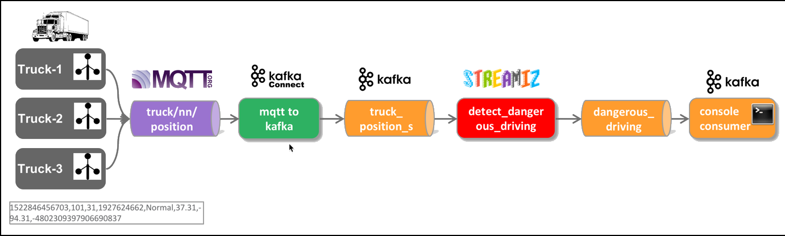

# Stream Processing using Streamiz

Let's redo the simple message filtering process of the previous workshop, using the [Streamiz.Kafka.Net](https://lgouellec.github.io/kafka-streams-dotnet) instead of KSQL. Streamiz.Kafka.Net is a .NET stream processing library for Apache Kafka (TM).



## Create the project structure

First create the workspace folder, which will hold our projects and navigate into it.

```bash
mkdir kafka-dotnet-streamiz
cd kafka-dotnet-streamiz
```

Now let's create the processor project

```bash
dotnet new console -o processor
```

Now start Visual Code, on Linux if installed using the [following documentation](https://code.visualstudio.com/docs/setup/linux), then it can be started with `code`.

```bash
code .
```

## Create the processor

To reference the library from the .NET Core project, execute the following command from within the `kafka-dotnet-streamiz` folder.

```
dotnet add processor package Streamiz.Kafka.Net
```

## Create the necessary Kafka Topic

We will use the topic `dangerous_driving_kstreams` for the output stream in the Kafka Streams code below. Due to the fact that `auto.topic.create.enable` is set to `false`, we have to manually create the topic.

Connect to the `broker-1` container

```bash
docker exec -ti broker-1 bash
```

and execute the necessary `kafka-topics` command.

```bash
kafka-topics --bootstrap-server kafka-1:19092,kafka-2:19093 --create --topic dangerous_driving_streamiz --partitions 8 --replication-factor 2
```

## Create a Streamiz Topology

Open `Program.cs` in the editor and add a `TruckPosition` class, which is handling the transformation from/to CSV and then add the Streamiz topology after.

```csharp
using Confluent.Kafka;
using Streamiz.Kafka.Net;
using Streamiz.Kafka.Net.SerDes;
using Streamiz.Kafka.Net.Stream;
using Streamiz.Kafka.Net.Table;
using System;
using System.Collections.Generic;
using System.IO;
using System.Linq;
using System.Runtime.Intrinsics;
using System.Threading;
using Microsoft.Extensions.Logging;
using Streamiz.Kafka.Net.Crosscutting;
using System.Threading.Tasks;

namespace processor
{
    class TruckPosition
    {
	      long timestamp;
	      int truckId;
	      int driverId;
	      int routeId;
	      String eventType;
	      Double latitude;
	      Double longitude;
	      String correlationId;

        public static TruckPosition create(String csvRecord) {
            TruckPosition truckPosition = new TruckPosition();

            String[] values = csvRecord.Split(',');
            truckPosition.timestamp = Convert.ToInt64(values[0]);
		        truckPosition.truckId = Convert.ToInt32(values[1]);
		        truckPosition.driverId = Convert.ToInt32(values[2]);
		        truckPosition.routeId = Convert.ToInt32(values[3]);
		        truckPosition.eventType = values[4];
		        truckPosition.latitude = Convert.ToDouble(values[5]);
		        truckPosition.longitude = Convert.ToDouble(values[6]);
		        truckPosition.correlationId = values[7];

            return truckPosition;
        }

        public static Boolean filterNonNORMAL(TruckPosition value) {
            Boolean result = false;
            result = !value.eventType.Equals("Normal");
            return result;
        }

        public String toCSV() {
		        return timestamp + "," + truckId + "," + driverId + "," + routeId + "," + eventType + "," + latitude + "," + longitude + "," + correlationId;
	      }

    }

    class Program
    {
        static async Task Main(string[] args)
        {
            var config = new StreamConfig<StringSerDes, StringSerDes>();
            config.ApplicationId = "test-app";
            config.BootstrapServers = "dataplatform:9092";

            StreamBuilder builder = new StreamBuilder();

            builder.Stream<string, string>("truck_position")
                .MapValues(v => TruckPosition.create(v.Remove(0,6)))
                .Filter((k,v) => TruckPosition.filterNonNORMAL(v))
                .MapValues(v => v.toCSV())
                .To("dangerous_driving_streamiz");

            Topology t = builder.Build();
            KafkaStream stream = new KafkaStream(t, config);

            Console.CancelKeyPress += (o, e) =>
            {
                stream.Dispose();
            };

            await stream.StartAsync();
        }

    }
}
```

With this in place, we can run the Topology from the terminal.

```bash
dotnet run -p ./processor/processor.csproj
```

Now let's see that we actually produce data on that new topic by running a `kafka-console-consumer` or alternatively a `kafkacat`.

```bash
kcat -b kafka-1:19092 -t dangerous_driving_streamiz
```
