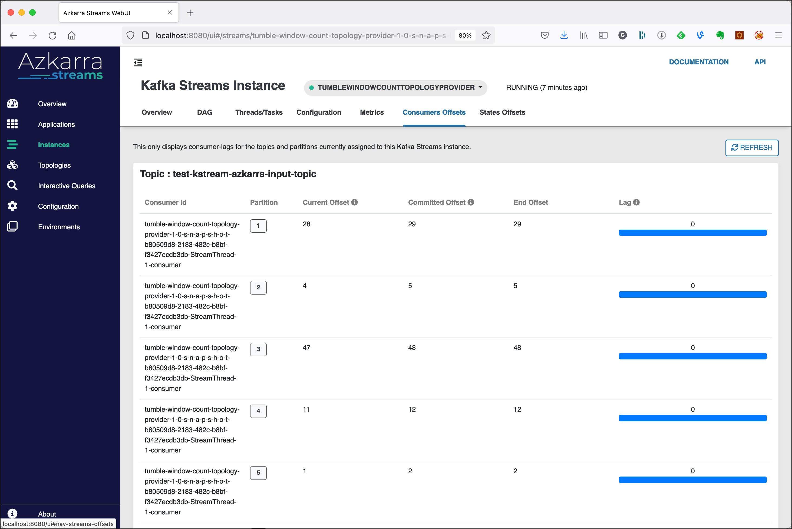

# Using Kafka Streams with Azkarra Streams for Stream Analytics

In this workshop we will learn how to process messages using the [Azkarra Streams](https://www.azkarrastreams.io) framework for Kafka Streams. Azkarra Streams is a lightweight java framework to make it easy to develop, deploy and manage streaming microservices based on Apache Kafka Streams.(Azkarra is Basque words meaning “Fast”).

We will create an Azkarra Streams application and implement the same basic processor from Workshop 8 which consumes messages from a topic, processes them and produces the result into a new topic. We will be using the Kafka Streams High-Level DSL.

## Setting up a Maven Project

We are going to use a Azkarra Streams Maven Archetype for creating a simple project structure. 

Run this following command


```bash
mvn archetype:generate -DarchetypeGroupId=io.streamthoughts \
-DarchetypeArtifactId=azkarra-quickstart-java \
-DarchetypeVersion=0.9.2 \
-DgroupId=com.trivadis.kafkaws \
-DartifactId=azkarra-kafkastreams \
-Dversion=1.0-SNAPSHOT \
-Dpackage=com.trivadis.kafkaws \
-DinteractiveMode=false
```

Maven will create a new project with the following structure (including a template implementation)

```bash
azkarra-kafkastreams/
├── docker-compose.yml
├── pom.xml
└── src
    └── main
        ├── java
        │   └── com
        │       └── trivadis
        │           └── kafkaws
        │               ├── StreamingApp.java
        │               └── Version.java
        └── resources
            ├── application.conf
            ├── log4j2.xml
            └── version.properties
```

The `pom.xml` already contains the Azkarra Streams and Kafka Streams dependencies

```xml
    <dependencies>

        <dependency>
            <groupId>org.apache.kafka</groupId>
            <artifactId>kafka-streams</artifactId>
            <version>${kafka.streams.version}</version>
            <scope>compile</scope>
            <exclusions>
                <exclusion>
                    <groupId>org.slf4j</groupId>
                    <artifactId>slf4j-api</artifactId>
                </exclusion>
            </exclusions>
        </dependency>

        <!-- START dependencies for Azkarra Streams -->
        <dependency>
            <groupId>io.streamthoughts</groupId>
            <artifactId>azkarra-metrics</artifactId>
            <version>${azkarra.streams.version}</version>
            <scope>compile</scope>
        </dependency>

        <dependency>
            <groupId>io.streamthoughts</groupId>
            <artifactId>azkarra-streams</artifactId>
            <version>${azkarra.streams.version}</version>
            <scope>compile</scope>
        </dependency>
        <!-- END dependencies for Azkarra Streams -->
        
        ...
    </dependencies>
```    

The project also contains a very straightforward `docker-compose.yml`, which we can delete (or ignore) as we won't need it as we have our "own" dataplatform running in docker compose.

## Creating the necessary topics

We will use the topic `test-kstream-azkarra-input-topic` and `test-kstream-azkarra-output-topic` in the KafkaStream processorcode below. Due to the fact that `auto.topic.create.enable` is set to `false`, we have to manually create the topic. 

Connect to the `kafka-1` container and execute the necessary kafka-topics command. 

```bash
docker exec -ti kafka-1 kafka-topics --create \
    --replication-factor 3 \
    --partitions 8 \
    --topic test-kstream-azkarra-input-topic \
    --zookeeper zookeeper-1:2181
    
docker exec -ti kafka-1 kafka-topics --create \
    --replication-factor 3 \
    --partitions 8 \
    --topic test-kstream-azkarra-output-topic \
    --zookeeper zookeeper-1:2181
```

This finishes the setup steps and our new project is ready to be used. Next we will implement the KafkaStreams Processor Topology using the Kafka Streams DSL.


## Writing the Kafka Streams application

Using your favorite IDE or editor, open the Maven project.

There is already an template implementation of an Azkarra Streams application in `com.trivadis.kafkaws.StreamingApp`. Overwrite it with the following implementation

```java
package com.trivadis.kafkaws;

import io.streamthoughts.azkarra.api.annotations.Component;
import io.streamthoughts.azkarra.api.config.Conf;
import io.streamthoughts.azkarra.api.config.Configurable;
import io.streamthoughts.azkarra.api.streams.TopologyProvider;
import io.streamthoughts.azkarra.streams.AzkarraApplication;
import io.streamthoughts.azkarra.streams.autoconfigure.annotations.AzkarraStreamsApplication;
import org.apache.kafka.common.serialization.Serde;
import org.apache.kafka.common.serialization.Serdes;
import org.apache.kafka.streams.StreamsBuilder;
import org.apache.kafka.streams.Topology;
import org.apache.kafka.streams.kstream.*;

import java.time.Duration;
import java.time.ZoneId;
/**
 * Azkarra Streams Application
 *
 * <p>For a tutorial how to write a Azkarra Streams application, check the
 * tutorials and examples on the <a href="https://www.azkarrastreams.io/docs/">Azkarra Website</a>.
 * </p>
 */
@AzkarraStreamsApplication
public class StreamingApp {

    public static void main(final String[] args) {
        AzkarraApplication.run(StreamingApp.class, args);
    }

    @Component
    public static class TumbleWindowCountTopologyProvider implements TopologyProvider, Configurable {

        private String topicSource;
        private String topicSink;
        private String stateStoreName;

        @Override
        public void configure(final Conf conf) {
            topicSource = conf.getOptionalString("topic.source").orElse("test-kstream-azkarra-input-topic");
            topicSink = conf.getOptionalString("topic.sink").orElse("test-kstream-azkarra-output-topic");
            stateStoreName = conf.getOptionalString("state.store.name").orElse("count");
        }

        @Override
        public String version() {
            return Version.getVersion();
        }

        @Override
        public Topology topology() {
            final StreamsBuilder builder = new StreamsBuilder();

            final KStream<String, String> stream = builder.stream(topicSource);

            // create a tumbling window of 60 seconds
            TimeWindows tumblingWindow = TimeWindows.of(Duration.ofSeconds(60));

            KTable<Windowed<String>, Long> counts = stream.groupByKey()
                    .windowedBy(tumblingWindow)
                    .count(Materialized.as(stateStoreName));

            counts.toStream().print(Printed.<Windowed<String>, Long>toSysOut().withLabel("counts"));

            final Serde<String> stringSerde = Serdes.String();
            final Serde<Long> longSerde = Serdes.Long();
            counts.toStream( (wk,v) -> wk.key() + ":" + wk.window().startTime().atZone(ZoneId.of("Europe/Zurich")) + " to " + wk.window().endTime().atZone(ZoneId.of("Europe/Zurich"))).to(topicSink, Produced.with(stringSerde, longSerde));

            return builder.build();
        }
    }
}
```

## Configure Azkarra Streams application

Azkarra Streams provides an easy mechanism to keep the configuration of your streaming application outside of the Java code.

Update the file `src/main/resources/application.conf` to contain the following configuration settings

```
azkarra {
  context {
    // Create source topics before starting Kafka Streams.
    auto.create.topics.enable = true

    // Wait for source topics to be created before starting Kafka Streams.
    wait.for.topics.enable = true

    monitoring.streams.interceptor {
      // Enable the MonitoringStreamsInterceptor
      enable = false
      // The output topic for sending monitoring events
      topic = "_azkarra-streams-monitoring"
      // The period the interceptor should use to send a streams state event (in milliseconds)
      interval.ms = 10000
    }
  }

  // Global configuration for all Kafka Streams instances
  streams {
    bootstrap.servers = "dataplatform:9092"
    default.key.serde = "org.apache.kafka.common.serialization.Serdes$StringSerde"
    default.value.serde = "org.apache.kafka.common.serialization.Serdes$StringSerde"
  }

  // List of components to auto-registered into context;
  components = [ ]

  // List of environments to auto-registered into context;
  environments = [ ]

  // Azkarra Metrics configs
  metrics {
    enable = true
    // Enable endpoint /prometheus
    endpoints.prometheus.enable = true
    // Enable JVM Metrics
    binders.jvm.enable = true
    // Enable KafkaStreams Metrics
    binders.kafkastreams.enable = true
  }

  // Azkarra Server configs
  server {
    // Enable JAX-RS resources extensions
    rest.extensions.enable = true
    listener = localhost
    port = 8080
    headless = false
    webui.enable = true
    // These information will be exposes through the http endpoint GET /info
    info {
      app {
        name = "@project.name@"
        description = "@project.description@"
        version = "@project.version@"
        encoding = "@project.build.sourceEncoding@"
        java.version = "@java.version@"
      }
    }
  }
}
```

## Running the Azkarra Streams application

As a last step, we will package and run the Maven project

```bash
mvn clean package && java -jar target/azkarra-kafkastreams-1.0-SNAPSHOT.jar
```

## Testing the Azkarra Streams application

Start the program and then first run a `kcat` consumer on the output topic

```bash
kcat -b dataplatform:9092 -t test-kstream-azkarra-output-topic -s value=q -o end -f "%k,%s\n" -q
```

Let's produce some messages to the input topic. Start a `kafkacat` producer

```bash
kcat -b dataplatform:9092 -t test-kstream-azkarra-input-topic -P -K , 
```

and produce some values with `<key>,<value>` syntax, such as

```bash
A,AAA
A,AAA
B,BBB
B,BBB
C,CCC
D,DDD
E,EEE
D,DDD
```

You should see the count by key on the console similar as shown below

```bash
B:2021-08-22T17:13+02:00[Europe/Zurich] to 2021-08-22T17:14+02:00[Europe/Zurich],2
C:2021-08-22T17:13+02:00[Europe/Zurich] to 2021-08-22T17:14+02:00[Europe/Zurich],1
D:2021-08-22T17:13+02:00[Europe/Zurich] to 2021-08-22T17:14+02:00[Europe/Zurich],2
E:2021-08-22T17:13+02:00[Europe/Zurich] to 2021-08-22T17:14+02:00[Europe/Zurich],1
A:2021-08-22T17:13+02:00[Europe/Zurich] to 2021-08-22T17:14+02:00[Europe/Zurich],2
```

## Azkarra UI

Azkarra also provides a default WebUI for exploring your local streams application. Azkarra Streams Web UI is available on <http://localhost:8080/ui>.


### Details on Instances

Navigate to **Instances** in the menu on the left side


Click on **tumbleWindowCountTopologyProvider** and you will see an overview of the Kafka Streams instance


Click on **DAG** to see a graphical representation of the Kafka Streams application


Click on **Consumer Offsets** to monitor possible consumer lags of your Kafka Streams topology



### Interactive Queries

If the Kafka Streams uses state stores, which our application here does, then the Azkarra UI allows to execute queries agains the state stores from the Dashboard UI. This is a standard functionality of Kafka Streams, which is implemented and available to use by Azkarra Streams. 

Navigate to **Interactive Queries** in the menu on the left side. In the **Application** drop-down select the application, in the **Store** drop-down select the `count` state store, select `TimestampedWindow` for the **Type** and select `all` for the **Operation**. 


Click **Execute** to run the query and you can see all the informaiton in the state store


If you know the time range (`timeFrom` and `timeTo`) you can switch the **Operation** to `fetch_all`


and you get the counts just for the given time range. The other operations allow to also restrict the keys you want to see.

Click on **CopyAsCurl** to get the `curl` command matching the query:

```bash
curl -H "Accept: application/json" -H "Content-Type:application/json" -sX POST http://localhost:8080/api/v1/applications/tumble-window-count-topology-provider-1-0-s-n-a-p-s-h-o-t/stores/count --data '{"set_options":{"query_timeout_ms":30000,"retries":100,"retry_backoff_ms":100,"remote_access_allowed":true},"type":"timestamped_window","query":{"fetch_all":{"keyFrom":"A","keyTo":"Z","timeFrom":"1629639660000","timeTo":"1629639720000","key":"A","time":"1629639709666"}}}'
```
 


