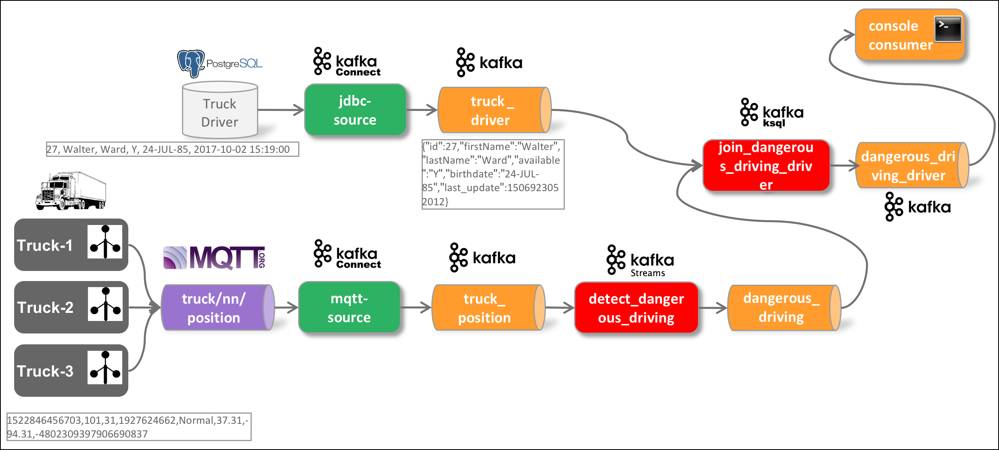

# IoT Vehicle Tracking Workshop

In this workshop we will be ingesting data not directly into Kafka but rather through MQTT first. We will be using a fictitious Trucking company with a fleet of trucks constantly providing some data about the moving vehicles. 

The following diagram shows the setup of the data flow we will be implementing. 

We will show the implementation step-by-step. For the streaming analytics step we will see different solutions:

* [IoT Data Ingestion through MQTT into Kafka](../13a-iot-data-ingestion-over-mqtt)

* Stream Analytics
	* [Stream Analytics using ksqlDB](../13b-stream-analytics-using-ksql)
	* [Stream Analytcis with Java using Kafka Streams](../13c-stream-analytics-using-java-kstreams)
	* [Stream Analytics using Streamiz](../13d-stream-analytics-using-dotnet-streamiz)
	* [Stream Analytics using Spark Structured Streaming](../13e-stream-analytics-using-spark-structured-streaming)

* [Static Data Ingestion into Kafka](../13f-static-data-ingestion)

