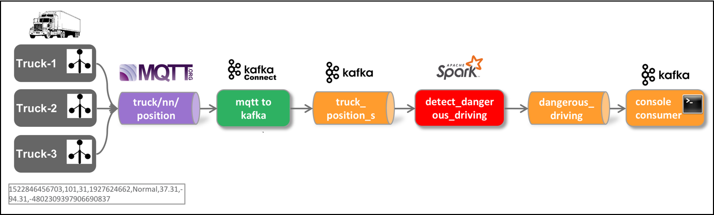
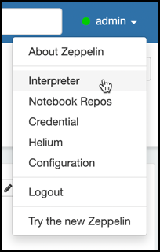
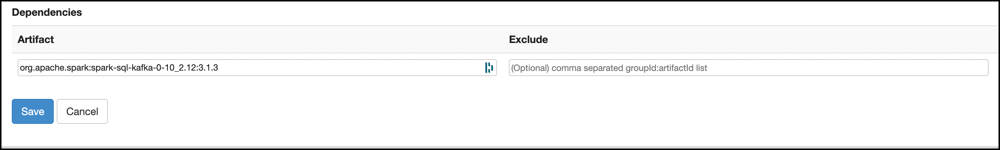
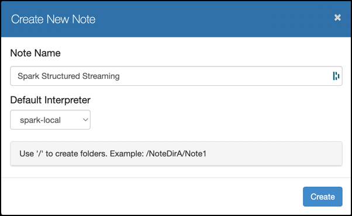

# Using Spark Structured Streaming for Stream Analytics

In this workshop we will learn how to process messages using Spark Structured Streaming.



With Spark Structured Streaming we assume the data to be available in JSON. Therefore we first transform it using ksqlDB using the ksqlDB stream created in workshop 13b.

```sql
CREATE STREAM truck_position_json_s
  WITH (kafka_topic='truck_position_json',
        value_format='JSON')
AS
SELECT * FROM truck_position_s
EMIT CHANGES;
```

## Creating Spark environment in Zeppelin

In a web browser navigate to Zeppelin on <http://dataplatform:28080>.

Let's create a local Spark environment by adding a new interpreter. On the right corner, click on **Admin** and select **Interpreter**



Click on **Create** to create a new Interpreter and set **Interpreter Name** to `spark-local` and select `spark` for the **Interpreter Group**.

Scroll down to **Dependencies** and add `org.apache.spark:spark-sql-kafka-0-10_2.12:3.1.3` into the **Artifact** field.



Click **Save** to create the interpreter.

## Creating a new notebook in Zeppelin

Create a new Notebook and select the `spark-local`



## Implement Spark Structured Streaming pipeline in Python

### Define Schema for truck_position events/messages

```python
%pyspark
from pyspark.sql.types import *

truckPositionSchema = StructType().add("TS", StringType()).add("TRUCKID",StringType()).add("DRIVERID", LongType()).add("ROUTEID", LongType()).add("EVENTTYPE", StringType()).add("LATITUDE", DoubleType()).add("LONGITUDE", DoubleType()).add("CORRELATIONID", StringType()) 
```

### Kafka Consumer

```python
rawDf = spark
  .readStream
  .format("kafka")
  .option("kafka.bootstrap.servers", "kafka-1:19092,kafka-2:19093")
  .option("subscribe", "truck_position_json")
  .load()
```

### Show the schema of the raw Kafka message

```python
rawDf.printSchema
```

### Map to "truck_position" schema and extract event time (trunc to seconds) 

```python
%pyspark
from pyspark.sql.functions import from_json

jsonDf = rawDf.selectExpr("CAST(value AS string)")
jsonDf = jsonDf.select(from_json(jsonDf.value, truckPositionSchema).alias("json")).selectExpr("json.*", "cast(cast (json.timestamp as double) / 1000 as timestamp) as eventTime")
```

### Show schema of data frame

```python
%pyspark
jsonDf.printSchema
```

### Run 1st query into in memory "table"

```python
%pyspark
query1 = jsonDf.writeStream.format("memory").queryName("truck_position").start()
```

### Using Spark SQL to read from the in-memory "table"

```python
%pyspark
spark.sql ("select * from truck_position").show()
```

or in Zeppelin using the %sql directive

```sql
%sql
select * from truck_position

```

### Stop the query

```python
%pyspark
query1.stop()
```

### Filter out normal events

```python
%pyspark
jsonDf.printSchema
jsonFilteredDf = jsonDf.where("json.EVENTTYPE !='Normal'")
```

### Run 2nd query on filtered data into in memory "table"

```python
%pyspark
query2 = jsonFilteredDf.writeStream.format("memory").queryName("filtered_truck_position").start()
```

### Use Spark SQL

```python
%pyspark
spark.sql ("select * from filtered_truck_position2").show()  
```

### Stop 2nd query

```python
%pyspark
query2.stop
```

### Run 3rd query - Write non-normal events to Kafka topic

Create a new topic

```
docker exec -ti kafka-1 kafka-topics --create --zookeeper zookeeper-1:2181 --topic dangerous_driving_spark --partitions 8 --replication-factor 3
```

```python
%pyspark
query3 = jsonFilteredDf.selectExpr("to_json(struct(*)) AS value").writeStream.format("kafka").option("kafka.bootstrap.servers", "kafka-1:19092").option("topic","dangerous_driving_spark").option("checkpointLocation", "/tmp").start()    
```

### Stop 3rd query

```python
query3.stop
```

