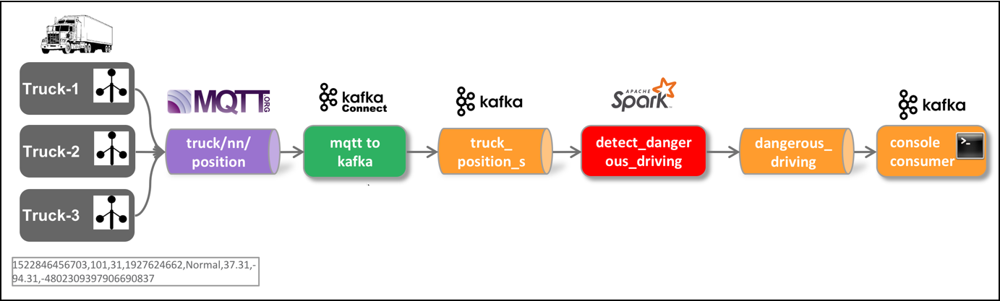

# IoT Data Ingestion and Analytics - Stream Processing using Spark Structured Streaming

With the truck data continuously ingested into the `truck_movement` topic, let's now perform some stream processing on the data.
 
There are many possible solutions for performing analytics directly on the event stream. From the Kafka ecosystem, we can either use Kafka Streams or ksqlDB, a SQL abstraction on top of Kafka Streams. For this workshop we will be using KSQL. 




CREATE STREAM truck_position_json_s
  WITH (kafka_topic='truck_position_json',
        value_format='JSON')
AS
SELECT * FROM truck_position_s
EMIT CHANGES;


## Using Python

### Define Schema for truck_position events/messages

```python
%pyspark
from pyspark.sql.types import *

truckPositionSchema = StructType().add("TS", StringType()).add("TRUCKID",StringType()).add("DRIVERID", LongType()).add("ROUTEID", LongType()).add("EVENTTYPE", StringType()).add("LATITUDE", DoubleType()).add("LONGITUDE", DoubleType()).add("CORRELATIONID", StringType()) 
```

### Kafka Consumer

```python
rawDf = spark
  .readStream
  .format("kafka")
  .option("kafka.bootstrap.servers", "kafka-1:19092,kafka-2:19093")
  .option("subscribe", "truck_position_json")
  .load()
```

### Show the schema of the raw Kafka message

```python
rawDf.printSchema
```

### Map to "truck_position" schema and extract event time (trunc to seconds) 

```python
%pyspark
from pyspark.sql.functions import from_json

jsonDf = rawDf.selectExpr("CAST(value AS string)")
jsonDf = jsonDf.select(from_json(jsonDf.value, truckPositionSchema).alias("json")).selectExpr("json.*", "cast(cast (json.timestamp as double) / 1000 as timestamp) as eventTime")
```

### Show schema of data frame

```python
%pyspark
jsonDf.printSchema
```

### Run 1st query into in memory "table"

```python
%pyspark
query1 = jsonDf.writeStream.format("memory").queryName("truck_position").start()
```

### Using Spark SQL to read from the in-memory "table"

```python
%pyspark
spark.sql ("select * from truck_position").show()
```

or in Zeppelin using the %sql directive

```sql
%sql
select * from truck_position

```

### Stop the query

```python
%pyspark
query1.stop()
```

### Filter out normal events

```python
%pyspark
jsonDf.printSchema
jsonFilteredDf = jsonDf.where("json.EVENTTYPE !='Normal'")
```

### Run 2nd query on filtered data into in memory "table"

```python
%pyspark
query2 = jsonFilteredDf.writeStream.format("memory").queryName("filtered_truck_position").start()
```

### Use Spark SQL

```python
%pyspark
spark.sql ("select * from filtered_truck_position2").show()  
```

### Stop 2nd query

```python
%pyspark
query2.stop
```

### Run 3rd query - Write non-normal events to Kafka topic

Create a new topic

```
docker exec -ti kafka-1 kafka-topics --create --zookeeper zookeeper-1:2181 --topic dangerous_driving_spark --partitions 8 --replication-factor 3
```

```python
%pyspark
query3 = jsonFilteredDf.selectExpr("to_json(struct(*)) AS value").writeStream.format("kafka").option("kafka.bootstrap.servers", "kafka-1:19092").option("topic","dangerous_driving_spark").option("checkpointLocation", "/tmp").start()    
```

### Stop 3rd query

```python
query3.stop
```

