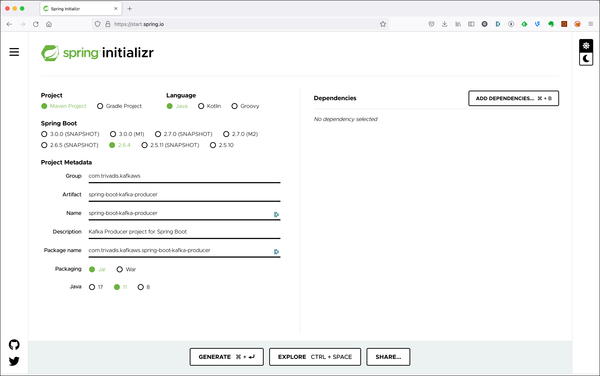
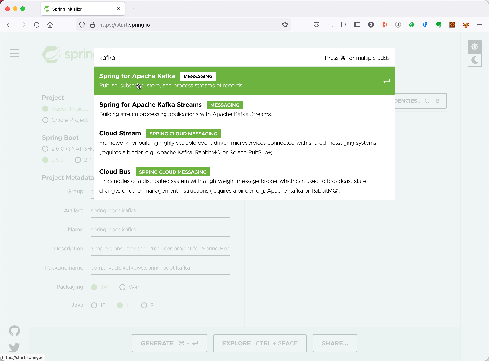
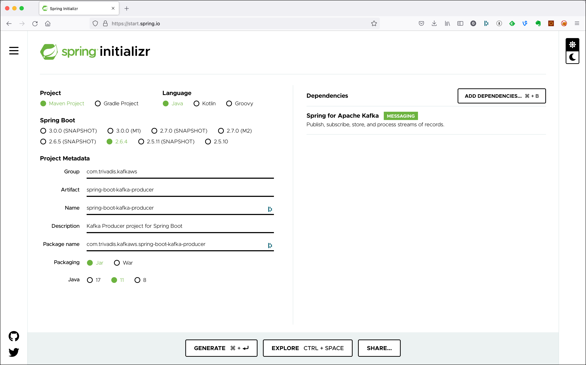

# Testing Kafka from Spring Boot using Kafka Spring

In this workshop we will learn how to use the **Spring Kafka** abstraction from within a Spring Boot application. We will implement both a consumer and a producer implementing the same behaviour as in [Workshop 4: Working with Kafka from Java](../04-producing-consuming-kafka-with-java). 

We will create two Spring Boot projects, one for the **Producer** and one for the **Consumer**, simulating two independent microservices interacting with eachother via events.

## Create the Spring Boot Producer

First we create and test the Producer microservice.

### Creating the Spring Boot Project

First, let’s navigate to [Spring Initializr](https://start.spring.io/) to generate our project. Our project will need the Apache Kafka support. 

Select Generate a **Maven Project** with **Java** and Spring Boot **2.6.4**. Enter `com.trivadis.kafkaws` for the **Group**, `spring-boot-kafka-producer` for the **Artifact** field and `Kafka Producer project for Spring Boot` for the **Description** field. 



Click on **Add Dependencies** and search for the  **Spring for Apache Kafka** depencency. 



Select the dependency and hit the **Enter** key. You should now see the dependency on the right side of the screen.



Click on **Generate Project** and unzip the ZIP file to a convenient location for development. 

Once you have unzipped the project, you’ll have a very simple structure. 

Import the project as a Maven Project into your favourite IDE for further development. 

### Implement a Kafka Producer in Spring

Now create a simple Java class `KafkaEventProducer` within the `com.trivadis.kafkaws.springbootkafkaproducer ` package, which we will use to produce messages to Kafka.

```java
package com.trivadis.kafkaws.springbootkafkaproducer;

import org.slf4j.Logger;
import org.slf4j.LoggerFactory;
import org.springframework.beans.factory.annotation.Autowired;
import org.springframework.beans.factory.annotation.Value;
import org.springframework.kafka.core.KafkaTemplate;
import org.springframework.kafka.support.SendResult;
import org.springframework.stereotype.Component;

import java.util.concurrent.ExecutionException;
import java.util.concurrent.TimeUnit;
import java.util.concurrent.TimeoutException;

@Component
public class KafkaEventProducer {
    private static final Logger LOGGER = LoggerFactory.getLogger(KafkaEventProducer.class);

    @Autowired
    private KafkaTemplate<Long, String> kafkaTemplate;

    @Value("${topic.name}")
    String kafkaTopic;

    public void produce(Integer id, Long key, String value) {
        long time = System.currentTimeMillis();

        SendResult<Long, String> result = null;
        try {
            result = kafkaTemplate.send(kafkaTopic, key, value).get(10, TimeUnit.SECONDS);
        } catch (InterruptedException e) {
            e.printStackTrace();
        } catch (ExecutionException e) {
            e.printStackTrace();
        } catch (TimeoutException e) {
            e.printStackTrace();
        }

        long elapsedTime = System.currentTimeMillis() - time;
        System.out.printf("[" + id + "] sent record(key=%s value=%s) "
                        + "meta(partition=%d, offset=%d) time=%d\n",
                key, value, result.getRecordMetadata().partition(),
                result.getRecordMetadata().offset(), elapsedTime);
    }
}
```

It uses the `Component` annotation to have it registered as bean in the Spring context. The topic to produce to is specified as a property, which we will specify later in the `applicaiton.yml` file.

We produce the messages synchronously.

### Create the necessary Topics through code

Spring Kafka can automatically add topics to the broker, if they do not yet exists. By that you can replace the `kafka-topics` CLI commands seen so far to create the topics, if you like.

Spring Kafka provides a `TopicBuilder` which makes the creation of the topics very convenient. 

```java
package com.trivadis.kafkaws.springbootkafkaproducer;

import org.apache.kafka.clients.admin.NewTopic;
import org.springframework.beans.factory.annotation.Value;
import org.springframework.context.annotation.Bean;
import org.springframework.kafka.config.TopicBuilder;
import org.springframework.stereotype.Component;

@Component
public class TopicCreator {
    @Value(value = "${topic.name}")
    private String testTopic;

    @Value(value = "${topic.partitions}")
    private Integer testTopicPartitions;

    @Value(value = "${topic.replication-factor}")
    private short testTopicReplicationFactor;

    @Bean
    public NewTopic testTopic() {
        return TopicBuilder.name(testTopic)
                        .partitions(testTopicPartitions)
                        .replicas(testTopicReplicationFactor)
                        .build();
    }
}
```

We again refer to properties, which will be defined later in the `application.yml` config file. 

### Add Producer logic to the SpringBootKafkaProducerApplication class

We change the generated Spring Boot application to be a console appliation by implementing the `CommandLineRunner` interface. The `run` method holds the same code as the `main()` method in [Workshop 4: Working with Kafka from Java](../04-producing-consuming-kafka-with-java). The `runProducer` method is also similar, we just use the `kafkaEventProducer` instance injected by Spring to produce the messages to Kafka.

```java
package com.trivadis.kafkaws.springbootkafkaproducer;

import org.slf4j.Logger;
import org.slf4j.LoggerFactory;
import org.springframework.beans.factory.annotation.Autowired;
import org.springframework.boot.CommandLineRunner;
import org.springframework.boot.SpringApplication;
import org.springframework.boot.autoconfigure.SpringBootApplication;

import java.time.LocalDateTime;

@SpringBootApplication
public class SpringBootKafkaProducerApplication implements CommandLineRunner {

	private static Logger LOG = LoggerFactory.getLogger(SpringBootKafkaProducerApplication.class);

	@Autowired
	private KafkaEventProducer kafkaEventProducer;

	public static void main(String[] args) {
		SpringApplication.run(SpringBootKafkaProducerApplication.class, args);
	}

	@Override
	public void run(String... args) throws Exception {
		LOG.info("EXECUTING : command line runner");

		if (args.length == 0) {
			runProducer(100, 10, 0);
		} else {
			runProducer(Integer.parseInt(args[0]), Integer.parseInt(args[1]), Long.parseLong(args[2]));
		}

	}

	private void runProducer(int sendMessageCount, int waitMsInBetween, long id) throws Exception {
		Long key = (id > 0) ? id : null;

		for (int index = 0; index < sendMessageCount; index++) {
			String value =  "[" + id + "] Hello Kafka " + index + " => " + LocalDateTime.now();

			kafkaEventProducer.produce(index, key, value);

			// Simulate slow processing
			Thread.sleep(waitMsInBetween);

		}
	}

}
```

### Configure Kafka through application.yml configuration file

First let's rename the existing `application.properties` file to `application.yml` to use the `yml` format. 

Add the following settings to configure the Kafka cluster and the name of the topic:

```yml
topic:
  name: test-spring-topic
  replication-factor: 3
  partitions: 8

spring:
  kafka:
    bootstrap-servers: ${DATAPLATFORM_IP}:9092
    producer:
      key-serializer: org.apache.kafka.common.serialization.LongSerializer
      value-serializer: org.apache.kafka.common.serialization.StringSerializer
```

For the IP address of the Kafka cluster we refer to an environment variable, which we have to declare before running the application.

```bash
export DATAPLATFORM_IP=nnn.nnn.nnn.nnn
```

### Build the application

First lets build the application:

```bash
mvn package -Dmaven.test.skip=true
```

### Run the application

Now let's run the application

```bash
mvn spring-boot:run
```

Make sure that you see the messages through the console consumer.

To run the producer with custom parameters (for example to specify the key to use), use the `-Dspring-boot.run.arguments`:

```bash
mvn spring-boot:run -Dspring-boot.run.arguments="100 10 10"
```

### Use Console to test the application

In a terminal window start consuming from the output topic:

```bash
kafkacat -b $DATAPLATFORM_IP -t test-spring-topic
```

## Create the Spring Boot Consumer

Now let's create an test the Consumer microservice.

### Creating the Spring Boot Project

Use again the [Spring Initializr](https://start.spring.io/) to generate the project.

Select Generate a **Maven Project** with **Java** and Spring Boot **2.6.4**. Enter `com.trivadis.kafkaws` for the **Group**, `spring-boot-kafka-consumer` for the **Artifact** field and `Kafka Consumer project for Spring Boot` for the **Description** field. 

Click on **Add Dependencies** and search for the  **Spring for Apache Kafka** depencency. 

Select the dependency and hit the **Enter** key. You should now see the dependency on the right side of the screen.

Click on **Generate Project** and unzip the ZIP file to a convenient location for development. 

Once you have unzipped the project, you’ll have a very simple structure. 

Import the project as a Maven Project into your favourite IDE for further development. 

### Implement a Kafka Consumer in Spring

Start by creating a simple Java class `KafkaEventConsumer` within the `com.trivadis.kafkaws.springbootkafkaconsumer` package, which we will use to consume messages from Kafka. 

```java
package com.trivadis.kafkaws.springbootkafkaconsumer;

import org.apache.kafka.clients.consumer.ConsumerRecord;
import org.slf4j.Logger;
import org.slf4j.LoggerFactory;
import org.springframework.kafka.annotation.KafkaListener;
import org.springframework.stereotype.Component;

@Component
public class KafkaEventConsumer {
    private static final Logger LOGGER = LoggerFactory.getLogger(KafkaEventConsumer.class);

    @KafkaListener(topics = "${topic.name}", groupId = "simple-consumer-group")
    public void receive(ConsumerRecord<Long, String> consumerRecord) {
        String value = consumerRecord.value();
        Long key = consumerRecord.key();
        LOGGER.info("received key = '{}' with payload='{}'", key, value);
    }
}
```

This class uses the `Component` annotation to have it registered as bean in the Spring context and the `KafkaListener` annotation to specify a listener method to be called for each record consumed from the Kafka input topic. The name of the topic is specified as a property to be read again from the `application.yml` configuration file.

In the code we only log the key and value received to the console. In real life, we would probably inject another bean into the `KafkaEventConsumer` to perform the message processing.

Starting with version 2.3, Spring Kafka sets `enable.auto.commit` to `false` unless explicitly set in the configuration. Previously, the Kafka default (true) was used if the property was not set.

If `enable.auto.commit` is false, the containers support several `AckMode` settings ([see documentation](https://docs.spring.io/spring-kafka/reference/html/#committing-offsets)). The default AckMode is `BATCH`, which commit the offset when all the records returned by the `poll()` have been processed. Other options allow to commit manually, after a given time has passed or after a given number of records have been consumed.
 
### Configure Kafka through application.yml configuration file

First let's rename the existing `application.properties` file to `application.yml` to use the `yml` format. 

Add the following settings to configure the Kafka cluster and the name of the two topics:

```yml
topic:
  name: test-spring-topic

spring:
  kafka:
    bootstrap-servers: ${DATAPLATFORM_IP}:9092
    consumer:
      key-deserializer: org.apache.kafka.common.serialization.LongDeserializer
      value-deserializer: org.apache.kafka.common.serialization.StringDeserializer
```

For the IP address of the Kafka cluster we refer to an environment variable, which we have to declare before running the application.

```bash
export DATAPLATFORM_IP=nnn.nnn.nnn.nnn
```

### Build the application

First lets build the application:

```bash
mvn package -Dmaven.test.skip=true
```

### Run the application

Now let's run the application

```bash
mvn spring-boot:run
```

## Various Options for Producer & Consumer

### Produce asynchronously

You can also produce asynchronously using Spring Kafka. Let's implement the `KafkaEventProducer` class in an asynchronous way:

```java
package com.trivadis.kafkaws.springbootkafkaproducer;

import org.apache.kafka.clients.producer.ProducerRecord;
import org.slf4j.Logger;
import org.slf4j.LoggerFactory;
import org.springframework.beans.factory.annotation.Autowired;
import org.springframework.beans.factory.annotation.Value;
import org.springframework.kafka.core.KafkaProducerException;
import org.springframework.kafka.core.KafkaSendCallback;
import org.springframework.kafka.core.KafkaTemplate;
import org.springframework.kafka.support.SendResult;
import org.springframework.stereotype.Component;
import org.springframework.util.concurrent.ListenableFuture;

@Component
public class KafkaEventProducerAsync {
    private static final Logger LOGGER = LoggerFactory.getLogger(KafkaEventProducerAsync.class);

    @Autowired
    private KafkaTemplate<Long, String> kafkaTemplate;

    @Value("${topic.name}")
    String kafkaTopic;

    public void produce(Integer id, Long key, String value) {
        long time = System.currentTimeMillis();

        ListenableFuture<SendResult<Long, String>> future = kafkaTemplate.send(kafkaTopic, key, value);

        future.addCallback(new KafkaSendCallback<Long, String>() {
            @Override
            public void onSuccess(SendResult<Long, String> result) {
                long elapsedTime = System.currentTimeMillis() - time;
                System.out.printf("[" + id + "] sent record(key=%s value=%s) "
                                + "meta(partition=%d, offset=%d) time=%d\n",
                        key, value, result.getRecordMetadata().partition(),
                        result.getRecordMetadata().offset(), elapsedTime);
            }

            @Override
            public void onFailure(KafkaProducerException ex) {
                ProducerRecord<Long, String> failed = ex.getFailedProducerRecord();
            }
        } );

    }
}
```

To test it, switch the injection in the `SpringBootKafkaProducerApplication` class to use the `KafkaEventProducerAsync` class:

```java
	@Autowired
	private KafkaEventProducerAsync kafkaEventProducer;
```

### Adding Message Filters for Listeners

Configuring message filtering is actually very simple. You only need to configure a `RecordFilterStrategy` (message filtering strategy) for the listening container factory. When it returns `true`, the message will be discarded. When it returns `false`, the message can normally reach the listening container.

Add the following additional configuration to the `SpringBootKafkaConsumerApplication` class. Here we just discard all messages which do not contain `Kafka 5' in its value:

```java
    @Autowired
    private ConsumerFactory consumerFactory;

    @Bean
    public ConcurrentKafkaListenerContainerFactory<Long, String> filterContainerFactory() {
        ConcurrentKafkaListenerContainerFactory<Long, String> factory = new ConcurrentKafkaListenerContainerFactory<>();
        factory.setConsumerFactory(consumerFactory);
        factory.setRecordFilterStrategy(
                record -> !record.value().contains("Kafka 5"));
        return factory;
    }
```

To use this factory instead of the default one created by the Spring Boot framework, you have to specify the `containerFactory` parameter in the `@KafakListener` annotation.

```java
    @KafkaListener(topics = "${topic.name}", groupId = "simple-consumer-group", containerFactory = "filterContainerFactory")
    public void receive(ConsumerRecord<Long, String> consumerRecord) {
```

Message filtering can be used for example to filter duplicate messages.

### Commit after given number of records

To commit offsets after a given number of records have been processed, swich the `AckMode` from `batch` to `count` and add the `ackCount` configuration to the `application.yml` file:

```yml
spring:
  kafka:
    bootstrap-servers: ${DATAPLATFORM_IP}:9092
    consumer:
      ..
    listener:
      ack-mode: count
      ack-count: 40
```

To check that commits are done after 40 records, you can consume from the `__consumer_offsets`topic using the following enhanced version of the `kafka-console-consumer`:

```bash
docker exec -ti kafka-1 kafka-console-consumer --formatter "kafka.coordinator.group.GroupMetadataManager\$OffsetsMessageFormatter" --bootstrap-server kafka-1:19092 --topic __consumer_offsets
```


### Manual Commit when consuming records

In the `@KafkaListener` method, add an additional parameter to get the `acknowledgment` bean on which you can invoke the `acknowledge()` method.

```java
public class KafkaEventConsumer {
    private static final Logger LOGGER = LoggerFactory.getLogger(KafkaEventConsumer.class);

    @KafkaListener(topics = "${topic.name}", groupId = "simple-consumer-group")
    public void receive(ConsumerRecord<Long, String> consumerRecord, Acknowledgment acknowledgment) {
        String value = consumerRecord.value();
        Long key = consumerRecord.key();
        LOGGER.info("received key = '{}' with payload='{}'", key, value);

        acknowledgment.acknowledge();
    }

}
```

Set the `ack-mode` to `manual` in the `application.yml`. 
