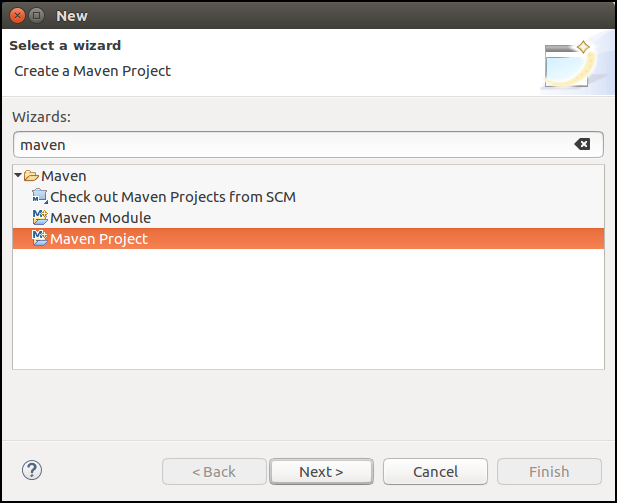
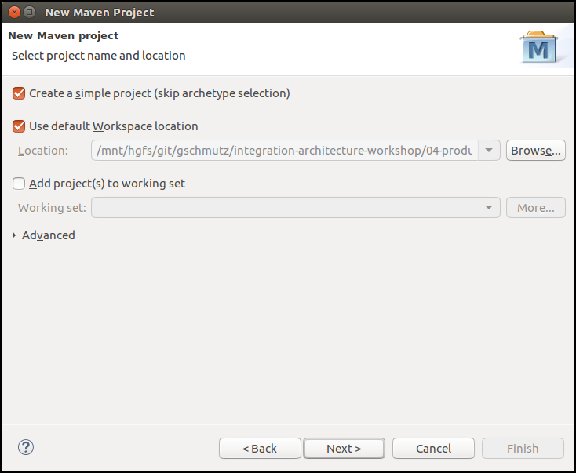
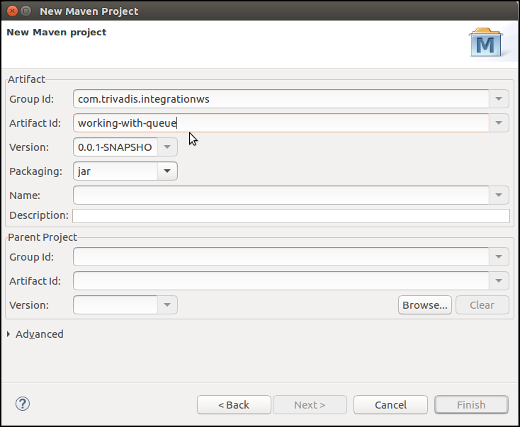
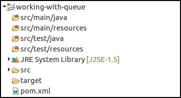

# Working with Eclipse

Eclipse is a popular IDE (Integrated Development Environment) for working with Java. This guide is based on the latest vesion of Eclipse, [Eclipse OXYGEN](http://www.eclipse.org/downloads/).

## Create a new Maven Project

To create a new Java Project with Maven support, perform the following steps:

In the Menu, select **File** | **New** | **Other...**.

Enter **maven** into the **Wizards** edit field. Select **Maven Project** and click **Next**.

Select the **Create a simple project (skip archetype selection)** and click **Next >**.

Specify the **Group Id** and **Artifact Id** and click **Finsih**.

Eclipse will show the new project in the **Package Explorer** to the right. 

You have successfully created an empty Maven Project. Start editing the **pom.xml** as needed. 

