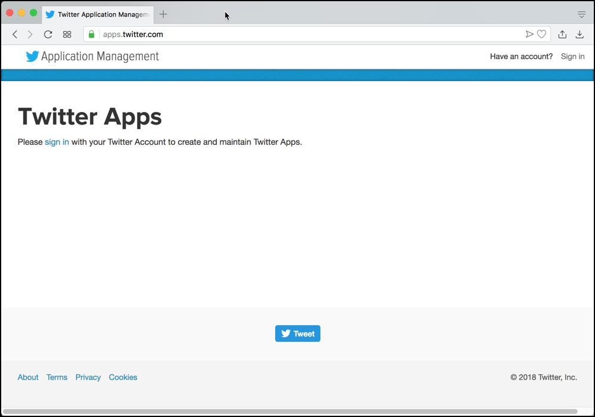
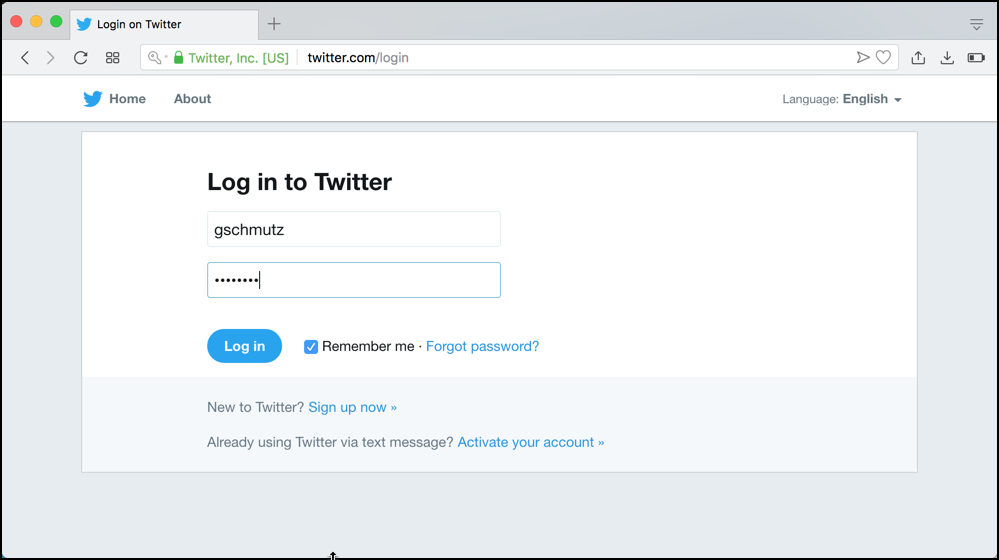
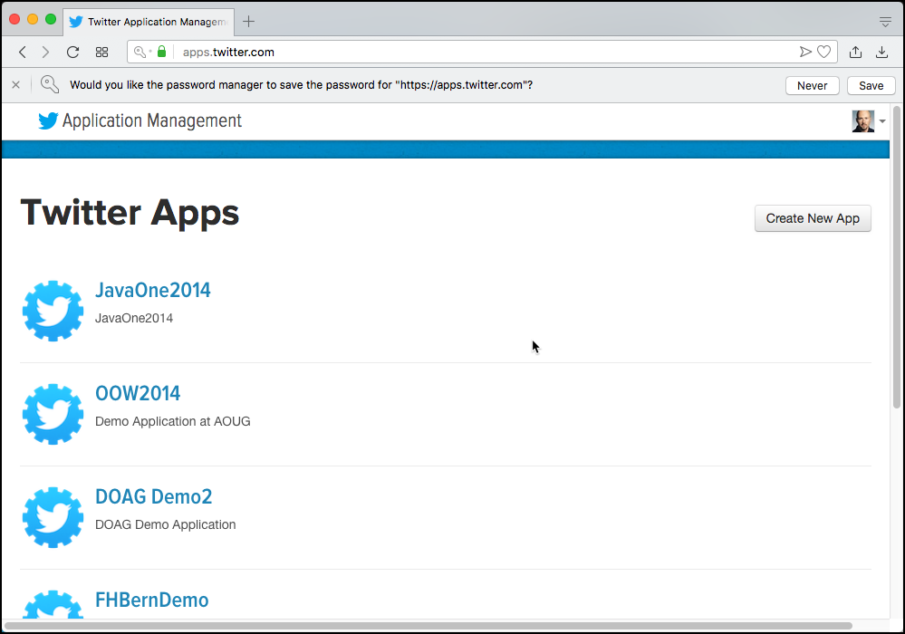
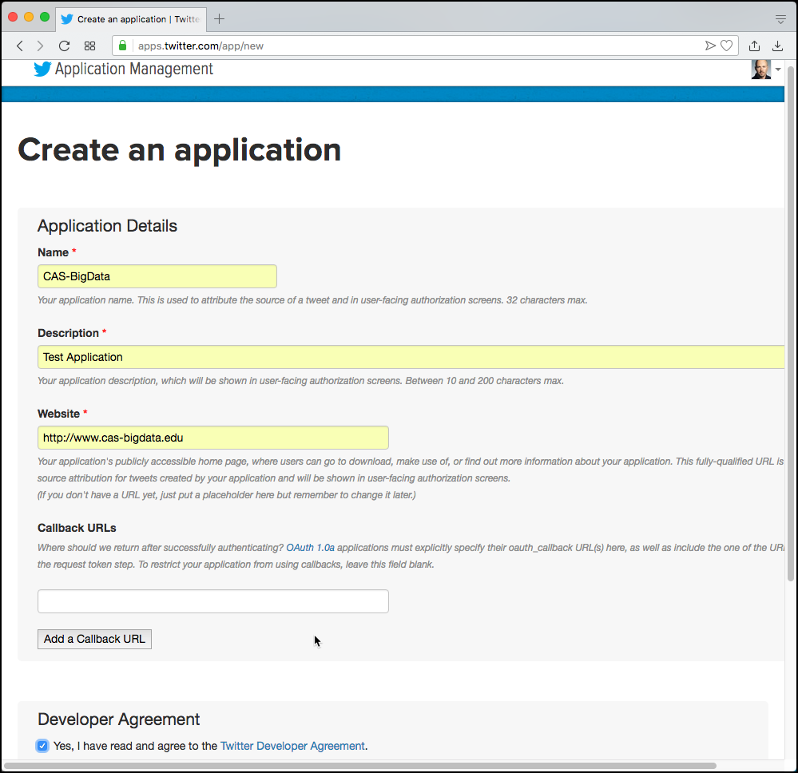
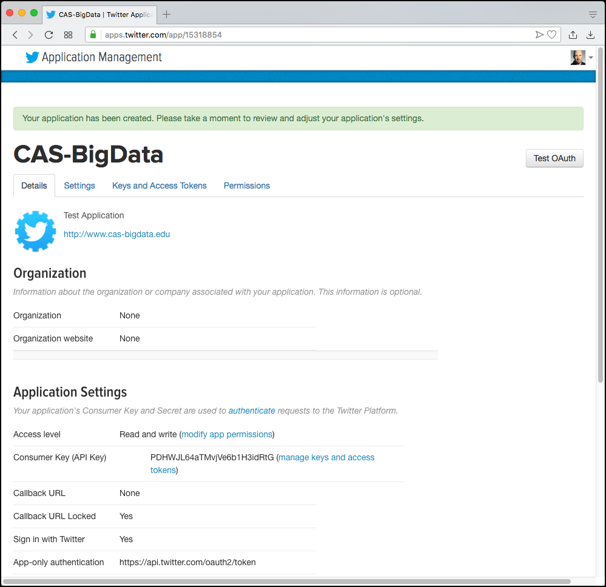
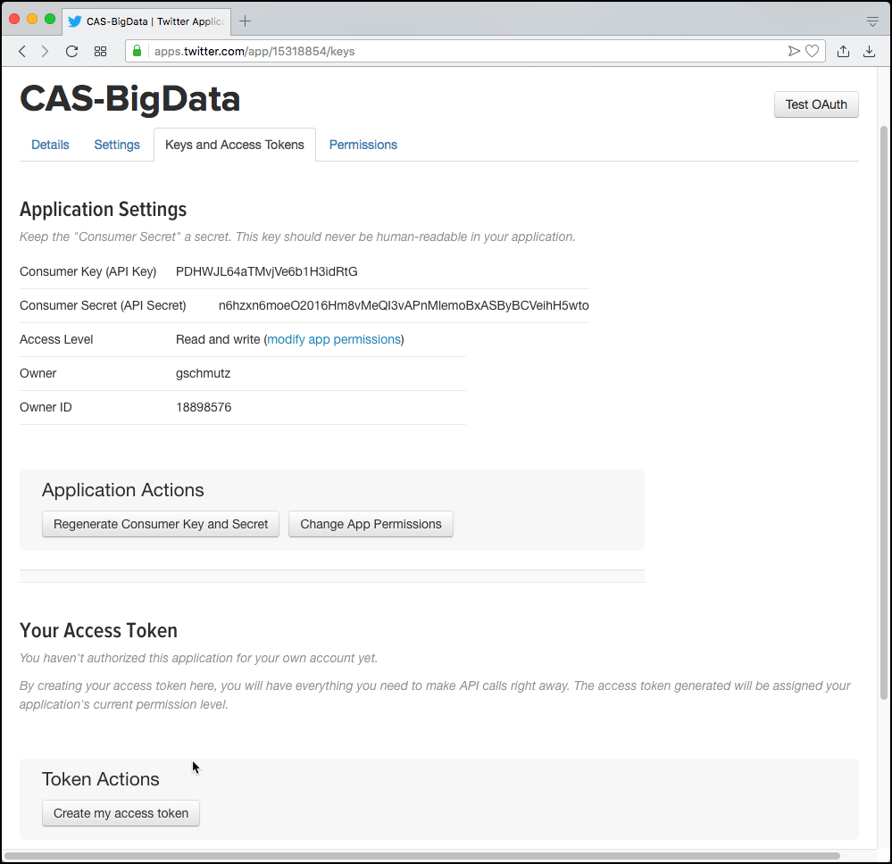
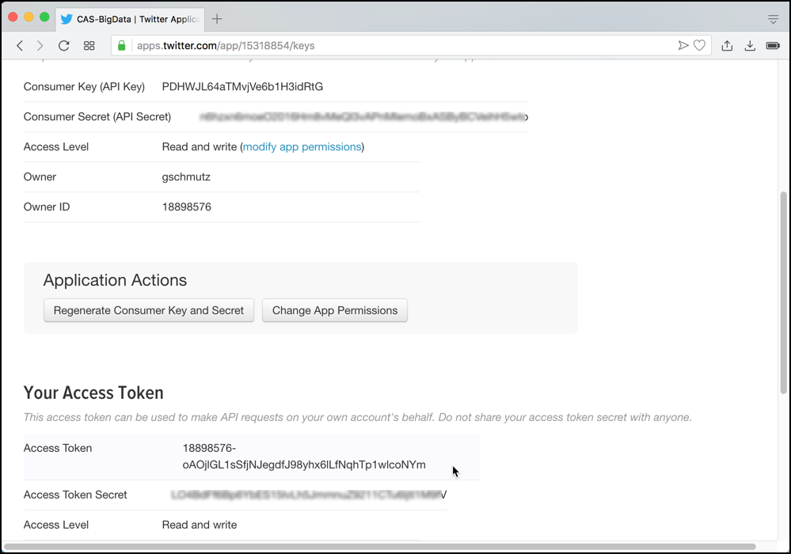

# Creating a Twitter Application

For the various Twitter consumer of this course, we will connect to twitter through the so-called [Filter Stream API](https://developer.twitter.com/en/docs/tweets/filter-realtime/overview.html). This allows to set some filter options, which defines the Tweets we are interested in. Filters can be set on Terms, Geographic Location, Language and User. 

In order to use the Twitter [Filter Stream API](https://developer.twitter.com/en/docs/tweets/filter-realtime/overview.html), we first have to create a Twitter application. If you don't have a Twitter user yet, you also have to create an account, which you can do from the sign in page below. To access the Twitter Application managment, navigate to <http://apps.twitter.com>.

Click on **Sign in** link on the top right corner. 

Enter the **Username** and **Password** of your twitter handle into the corresponding fields. If you don’t yet have a twitter handle, then click on the small **Sign up now** link to register at twitter.

Clock on **Create New App** in the upper right corner to create a new Twitter application.

Enter **Name**, **Description**, **Website** 

Click on **Create your Twitter application**.

Click on **Keys and Access Tokens** to get the credentials.

Click on **Create my access tokens**

The Acess token pair gets generated and is available to be used. 

Note that you will need the **Consumer Key**, the **Consumer Secret** the **Access Token** and the **Access Token Secret** when using the Twitter API and conneting with OAuth protocol.

